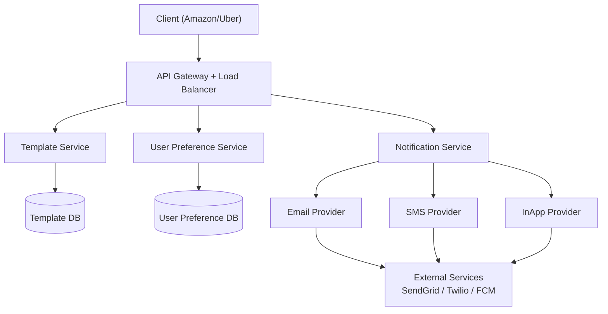
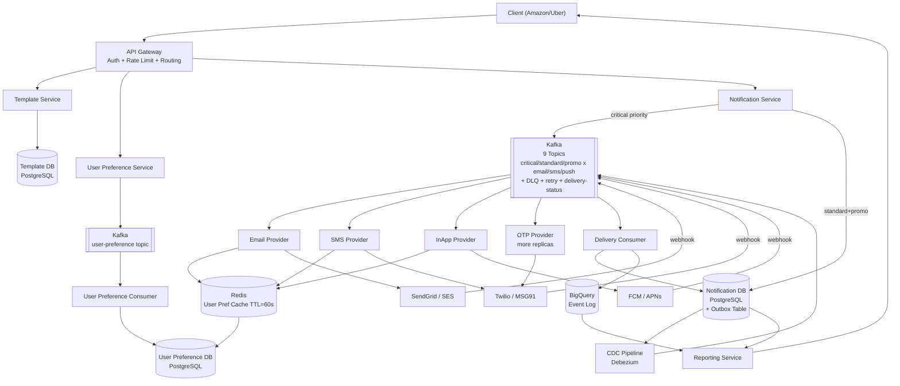
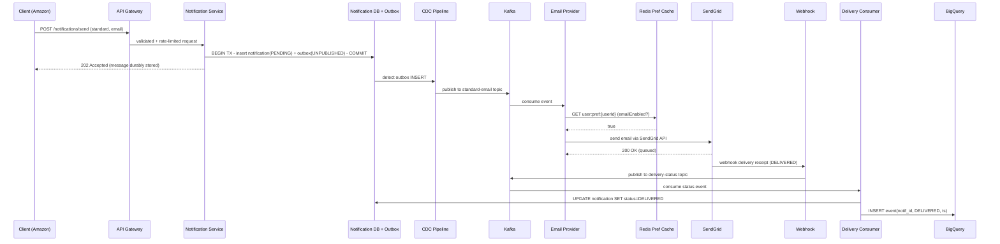
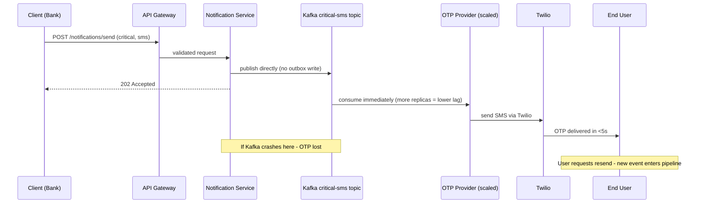

# Notification System Design

---

## 1. What Is a Notification System?

A notification platform is the piece of infrastructure that sits behind an app you never see directly: when Amazon needs to tell you your order shipped, when Uber needs to text you a ride OTP, or when Flipkart wants to email you about a sale, none of those companies builds its own delivery pipeline to your phone — they call a system like this one instead. It takes one instruction ("send this notification to this user") and gets it out across whichever channel — email, SMS, or an in-app push — actually reaches that person, tracks whether it arrived, and does this reliably for many different client companies at once, for the organization sending the message (the *client* — Amazon, Uber, Flipkart) and the person receiving it (the *user*), without ever mixing up whose users belong to whom.

At the scale this operates at — a client bulk-messaging fifty million people during a single sale, an OTP that expires if it takes more than five seconds — the hard part was never sending one message to one person. It's doing that instantly for the ones where instant actually matters, staying durable for the ones where losing a message means real money, and never letting one client's flood of promotional email delay another client's password-reset text.

---

## 2. A Day in the Life

Ananya opens the Flipkart app to buy a pair of shoes during their Big Billion Day sale. She adds them to her cart, and by the time she reaches checkout she's asked to confirm with a one-time code. She taps "Send OTP," and before she's even fully looked up from the screen, a text message lands: a six-digit code. She types it in and the order goes through — the whole OTP round trip felt instant, not because she thought about it, but because she didn't have time to.

A minute later, an order confirmation lands in her email inbox: order number, delivery estimate, a receipt. This one she doesn't rush to open — it can sit in her inbox for a few seconds before it shows up, and that's completely fine, because nothing about it was time-critical the way the OTP was.

She'd turned off SMS notifications for Flipkart a few weeks ago, keeping just email and push, after getting one too many promotional texts. So later that evening, when Flipkart blasts a sale reminder to every one of the fifty million people who added something to a cart that day, Ananya's phone buzzes once with a push notification — and stays silent on SMS, exactly as she asked, even though millions of other users are getting that exact same promo on all three channels at once.

Neither Ananya nor the engineer at Flipkart who triggered that campaign ever thought about a Kafka topic, an outbox table, or a preference cache — from here on, this is how that experience actually gets built.

---

## 3. Requirements — and Why They Matter

**Scope.** Ananya's OTP, her order-confirmation email, and the sale-day push notification are all instances of the same underlying problem: *build an event-driven fan-out system that takes user actions, fans them out to multiple delivery channels, and guarantees reliable delivery with retries, preferences, and prioritisation — without spamming users or overwhelming external providers.* In scope: template management, real-time and scheduled notifications, user preference management, delivery status tracking, OTP/critical vs promotional priority handling, multi-tenant client isolation. Out of scope: building FCM/APNs/Twilio's own internals, user identity management (clients own their user IDs), notification content moderation.

**One piece of vocabulary matters before anything else.** In this system, *Client* is the organization integrating with the platform — Amazon, Uber, Flipkart — and *User* is the end person receiving the notification on their phone or in their inbox. That distinction isn't cosmetic: user preferences belong to the user, not to the client. Amazon doesn't get to decide that a user's SMS opt-out doesn't apply to it — the preference is the user's, enforced the same way no matter which client is sending.

**Functional requirements:**

1. Support three notification channels: Email, SMS, In-App Push (FCM/APNs)
2. Support real-time notifications (OTP, transaction alerts) and scheduled notifications (promotions)
3. Template system with variable substitution — clients define templates once, personalise per user at send time
4. User-level channel preference — end users can opt out of specific channels (e.g., no SMS, email only)
5. Delivery status dashboard for clients — see pending / sent / delivered per notification
6. Multi-tenant — client isolation (Amazon's templates and users never mix with Uber's)

<details markdown="1">
<summary><strong>Point to Ponder:</strong> What happens if a client's own system times out on a request and retries it — does the user get the same notification twice?</summary>

No — every send request carries a `notification_id` UUID that the client itself generates, not one the server assigns. If the same ID arrives twice, the Notification Service's `UNIQUE(notification_id)` constraint catches the duplicate and simply returns the already-existing record instead of creating a second one. The client's retry is safe by construction; it doesn't need to know or care whether its first attempt actually landed. See §6 API Design for the full idempotency mechanism.

</details>

**Non-functional requirements — and why each one matters to a real user, not just as a target:**

| Property | Requirement | Why |
|---|---|---|
| Availability | 99.99% (AP over CP) | Notification delivery must survive partial failures; stale preferences for seconds are acceptable |
| OTP latency | <5 seconds end-to-end | OTP expires; missed window = failed auth |
| Promotional latency | 5–10 seconds acceptable | No urgency; durability > speed |
| Throughput | 1M notifications/min peak | Multi-tenant at scale; burst campaigns |
| Consistency | Eventual | Template changes propagate within seconds; preference changes within seconds |
| Durability | No message loss for standard/promo | Once acknowledged to client, message must be delivered or dead-lettered |

**Consistency Model:**

| Domain | Model | Reason |
|---|---|---|
| Notification delivery (standard/promo) | Guaranteed (outbox + CDC) | Once client receives ACK, message cannot be lost |
| Notification delivery (OTP) | At-least-once (Kafka) | User can request resend if OTP expired; slight duplication is tolerable |
| User preferences | Eventual (Redis cache, TTL=60s) | 60s of stale preference = minor; scanning DB per notification = not scalable |
| Template updates | Eventual (seconds) | Template version change propagates on next publish |

<details markdown="1">
<summary><strong>Point to Ponder:</strong> Ananya opts out of SMS at 2:00pm — does a promotional campaign that fires at 2:00:30pm respect that immediately?</summary>

Not necessarily, and that's a deliberate trade-off, not a bug: preferences are cached in Redis with a 60-second TTL specifically so providers don't have to hit PostgreSQL on every single one of a million notifications a minute. For up to 60 seconds after Ananya's change, a provider might still be reading the stale cached value and send her an SMS anyway. The system accepts this because the alternative — a database read in the hot path of every send — doesn't scale at this throughput. See §8.4 in Deep Dives for the full mechanism.

</details>

---

## 4. Scale, From First Principles

Before designing anything, it's worth asking: how much traffic does "industrial scale" for a platform serving Amazon, Uber, and Flipkart at once actually mean — and what does that force onto the architecture before any technology gets picked?

**How many notifications hit the system every second?** Start from the peak minute and work down to a rate:
```
Notifications/minute (peak):  1,000,000
Notifications/second (avg):   ~16,700/sec
Peak burst (3x normal):       ~50,000/sec
```
That burst number — 50,000/sec, not the calmer 16,700/sec average — is the one that has to hold true through every layer of the pipeline, not just at the API's front door, because a flash sale doesn't announce itself in advance.

**What does each notification actually turn into downstream?** A single triggering event isn't one Kafka write — most notifications go out on one or two channels at once (a bank OTP might be SMS and push together; a promo might be email and push), and that fan-out is what turns 1M notifications/min at the API into roughly 2–3M Kafka events/min actually moving through the pipeline. The event volume the system has to sustain is already 2–3x the request volume before a single message reaches a provider.

**What does that mean for storage?** Each notification payload averages about 500 bytes:
```
Notification DB storage: 1M/min x 500B x 60 x 24 = ~720 GB/day
```
And because every one of those notifications throws off roughly 3–5 lifecycle events for the client dashboard (queued, sent, delivered, failed), that's an entirely different scale of data landing in the analytics store — about 4 billion events a day. 720 GB/day of operational records and 4B/day of append-only events are two completely different shapes of storage problem, which is exactly why they end up in two different databases (§7 Data Model), not one.

**How many templates does the Template Service actually need to hold?** Somewhere between 50 and 200 active templates per client. That's a small number in absolute terms, but it's the reason templates need real versioning rather than being edited in place — with that many active templates per client, an in-flight campaign has to keep using the exact version it started with, not whatever a designer happens to be editing at that moment.

**Now the number that dominates every other decision in this design: the five-second OTP deadline.** The hardest flow in the system is OTP delivery, which must reach the end user in under five seconds. Any path that involves a disk write or a change-data-capture hop adds two to five seconds of latency on its own — which is most or all of the entire budget, before the message has even reached Kafka. That single constraint is what rules out routing OTP through the same write path as everything else, before any other requirement even gets considered: OTP must bypass the outbox pattern entirely.

**And what happens when one client fires a bulk campaign?** Take Flipkart's Big Billion Day: one promotional notification sent to fifty million users at once is fifty million events landing in a short window. Kafka has to absorb that burst instantly, while providers — SendGrid, Twilio — consume it at whatever pace their own rate limits allow, not the pace it arrived at.

Three channels, three priority tiers — nine possible combinations of the two — is also worth flagging here, because it's what later becomes the exact shape of the Kafka topic layout (§8.3).

These numbers are what drive every decision that follows: two separate write paths (fast vs. reliable) so the five-second OTP deadline never has to compete with a fifty-million-event promotional burst, dedicated OTP Kafka topics with extra consumer replicas so consumer lag never touches critical traffic, and BigQuery instead of PostgreSQL for event-level analytics, since four billion events a day would drown an operational database built for single-row lookups.

---

## 5. High-Level Architecture

Remember Ananya's OTP landing in under five seconds while her order-confirmation email quietly took a little longer — here's what actually happens underneath both, and why they don't take the same route through the system.

A notification platform isn't really a messaging app at its core — it's a pipeline. Something happens in a client's own system (a login attempt, an order, a sale going live), and from there the job is entirely mechanical: fan that one event out to whichever channels are relevant, check it against what the recipient actually wants to receive, deliver it, retry if delivery fails, and never let go of the guarantee that it'll either be delivered or explicitly given up on — never silently dropped.

```
This system is NOT about sending messages.
It is about:
  Event → Queue → Fan-out → Preference Check → Delivery → Retry → Guarantee
```

Before that, there's a more basic question every fan-out design has to answer: when an event fires, does the system generate every recipient's notification immediately (push, fan-out on write), or does it wait and generate them on demand when each recipient actually checks (pull, fan-out on read)? Push gives low read latency, since everything is pre-generated by the time anyone looks — but the write cost scales directly with the audience: fifty million recipients means fifty million database inserts at the moment the event fires, and that's exactly where it breaks, since a bulk campaign at that size overwhelms the database outright. Pull flips the trade entirely: write cost stays low, just one row per event regardless of audience size, but read latency goes up because each notification is generated on demand — and it breaks the opposite way, when a read storm hits, such as ten million users opening the app at once and all triggering generation simultaneously. Neither one is right for every case here, so this system doesn't pick just one: it uses push for OTP and other single-recipient transactional sends, where instant delivery to one person is what matters, and a pull-leaning model for bulk promotional campaigns, where Kafka is the actual fan-out mechanism — one event published in, N consumers reading it out at their own pace, async and batched rather than fifty million synchronous writes at once.

That guarantee is also where a decision has to get made early: how strong a delivery promise does this system actually make? A fully synchronous exactly-once guarantee (Kafka transactions, two-phase commit) exists, but it's expensive enough — and unnecessary enough for this domain — that it's ruled out up front. Instead the system builds *effectively-once* delivery out of two cheaper pieces: Kafka's own at-least-once semantics (a consumer that crashes mid-processing just replays the event on restart) plus the `notification_id` UUID the client generates and sends with the request. The Delivery Consumer uses that same ID as an idempotent key when it writes status back to the Notification DB (`INSERT ... ON CONFLICT notification_id DO NOTHING`), so a Kafka replay that delivers the same event twice never produces a duplicate database write or a duplicate send.

| Guarantee | How | When to use here |
|---|---|---|
| At-most-once | Fire to Kafka, no retry | Never — silent message loss |
| At-least-once | Kafka consumer replay on crash | Standard/promo — duplicates handled by idempotency key |
| Exactly-once | Kafka 2PC transactions | Too expensive; overkill for notifications |

Every request funnels through one Notification Service, but from there it splits onto one of two paths, decided purely by priority at the moment the request comes in:

```
Client (Amazon/Uber) → Notification Service
                            |
           ┌────────────────┴─────────────────┐
     OTP / Critical                    Standard / Promo
     (fast path)                       (reliable path)
           |                                   |
     Kafka directly                    DB Write (Outbox + Notification)
     (at-least-once)                       |
           |                           CDC Pipeline → Kafka
           └──────────────┬────────────────────┘
                    9 Kafka Topics
               (3 priorities × 3 channels)
                          |
              ┌───────────┼───────────┐
         Email Provider  SMS Provider  InApp Provider
              |               |              |
         SendGrid/SES     Twilio/MSG91   FCM / APNs
              |               |              |
              └───────────────┴──────────────┘
                    Webhook delivery receipts
                          |
                 Delivery Status Kafka
                          |
                  Delivery Consumer
                    |           |
             Notification DB   BigQuery
             (final status)    (event log)
                          |
                  Reporting Service → Client Dashboard
```

| Fast Path (OTP/Critical) | Reliable Path (Standard/Promo) |
|---|---|
| Notification Service → Kafka directly | Notification Service → Outbox Table + Notification DB |
| At-least-once delivery (retry on resend) | CDC pipeline → Kafka (guaranteed, no message loss) |
| Dedicated OTP consumer (more replicas) | Standard consumer (can lag up to 10s) |
| No DB write before Kafka publish | ACK to client only after DB write succeeds |

<details markdown="1">
<summary><strong>Point to Ponder:</strong> The reliable path's outbox only adds a couple of seconds of latency — why does OTP bypass it entirely instead of just accepting that small delay?</summary>

Because "a couple of seconds" is measured against a five-second budget, not against zero. The outbox's DB write plus CDC detection adds 2–5 seconds on its own — on a bad day, that alone can eat the entire OTP window before the message has even reached Kafka, let alone the user's phone. An OTP that arrives after it expires has failed exactly as completely as one that never arrived, so the fast path skips the outbox rather than gambling the whole budget on it. See §8.2 in Deep Dives for the full trade-off.

</details>

### Simple Design



### Evolved Design



### The Full Sequence

The diagrams above show the components; here's the actual message sequence for each of the two paths.

For a standard or promotional notification: the client's request goes through the API Gateway, which validates the API key and applies inbound rate limiting — a token bucket capping a client around 100K notifications/min, so one client's flood can't starve another (§8.6 has the full mechanism) — before handing off to the Notification Service. From there, a single database transaction inserts a `PENDING` notification row and an `UNPUBLISHED` outbox row together — only once that transaction commits does the client get its `202 Accepted`, because ACKing any earlier would be a promise the system hasn't actually kept yet (§8.1 covers exactly why). The CDC pipeline then notices the new outbox row and publishes it onto the right `{priority}-{channel}` topic; whichever provider owns that topic checks the recipient's cached preference before doing anything else, forwards to the actual external service (SendGrid, Twilio, or FCM/APNs), and once that service fires a delivery webhook back, the Delivery Consumer updates both the Notification DB and BigQuery's event log — which is exactly what the Reporting Service reads from to serve the client dashboard: final status from the Notification DB, the granular per-notification event timeline from BigQuery.

The OTP path skips almost all of that: the Notification Service detects `priority: critical` and writes directly to Kafka's `critical-{channel}` topic with no outbox step at all. A dedicated OTP consumer group — deliberately over-provisioned with more replicas than the standard consumers — picks it up essentially immediately and hands it to Twilio or FCM. There's no retry built into this path if that delivery fails; the product's answer is simply that the user requests a fresh OTP, which enters the pipeline as a brand-new event. The OTP notification still eventually shows up on the client's dashboard despite skipping the outbox — a separate, lightweight async consumer writes it into the Notification DB after the fact, purely for the dashboard's benefit, deliberately off the critical delivery path so it can never slow OTP delivery down.





---

## 6. API Design

The API is small because there's really only one shape of actor calling it: a client's backend, never an end user's phone directly — templates, sends, and preference updates are all requests one system makes on behalf of another, which is why every endpoint below is scoped by a client identity even when a preference technically belongs to the end user, not the client.

| Endpoint | Method | Actor | Key Params |
|---|---|---|---|
| `/templates` | POST | Client | `name, type, channel, content, variables[]` |
| `/templates/{id}` | GET | Client | `version` (optional, defaults to latest active) |
| `/notifications/send` | POST | Client | `templateId, recipientId, variables, channel, priority, scheduledAt` |
| `/notifications/{id}/status` | GET | Client | — |
| `/users/{externalUserId}/preferences` | PUT | User (via Client) | `clientId, emailEnabled, smsEnabled, pushEnabled` |

**`POST /notifications/send` payload:**
```json
{
  "templateId": "tmpl_abc123",
  "recipientId": "user_789",        // client's external user ID
  "variables": { "product": "iPhone 15", "discount": "20%" },
  "channel": ["email", "sms"],
  "priority": "standard",           // critical | standard | promotional
  "scheduledAt": null               // null = send now
}
```

Every client registers for an API key up front, and the API Gateway validates it on every single call before a request ever reaches the Notification Service — that's what makes the multi-tenant isolation from §3 actually enforceable at the network edge, not just a convention downstream services are trusted to honor.

Two design choices here aren't obvious from the table alone. First, `priority: critical` isn't just a field the Notification Service reads and routes on later — setting it changes which code path the request takes at write time, skipping the outbox table entirely (§8.2). Second, `channel` is an array, not a single value, because one notification can legitimately fan out across multiple channels at once — an OTP might go by SMS while a promo goes by email and push together — which is exactly why idempotency has to key off the whole request, not per channel.

**Idempotency:** `notification_id` is a UUID generated by the client and sent in the request. If the same `notification_id` arrives twice — a client retry after a timeout, say — the Notification Service detects the duplicate via `UNIQUE(notification_id)` and returns the existing record instead of creating a second one. No duplicate delivery, no client-side guesswork about whether their retry caused a double-send.

---

## 7. Data Model

Seven different kinds of data live in this system, and separating them by how they're actually used — rather than by which table happens to hold them — makes the storage choices close to self-explanatory.

**Templates are structured, relational, and rarely written.** A client defines somewhere between 50 and 200 active templates, each tagged `type: promotional` or `type: transactional` and versioned so an in-flight campaign never gets rewritten out from under it mid-send — `is_active` marks which version actually gets used at send time, and `version` just increments on every edit. None of that needs anything more exotic than PostgreSQL: low write volume, and every read benefits from being able to join against `client_id` for isolation.

**User preferences split into a source of truth and a hot cache, because correctness and raw read speed pull in different directions at this volume.** The actual preference — opted in or out per channel, a do-not-disturb window (e.g. `22:00` to `08:00`, no notifications in between), and a fallback priority ordering (1 = first choice, 2 = fallback, 3 = last resort) — is structured, updated infrequently, and needs to be authoritative, so it lives in PostgreSQL. But reading that table on every single one of a million sends a minute would fall over immediately, so a Redis cache sits in front of it for the actual per-send check — fast, sub-millisecond, and explicitly never treated as the source of truth (§8.4 has the full mechanism and the 60-second consistency trade-off that comes with it).

**The notification record and its outbox counterpart are durable but transient in different ways.** The notification row is the client-facing operational record — the one thing `GET /notifications/{id}/status` actually reads, tracking a message through `PENDING → SENT → DELIVERED → FAILED` — and it needs to be correct and queryable by `notification_id`, which again means PostgreSQL. The outbox row lives in the very same database, in the very same transaction as the notification insert, purely so the CDC pipeline has something to tail; once it's published to Kafka it's marked and has essentially done its job. Neither one would make sense in a store that couldn't guarantee both inserts land atomically together — the exact reasoning behind choosing PostgreSQL over a faster but non-transactional store, covered fully in the Trade-offs below.

**Everything append-only and read-rarely-except-in-bulk goes to BigQuery.** The event log — every `queued`, `sent`, `delivered`, and `failed` transition for every notification — is written once and essentially never updated, and at roughly 4 billion events a day, querying it for a client's weekly delivery-rate dashboard is a job for a columnar analytics store, not the same database serving live single-row lookups.

**Kafka threads through all of it as the connective tissue, not a data store of its own.** Nine topics (three priority tiers times three channels) plus delivery-status, retry, and DLQ topics carry every event between every other piece of this system, with 7-day retention giving CDC and consumers room to catch up after any outage without losing anything already published.

| Entity | Storage | Key Columns |
|---|---|---|
| Template | PostgreSQL | template_id, client_id, name, type, channel, content, variables, version, is_active, created_at, updated_at |
| Notification record | PostgreSQL | notification_id, client_id, external_user_id, template_id, channel, payload, status, priority, scheduled_at, last_updated_at |
| Outbox row | PostgreSQL (same DB, same transaction) | outbox_id, notification_id, event_type, payload, published, created_at |
| User preference | PostgreSQL | id, client_id, external_user_id, channel, enabled, priority, do_not_disturb_start, do_not_disturb_end, updated_at |
| Preference cache entry | Redis, TTL=60s | pref:{clientId}:{userId}:{channel} → {enabled, priority, dnd_start, dnd_end} |
| Event log | BigQuery | notification_id, event_type, timestamp |
| Message bus | Kafka, 7-day retention | 9 topics (priority × channel) + delivery-status + retry + DLQ |

**Why one row per channel, not one row per user, in the preference table?** A user may enable email but disable SMS, and set push as priority 1 — storing per-channel rows makes `WHERE external_user_id = ? AND channel = 'sms' AND enabled = true` a simple indexed lookup. A single JSON blob per user would need deserialising on every single preference check, which is exactly the kind of per-request cost this system can't afford at a million sends a minute.

---

## 8. Deep Dives

### 8.1 Transactional Outbox — Guaranteed Delivery Without Losing Messages

This is the single mechanism the rest of this design leans on hardest, so it's worth walking through in full rather than as a quick bullet list.

**What it has to do:** every time the Notification Service takes a request, it has two jobs — tell the client "we've got it, it'll be sent," and actually get the message moving toward Kafka for async processing. Both have to happen, and they have to happen consistently with each other, or the client's ACK becomes a lie.

**Why the obvious orderings all fail.** Try ACKing the client first, then publishing to Kafka: if the service crashes in between, the client walks away believing the message will be delivered, and it never will be — silently lost. Flip the order — publish to Kafka first, then ACK: now a crash before the ACK means the client sees a timeout, retries, and a message that was already durably queued gets sent again as a duplicate. Even the intermediate idea of writing the notification to a database row before publishing to Kafka doesn't close the gap on its own — a crash landing between that database write and the Kafka publish leaves one system with a record the other doesn't have, and status tracking simply breaks: the database says one thing, Kafka says another, and nothing reconciles them.

**What has to be true instead:** the "got it, will be sent" promise and the "durably captured" fact have to be the same atomic event — not two separate steps that can be interrupted between them.

**The mechanism:** a single database transaction inserts two rows at once — a `notification` row (`status = PENDING`) and an `outbox` row (`published = false`) — and only once that transaction commits does the service ACK the client. At that point the message is durable, full stop, regardless of whether Kafka, the network, or anything downstream is currently healthy. Separately, a CDC pipeline (Debezium) tails the same database's write-ahead log, notices the new outbox row, publishes it to Kafka, and marks `outbox.published = true`. If the CDC process itself crashes before publishing, nothing is lost — the row is still sitting in the outbox table, and Debezium simply resumes from its last committed WAL position on restart and publishes it then.

Reading the write-ahead log this way, instead of polling the outbox table on a timer, is a deliberate choice: Debezium picks up a new row in under 500ms with no polling interval at all, where a polling job has to pick one of two bad options at this volume — polling once a second lets up to a million-row backlog build up between polls, and polling every 100ms means 600,000 extra database reads a minute just to check whether anything changed.

The cost accepted here is operational: running Debezium means running Kafka Connect infrastructure, one more moving part to operate. That's worth it because every faster alternative compromises either latency or the durability guarantee itself — there isn't a cheaper way to make "ACK means durable" actually true.

> [!NOTE]
> Key Insight: The outbox pattern is not an optimisation — it's the only way to guarantee "ACK to client = message will be delivered or dead-lettered." Without it, an ACK is a promise we can't keep.

---

### 8.2 Priority Tiers — Two Write Paths for One System

The outbox above solves durability, but it doesn't solve everything — durability and speed pull in opposite directions, and this system genuinely needs both at once for different messages. An OTP has to arrive inside five seconds or it's useless; a promotional email can take ten seconds and nobody notices. The outbox's own DB write plus CDC detection adds 2–5 seconds on its own — comfortably fine against a 10-second promo budget, and potentially the entire OTP budget gone before the message has even reached Kafka. A single write path literally cannot satisfy both SLAs; forcing OTP through the outbox risks expiring it before it's sent, and skipping the outbox for everything trades away the durability guarantee that promotional and transactional messages actually need.

The fix is splitting by priority right where the request enters the Notification Service, not somewhere downstream:

| Priority | Write Path | Durability | Latency |
|---|---|---|---|
| Critical (OTP, bank txn) | Direct to Kafka | At-least-once (resend on failure) | <500ms to Kafka |
| Standard (transactional) | Outbox → CDC → Kafka | Guaranteed (no message loss) | ~1–3s |
| Promotional (marketing) | Outbox → CDC → Kafka | Guaranteed | ~2–5s (acceptable) |

For OTP, the product answer to "what if it's lost" is simply that the user clicks resend — that's not a workaround, it's the actual design: a five-second delay is worse for the user than an occasional resend click. The trade-off accepted is at-most-once delivery risk if Kafka happens to crash in exactly the wrong instant, which is acceptable on two separate grounds — Kafka itself is highly available, so that window is rare, and OTPs are explicitly designed around being resendable in the first place.

> [!NOTE]
> Key Insight: Two write paths for two SLAs. Don't force OTP through the outbox — you'll kill its latency. Don't skip the outbox for promos — you'll lose bulk campaign messages silently.

---

### 8.3 Kafka Topic Design — Nine Topics, Not One

A single `notifications` topic carrying every event sounds simpler, but it creates three problems at once: email consumers waste cycles deserializing SMS events they're going to discard, a critical OTP event queues behind whatever bulk promo campaign happens to be running ahead of it, and there's no way to enforce a different SLA per priority tier when everything shares one queue.

The fix is nine topics — three priority tiers times three channels:

```
critical-email    standard-email    promotional-email
critical-sms      standard-sms      promotional-sms
critical-push     standard-push     promotional-push
+ delivery-status
+ retry
+ DLQ
```

That isolation is what makes the OTP Provider's SLA actually enforceable: it subscribes only to `critical-sms` and `critical-email`, so it's structurally incapable of being blocked by a Flipkart bulk promo campaign, no matter how large that campaign is. Its consumer group also runs with three times the replicas of a standard consumer group, since consumer lag directly is delivery lag on this path. A bulk email campaign, meanwhile, just fills up `promotional-email` and lets standard consumers work through it at whatever pace they can sustain, with zero effect on OTP's SLA.

> [!NOTE]
> Key Insight: Topic isolation by priority is the only way to enforce SLA differentiation. Without it, one 50M-user campaign delays every OTP in the system for 10–30 minutes.

---

### 8.4 User Preference — A Cache Layer to Avoid a Database Scan on Every Send

At 1 million notifications a minute, checking the User Preference DB before every single send means 1 million read queries a minute hitting PostgreSQL. PostgreSQL handles roughly 100,000 reads a minute comfortably — this is a tenfold overload, and it would degrade the exact database that also needs to serve the outbox and notification-status lookups from §8.1.

The naive fix — just query the database every time — degrades under load rather than failing cleanly, which is worse: a slow preference check backs up every provider behind it. The actual fix is a Redis cache in front of PostgreSQL, keyed `pref:{clientId}:{externalUserId}` → `{ emailEnabled, smsEnabled, pushEnabled }`, with a 60-second TTL. A cache miss reads from the database and repopulates the cache; a preference change deletes the cache key (`DEL pref:{clientId}:{externalUserId}`) and lets the next read repopulate it — the classic cache-aside pattern, chosen specifically because it needs no explicit write-through logic on the hot path.

The trade-off accepted is up to 60 seconds of eventual consistency: a user who just opted out of SMS can still receive one for up to a minute afterward. That's acceptable because the alternative — a database round-trip on every single send — doesn't scale at this throughput at all, not because the staleness itself is harmless in isolation.

> [!NOTE]
> Key Insight: Preference is checked at the provider level, not at the Notification Service level. This is deliberate — by the time a message reaches a provider, we've already committed it to Kafka. Discarding at the provider (not at intake) avoids complexity in the routing layer.

---

### 8.5 Delivery Status Tracking — Webhook, Kafka, and Two Stores

Once a provider hands a message to Twilio, SendGrid, or FCM, this system has no direct visibility into whether it actually reached the user — that external service has its own delivery pipeline entirely outside this one. Tracking the `SENT → DELIVERED` transition means relying on that external service to tell us, after the fact.

The mechanism is a webhook plus Kafka: the external service fires a webhook back to the Provider service the moment it confirms delivery, and the Provider publishes that event onto the `delivery-status` Kafka topic rather than writing to a database directly — keeping providers themselves stateless. The Delivery Consumer reads from that topic and writes to two separate stores: PostgreSQL, updating `notification.status = DELIVERED` for whoever queries "is this delivered?" — a single indexed row lookup — and BigQuery, appending an immutable `notification_events` row (`notification_id, event_type='DELIVERED', ts`) for whoever needs the full timeline of status changes or a delivery-rate dashboard across a week's worth of traffic.

Splitting into two stores here isn't redundancy — it's matching each query pattern to the store built for it. PostgreSQL is right for the O(1) single-row question; BigQuery is right for the analytical scan over billions of rows that a client dashboard's "delivery rate this week" actually needs. The cost accepted is write amplification — every delivery event now costs two writes instead of one — which is tolerable because delivery-status events are already far less frequent than the original send events (one send, versus one or two status updates per notification).

> [!NOTE]
> Key Insight: Don't use your operational DB for analytics. Notification DB (PostgreSQL) for real-time status lookups. BigQuery for event timelines and delivery rate dashboards. Two tools, two purposes.

---

### 8.6 Rate Limiting — Two Tiers for Two Different Threats

Rate limiting here isn't one problem, it's two, and they protect against opposite directions of traffic. Inbound, at the API Gateway, a token bucket per `clientId` and `apiKey` — for instance, capping a client around 10,000 notification requests a minute — exists to protect this platform itself from a single client flooding it, whether through a bug, a runaway loop in their own code, or outright abuse; without it, one client's mistake can starve every other client sharing the platform. Outbound, at the provider level, a separate token bucket per external service — SendGrid capped around 100 emails a second, Twilio around 1,000 SMS a second, refilling at whatever rate each provider actually states — protects those external services from this platform itself. Exceeding a provider's own limit doesn't just get throttled cleanly; it gets silently dropped or throttled by them with no error surfaced back to us, so a token bucket on our own outbound side, backed by exponential-backoff-and-retry rather than a DLQ, is what stands between a burst and quietly losing messages nobody even notices went missing.

Without that second tier specifically, a single campaign the size of Flipkart's — 50 million emails — would blow straight through SendGrid's stated limit and lose millions of messages with absolutely no error surfaced to the client who sent it.

> [!NOTE]
> Key Insight: Rate limiting at two points for two different adversaries — bad actors hitting your API, and your own services overwhelming external partners. Both need to be solved independently.

---

## 9. Bottlenecks & Scaling

At ten times today's scale — 10 million notifications a minute instead of one — five different components hit their ceiling, each for a different reason, and none of them get fixed by simply provisioning more of the same box.

Kafka consumer lag is the first and most direct one: ten times the events arriving on the same set of partitions means OTP traffic starts waiting behind the promotional flood unless something changes — the fix is increasing partitions per topic and scaling consumer replicas independently per priority tier, so a promo surge scales its own consumers without touching OTP's dedicated pool. The Notification DB feels the same pressure from the write side: 10 million inserts a minute into PostgreSQL would overwhelm a single primary, so it gets horizontally sharded by `client_id`, with PgBouncer pooling connections in front of it. The outbox's CDC pipeline is a subtler version of the same problem — a single Debezium connector tailing one write-ahead log starts to lag at 10x volume, so the fix is running multiple connectors, each watching its own partition of the outbox table by `client_id`, rather than asking one connector to keep up with everyone. Outside the system's own walls, SendGrid and Twilio throttle at their own stated limits regardless of how well anything internal scales — the only lever available there is spreading load across multiple API keys per provider. And BigQuery ingest, sitting at 4 billion events a day today, becomes 40 billion at 10x — handled by leaning on Kafka's native BigQuery streaming connector rather than a custom consumer, since that connector is already built to absorb exactly this kind of volume.

The clearest real test of all this is a single Flipkart Big Billion Day-style campaign: 50 million notifications fired in a 30-minute window works out to about 27,000 notifications a second, versus roughly 16,000/sec on a normal day. Kafka absorbs the burst by simply letting the `promotional-email` topic fill up while its consumers process at whatever rate they can sustain — nothing forces them to keep pace with the write rate. OTP is completely unaffected by any of this, because `critical-sms` sits on its own isolated topic with its own dedicated consumer capacity — that campaign never touches it. The one place the campaign does hit a wall is outbound, at SendGrid's own rate limit: once that's hit, the provider's token bucket kicks in, the excess spills into the retry topic, and those messages still get delivered within minutes — delayed, never lost.

Scheduled sends work by piggybacking on the same reliable pipeline, just with a delay bolted onto the front: a client sends `scheduledAt` in the future, the Notification DB stores the row with `status=SCHEDULED`, and a Scheduler Service polls that table every second for rows where `status=SCHEDULED AND scheduled_at <= NOW()`. The moment a row matches, it's inserted into the outbox table and flows through the exact same CDC → Kafka → provider pipeline as an ordinary standard or promotional notification — scheduling isn't a separate system, it's a delay in front of the reliable path.

---

### 9.1 Failure Scenarios

Every provider-facing failure — Twilio going down, SendGrid running slow, FCM silently failing, or a delivery webhook simply never arriving — follows the same universal three-stage recovery, and it's worth walking through why that shape works before looking at each case individually. A failed call to an external service first retries with exponential backoff: 1 second, then 2, then 4, for three attempts total. If it's still failing after that, the system falls back to a different channel if one's configured — an SMS failure escalates to push, an email failure escalates to SMS — which is exactly why the user preference table carries a priority field at all (§7 Data Model): priority=1 is the first attempt, priority=2 is the automatic fallback. Only if there's no fallback configured, or the fallback also fails, does the message land in a dead letter queue and page the ops team for manual inspection or replay. In short:

```
Provider calls external service
  → FAIL (timeout / 5xx)
    → Stage 1: Retry with exponential backoff
        attempt 1 → wait 1s → attempt 2 → wait 2s → attempt 3 → wait 4s
    → Still failing after 3 attempts?
      → Stage 2: Channel fallback (if configured)
          SMS failed → try Push notification instead
          Email failed → try SMS as fallback
      → No fallback channel? Or fallback also failed?
        → Stage 3: Dead Letter Queue (DLQ Kafka topic)
            ops team alerted; manual inspection or replay
```

Individually, that pattern plays out a little differently depending on what actually broke. Twilio going down entirely means an SMS follows the full three stages above, end to end. SendGrid merely being slow is milder — the message is delayed, not lost, because Kafka's at-least-once delivery means the consumer just retries on timeout, and the idempotency key stops that retry from becoming a duplicate send. FCM is the trickiest of the three, because it can fail *silently* — no error, no webhook, nothing — so there's no retry trigger at all; the system instead relies on a reconciliation job that notices a notification stuck at `status=SENT` with no delivery receipt after 24 hours and marks it `FAILED`. A delivery webhook failing outright gets the same reconciliation treatment from the other direction: a status stuck at `SENT` gets actively polled from the external provider's own delivery-report API rather than waiting passively for a webhook that isn't coming.

The infrastructure-layer failures recover differently depending on whether what failed was durable or in-flight. A brief Kafka outage on the OTP path actually does lose the in-flight event — there's no outbox backing it up — so recovery is just the user clicking resend and a fresh event entering the pipeline. The exact same Kafka outage on the standard/promo path loses nothing at all, because the event is still sitting in the outbox table with `published=false`; Debezium simply replays from where it left off in the write-ahead log once Kafka is back. CDC lag by itself — no outage, just falling behind — delays promotional notifications and triggers an alert once P95 lag passes 5 seconds, at which point the fix is scaling out more Debezium connectors. If the Redis preference cache goes down, providers fall back to reading preferences cold from PostgreSQL — slower, but correctness is untouched, since Redis was never the source of truth to begin with. And if BigQuery ingest itself fails, nothing is actually lost either: Kafka's 7-day retention means the event log simply re-streams once ingest recovers.

The one client-facing failure mode — the Notification Service crashing after it's written to the database but before it ACKs the client — looks alarming from the client's side (a bare timeout, no confirmation) but resolves cleanly: the client retries with the same `notification_id` it already generated, the `UNIQUE` constraint on that column detects the duplicate, and the service returns the existing record instead of creating a second one — no re-send, no double notification.

---

### 9.2 Trade-offs

### Sync vs Async Notification Delivery

Sending directly and synchronously to the external provider is the simplest design to picture, but it inherits that provider's own throughput ceiling: waiting on SendGrid or Twilio inline caps the whole system at whatever those services can process per second — nowhere near 1 million notifications a minute — and any client waits on that external call, so a timeout there is a lost message with nothing else to catch it. The async alternative decouples the two: the client gets ACKed in under 100ms the moment the message is durably queued, Kafka absorbs whatever burst arrives regardless of how fast providers can drain it, and a failure downstream hits Kafka's retry-and-DLQ machinery instead of the client's open connection. The cost of that decoupling is real: standing up and running Kafka plus a CDC pipeline is meaningfully more infrastructure than a service that just calls an API directly.

**Chosen:** Async, always. Synchronous delivery to SendGrid at 1M notifications/min would saturate any single API key almost immediately.

> [!NOTE]
> Key Insight: The async pipeline is not a performance optimisation — it's the only architecture that can handle 1M/min without synchronously blocking every client call on an external HTTP request.

---

### Primary DB: PostgreSQL vs Cassandra for Notification Table

The two databases pull in opposite directions on throughput and transactions. PostgreSQL tops out around 100,000 writes a minute per node — needing sharding well before 1M/min — but gives ACID transactions, which is exactly what the outbox pattern requires: inserting the notification row and the outbox row has to be one atomic multi-table write, or the durability guarantee in §8.1 falls apart. Its query patterns also fit this system's actual access pattern well — status updates keyed by `notification_id`, range queries by `client_id` — and its operational complexity is familiar, with sharding as the only real complication once volume demands it. Cassandra scales writes linearly across nodes with multi-master replication and would comfortably absorb the volume, and it's naturally suited to partition-key-plus-time-range queries, but it doesn't support multi-table transactions at all — there's no way to make the notification-plus-outbox insert atomic the way the outbox pattern needs it to be — and running it well means taking on a genuinely complex multi-datacenter setup.

**Chosen:** PostgreSQL — the outbox pattern's atomicity requirement rules out Cassandra outright, regardless of its throughput advantage. The plan for scale is sharding by `client_id` once volume actually demands it (§9 above).

> [!NOTE]
> Key Insight: The outbox pattern requires a transactional DB. That constraint rules out Cassandra for the Notification DB, despite Cassandra's superior write throughput.

---

### OTP Durability: At-Most-Once vs At-Least-Once

For OTP specifically, at-least-once — routing it through the same outbox path as everything else — would guarantee the message is never silently dropped, but that guarantee costs 2–5 seconds of latency for the DB write and CDC detection, and an OTP that arrives after it's already expired has failed just as completely as one that never arrived, only more confusingly. At-most-once — publishing straight to Kafka with no durability guarantee before that publish — gets the message out in under 500ms, at the cost that a Kafka crash at exactly the wrong instant loses it outright, with no duplicate-handling machinery needed because there's nothing to deduplicate.

**Chosen for OTP:** at-most-once with resend. An expired OTP is worse than a missing one — the user can request a resend, but a code that arrives too late just confuses them.

---

### Delivery Status: Single DB vs Two-Store (PostgreSQL + BigQuery)

A single PostgreSQL store answers "is this notification delivered?" in a fast, O(1) row lookup either way — that part doesn't change. Where it breaks down is analytics: "what's our delivery rate this week?" against a table taking in 720GB a day means a table scan over hundreds of gigabytes, a dangerous query to run against the same database serving live operational lookups. Splitting into two stores keeps the O(1) lookup in PostgreSQL exactly as before, and moves the aggregation queries to BigQuery, a columnar store built for exactly that kind of scan — at the cost of running and paying for two pieces of infrastructure instead of one.

**Chosen:** two-store. Analytics queries never touch the operational database.

---

## 10. Frontend Notes

*Notification system is 95% backend / 5% frontend. The frontend problem is the client dashboard and the template builder.*

### Delivery Status Dashboard
- Poll `GET /notifications?clientId=X&status=pending&page_cursor=Y` every 30 seconds (not WebSocket — delivery events are infrequent enough that polling is fine; WebSocket adds connection management overhead for marginal UX gain)
- Cursor pagination on notification list (never offset — millions of rows)
- Status filters: All / Pending / Sent / Delivered / Failed

### Template Builder
- Variable placeholders highlighted in editor: `{{product_name}}`, `{{user_name}}`
- Preview panel renders template with sample variables
- Version history shown as numbered list (latest active = highlighted)

### Preference UI (End-User Facing, embedded by client)
- Toggle per channel: Email / SMS / Push
- `PUT /users/{id}/preferences` on toggle change (debounced 500ms — avoid rapid-fire updates)

---

## 11. Evaluation: Did We Meet the Requirements?

Six non-functional requirements were set out in §3. Here's how the design actually satisfies each one — not just what was promised, but the specific mechanism doing the work.

**Availability (99.99%, AP over CP):** No single component failure takes delivery down entirely — §9.1's Failure Scenarios walk through Redis falling back to a cold PostgreSQL read, Kafka outages that the outbox absorbs without loss, and provider failures resolved by retry, fallback, and reconciliation. The system stays available by design, not by luck, because almost every piece of state here either self-heals or was never the only copy in the first place.

**OTP latency (<5 seconds):** The fast path skips the outbox entirely — direct to Kafka in under 500ms, picked up by a dedicated OTP consumer group running with three times the replicas of a standard one (§8.2, §8.3) — because the outbox's own 2–5 second latency would eat most or all of a five-second budget before the message even reached Kafka.

**Promotional latency (5–10 seconds, acceptable):** The reliable path takes the slower, durable route deliberately — a database transaction, then Debezium tailing the write-ahead log in under 500ms, then a Kafka publish — because for this priority tier, never losing the message matters more than shaving off a couple of seconds (§8.1).

**Throughput (1M notifications/min peak, ~50,000/sec burst):** This isn't a target the design was tuned to hit after the fact — it's the number that ruled out a synchronous provider call and a single-writer database before any technology got chosen (§4 Scale, From First Principles). Kafka absorbs bursts independently of how fast providers can drain them, the Notification DB shards by `client_id` once volume demands it, and outbound token buckets keep the platform from ever overwhelming SendGrid or Twilio in the process (§9 Bottlenecks & Scaling).

**Consistency (eventual):** Deliberately not strong everywhere — template changes propagate on next publish, and preference changes propagate within the bound of a 60-second Redis TTL (§8.4) — because a few seconds of staleness on either is harmless, and the alternative (a synchronous read on every send) doesn't survive this system's own throughput requirement.

**Durability (no loss for standard/promo):** The transactional outbox (§8.1) is what actually makes "ACK means it'll be delivered" true rather than aspirational — a CDC crash replays from the write-ahead log, a Kafka outage leaves the row waiting safely in the outbox, and the reconciliation jobs in §9.1 catch the remaining failure modes (a silent FCM failure, a webhook that never arrives) that no retry loop would ever detect on its own.

| Requirement | Mechanism |
|---|---|
| Availability 99.99% | Dual write paths + self-healing state (Redis fallback to DB, Kafka retention, outbox replay) |
| OTP latency <5s | Direct-to-Kafka fast path, no outbox, dedicated 3x-replica consumer group |
| Promotional latency 5–10s | Outbox → Debezium (<500ms WAL tail) → Kafka, durability prioritised over speed |
| Throughput 1M/min peak | Kafka absorbs bursts independent of consumer pace; DB sharded by client_id; outbound token buckets |
| Consistency — eventual | 60s Redis preference TTL; template changes propagate on next publish |
| Durability — no loss (standard/promo) | Transactional outbox + CDC replay + reconciliation jobs for silent failures |

---

## 12. Conclusion

This design treats a notification platform as two pipelines wearing one API: a reliable path built around a transactional outbox, guaranteeing that an ACK to a client is never a promise the system can't keep; and a fast path that deliberately breaks that same guarantee for exactly one kind of message — the one where arriving in under five seconds matters more than arriving at all. The hardest problem wasn't fanning a message out across three channels; it was drawing that line correctly, once, at the point where a request enters the system (priority), rather than trying to make one write path serve every SLA at once. Every other decision here — nine Kafka topics instead of one, a 60-second preference cache instead of a database read on every send, two storage backends for delivery status instead of one — falls out of protecting that same distinction: what can wait a few seconds for the sake of never being lost, and what can afford to be lost occasionally because waiting isn't an option at all.

---

## 13. Interview Summary

### Key Decisions

| Decision | Problem it solves | Trade-off accepted |
|---|---|---|
| Transactional Outbox + CDC | ACK to client = guaranteed delivery (no message loss) | 2–5s latency; CDC operational complexity |
| Direct Kafka for OTP (bypass outbox) | OTP must arrive in <5s | At-most-once delivery; user can resend |
| 9 Kafka topics (priority × channel) | Priority isolation — OTP never queued behind promo campaigns | More topics to manage |
| Redis preference cache (TTL=60s) | 1M/min can't scan preference DB on every notification | 60s stale preference after user opt-out |
| Webhook → Kafka → two stores | Delivery confirmation without providers writing directly to DB | Write amplification; two infra dependencies |
| BigQuery for event log | Analytics over 4B events/day; not OLTP queries | Two stores instead of one |
| Token bucket at provider level | Don't exceed external service rate limits (Twilio, SendGrid) | Slight delivery queuing at burst |

### Fast Path vs Reliable Path

```
Fast Path (OTP / Critical):
  Client request
    → API Gateway (auth + rate limit)
    → Notification Service
    → Kafka critical-{channel} topic (direct, no outbox)
    → OTP Provider (dedicated, more replicas, lower lag)
    → Twilio / FCM
    → User in <5 seconds

Reliable Path (Standard / Promotional):
  Client request
    → API Gateway
    → Notification Service
    → DB Transaction: notification(PENDING) + outbox(UNPUBLISHED) — COMMIT
    → ACK to client (message is now durable)
    → CDC Pipeline detects outbox row
    → Kafka standard/promo-{channel} topic
    → Provider checks Redis preference cache
    → External service (SendGrid / FCM)
    → Webhook → Kafka delivery-status
    → Delivery Consumer → PostgreSQL (status=DELIVERED) + BigQuery (event log)
```

### Key Insights Checklist

> [!TIP]
> Say these out loud in the interview:

1. "This system is not about sending messages. It's an event-driven pipeline: Event → Queue → Fan-out → Preference Check → Delivery → Retry → Guarantee. Every component exists to serve one of those stages."
2. "I use at-least-once delivery plus idempotency key — not exactly-once. Exactly-once in Kafka requires 2PC transactions and is prohibitively expensive. At-least-once plus a unique `notification_id` gives me effectively-once delivery at a fraction of the cost."
3. "The outbox pattern is a correctness requirement, not a performance choice. Without it, an ACK to the client is a lie — we have no guarantee the message survives a crash between the ACK and the Kafka publish."
4. "I use two write paths for two SLAs. OTP bypasses the outbox and goes directly to Kafka — 2–5s latency from the outbox would expire the OTP before it arrives. Standard and promo go through the outbox — durability matters more than speed there."
5. "Nine Kafka topics, not one. Priority isolation is the only way to guarantee OTP SLA. A single topic means one Flipkart Big Billion Day campaign queues 50M events ahead of every OTP in the system."
6. "Every provider failure follows the same pattern: retry with exponential backoff → channel fallback → dead letter queue. The user preference priority field is what enables channel fallback — SMS fails, escalate to push. That's why priority is a first-class field."
7. "I rate-limit at two points for two different threats: at the API Gateway to protect us from bad actors, and at the provider level to protect external services from us. Missing Tier 2 means we silently drop millions of messages when our bulk campaigns exceed Twilio's rate limit."
8. "User preferences are stored one row per channel, not one row per user. This makes the provider-level check a single indexed lookup: `WHERE user_id = ? AND channel = 'sms' AND enabled = true`. A JSON blob per user requires deserialisation on every notification — wrong at 1M/min."
9. "Client = the organisation (Amazon, Uber). User = the end person. Amazon doesn't own a user's preference to opt out of SMS. The user does. This distinction changes the entire preference ownership model."
