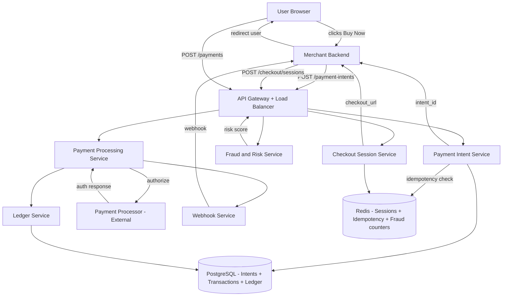
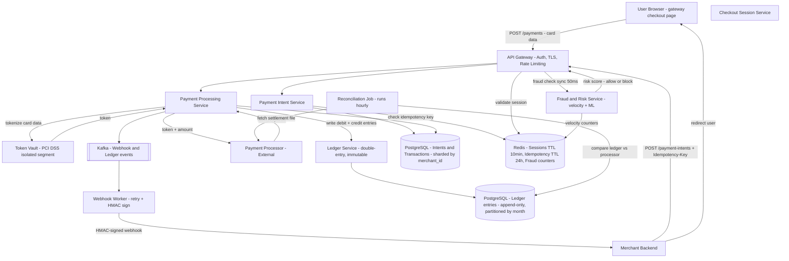
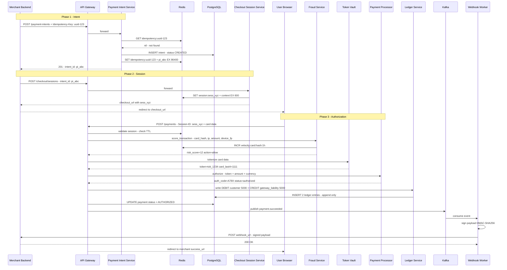
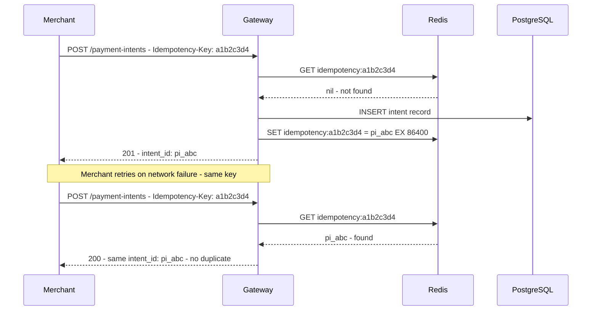
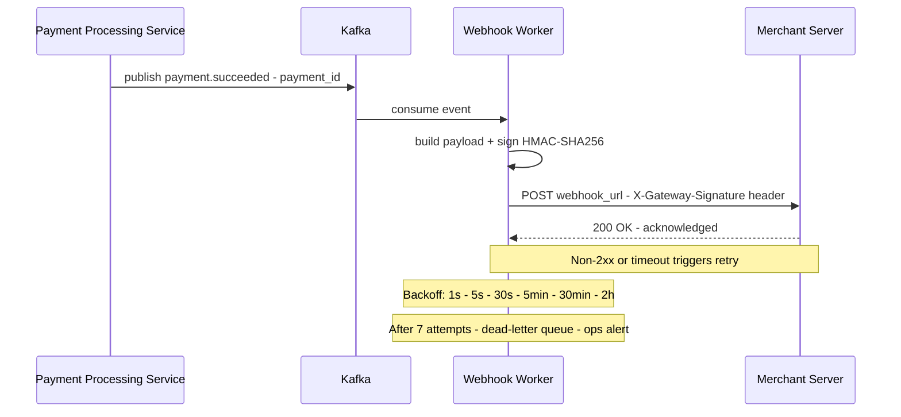
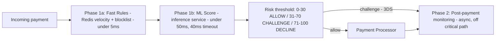

# System Design: Payment Gateway (Stripe / Razorpay / PayPal)

---

## 1. What Is a Payment Gateway?

A payment gateway is the piece of infrastructure an online store plugs into its checkout flow so it can accept a card payment without ever touching the card number itself. A shopper types their card details into a page during checkout; from that moment on, the gateway takes over — collecting the card securely, deciding in a fraction of a second whether the transaction looks like fraud, sending it to a bank for approval, and telling the merchant whether the money is on its way. Stripe, Razorpay, and PayPal are all this same kind of system: a merchant's own website or app calls a handful of APIs and hands the shopper off to a page the gateway controls, and the gateway owns everything about handling money and card data safely from that point forward.

At the scale a payment gateway actually runs at, the hard part was never authorizing one card once. It's guaranteeing that a dropped connection during that one authorization never turns into a shopper being charged twice, and that every unit of money that moves through the system is provably accounted for — not just today, but months later when someone asks where it went.

---

## 2. A Day in the Life

Farhan is buying a jacket from Devika's online store. He adds it to his cart, checks out, and types his card number, expiry date, and CVV into a payment page that looks exactly like it belongs to Devika's site — same colors, same logo — though he has no idea it's actually hosted somewhere else entirely. He taps "Pay ₹4,999." For about a second and a half, the button just spins.

Behind that spinner, in an instant he never sees, the system checks that his card isn't stolen or being used from five different countries in the last hour, sends it off to his bank for approval, gets an "approved" back, and records — permanently, in a form nobody can quietly edit later — that the money now belongs to Devika's business instead of Farhan's account.

The spinner stops. Farhan sees "Payment successful," and a minute later an email lands: order confirmed, jacket on the way. On Devika's side, at almost the same instant, her own store's system gets told the payment went through, and her fulfillment team starts packing the order — she never had to ask her gateway "did it work?"; it told her the moment it happened.

Later that night, Farhan's phone briefly loses signal right as he's checking his order status. The app spins for a couple of extra seconds and then just shows him the same "Payment successful" screen it would have shown anyway. Nothing charged him twice, nothing broke, and neither Farhan nor Devika ever thought about a token vault, a ledger, or a webhook. Everything from here on is how those fifteen seconds of Farhan's life actually get built.

---

## 3. Requirements — and Why They Matter

**Scope.** Farhan's fifteen seconds are really three separate phases wearing one spinner: a merchant registering what's about to be paid for, a secure page collecting the card, and an authorization that has to be correct no matter what goes wrong along the way. In scope: payment intent creation, gateway-hosted checkout sessions, card tokenization via a vault, pre-auth fraud scoring, a double-entry ledger, a transaction state machine, webhook delivery to merchants, and hourly reconciliation against the bank. Out of scope: the actual bank-level movement of money (the payment processor is treated as a black box), partial payments and installments, and training the ML fraud model (inference is in scope, training isn't) — with refunds and chargebacks flagged as worthwhile extensions rather than something this design covers end to end.

**Functional requirements:**

1. **Payment Intent** — merchant creates an intent with amount, currency, and order reference before card data is collected
2. **Checkout Session** — gateway generates a secure, hosted card-entry page tied to the intent (10-min TTL)
3. **PCI DSS-compliant card handling** — card data is captured on the gateway's own page, tokenized, and never stored raw outside the vault
4. **Fraud scoring** — every transaction is scored synchronously before authorization; high-risk transactions are blocked or challenged
5. **Double-entry ledger** — every payment creates immutable debit and credit entries; debits must always equal credits per payment_id
6. **Transaction status** — merchant can query payment status at any time via GET
7. **Webhook notification** — gateway notifies merchant backend on payment.succeeded, payment.failed, and payment.pending events
8. **Reconciliation** — hourly job aligns gateway ledger with processor settlement file to resolve gaps from network partitions

<details markdown="1">
<summary><strong>Point to Ponder:</strong> A merchant's request to create a payment intent times out on their end and they retry it — does Farhan get charged twice?</summary>

No — the retry carries the same idempotency key as the original request, and the gateway recognizes it. Instead of creating a second intent, it returns the exact same `intent_id` it returned the first time, so the merchant's retry is safe by construction and never needs to guess whether its earlier attempt actually landed. See §8 Deep Dives for the full mechanism, including how two *concurrent* retries racing each other are handled without a duplicate slipping through.

</details>

**Non-functional requirements — and why each one matters to a real shopper or merchant, not just as a target:**

| Requirement | Target | Why it matters |
|---|---|---|
| Throughput | 10,000 TPS peak | This is what "everyone can check out at once" actually costs the system — a flash sale that exceeds it means real shoppers see checkout failures at the exact moment merchants need sales the most. |
| Gateway latency | under 200ms (fraud + tokenization + session validation + ledger write) | Every extra hundred milliseconds Farhan stares at that spinner is doubt creeping in about whether the payment actually went through. |
| Fraud check latency | under 50ms synchronous, on critical path | This budget has to fit entirely inside the 200ms above without Farhan ever noticing a separate step happened. |
| Availability | 99.99% (four nines) | A gateway outage doesn't take down one merchant's checkout — it takes down every merchant on the platform at once, all simultaneously unable to take money. |
| Consistency | CP — consistency over availability; double charges are unacceptable | A double charge isn't a UX bug — it's a real line on someone's bank statement that shouldn't be there, and it's the fastest way to lose a merchant's trust permanently. |
| Durability | Zero payment record loss — ACID PostgreSQL with point-in-time recovery | A lost payment record means a shopper who paid has no proof they paid, and a merchant who shipped has no record they were ever paid for it. |
| Idempotency | All payment operations must be retry-safe — network retries must never double-charge | Card networks and mobile connections drop constantly, exactly like Farhan's phone did — if a retry after a dropped connection could double-charge, every flaky moment of network signal becomes a real financial risk to a real person. |
| Security | PCI DSS Level 1 — raw card numbers must never leave the vault | Raw card numbers are the single most valuable thing to steal anywhere in this system; if they never exist outside one small vault, a breach anywhere else has nothing worth stealing. |
| Ledger correctness | SUM(debits) = SUM(credits) per payment_id at all times | This is the mathematical proof that no money was silently created or destroyed — the thing that lets the gateway say, with certainty, exactly where every unit of money went, even months later. |

**Consistency Model:**

| Domain | Model | Reason |
|---|---|---|
| Ledger entries | Strong (ACID) | Financial correctness — no eventual consistency for money |
| Session store | Eventual (Redis) | Short-lived; loss means user retries checkout |
| Idempotency keys | Eventual (Redis) | 24h window covers retries; slight race is acceptable |
| Webhook delivery | At-least-once | Exactly-once requires 2PC across external system |

> [!NOTE]
> **Key Insight:** Most design decisions flow from three constraints: PCI DSS compliance, idempotency, and ledger correctness. Every major component — hosted checkout page, token vault, double-entry ledger, idempotency keys, reconciliation — exists to satisfy one or more of these three.

<details markdown="1">
<summary><strong>Point to Ponder:</strong> The payment processor approves Farhan's card, but the gateway crashes a split second later, before the ledger entries get written — is that money just lost track of?</summary>

No — the ledger write is designed to be the thing that happens *before* the result is returned to the user in the normal flow, but when a crash lands in that exact gap, the hourly reconciliation job is what catches it: it compares the gateway's ledger against the processor's own settlement file, notices the authorization the processor recorded that the ledger doesn't have, and writes the missing entries itself. Correctness here is never conditional on the happy path completing. See §9 for the full failure-recovery story.

</details>

---

## 4. Scale, From First Principles

Before designing anything, it's worth asking what "10,000 transactions per second" — the number this whole system is built around — actually forces onto every component downstream of it.

**Starting assumption:**
```
Scale target: 10,000 TPS peak
Each payment: 3 API calls (intent + session + pay) → 30,000 req/sec peak
```
One payment isn't one request — it's three, spread across the three phases of Farhan's checkout. That triples the effective request rate before a single database or cache gets chosen.

**How many payment intents does that create, and how much does it cost to store them?** At peak, `10,000/sec × 86,400s = 864M intents/day` — though real traffic averages roughly 10x lower than peak, landing closer to `~86M/day`. At roughly 500 bytes a record, that's `~43 GB/day`, sharded across PostgreSQL by `merchant_id` so one merchant's write volume never contends with another's.

**How many ledger rows does that create?** Every payment produces 4 immutable rows — two on capture, two on settlement — so `10,000 TPS × 4 = 40,000 ledger writes/sec`, append-only and partitioned by month. That's four times the base transaction rate landing on the one table this design can least afford to get wrong.

**What about the checkout sessions sitting in Redis while a shopper is on the card-entry page?** `10,000 concurrent active sessions × 2 KB = ~20 MB` — trivial for Redis to hold. Each session gets a 10-minute TTL, so auto-expiry handles cleanup on its own; nothing has to sweep for abandoned checkouts.

**And the idempotency key store — the thing standing between a network retry and a double charge?** `10,000 keys/sec × 86,400s = 864M keys/day` of churn. At roughly 200 bytes a key, that's `~173 GB/day` moving through a Redis cluster with LRU eviction, each key living for a 24-hour TTL — long enough to cover any realistic retry window a shopper or merchant might hit.

**How many webhook deliveries does the gateway have to push out to merchants?** `10,000 payments/sec` translates to roughly `~15,000 deliveries/sec` at peak, since a single payment can fan out to more than one event — and because delivery is at-least-once (more on why in §8), that number is a floor, not a ceiling. A Kafka topic partitioned per merchant is what carries that load.

**And fraud scoring — the one synchronous check sitting directly in the critical path?** `10,000 TPS` means `10,000 checks/sec`, split across two budgets: fast rules running against Redis in under 5ms, and an ML inference service adding under 50ms more, with a hard 40ms timeout that falls back to the rules-only score if the model doesn't answer in time.

These numbers are what drive every major decision that follows: append-only ledger partitioning for write throughput, Redis instead of PostgreSQL for sessions and idempotency (PostgreSQL simply can't absorb 864M key writes a day on top of its existing payment load), Kafka for webhook fan-out, and synchronous fraud scoring with an ML timeout fallback rather than either blocking indefinitely on a model or skipping the check entirely.

---

## 5. High-Level Architecture

Remember Farhan's fifteen seconds from the story above — here's what actually happens underneath that spinner.

A payment gateway is not simply a transaction processor — it's a correctness-first orchestration layer that moves money safely across multiple financial entities while keeping an immutable audit trail the whole way through. Three sequential phases drive every payment: the merchant registers a **payment intent**, the gateway creates a **secure session** and hosts the card-entry page, and the shopper submits their card for **authorization**. In that third phase, the gateway tokenizes the card, scores it for fraud, routes it to a payment processor, writes the double-entry ledger, and fans a webhook out to the merchant — all while guaranteeing idempotency across every single step.

```
Phase 1: INTENT                 Phase 2: SESSION               Phase 3: PAY
Merchant POST /payment-intents  Merchant POST /checkout/sess   User submits card on GW page
         |                               |                              |
  Idempotency-Key check          Redis TTL 10min                Fraud check  <50ms
  PostgreSQL INSERT               session_id returned           Tokenize -> Vault
  intent_id returned             checkout_url redirect          Route -> Processor
         |                               |                              |
  Redis: SET key->intent_id       User browser opens GW page    Ledger write (4 rows)
  EX 86400 (dedup 24h)            countdown timer starts        Kafka -> Webhook -> Merchant
```

Three concurrent paths run through this pipeline, each optimized for something different: a **fast path** optimized for staying under the 200ms gateway budget (Redis session lookup, fraud rules, vault tokenization, and a synchronous processor call, all chained together); a **reliable path** optimized purely for correctness — zero double-charges, zero lost money — built from idempotency keys, an append-only ledger, ACID PostgreSQL, and the reconciliation job; and an **audit path** whose entire job is an immutable money trail, enforced by the double-entry bookkeeping invariant that debits always equal credits per `payment_id`.

> [!IMPORTANT]
> **The gateway hosts the checkout page — not the merchant.** Card data enters on gateway infrastructure only. This is not a UX decision — it is the PCI DSS compliance boundary. Merchants never see raw card numbers.

<details markdown="1">
<summary><strong>Point to Ponder:</strong> Why does the gateway host the checkout page itself instead of letting Devika build her own card-entry form?</summary>

Because whoever's servers the card number touches, however briefly, fall inside PCI DSS scope — and that scope is expensive and risky to hold. If Devika built her own card form, her entire infrastructure would need an annual PCI audit and would become a target the moment it ever handled a raw card number. By keeping card entry exclusively on gateway-controlled infrastructure, only the gateway's checkout page and vault ever need to be in scope — a breach anywhere else in Devika's stack exposes zero card data. See the PCI Scope Reduction trade-off in §9 for the full comparison.

</details>

> [!NOTE]
> **Key Insight:** Money movement must be correct (no duplication), durable (never lost), and auditable (fully traceable). Latency is secondary to correctness. A 50ms fraud check on the critical path is the right trade-off — a double-charged payment cannot be silently fixed.

<details markdown="1">
<summary><strong>Point to Ponder:</strong> Why is the fraud check synchronous and sitting directly in the critical path, instead of scoring the transaction after the money has already moved?</summary>

Because pre-auth scoring is cheaper than post-auth reversal by every measure that matters: no processor authorization fee gets spent, no reversal flow has to run, and no shopper is confused by a payment that succeeded and then unwound itself. A 50ms budget on the critical path is intentional — `FRAUD_DECLINED` is the cheapest terminal state anywhere in this system, precisely because it happens before the processor call, not after. See §8.3 Deep Dives for the full two-phase fraud architecture.

</details>

### From Simple to Evolved

The architecture starts simple and grows a token vault, Kafka, and a separate ledger database as the system matures — here's both versions.

**Simple Design:**



**Evolved Design — Token Vault + Kafka + Separate Ledger DB:**



### The Full Sequence

The diagrams above show the components; this shows the actual message sequence between them, end to end — the same fifteen seconds from Farhan's story, now traced hop by hop.

**Phase 1 — Intent:** Devika's backend calls `POST /payment-intents` with an idempotency key in the header. The Payment Intent Service checks Redis first — has this key been seen before? If so, it returns the cached response, which is exactly what prevents a double charge on a network retry. If it's genuinely new, the service inserts an intent record into PostgreSQL with `status = CREATED`, caches the idempotency key in Redis for 24 hours, and hands `intent_id` back to Devika's backend.

**Phase 2 — Session:** Devika's backend creates a checkout session against that `intent_id`; the session context lands in Redis with a 10-minute TTL, and Devika's backend redirects Farhan to the hosted checkout page carrying that session token.

**Phase 3 — Authorization:** Farhan types his card details into that page, and the data goes to the Token Vault first — it never touches Devika's servers at all, which is the whole mechanism behind reducing her PCI scope. The Fraud Service scores the transaction in real time against velocity counters, device fingerprint, and IP reputation, all read from Redis. If the risk score comes back acceptable, the tokenized card goes to the Payment Processor. When the processor returns an authorization code, the Ledger Service writes two entries atomically — debit customer, credit gateway liability — append-only, never updated. Payment status flips to `AUTHORIZED` in PostgreSQL, a `payment.succeeded` event publishes to Kafka, the Webhook Worker signs it with HMAC-SHA256 and delivers it to Devika's webhook URL, and Farhan is redirected to the success page.



> [!NOTE]
> **Key Insight:** The ledger write happens BEFORE returning the result to the user. If the gateway crashes after the processor authorizes but before writing the ledger, reconciliation detects the gap and writes the missing entries. Correctness is never conditional on the happy path completing.

---

## 6. API Design

Six endpoints cover the whole surface, and none of them are ever called directly by a shopper's browser talking to a merchant-authenticated route — a shopper is never a trusted party in this API's model, only a browser session sitting on the gateway's own hosted checkout page for a few minutes. The split instead runs by *who's asking*: a merchant's backend drives intent creation, confirmation, status polling, refunds, and tokenization; the gateway itself is the caller for outbound status, and — separately — the *receiver* when a payment processor pushes its own async events back in.

| Method | Path | Description |
|---|---|---|
| POST | /api/v1/payment-intents | Create payment intent {amount, currency, idempotency_key}, returns {intent_id, client_secret} |
| POST | /api/v1/payment-intents/{id}/confirm | Confirm payment with tokenized card, triggers bank charge |
| GET | /api/v1/payment-intents/{id} | Poll payment status |
| POST | /api/v1/refunds | Initiate refund {payment_intent_id, amount} |
| POST | /api/v1/webhooks | Receive async events from payment processors (idempotent) |
| POST | /api/v1/tokens | Tokenize card details → returns opaque token (PCI scope boundary) |

Two design choices here aren't obvious from the table alone. The first is that `/api/v1/webhooks` is an *inbound* endpoint — it's the gateway receiving events from the payment processor's own bank-side systems, not the merchant-facing webhook delivery described in §5 and §8.2; those are two entirely separate flows that happen to share the word "webhook." The second is `/api/v1/tokens`: it exists as its own endpoint specifically to draw the PCI scope boundary in the API itself — tokenization is the one operation in this whole surface where raw card data crosses the wire at all, and isolating it to a single-purpose endpoint is what lets every other endpoint in this table stay entirely outside PCI scope.

> [!IMPORTANT]
> The `idempotency_key` on `POST /payment-intents` is the most critical design decision in the API — it's what prevents double charges on network retries. The webhooks endpoint must be idempotent too because payment processors deliver at-least-once.

---

## 7. Data Model

Seven kinds of data live in this system, and grouping them by how they're actually used — rather than treating them as one flat list — makes the storage choices close to self-evident.

**The durable, financial data lives in PostgreSQL, because it's money and it can never quietly disappear or partially update.** `payment_intents` needs ACID guarantees for every write, and sharding it by `merchant_id` distributes write load evenly since each merchant's own transactions naturally land on a single shard. `payment_events` is append-only by design — it's the immutable audit trail of every status transition, and the payment's current state is simply whichever row is most recent for that `payment_id`. `ledger_entries` follows the same append-only philosophy, partitioned by month so older months can be archived off to cold storage without touching anything active, and its amounts are stored as `BIGINT` in minor units rather than `FLOAT` — because IEEE 754 can't represent a value like 0.10 exactly, and across ten thousand transactions that imprecision compounds into real drift. Storing ₹5000.00 as the integer `500000` paise eliminates rounding error entirely: no floats, no lost money.

**The ephemeral, fast-path data lives in Redis, because losing it costs nothing but a retry.** Idempotency keys need sub-millisecond lookups on the critical path and a 24-hour TTL that expires them automatically, with no cleanup job ever needing to run. Checkout sessions are ephemeral for the same reason Farhan's session was — a 10-minute TTL enforces its own expiry, and at 10,000 TPS the total footprint is roughly 20 MB, trivial for Redis to hold.

**Card data itself lives nowhere the rest of the system can reach it.** `card_tokens` sits in a Token Vault — a PostgreSQL instance in its own PCI-isolated network segment, protected by AES-256 encryption and HSM-managed keys — and it's the only component in the entire architecture that ever holds a raw card number.

**And the record of what got delivered to whom lives in Kafka plus a delivery log.** `webhook_events` combines Kafka's reliable fan-out with a PostgreSQL delivery log tracking attempt count and next-retry time — Kafka moves the event, the log is what a merchant's support team actually queries when they ask "did you even try to deliver this?"

**Ledger correctness invariant:** for every `payment_id`, `SUM(amount WHERE type=debit) = SUM(amount WHERE type=credit)`. Any row failing this invariant means money was created or destroyed — immediate ops alert. This query is run by the reconciliation job after every batch.

| Entity | Storage | Key Columns |
|---|---|---|
| payment_intents | PostgreSQL (sharded by merchant_id) | intent_id, merchant_id, amount, currency, status, created_at |
| payment_events | PostgreSQL (append-only) | event_id, payment_id, from_status, to_status, fraud_score, processor_ref, created_at |
| ledger_entries | PostgreSQL (partitioned by month) | entry_id, account_id, payment_id, type (debit/credit), amount_minor_units, currency, created_at |
| idempotency_keys | Redis (TTL 24h) | idempotency:key → intent_id |
| checkout_sessions | Redis (TTL 10 min) | session:sess_id → intent context |
| card_tokens | Token Vault (PCI-isolated PostgreSQL) | token_id, encrypted_pan, card_last4, card_brand, created_at |
| webhook_events | Kafka + PostgreSQL (delivery log) | event_id, payment_id, merchant_id, status (pending/delivered/failed), attempt_count, next_retry_at |

> [!IMPORTANT]
> **The ledger is the most important table in the system.** If the intent table is lost and the ledger is intact, system state can be reconstructed. The reverse is not true. The ledger must be append-only, ACID-compliant, and backed up with point-in-time recovery.

---

## 8. Deep Dives

### 8.1 Idempotency Keys — Preventing Double Charges

This is the single mechanism the rest of this design leans on hardest — the one that turns Farhan's dropped signal at the end of §2 into a non-event instead of a duplicate charge — so it's worth walking through in full.

**Here's the problem it solves:** a merchant calls `POST /payment-intents`, the network times out before the response comes back. The merchant now genuinely doesn't know whether the gateway received the request or not — from their side, a timeout looks identical whether the intent was created or never arrived. If they retry blindly, and the first request actually did land, the shopper now has two intents and, downstream, a real risk of being charged twice.

**Why the obvious dedup approach fails:** deduplicating by amount, merchant_id, and timestamp sounds reasonable until you notice it isn't actually unique — the same merchant can legitimately fire two genuine payments for the same amount within a few seconds of each other (two customers buying the same ₹999 item, say), and a naive dedup rule would silently collapse them into one.

**The mechanism that actually works:** the merchant generates its own idempotency key — a UUID it controls, not one the server assigns — and sends it in the request header. The gateway checks Redis for that exact key before doing anything else. If it's not there, the gateway creates the intent, stores the key with a 24-hour TTL mapping to the new `intent_id`, and returns `201`. If the same key shows up again, the gateway skips creation entirely and returns the same `intent_id` with a `200` — the merchant's retry is safe by construction, and it never has to reason about whether its first attempt succeeded.



That GET-then-SET pattern itself has a subtler race inside it — two concurrent retries could both pass the `GET` before either one's `SET` lands, which is a distinct failure mode from the one this deep dive is solving and gets its own atomic fix (Redis `SET NX`) in §9's Failure Scenarios.

Idempotency doesn't stop at the intent-creation endpoint, either — it has to be re-earned at every layer a payment passes through, because a retry can, in principle, re-enter the pipeline at any point:

| Operation | Mechanism |
|---|---|
| POST /payment-intents | Idempotency-Key header → Redis dedup (24h TTL) |
| POST /v1/payments card charge | Session ID is single-use — invalidated after first submission |
| Processor call | auth_request_id sent to processor; processor deduplicates on their side |
| Webhook delivery | payment_id as dedup key; merchant checks before fulfilling order |
| Ledger write | payment_id uniqueness constraint per entry type — double write is a no-op |

At the checkout page itself, the session ID is single-use, invalidated the moment it's first submitted, so a resubmitted form can't fire a second authorization. At the processor call, an `auth_request_id` travels with the request so the processor deduplicates on its own side too — idempotency isn't only the gateway's problem, it has to hold across the boundary to the bank. At webhook delivery, `payment_id` is the dedup key the merchant is expected to check before fulfilling an order, since delivery itself is at-least-once (§8.2). And at the very last hop, the ledger write, a uniqueness constraint on `payment_id` per entry type means a duplicate write is simply a no-op rather than a second set of debit/credit rows.

**The trade-off accepted:** the merchant has to generate and include a UUID idempotency key on every call — a contract requirement on the API, not an optional nicety. The 24-hour TTL is chosen specifically to cover realistic retry windows without inflating Redis memory for no benefit; a longer TTL wouldn't buy meaningfully more retry-safety, just more storage.

> [!NOTE]
> **Key Insight:** Idempotency is a correctness requirement, not an optimization. Without it, every network retry is a potential double charge. The 24h Redis TTL is the retry window contract — not a performance parameter.

---

### 8.2 Webhook Reliability + Retry

**Here's the problem it solves:** once a payment is authorized, the merchant's own server has to be told so it can fulfill the order — but that notification is a synchronous HTTP call to a server the gateway does not control, and that server can be down, slow, or simply unreachable for hours at a time.

**Why calling it directly fails:** a direct HTTP call from the Payment Processing Service straight to the merchant, made the instant authorization completes, ties the gateway's own throughput to whatever that one merchant's server can currently handle. A slow merchant server holds the connection open, applies back-pressure to the processing service, and — worse — the event is simply gone if that call times out, with nothing left to retry it.

**The chosen mechanism — a Kafka-backed retry queue with exponential backoff:** rather than calling the merchant directly, the Payment Processing Service publishes `payment.succeeded` onto Kafka and moves on immediately. A dedicated Webhook Worker consumes that event, builds the payload, signs it with HMAC-SHA256, and only then makes the actual outbound call — decoupling "the payment succeeded" from "the merchant was told" completely.



A non-2xx response or a timeout triggers a retry on a backoff schedule of 1s, 5s, 30s, 5 minutes, then 30 minutes, then 2 hours — and after 7 attempts with no success, the event moves to a dead-letter queue and ops gets paged, rather than retrying forever against a merchant server that's clearly not coming back soon.

**HMAC signing is mandatory, not optional, and here's why:** without it, an attacker can simply `POST` a fake `payment.succeeded` payload straight at a merchant's webhook URL and walk away with goods for free. HMAC-SHA256, signed with the merchant's own secret key, proves the payload actually came from the gateway — a correct merchant handler recomputes `HMAC(body, secret)` and rejects anything where it doesn't match the `X-Gateway-Signature` header.

**And because delivery is at-least-once, the merchant's own handler has to be idempotent too:** a webhook worker delivering the same event twice is expected behavior, not a bug, so a correct handler extracts `payment_id`, checks whether that payment was already fulfilled, and skips if it was — documented as a contract requirement in exactly the way Stripe documents the same expectation for its own merchants.

**The trade-off accepted:** at-least-once delivery means merchants can and will receive duplicate webhooks. Exactly-once would require a distributed two-phase commit spanning the gateway and every merchant's own system — prohibitively complex for a guarantee that duplication already makes unnecessary, since merchants can (and must) implement idempotent handlers instead.

> [!NOTE]
> **Key Insight:** Never process a webhook without verifying the HMAC signature. An unverified webhook endpoint is a free-order vulnerability. Signature verification is the authentication layer for server-to-server callbacks.

---

### 8.3 Fraud Detection — Two-Phase Architecture

**Here's the problem it solves:** at 10,000 TPS, fraudulent cards from card-testing attacks, stolen credentials, and geo-anomaly attacks arrive mixed into the exact same traffic as legitimate payments. Without a gate in front of authorization, every fraudulent transaction that gets through is a direct financial loss, plus processor fees, plus the cost of unwinding it after the fact.

**Why the obvious approach fails:** running a full ML model synchronously on every one of those 10,000 transactions a second means either investing in very low-latency model serving, or accepting real latency directly on the critical path — and a single slow inference call blocks the payment behind it, which is exactly the kind of dependency this design otherwise goes out of its way to avoid.

**The chosen mechanism — a two-phase gated architecture:**



Phase 1a runs four independent checks against Redis, each contributing its own slice of a running risk score, and all of them finishing in well under 5ms because they're pure in-memory lookups and counters — no external call, no disk read. A velocity check increments a per-card-hash counter for the last hour; crossing five transactions in that window — the classic signature of a card-testing attack — adds 40 points. A blocklist check adds 60 points, or triggers an instant decline outright, if the card hash or the requesting IP is already known-bad. An amount-anomaly check adds 20 points if the current transaction is more than five times the card's own 30-day rolling average. And a geo-anomaly check adds 30 points if the card's issuing country doesn't match the country the request is actually coming from.

Phase 1b hands whatever survives Phase 1a to an ML inference service, which looks at the transaction sequence, device fingerprint, and merchant category code against the card's own history, and adds a `risk_delta` of 0–40 on top of the Phase 1a score — all within a 50ms budget, with a hard 40ms timeout. If the model doesn't answer in time, the system falls back to the Phase 1a score alone rather than blocking the payment on model availability — the critical path is never held hostage to whether the ML service happens to be healthy.

The combined score then sorts into one of three outcomes: 0–30 allows the transaction straight through to the processor, 31–70 routes it into a 3D Secure challenge rather than an automatic authorization, and 71–100 is treated as high enough risk to stop before it ever reaches the processor at all.

**The trade-off accepted:** pre-auth fraud checking adds a full 50ms to every single payment's critical path. That's the correct trade to make here — a slightly slower payment is completely recoverable, while a fraudulent authorization that's allowed to complete carries processor fees, chargeback risk, and reversal complexity that a 50ms delay never costs anyone.

> [!NOTE]
> **Key Insight:** Pre-auth fraud scoring is cheaper than post-auth reversal by every measure — no processor authorization fee, no reversal flow, no user confusion. The 50ms budget on the critical path is intentional. FRAUD_DECLINED is the cheapest terminal state in the system.

---

## 9. Bottlenecks, Failure Scenarios & Trade-offs

Every component in this design has a point where it stops being the right shape for the traffic in front of it — worth knowing where those points sit even though today's 10,000 TPS target sits comfortably under most of them.

The `payment_intents` table is the first thing under real pressure, since a single PostgreSQL primary would otherwise be absorbing 10,000 inserts a second on top of 40,000 ledger writes a second at the same time. Sharding `payment_intents` by `merchant_id` fixes the intent side of that — a consistent hash spreads merchants evenly across shards, and because each merchant's own transactions land on one shard, per-merchant queries stay fast. `ledger_entries` gets the same sharding treatment by `payment_id`, layered with the monthly partitioning already in place, so writes spread evenly and older months can be archived to cold storage (S3) without touching anything active. Reads get pulled off the write path entirely too — `GET /payments/{id}` and balance queries go to read replicas, leaving the primary to do nothing but writes. And the Redis idempotency store, already carrying ~173 GB/day of churn (§4), scales horizontally as a cluster, with LRU eviction after TTL expiry keeping memory bounded regardless of how much traffic grows.

Webhook fan-out hits its own wall from a different direction: 15,000 deliveries a second, each one an external HTTP call to a merchant server the gateway doesn't control, means any one slow merchant risks backing up the delivery queue for everyone behind it. Partitioning the Kafka topic by `merchant_id` is what prevents that — each merchant's events land on one partition, guaranteeing ordered delivery per merchant while keeping a slow merchant's backlog from ever touching a fast merchant's. The webhook worker pool scales horizontally on top of that, each worker consuming from its own assigned partitions and auto-scaling on consumer-lag, with a per-merchant concurrency cap stopping any single merchant from monopolizing worker threads outright. And the dead-letter queue after 7 attempts (§8.2) is itself part of the scaling story — it converts "retry forever" into "alert ops and notify the merchant via dashboard," which keeps a permanently-down merchant server from consuming capacity indefinitely.

Reconciliation scales differently again, because its bottleneck isn't throughput, it's the shape of its own queries: an hourly job doing a full table scan over `ledger_entries` growing at 43 GB/day (§4) would slow down on its own regardless of how well everything upstream scales. The fix is scoping every query to the recent window that actually matters — `created_at > NOW() - interval '2 hours'` against a composite index on `(payment_id, created_at)` — rather than scanning history that's already settled. The processor's settlement file gets ingested incrementally, chunked by time window instead of read in one pass, and the ledger-correctness invariant check itself runs only on the delta since the last batch — O(new rows), not O(total rows) — with the monthly partitions from §7 meaning old, already-reconciled data never gets scanned at all.

---

### 9.1 Failure Scenarios

Every piece of this system can fail on its own, and which recovery path applies depends entirely on whether what failed sits before or after the ledger write — the one moment this whole design treats as the actual point of no return.

The failures that land *before* the ledger write both resolve the same way, through reconciliation: if the gateway times out before ever reaching the processor, the intent is simply stuck in `PENDING`, and reconciliation fetches the real status from the processor directly and either writes the missing ledger entries or marks the payment `FAILED`. If the processor comes back with success but the gateway crashes before the ledger entries are actually written, the processor is holding a valid authorization the ledger doesn't yet know about — and reconciliation catches exactly that gap via the settlement file, writing the missing entries and sending the webhook after the fact, just later than the happy path would have.

Concurrency failures get handled at the mechanism level rather than by retrying and hoping. The idempotency race flagged in §8.1 — two concurrent retries both passing a Redis `GET` before either one's `SET` lands — is closed by using an atomic `SET NX` (set-if-not-exists) instead of a plain read-then-write, so only one of the two racing requests can actually create an intent.

Downstream dependencies fail independently, and each has its own fallback rather than taking the whole payment down with it. A webhook delivery failure because a merchant's server is down means that merchant simply doesn't get told to fulfill the order yet — Kafka's exponential backoff (1s, 5s, 30s, 5min, 30min, 2h) keeps retrying, landing in a dead-letter queue with an ops alert after 7 attempts, exactly as described in §8.2. A Redis session store restart loses any checkout sessions that were active mid-flow — a shopper mid-checkout just sees "session expired" and the merchant re-creates the checkout session, which is a mild inconvenience rather than a real failure, since no money has moved yet at that point in the flow. A fraud service timeout means the ML score in §8.3's Phase 1b never comes back in time, and the system falls back to the fast-rules score alone rather than ever blocking a payment on ML availability. Token vault unavailability is treated as a hard stop rather than a degraded path — the payment simply cannot proceed without tokenization, so the gateway returns a `503`, writes no ledger entry, makes no processor call, and PCI scope is never at risk of being breached by a workaround.

Infrastructure-level failures recover on their own timelines. A PostgreSQL primary failover makes the write path unavailable for roughly 30–60 seconds while a read replica gets promoted; once promotion completes, new writes resume, and any transactions that were in flight during the gap simply retry through the same idempotency-key mechanism as any other retry. A processor outage on the primary payment processor would otherwise mean 100% of payments failing while it's down — multi-processor routing is what prevents that, failing over to a secondary processor in under a second via health check, with no manual intervention required.

And the one failure mode with no automated recovery path by design is a ledger invariant violation caught by reconciliation — `SUM(debits) != SUM(credits)` for some `payment_id`. That triggers an immediate page to ops for manual investigation, closed out with a compensating ledger entry written alongside an audit note, because an automatic "fix" to a broken money invariant is exactly the kind of silent correction this design refuses to make.

---

### 9.2 Trade-offs

### Idempotency Key Storage — Redis vs PostgreSQL

The two options split almost entirely on lookup speed versus durability. Redis answers an idempotency check in under 1ms and expires keys natively on a TTL with no cleanup job ever needing to run, but a Redis restart loses whatever keys were in flight — it isn't durable across a crash. A PostgreSQL idempotency table would survive a restart intact, but every lookup costs 5–50ms of disk I/O instead of sub-millisecond memory access, and because rows don't expire on their own, a background `DELETE` job would have to run continuously just to keep the table from growing forever. At the volume this system actually runs at — 864M idempotency keys a day (§4) — that gap widens further: Redis absorbs that churn as a matter of course, while PostgreSQL would be taking on 864M extra row writes a day on top of the payment writes it's already handling, becoming its own bottleneck.

**Chosen: Redis with 24h TTL.** PostgreSQL simply cannot absorb 864M idempotency key writes a day on top of existing payment writes at this throughput. Redis keeps the idempotency check off the critical path entirely with a sub-1ms lookup. The durability trade-off is acceptable because it's bounded: a Redis restart losing in-flight keys only opens a small window where a retry could theoretically create a duplicate intent — and that window is caught by the PostgreSQL `payment_id` uniqueness constraint as a second line of defense, not the only one.

> [!NOTE]
> **Key Insight:** Redis TTL makes idempotency key management zero-maintenance. PostgreSQL would need a background job deleting millions of rows per day. TTL expiry is free.

---

### At-Least-Once Webhook Delivery vs Exactly-Once

At-least-once, backed by Kafka's retry queue and HMAC signing, is comparatively simple to build and run, but it comes with a real cost passed on to merchants: they will, on occasion, receive the same webhook twice and have to handle it. Exactly-once delivery would remove that burden entirely — no duplicate ever reaches the merchant — but only by wiring up a distributed two-phase commit spanning the gateway and every merchant's own system, which is expensive infrastructure to build and expensive latency to pay on every single delivery, for a guarantee most merchants don't actually need once their handler is idempotent anyway. It's also not an outlier choice: Stripe, Razorpay, and Braintree all deliver at-least-once — no major payment gateway in the industry actually offers exactly-once webhook delivery.

**Chosen: at-least-once with HMAC signing and a documented idempotency contract.** Exactly-once delivery requires distributed transactions across systems this gateway doesn't control, and at-least-once is safe precisely because merchants can — and are required to — implement idempotent webhook handlers, which is the same standard the rest of the payments industry has already settled on.

> [!NOTE]
> **Key Insight:** The queue (Kafka) is a correctness requirement for webhook delivery, not a performance optimization. Without it, webhook delivery is a synchronous call on the critical path — one slow merchant server backs up payment processing for everyone.

---

### PCI Scope Reduction via Tokenization

Letting the gateway's own Token Vault hold every card number means only the vault and the checkout page ever fall inside PCI DSS scope, and a breach anywhere else in the architecture — the Intent Service, the Fraud Service, the Ledger, the Webhook Worker — exposes zero card data, because none of them ever had it. The alternative, a merchant storing card data on their own infrastructure, puts their entire stack inside PCI scope instead of one isolated component, meaning every merchant needs their own annual PCI audit rather than relying on the gateway's, and a breach anywhere in their systems is an immediate, direct fraud risk rather than an exposed token that's useless without the vault's own mapping back to a real card. The integration cost runs the opposite direction, though: a merchant using the vault just redirects to the gateway's hosted checkout URL, while building a card form themselves means owning that UI and the risk that comes with it.

**Chosen: Token Vault with a gateway-hosted checkout page.** The vault isolates every raw card number into one single, audited, HSM-backed component. This is, in a very literal sense, the value proposition Stripe and Razorpay sell to merchants in the first place — accepting payments without ever stepping inside PCI scope at all.

> [!IMPORTANT]
> **Tokenization is not about security theatre.** The vault's network isolation means an attacker who compromises the Ledger Service or Fraud Service gets transaction metadata — amounts, merchant IDs, timestamps — but zero card numbers. The blast radius of any breach outside the vault is bounded.

---

## 10. Evaluation: Did We Meet the Requirements?

Nine non-functional requirements were set out in §3. Here's how the design actually satisfies each one — not just what was promised, but the specific mechanism doing the work.

**Throughput (10,000 TPS peak):** This isn't a target the design was tuned to hit after the fact — sharding `payment_intents` and `ledger_entries` by `merchant_id`/`payment_id`, moving idempotency and session state to Redis instead of PostgreSQL, and buffering webhook fan-out through Kafka were all decisions made *because* 10,000 TPS ruled out a single-writer relational database before any component got chosen (§4, §9).

**Gateway latency (under 200ms) and fraud check latency (under 50ms):** The entire fast path stays in memory or bounded-latency calls: Redis session validation, fast fraud rules under 5ms, an ML score under 50ms with a hard 40ms timeout and rules-only fallback, vault tokenization, and a synchronous processor call — each budgeted so the whole chain fits inside 200ms without the fraud check alone consuming the entire budget.

**Availability (99.99%):** No single dependency takes the whole gateway down. Multi-processor routing fails over to a secondary processor in under a second if the primary goes down; a PostgreSQL primary failover promotes a replica within 30–60 seconds; Redis runs as a cluster rather than a single point of failure (§9.1).

**Consistency (CP — double charges unacceptable):** This is the one place the design deliberately refuses to trade correctness for availability. The idempotency key mechanism (§8.1) makes retries safe by construction, and the PostgreSQL `payment_id` uniqueness constraint backstops even the rare race where two concurrent Redis operations might otherwise slip through.

**Durability (zero payment record loss):** ACID PostgreSQL with point-in-time recovery is the record of truth, and nothing downstream of a crash is treated as unrecoverable — the reconciliation job specifically exists to detect and repair any gap left by a mid-flow failure (§9.1).

**Idempotency (retry-safe operations):** Threaded through every single layer, not just the intent-creation endpoint — session single-use, processor-side dedup via `auth_request_id`, webhook `payment_id` dedup, and a ledger uniqueness constraint that turns a duplicate write into a no-op (§8.1).

**Security (PCI DSS Level 1):** The Token Vault is the only component in the system that ever holds a raw card number, isolated in its own network segment with AES-256 and HSM key management — a breach anywhere else in the stack has nothing worth stealing (§7, §9.2).

**Ledger correctness (debits = credits):** Enforced as a literal SQL invariant — `SUM(debits) = SUM(credits)` per `payment_id` — checked by the reconciliation job after every batch, with `BIGINT` minor-unit amounts eliminating the float drift that would otherwise make the invariant unreliable at scale (§7).

| Requirement | Mechanism |
|---|---|
| Throughput 10,000 TPS | Sharded PostgreSQL (merchant_id / payment_id), Redis for session + idempotency, Kafka for webhook fan-out |
| Gateway latency under 200ms | In-memory fast path: Redis session check, fraud rules, tokenization, sync processor call |
| Fraud check under 50ms | Two-phase architecture, 40ms ML timeout, fallback to fast rules |
| Availability 99.99% | Multi-processor failover (<1s), PostgreSQL replica promotion (30–60s), Redis cluster |
| Consistency — CP | Idempotency keys + PostgreSQL uniqueness constraint as backstop |
| Durability — zero loss | ACID PostgreSQL PITR + reconciliation job repairs any gap |
| Idempotency — retry-safe | Layered dedup: session, processor auth_request_id, webhook payment_id, ledger constraint |
| Security — PCI DSS Level 1 | Token Vault isolated PCI segment; raw card data never leaves it |
| Ledger correctness | SUM(debits)=SUM(credits) SQL invariant, checked every reconciliation batch |

---

## 11. Conclusion

This design treats a payment gateway as three obligations wearing one checkout button: move money exactly once no matter how many times a network retries, keep an audit trail complete enough that money can never quietly appear or vanish, and never let a raw card number exist anywhere outside one small, heavily guarded vault. The hardest problem wasn't authorizing a card — it was making "the merchant was told this succeeded" and "the ledger actually has two matching rows for it" the same atomic fact, one that survives a crash landing at literally any point in between. Every other decision here — Redis idempotency keys backstopped by a PostgreSQL uniqueness constraint, a gateway-hosted checkout page instead of merchant-built card forms, Kafka-buffered webhooks with HMAC signing, an hourly reconciliation job that treats the bank's own settlement file as the final word — falls out of protecting that one fact under every kind of failure this system can hit.

---

## 12. Interview Summary

### Key Decisions

| Decision | Problem It Solves | Trade-off Accepted |
|---|---|---|
| Double-entry ledger (immutable, append-only) | No money lost; SQL invariant catches imbalance instantly | 4 writes per payment; balance requires SUM query not a column read |
| Pre-auth fraud scoring under 50ms | Block fraud before processor call — no fee, no reversal, no user confusion | +50ms on every payment critical path; ML timeout falls back to fast rules |
| Gateway hosts checkout page | Card data never touches merchant servers; PCI DSS scope isolation | Merchant must redirect users to gateway URL |
| Token Vault in isolated PCI segment | Raw card data never in main DB; breach elsewhere = zero card exposure | Additional network hop; vault is separate PCI-scoped infrastructure |
| Idempotency keys — Redis, 24h TTL | Network retries cannot double-charge | Merchant must generate and send idempotency key on every call |
| Kafka for webhook delivery | At-least-once fan-out; retry on failure; merchant server isolation | Merchants must implement idempotent webhook handlers |
| Hourly reconciliation job | Gateway ledger converges with bank truth after network partitions | Up to 1h before a PENDING payment resolves to FAILED or CAPTURED |

### Fast Path vs Reliable Path

```
Fast Path (under 200ms gateway processing):
  User submits card on gateway checkout page
    → session validation (Redis, under 1ms)
    → fraud check fast rules (Redis, under 5ms)
    → fraud check ML score (inference service, under 50ms)
    → tokenize card data (Vault, ~10ms)
    → authorize with processor (sync, 2-5s processor-side)
    → redirect user to merchant success_url

Reliable Path (correctness — zero money lost):
  Intent creation  → PostgreSQL INSERT before returning intent_id
  Fraud DECLINE    → terminal state, no ledger entry, no processor call, no fee
  Authorization    → ledger entries written BEFORE returning result to user
  State transition → payment_events append BEFORE broadcasting result
  Processor timeout → status = PENDING, reconciliation resolves within 1h
  Webhooks         → Kafka at-least-once, retry with backoff, DLQ after 7 attempts

If fast path fails (processor timeout at 30s):
  Payment status = PENDING
  No ledger entry yet (reconciliation writes it on resolution)
  Reconciliation job picks up within 1h
  Webhook sent to merchant after reconciliation resolves
  User sees "payment processing" — confirmation email follows
```

### Key Insights Checklist

- **The double-entry ledger is a mathematical invariant.** Every payment creates 4 immutable rows. `SUM(debits) = SUM(credits)` per `payment_id` is enforced by a SQL query. If that query returns rows, money is missing — not possible to miss silently.
- **Fraud check runs before the processor call — always.** Pre-auth scoring is cheaper than post-auth reversal: no processor authorization fee, no reversal flow, no user confusion. FRAUD_DECLINED is the cheapest terminal state.
- **Payment gateway is not payment processor.** The gateway orchestrates, tokenizes, scores fraud, and maintains the ledger. The processor moves money at the bank. We design the gateway — bank interaction is an external black box.
- **The gateway hosts the checkout page because of PCI DSS, not UX.** Card data enters on gateway infrastructure. Merchants never see raw card numbers. The vault isolates PCI scope to a single component.
- **Idempotency is a correctness requirement, not an optimization.** Every payment API call must be retry-safe. Without idempotency keys, retries equal double charges equal broken ledger invariant.
- **The processor's settlement file is the source of truth — not your database.** Reconciliation syncs the ledger against bank reality on a schedule. For disputes, the bank's record wins — always.
- **Webhooks are at-least-once; merchants must be idempotent.** HMAC-sign every webhook for authenticity. Merchants check if `payment_id` was already fulfilled before acting — this is documented as an API contract.
