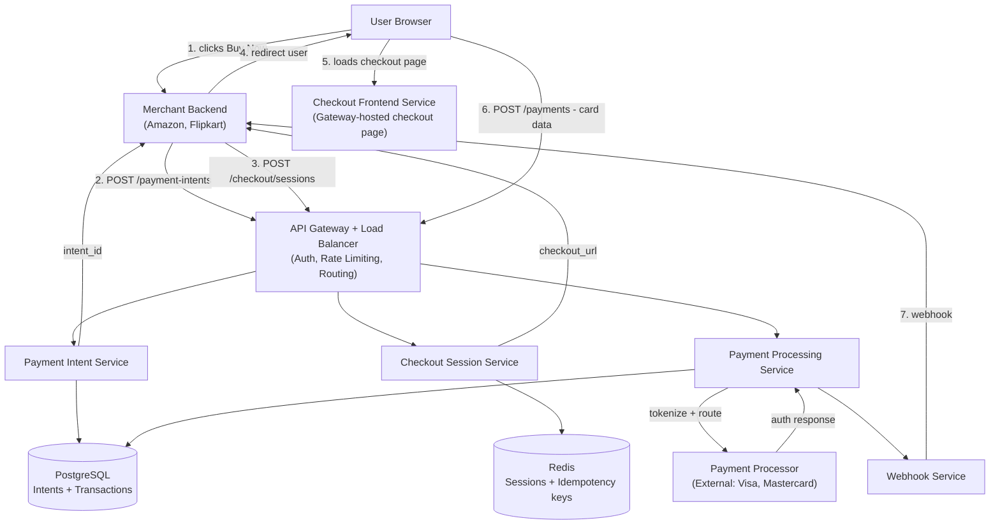
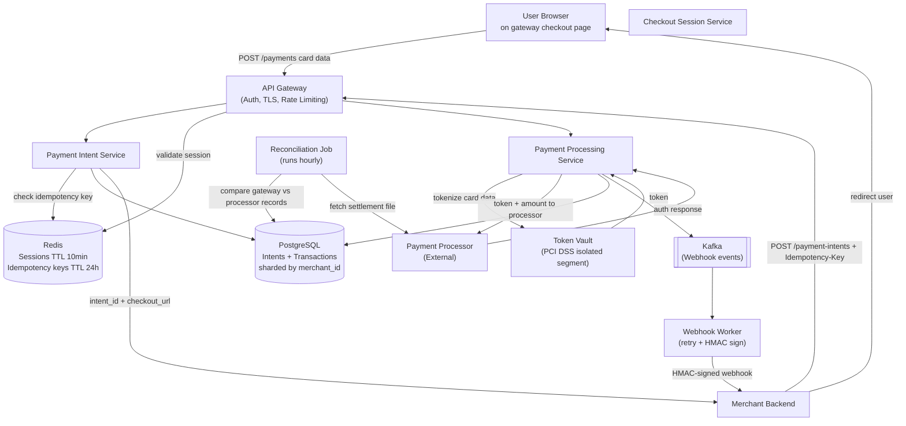
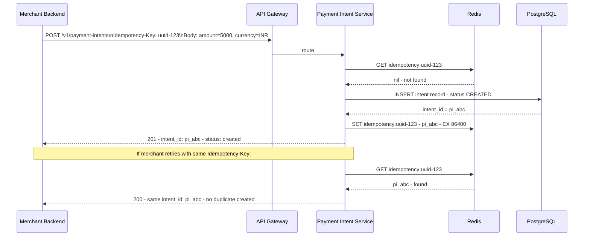
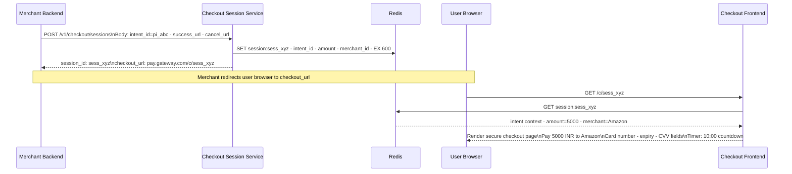
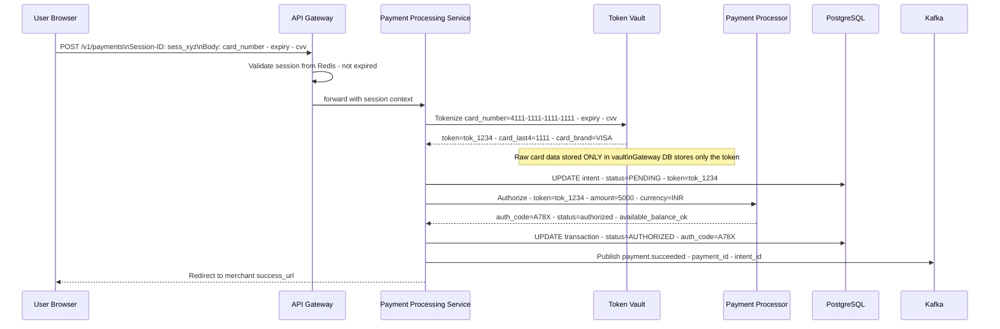
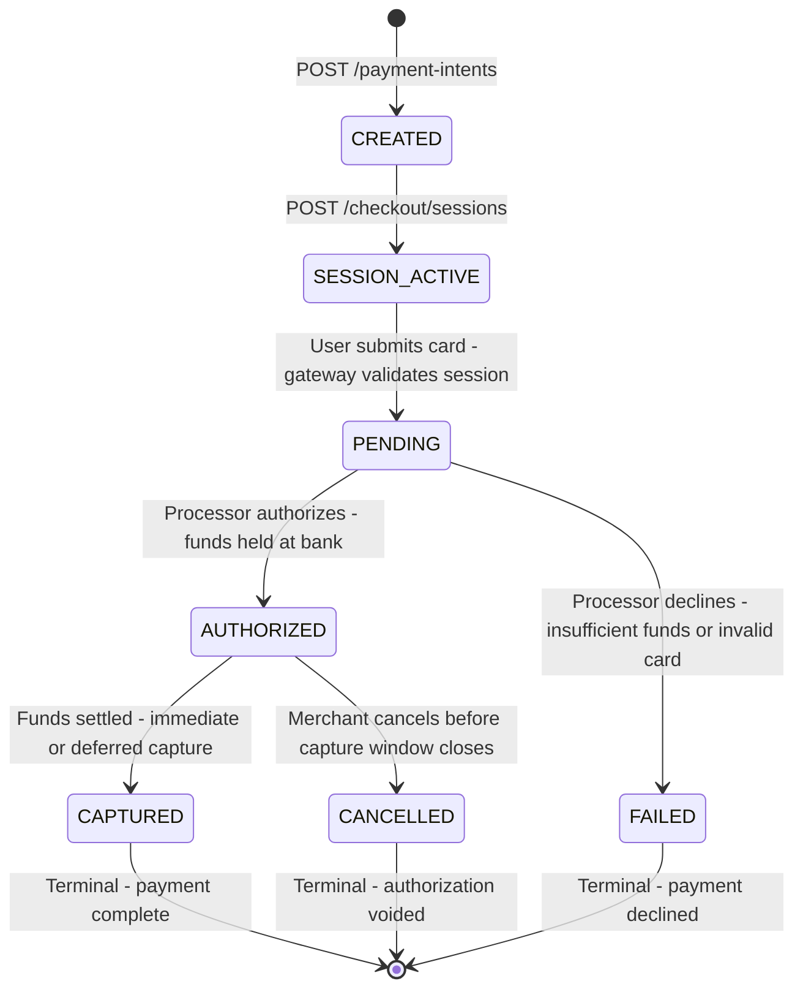
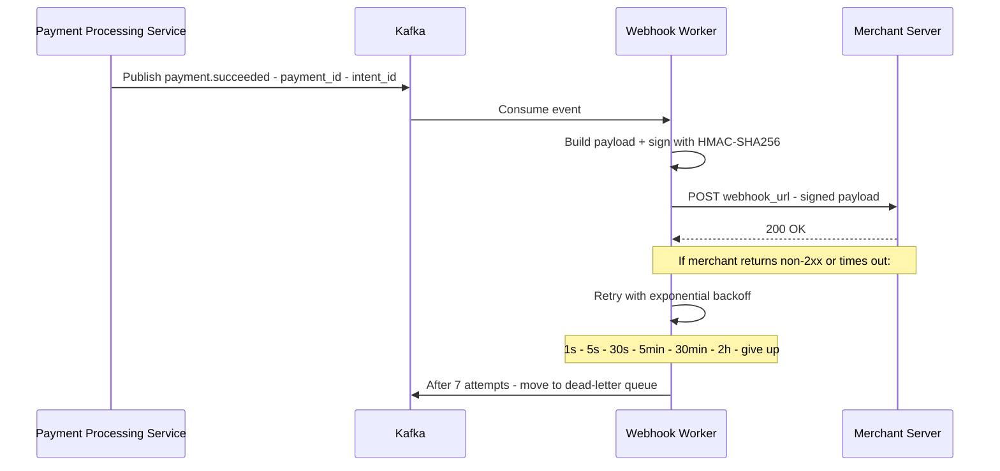

# System Design: Payment Gateway (Stripe / Razorpay / PayPal)

---

## 🧠 Mental Model

> **A payment gateway is not a bank. It is a traffic controller and security layer between merchants and payment processors.**

Before designing anything, understand the two entities the interviewer is testing:

| | Payment Gateway | Payment Processor |
|---|---|---|
| **What it is** | Orchestration engine | Financial network entity |
| **What it does** | Collects card data, tokenizes it, routes to processor | Talks to banks and card networks (Visa/Mastercard) to authorize, capture, and settle money |
| **Our scope** | ✅ We are designing this | ❌ External black box |
| **In simple words** | Traffic controller of payments | The system that moves the money |

The system runs three sequential phases:

```
Phase 1: INTENT             Phase 2: SESSION            Phase 3: PAY
User clicks Buy Now    →    Gateway creates        →    User submits card
                            secure checkout page        details on GW page
       │                           │                           │
Merchant backend            Merchant redirects         Gateway tokenizes
POST /payment-intents       user to GW checkout URL    → routes to processor
       │                           │                           │
       ▼                           ▼                           ▼
Payment Intent DB           Redis (TTL 10 min)          Payment Processor
returns intent_id           returns session_id          → Bank authorization
```

> [!IMPORTANT]
> **The gateway hosts the checkout page — not the merchant.** When you click "Pay Now" on Amazon, Amazon redirects you to Razorpay/Stripe's page to enter card details. This is not a UX choice — it is the PCI DSS compliance boundary. Card data must never touch the merchant's servers.

### ⚡ Core Design Principle

| Principle | Mechanism | Optimizes for | Can fail? |
|---|---|---|---|
| **Idempotency** | Idempotency key per request; deduplicated in Redis | Prevents double charges on network retries | No — must check before processing |
| **Tokenization** | Card data → random token; raw card number never stored in main DB | PCI DSS compliance; vault isolates card data | No — must tokenize before any persistence |
| **Consistency over Availability** | PostgreSQL ACID; CP over AP | Money cannot be double-charged or lost | No — payment state must be consistent |
| **Session = Redis TTL** | Checkout session lives ~10 min; auto-expires | Low latency lookup; no cleanup job needed | Yes — expired session = user retries checkout |
| **Async confirmation** | Processor responds "order placed", not "money moved" | Decouples gateway latency from bank processing | Yes — reconciliation job catches mismatches |
| **Webhook at-least-once** | Kafka retry queue; HMAC-signed payloads | Reliable merchant notification | Yes — merchant must handle duplicate webhooks |

> [!NOTE]
> **Key Insight:** The 200ms latency target covers only the gateway's processing — tokenization, session validation, routing to processor. The actual bank authorization (inside the payment processor) takes 2–5 seconds. We are responsible for < 200ms of that total.

---

## 1. Problem Statement & Scope

Design a payment gateway (like Stripe, Razorpay, or PayPal) that merchants integrate into their checkout flows to accept payments from users. The gateway collects card details securely, tokenizes them, routes to payment processors, and notifies merchants of payment outcomes.

**In scope:**
- Payment intent creation — register a payment before card data is collected
- Secure checkout session — gateway-hosted card entry page (not merchant's)
- Card tokenization and routing to external payment processor
- Transaction status tracking
- Webhook delivery to merchants on payment outcomes

**Out of scope:**
- Actual bank-level money movement (payment processor — black box)
- Partial payments and installments
- Refunds and chargebacks
- Fraud detection ML (separate service)

---

## 2. Requirements

### Functional Requirements

1. **Payment Intent** — merchant creates a payment intent (what's being bought, amount, currency)
2. **Checkout Session** — gateway generates a secure session and hosted checkout page for card entry
3. **PCI DSS-compliant data handling** — card data captured on gateway's page, tokenized, never stored raw
4. **Transaction status** — merchant can query payment status at any time
5. **Webhook notification** — gateway notifies merchant's backend when payment succeeds or fails

### Non-Functional Requirements

| Requirement | Target | Reasoning |
|---|---|---|
| Scale | 10,000 TPS | Stated by interviewer |
| CAP choice | Consistency over Availability (CP) | Money — double charges or lost payments are unacceptable |
| Latency | < 200ms for gateway processing | Tokenization + session validation only; processor latency is out of our control |
| Security | PCI DSS Level 1 compliant | Card data must never be exposed to merchants or stored raw |
| Durability | Zero payment record loss | Every transaction record must survive server failures |
| Idempotency | All payment operations must be retry-safe | Network retries must never double-charge |

> [!NOTE]
> **Key Insight:** This system is domain-centric — most of the design decisions flow from two constraints: PCI DSS compliance and idempotency. Every major architectural choice (hosted checkout page, token vault, idempotency keys, reconciliation) exists to satisfy one or both of these.

---

## 3. Back-of-Envelope Estimations

```
Scale: 10,000 TPS peak

Each payment = 3 API calls (intent + session + pay) → 30,000 req/sec peak

Payment Intent records:
  10,000/sec × 86,400s = 864M intents/day at peak
  Real average ~10× lower → ~86M/day
  Record size ~500 bytes → ~43 GB/day
  PostgreSQL sharded by merchant_id — manageable

Session data (Redis):
  10,000 concurrent active sessions (TTL = 10 min)
  Session size ~2 KB each → ~20 MB in Redis at any time
  Trivial for Redis — billions of keys supported

Webhook deliveries:
  10,000 payments/sec → 10,000 webhooks/sec to merchants
  At-least-once + retry → ~15,000 deliveries/sec peak
  Kafka topic with per-merchant partitioning

Idempotency key store (Redis):
  TTL = 24h; 10,000 keys/sec × 86,400s = 864M keys/day
  Key size ~200 bytes → ~173 GB/day churn
  Redis cluster with LRU eviction — manageable
```

---

## 4. API Design

### Merchant-Facing APIs

```
POST /v1/payment-intents
  Header:  Authorization: Bearer {merchant_api_key}
  Header:  Idempotency-Key: {client_generated_uuid}
  Body:    { amount, currency, customer_id, order_id, metadata }
  Response: { intent_id, status: "created", created_at }
  Purpose: Register a payment before any card data is collected

POST /v1/checkout/sessions
  Header:  Authorization: Bearer {merchant_api_key}
  Body:    { intent_id, success_url, cancel_url }
  Response: { session_id, checkout_url: "https://pay.gateway.com/c/{session_id}" }
  Purpose: Create secure session; merchant redirects user to checkout_url

GET /v1/payments/{payment_id}
  Header:  Authorization: Bearer {merchant_api_key}
  Response: { payment_id, intent_id, status, amount, currency, created_at, updated_at }
  Purpose: Poll transaction status (supplement to webhook)
```

### Gateway-Internal API (Checkout Page Only)

```
POST /v1/payments
  Header:  Session-ID: {session_id}     ← validated server-side from Redis
  Body:    { card_number, expiry, cvv, cardholder_name }
  Response: { payment_id, status: "pending" }
  Purpose: User submits card data on gateway-hosted checkout page
  Note:    This endpoint is ONLY called by the gateway's own checkout frontend.
           Merchants never call this directly — they have no access.
           This endpoint lives inside the PCI DSS-scoped network segment.
```

### Webhook Payload (Pushed to Merchant)

```
POST {merchant_webhook_url}
  Header:  X-Gateway-Signature: HMAC-SHA256(payload, merchant_webhook_secret)
  Body:    {
    event:      "payment.succeeded" | "payment.failed" | "payment.pending",
    payment_id: "pay_xyz",
    intent_id:  "pi_abc",
    amount:     5000,
    currency:   "INR",
    timestamp:  "2026-03-28T10:00:00Z"
  }
```

> [!NOTE]
> **Key Insight:** The Idempotency-Key header on POST /payment-intents is the most important field in the entire API. If the merchant's server crashes after calling the API but before receiving the response, it retries with the same key — and gets back the same intent_id without creating a duplicate payment. This prevents double charges on any infrastructure failure.

---

## 5. Architecture

### Simple High-Level Design



### Evolved Design (with Token Vault + Kafka + Reconciliation)



---

## 6. Deep Dives

### 6.1 Complete Payment Flow (The 3-Phase Journey)

> **Here is the problem we are solving: a user wants to pay a merchant, but the merchant must never see card data, and we must guarantee exactly-once money movement even across retries and failures.**

#### Phase 1 — Payment Intent



#### Phase 2 — Secure Session (Gateway creates checkout page)



#### Phase 3 — Authorization (User clicks Pay Now)



---

### 6.2 Tokenization and PCI DSS Compliance

> **The gateway never stores raw card numbers. The token vault is the only PCI DSS-scoped system. Everything else operates on tokens.**

**What tokenization does:**

```
User enters:  card_number = 4111 1111 1111 1111
              expiry      = 12/28
              cvv         = 123

Token Vault:
  1. Encrypt card with AES-256 (key stored in HSM — Hardware Security Module)
  2. Generate random token: tok_abc123xyz
  3. Store: tok_abc123xyz → encrypted(4111..., 12/28, 123)
  4. Return: token = tok_abc123xyz,  card_last4 = 1111

Gateway DB stores:  token, card_last4, card_brand
Gateway NEVER stores: card_number, full expiry, cvv

When routing to processor:
  Vault looks up token → decrypts real card data → sends to processor over TLS + mutual auth
  Processor receives real card data (from vault), not tokens
```

**PCI DSS scope isolation:**

```
┌────────────────────────────────────────────────────────────────┐
│  PCI DSS Scope (isolated network segment, strict access control)│
│  ┌──────────────────────────────────────────────────────────┐  │
│  │  Token Vault                                             │  │
│  │  - Only component that receives raw card data            │  │
│  │  - Encrypts using HSM-backed keys                        │  │
│  │  - Communicates with processor via TLS + mutual auth     │  │
│  └──────────────────────────────────────────────────────────┘  │
└────────────────────────────────────────────────────────────────┘

All other services (Intent Service, Session Service, Webhook Worker)
operate OUTSIDE PCI scope — they only handle tokens, never card data.
A breach anywhere outside the vault exposes zero card data.
```

> [!IMPORTANT]
> **The reason the gateway hosts the checkout page is PCI DSS compliance.** If the merchant's website collected card data, the merchant's entire infrastructure would be in PCI scope — requiring expensive annual audits, penetration testing, and compliance overhead. By hosting the card entry page, the gateway takes on PCI scope so merchants don't have to.

> [!NOTE]
> **Key Insight:** Tokenization isolates PCI scope. The vault is the only component that ever sees raw card numbers. A breach in any other part of the system — Intent Service, Webhook Worker, Reconciliation Job — exposes zero card data. This is the security architecture that makes it possible to run a payment company with a relatively small compliance footprint.

---

### 6.3 Idempotency — Preventing Double Charges

> **The most critical correctness property in a payment system: the same payment must never be processed twice, even when the client retries due to network failures.**

**The problem:**

```
Merchant calls POST /v1/payment-intents
  → Network timeout at 150ms
  → Merchant doesn't know: did the gateway receive it?
  → Merchant retries
  → WITHOUT idempotency: two intents created → user charged twice
```

**The solution:**

```
Request header:  Idempotency-Key: a1b2c3d4-uuid-generated-by-merchant

Gateway logic:
  1. Check Redis: GET idempotency:a1b2c3d4
     → Found:     return cached response immediately (no DB write, no duplicate)
     → Not found: proceed with processing
  2. Process request → write to PostgreSQL
  3. Cache result: SET idempotency:a1b2c3d4 {intent_id, status} EX 86400
  4. Return response

On merchant retry with same key:
  → Redis HIT → return same intent_id → zero duplicates
```

**Idempotency applies across all operations:**

| Operation | Mechanism |
|---|---|
| POST /payment-intents | Idempotency-Key header → Redis dedup (24h TTL) |
| POST /v1/payments (card charge) | Session ID is single-use — invalidated after first use |
| Processor call | auth_request_id sent to processor; processor deduplicates on their side |
| Webhook delivery | payment_id as dedup key; merchant must check before acting |

> [!NOTE]
> **Key Insight:** Idempotency is not an optimization — it is a correctness requirement. Without it, every network retry is a potential double charge. The 24h TTL on idempotency keys covers the realistic window for retries. After 24h, a new payment with the same key is treated as a fresh payment.

---

### 6.4 Payment State Machine

Every payment flows through defined states. No state can be skipped; no backward transitions are allowed (except to FAILED from any in-progress state).



**State stored in PostgreSQL (append-only event log):**

```sql
CREATE TABLE payment_events (
  event_id      UUID PRIMARY KEY,
  payment_id    UUID NOT NULL,
  from_status   TEXT,
  to_status     TEXT NOT NULL,
  processor_ref TEXT,          -- auth_code or decline_code from processor
  metadata      JSONB,
  created_at    TIMESTAMP DEFAULT NOW()
);
```

> [!NOTE]
> **Key Insight:** Never update a payment record in place — append events. This gives you a complete audit trail, makes reconciliation straightforward (compare event log with processor), and prevents race conditions from overwriting state. The current status is always the `to_status` of the latest event.

---

### 6.5 Reconciliation — The Source of Truth Problem

> **Here is the problem: the gateway thinks a payment is AUTHORIZED. The processor's settlement file says it never happened. Who is right?**

**Why reconciliation is necessary:**

```
Scenario 1 — Gateway ahead of reality:
  Gateway:           status = AUTHORIZED
  Bank settlement:   no record found
  Action:            Void the authorization, mark FAILED, notify merchant

Scenario 2 — Gateway behind reality:
  Gateway crashed after calling processor, before updating DB
  Bank:              money deducted, status = CAPTURED
  Gateway:           status = PENDING
  Action:            Update to CAPTURED, send webhook to merchant

Scenario 3 — Timeout during processor call:
  Gateway:           status = PENDING (processor call timed out)
  Bank:              authorization did happen (processor accepted before timeout)
  Action:            Fetch status from processor, update to AUTHORIZED or FAILED
```

**Reconciliation job (runs every hour):**

```
1. SELECT all payments WHERE status IN ('PENDING', 'AUTHORIZED') from PostgreSQL

2. For each payment:
   GET /v1/processor/status/{processor_ref}
   → Returns: { status: "settled" | "declined" | "pending" | "not_found" }

3. Compare and act:
   Gateway    | Processor  | Action
   PENDING    | settled    | → CAPTURED + send webhook
   PENDING    | declined   | → FAILED + send webhook
   PENDING    | not_found  | → Flag for manual review (possible split-brain)
   AUTHORIZED | settled    | → CAPTURED + send webhook
   AUTHORIZED | not_found  | → CANCELLED + alert ops team

4. Write all changes as new payment_events rows (append-only)
5. Emit Kafka events for any status changes → Webhook Worker delivers to merchant
```

> [!IMPORTANT]
> **Reconciliation is not a fallback — it is a required feature.** Every payment gateway runs reconciliation. Network partitions between the gateway and processor are not edge cases at 10,000 TPS — they happen daily. Reconciliation is what ensures your internal records converge with bank reality. The processor's settlement file is the ultimate source of truth — not your database.

> [!NOTE]
> **Key Insight:** The payment processor's settlement file is the ground truth. Money has either moved at the bank or it hasn't. Your database is a derived view of that truth. Reconciliation syncs the two on a schedule. For disputes, the bank's record wins — always.

---

### 6.6 Webhook Delivery

> **Merchants need to know when payments succeed or fail. The gateway pushes this via webhooks — but delivery must be reliable, protected against spoofing, and the merchant must handle duplicates.**

**Delivery pipeline:**



**HMAC signature — why it matters:**

```
Without signing:
  Attacker sends fake POST to merchant's webhook URL:
    { event: "payment.succeeded", payment_id: "pay_fake123" }
  Merchant ships order for free.

With HMAC-SHA256 signing:
  signature = HMAC-SHA256(request_body, merchant_webhook_secret)

Merchant verifies:
  expected = HMAC-SHA256(received_body, stored_secret)
  if signature != expected: reject — spoofed webhook
  if signature == expected: process
```

**Merchant-side idempotency (required):**

```
Webhook worker delivers at-least-once.
Merchant may receive the same event twice.

Correct merchant handler:
  1. Verify HMAC signature
  2. Extract payment_id
  3. SELECT from orders WHERE payment_id = ? AND status = 'paid'
     → Found: return 200 (already processed, no action)
     → Not found: fulfill order, mark paid, return 200
```

> [!NOTE]
> **Key Insight:** Never process a webhook without verifying the HMAC signature. An unverified webhook endpoint is a free order vulnerability — any attacker can POST a fake "payment.succeeded" event. Signature verification is the authentication layer for server-to-server callbacks.

---

## 7. ⚖️ Key Trade-offs

### Trade-off 1: Redis vs PostgreSQL for Sessions

| Dimension | Redis (chosen) | PostgreSQL |
|---|---|---|
| Latency | < 1ms | 5–50ms |
| TTL support | Native — key auto-expires | Requires background cleanup job |
| Durability | Not durable — session loss = user retries | Durable |
| Active sessions at 10K TPS | 10,000 keys × 2 KB = 20 MB in Redis | 10,000 rows (trivial) |
| Cleanup complexity | None | Cron job to delete expired rows |

**Chosen: Redis.**
Sessions are short-lived (10 min TTL), high-frequency (10,000 concurrent), and loss is acceptable — user retries. Redis TTL eliminates cleanup jobs entirely. The trade-off we accept is non-durability: a Redis restart loses active sessions. This is acceptable because a user re-initiating checkout is far better than adding DB write pressure for ephemeral data.

> [!NOTE]
> **Key Insight:** Redis TTL is the right primitive for short-lived transactional state. The session's value lives for exactly 10 minutes by design. PostgreSQL would give you ACID guarantees for data that is intentionally temporary.

---

### Trade-off 2: Synchronous vs Asynchronous Authorization

| Dimension | Synchronous (chosen) | Fully Asynchronous |
|---|---|---|
| User experience | User waits ~2–5s, sees result immediately | User sees "processing", webhook arrives later |
| Implementation | Blocking call to processor, timeout handling | Kafka-based, fully decoupled |
| Failure handling | Timeout → PENDING → reconciliation picks up | Natural for async — message replay |
| Appropriate for | Most consumer payments | High-volume B2B batch payments |

**Chosen: Synchronous with timeout + async reconciliation fallback.**
The user-facing flow is synchronous — we wait for the processor's authorization response (up to 30s timeout). If the processor times out, we set status to PENDING and rely on reconciliation to resolve. This gives most users an immediate result. The trade-off we accept is holding a connection open during processor processing (~2–5s), which is acceptable because users expect immediate feedback on payments.

---

### Trade-off 3: At-Least-Once vs Exactly-Once Webhook Delivery

| Dimension | At-Least-Once (chosen) | Exactly-Once |
|---|---|---|
| Implementation | Kafka + retry queue | Distributed 2PC or Kafka transactions |
| Risk | Merchant receives duplicate webhook | None |
| Mitigation | Merchant implements idempotent handler | Not needed |
| Infrastructure cost | Low | High — 2PC adds significant latency |

**Chosen: At-least-once with HMAC signing + merchant-side idempotency.**
Exactly-once delivery requires distributed transactions spanning the gateway and the merchant's system — prohibitively complex and slow. At-least-once is safe because merchants can (and must) implement idempotent webhook handlers. The trade-off we accept is that merchants receive the burden of deduplication, which is standard in the payment industry.

---

### Trade-off 4: Single Processor vs Multi-Processor Routing

| Dimension | Single Processor | Multi-Processor (chosen) |
|---|---|---|
| Failure resilience | Single point of failure | Failover to backup processor in < 1s |
| Cost optimization | No flexibility | Route to cheapest processor per card type |
| Authorization rate | Limited by one processor | Higher — failover improves success rate |
| Integration complexity | Simple | Multiple integrations required |

**Chosen: Multi-processor routing with primary/fallback.**
At 10,000 TPS, a single processor outage = 100% payment failure = direct revenue loss. Multi-processor routing lets the gateway failover in under 1 second. The trade-off we accept is integration complexity (each processor has a different API), which is acceptable because payment success rate is a direct revenue metric.

---

## 8. Interview Summary

### Decision Table

| Decision | Problem It Solves | Trade-off Accepted |
|---|---|---|
| Gateway hosts checkout page | Card data never touches merchant servers; PCI DSS scope isolation | Merchant must redirect users to gateway URL |
| Token Vault (isolated segment) | Raw card data never in main DB; breach anywhere else exposes zero cards | Additional network hop; vault is separate PCI-scoped infra |
| Idempotency keys (Redis, 24h TTL) | Network retries cannot double-charge | Merchant must generate and send idempotency key |
| Redis for sessions (TTL 10 min) | Sub-1ms session lookup; automatic expiry | Non-durable — Redis restart loses active sessions |
| PostgreSQL for transactions (ACID) | Consistent payment state; no phantom charges | Lower write throughput than NoSQL |
| Append-only event log for state | Full audit trail; reconciliation-friendly | More storage; current state requires latest event query |
| Reconciliation job (hourly) | Gateway state converges with bank truth after partitions | Up to 1h delay before failed payments are detected |
| Kafka for webhook delivery | Reliable at-least-once fan-out; retry on failure | Merchants must implement idempotent handlers |
| HMAC-signed webhooks | Merchants verify gateway authenticity | Merchant must implement signature verification |

### Fast Path vs Reliable Path

```
Fast Path (user experience, < 200ms gateway latency):
  User submits card → session validation (Redis, < 1ms)
                    → tokenization (Vault, ~10ms)
                    → processor call (sync, ~2-5s processor-side)
                    → redirect to success URL

Reliable Path (correctness, zero money lost):
  Intent → PostgreSQL write BEFORE returning intent_id
  Status transitions → DB write BEFORE broadcasting result
  Processor timeout → status = PENDING → reconciliation resolves within 1h
  Webhooks → Kafka at-least-once → retry with exponential backoff → DLQ

If fast path fails (processor timeout at 30s):
  Status = PENDING
  Reconciliation job picks up within 1h
  Webhook sent to merchant on resolution
  User sees "payment processing" — email confirmation follows
```

### Key Insights Checklist

- **Payment gateway ≠ payment processor.** The gateway orchestrates and tokenizes. The processor moves money at the bank. We design the gateway — the bank interaction is an external black box.
- **The gateway hosts the checkout page, not the merchant.** This is how PCI DSS compliance is achieved. Card data enters on gateway infrastructure. Merchants never see raw card numbers.
- **Tokenization isolates PCI DSS scope.** Raw card data lives only in the vault. A breach anywhere else in the system — Intent Service, Webhook Worker, Reconciliation Job — exposes zero card data.
- **Idempotency is a correctness requirement.** Every payment API call must be retry-safe. The idempotency key is the mechanism. Without it, retries = double charges.
- **The processor's response is "authorization placed", not "money moved".** Authorization holds funds at the bank. Capture moves them. Settlement happens in bank batch processes, reconciled hours later.
- **Reconciliation is not a fallback — it is a required feature.** Network partitions between gateway and processor happen daily at scale. Reconciliation ensures gateway state eventually matches bank reality. The processor's settlement file is the source of truth.
- **Webhooks are at-least-once; merchants must be idempotent.** HMAC-sign every webhook so merchants can verify authenticity. Merchants must check if payment_id was already processed before fulfilling orders.

---

## 9. Frontend Notes

**Frontend / Backend split: 90% backend, 10% frontend.**

The design is almost entirely backend: tokenization, idempotency, state machine, reconciliation, webhook delivery. The one frontend component worth mentioning is the gateway's own hosted checkout page.

| Concept | What to say in an interview |
|---|---|
| **Hosted Checkout Page** | The gateway renders its own secure HTML page for card entry. This page loads session context from Redis (merchant name, amount, timer). It submits card data directly to the gateway's PCI-scoped endpoint — not to any merchant server. |
| **Session Timer** | A countdown timer (10 min) shown on checkout. Implemented as `session_expires_at` in Redis. On submit, gateway checks TTL before processing. Expired session = reject with "session expired, please try again". |
| **3DS Redirect (optional)** | Some card banks require 3D Secure — an OTP/biometric step. The gateway detects this from the processor response and redirects the user to the bank's 3DS page mid-flow, then resumes on callback. |
