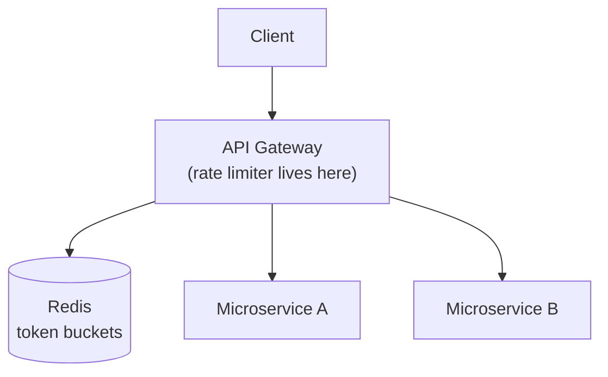
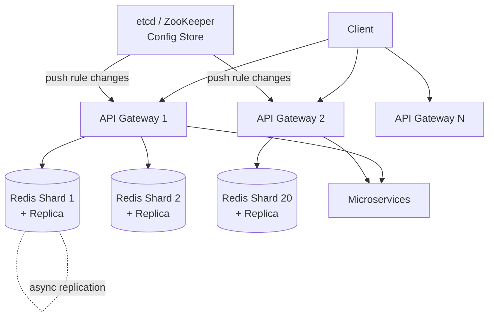
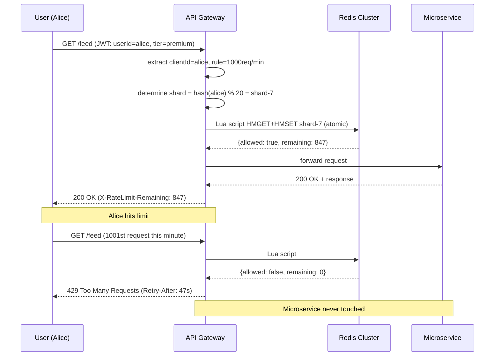

# Distributed Rate Limiter — System Design

---

## 1. What Is a Distributed Rate Limiter?

A rate limiter is the part of a backend system that decides how many requests any one client is allowed to make in a given stretch of time, and politely refuses the rest. It sits in front of a social media app's backend services, watching every request that comes through, and answering one question over and over: has this particular user, device, or API client already used up their share for right now?

Nobody using the app ever sees the rate limiter directly — there's no button for it, no screen, no setting. It's an invisible layer standing between the app's users and the servers doing the real work, there purely to keep those servers healthy when traffic gets heavy, unpredictable, or outright abusive.

---

## 2. A Day in the Life

Alice is a premium subscriber on a social media app. She's on her commute, and out of habit she taps into the app three or four times in the space of a few seconds — check the feed, check notifications, check her messages, back to the feed. None of that feels unusual to her; it's just how people actually use their phones, in little bursts rather than one request at a time.

A few seconds later, on a completely different part of the internet, something else is happening. A scraping tool, not a person, is hammering the same app's public profile pages over and over, as fast as its connection allows, trying to harvest photos before anyone notices. To the servers on the other end, both Alice's burst of taps and the scraper's flood look, for a fraction of a second, like the exact same thing: a lot of requests arriving very close together.

What happens next is where the two stories diverge. Alice's burst sails through without her ever noticing a delay — her few taps were well within what she's allowed, and the app just works. The scraper isn't so lucky: after a short burst of successes, every further request starts coming back with the same blunt message — *too many requests, try again in a little while* — and no matter how fast it keeps firing, that answer doesn't change until enough time has passed.

Neither Alice nor the scraper ever sees the machinery behind that difference. Everything from here on is how the system tells the two of them apart, in well under the time it takes to notice a delay.

---

## 3. Requirements — and Why They Matter

**What's in scope, and what isn't.** This design covers identifying clients (by user ID, IP address, or API key), enforcing configurable rules per client tier, the token bucket algorithm itself, keeping state in sync across every gateway instance with no shared local memory, updating rules on the fly, and returning proper error responses. It deliberately leaves out client-side rate limiting — a client can always just ignore its own code, so the moment rate limiting actually matters is the moment it's enforced somewhere the client doesn't control — along with billing/quota metering and content-based throttling, both of which are different problems wearing a similar shape.

> [!IMPORTANT]
> **The core problem, stated precisely:** control request rate without adding meaningful latency, while staying accurate across a distributed system of multiple gateway instances that share no local state. Every design decision in this doc is really an answer to some piece of that sentence.

**Functional requirements — what the system has to actually do:**

1. Identify clients by User ID (authenticated), IP address (anonymous), or API key (developer APIs)
2. Enforce configurable rate limit rules per client tier — a regular user gets 100 requests/min, a premium user gets 1000/min, an API key gets 50,000/min
3. Apply the token bucket algorithm: a burst capacity plus a steady refill rate
4. Return `429 Too Many Requests` immediately on limit exceeded — fail fast, never queue
5. Include informative response headers: remaining requests, reset time, retry-after
6. Support dynamic rule changes without redeploying the gateway

<details markdown="1">
<summary><strong>Point to Ponder:</strong> Why fail fast with an immediate 429 instead of queuing an over-limit request until there's room?</summary>

Because a queued request just makes the user wait, and a user who's waiting assumes something's broken — they click again, which adds a second request on top of the first, and now the backlog is growing instead of draining. For interactive APIs, an immediate, clear 429 is always the right answer; queuing only makes sense for batch jobs that can genuinely afford to sit and wait. See §6 System Interface for the full reasoning.

</details>

**Non-functional requirements — and why each one matters, not just as a number to hit:**

| Requirement | Target | Why it matters |
|---|---|---|
| Availability | AP — availability over consistency | The rate limiter has to stay up through partial failures; a few seconds of stale rules is a far smaller problem than the rate limiter itself going offline and taking protection with it. |
| Rate check latency | <10ms added overhead | It sits in the critical path of every single request — any latency it adds, every user feels directly, on every request, forever. |
| Throughput | 1M RPS | This is simply what 100M daily active users produces at peak — not a target chosen in isolation. |
| Fault tolerance | Fail close, with a local fallback | Failing open lets bad actors straight through, and an unprotected backend can cascade-fail under exactly the kind of load the rate limiter exists to stop. |
| Rule propagation | <1 second | Achieved by pushing config changes (via etcd/ZooKeeper), not polling for them — a slow-to-update rule is a rule an abusive client can exploit for longer. |

**Consistency model, by domain — because "consistency" isn't one setting for the whole system:**

| Domain | Model | Reason |
|---|---|---|
| Token bucket state | Eventual (async replication) | A user getting one extra request through during a replica failover is a rounding error, not a correctness bug. |
| Rate limit rules | Near-real-time push | Rules are pushed via an etcd/ZooKeeper subscription, so there's no polling delay baked into how fast a change takes effect. |
| Client identification | Read-your-writes not required | The limit is enforced per time window, not per session — there's no "your own write" to read back. |

<details markdown="1">
<summary><strong>Point to Ponder:</strong> If the rate limiter has to choose between availability and consistency, why pick availability for a system whose whole job is enforcing a hard limit?</summary>

Because the two things it's protecting aren't equally important: the token bucket count itself can afford to be slightly stale (worst case, a handful of extra requests slip through for a few seconds), but the rate limiter going fully offline removes protection from every backend service behind it, for everyone, all at once. A slightly generous limit for a few seconds is a much smaller failure than no limit at all. See §8.5 for exactly how that trade-off is implemented — fail close with a local fallback, not a hard stop.

</details>

---

## 4. Scale, From First Principles

Before designing anything, it's worth working out what scale actually means here — how many users, how many requests, and what that implies for the technology underneath.

**Starting assumptions:**
```
Daily Active Users:      100M
Requests/second (peak):  1M RPS
```

**How many Redis operations does checking one request actually cost?** Each check reads the current bucket state and writes the updated one back — an `HMGET` followed by an `HMSET` — so that's 2 Redis operations per check, not 1. A single Redis instance tops out around 100K operations per second, which means it can only sustain:
```
100K ops/sec / 2 ops per check = 50K RPS per Redis instance
```

**What does that imply for the number of shards?** At 1M RPS system-wide, one Redis instance is 20 times undersized:
```
1M RPS / 50K RPS per instance = 20 Redis shards, minimum
```
That's not a comfortable number to round up from — it's the floor. Redis throughput, not storage, is the actual bottleneck this design has to solve for.

**Is storage even a concern at this scale?** A token bucket only needs two values per user — token count and last refill timestamp, each an int64 — so 16 bytes per user. Across 100M users:
```
100M users x 16 bytes -> ~3-4GB total (with overhead) -> ~150-200MB per shard
```
That comfortably fits in memory on any standard Redis node. Storage was never going to be the constraint here, which is exactly why the 20-shard number above is driven entirely by throughput, not capacity.

**What's the hardest latency constraint?** Fewer than 10ms of added latency per request. The rate limiter sits directly in the critical path of every single request that reaches the backend — any latency it adds is latency every user feels, on every request, all the time.

These numbers are what drive the rest of this design: Redis Cluster with 20 shards (not a single Redis instance), connection pooling at every gateway instance, and geographic colocation of Redis with the gateway — because at a 10ms latency budget, even a single extra network hop across a region boundary would eat a meaningful chunk of it.

---

## 5. High-Level Architecture

Go back to Alice's burst of taps and the scraper's flood from the story above — here's what's actually deciding, in milliseconds, which is which.

A rate limiter is fundamentally a distributed counter system: something that decides whether a request should pass, based on time and how much of a client's allowance has already been used. Three pieces make that decision: a **time window** that defines the measurement period (say, one minute); a **counter** that tracks how many requests a client has made inside that window, held in Redis so every gateway instance sees the same number instead of its own local guess; and a **decision engine** — the token bucket algorithm — that turns whatever the counter currently says into a plain allow-or-reject.

Every request from any client passes through exactly one gate: the API Gateway. Before it routes anything anywhere, the gateway asks one question — *is this client allowed?* — and the answer to that question lives in Redis, shared state every gateway instance can see, never in the gateway's own local memory. That's the architectural decision everything else here is downstream of: a client's request could land on any of dozens of gateway instances, in any order, and each one has to see the exact same picture of how much that client has already used.

| Fast Path (allow) | Reliable Path (reject) |
|---|---|
| Gateway `HMGET`s Redis directly (<1ms) | An atomic Lua script reads and updates in one Redis operation |
| Rules are cached in-memory on the gateway, pushed there by etcd | 429 and headers return immediately, no queue |
| The connection pool reuses TCP connections — no handshake per check | Fails close if Redis is unavailable |

<details markdown="1">
<summary><strong>Point to Ponder:</strong> Why does the gateway keep rate limit rules cached in its own memory instead of just asking Redis for them on every request, the way it asks about token counts?</summary>

Because rules change rarely — nowhere near as often as token counts, which change on every single request — so paying a network round-trip for something that's almost always the same answer would be pure waste on the hottest path in the system. §8.6 covers the push mechanism (etcd) that keeps that in-memory cache correct without ever polling for it.

</details>

### Simple Design



### Evolved Design



The simple version is a single gateway talking to a single Redis instance — fine for understanding the shape of the system, but it doesn't survive contact with the scale numbers from §4. The evolved version is the same idea repeated across many gateway instances and 20 Redis shards, with etcd pushing rule changes out to every gateway instead of any of them polling for updates.

### The Full Sequence

Trace Alice's request all the way through, and then the scraper's rejected one right behind it. Alice's `GET /feed` hits an API Gateway carrying her identity — a `userId` pulled from the JWT in her `Authorization` header since she's logged in, a source IP from `X-Forwarded-For` if a request is anonymous instead, or an `API-Key` header if the caller is a developer integration. The gateway already knows which rule applies to her before it touches Redis at all: premium users get 1000 requests/minute, regular users get 100/minute, and that mapping came from etcd on gateway startup, not a lookup on this request. With identity and rule both in hand, the gateway calls Redis with a single Lua script — an atomic read-modify-write that reads the bucket, calculates the refill, and writes the result back, all in one indivisible round trip:
```lua
-- atomic: no race condition possible
local bucket = redis.call('HMGET', clientKey, 'tokens', 'last_refill')
local tokens = tonumber(bucket[1]) or MAX_TOKENS
local last_refill = tonumber(bucket[2]) or now
local elapsed = now - last_refill
local refill = math.floor(elapsed * REFILL_RATE)
tokens = math.min(MAX_TOKENS, tokens + refill)
if tokens > 0 then
  tokens = tokens - 1
  redis.call('HMSET', clientKey, 'tokens', tokens, 'last_refill', now)
  return {1, tokens}   -- allowed
end
return {0, 0}          -- rejected
```
For Alice, that script comes back `{allowed: true, remaining: 43}`, and the gateway forwards her request to the right microservice — total added overhead under 2ms.

The scraper's request runs through the exact same steps — identify, look up rule, call the Lua script — and only diverges at the very last one: the script comes back `{allowed: false, remaining: 0}`, and the gateway returns `429 Too Many Requests` with the rate-limit headers immediately, without ever forwarding the request to a microservice. The microservice never even knows the scraper's request happened — again, under 2ms of added overhead, this time to reject rather than forward.

> [!IMPORTANT]
> **No async queue in this system — rate limiting is synchronous by design.** The check has to complete before the request is forwarded. Async rate limiting would mean routing the request first and checking the limit later — by then the backend has already done the work the rate limiter was supposed to prevent it from doing. A rate limiter is a gate, not a filter.



What happens if the gateway can't even reach Redis to ask the question — a shard timing out mid-check — gets its own full mechanism in §8.5; the short version is that the gateway never fails open, it falls back to a coarser local check instead.

---

## 6. System Interface

This isn't a REST API in the usual sense — there's no client anywhere in the system that calls it directly. Every caller is another piece of infrastructure: the API Gateway is the only thing that ever invokes it, on every single request that passes through, which is why the interface is shaped as an internal RPC rather than a set of public endpoints.

```
isRequestAllowed(clientId: string, rule: Rule) → Response

Response {
  allowed:       bool
  remaining:     int       // tokens left after this check
  reset_at:      int64     // unix ts when bucket fully refills
  retry_after_s: int       // seconds until next token available (on reject)
}
```

The one field worth calling out specifically is `retry_after_s` — it only gets populated on a rejection, and it exists so the caller never has to guess how long to back off for; the rate limiter already knows exactly when the next token becomes available, so it just says so.

**On reject, the caller turns that response into an HTTP 429 for the end user, with headers carrying the same information back out:**
```
HTTP/1.1 429 Too Many Requests
X-RateLimit-Limit:     100          ← the rule ceiling
X-RateLimit-Remaining: 0            ← tokens left
X-RateLimit-Reset:     1704067260   ← unix ts of next full refill
Retry-After:           47           ← seconds until retry makes sense
```

**Why fail fast instead of queuing an over-limit request?** A queued request just makes the user wait — and a user who's waiting assumes something is broken, so they click again, and now there's a growing backlog plus double the original requests. For interactive APIs, an immediate, clear 429 is always the right call. Queuing only makes sense for batch jobs that can genuinely afford to sit and wait — which is exactly the class of caller this system doesn't have.

---

## 7. Data Model

Three different kinds of data live behind this system, and they end up in three different places for three different reasons.

**Token bucket state is the hottest, most ephemeral piece, and it lives in Redis Cluster.** Every single request touches it, it needs a sub-millisecond lookup, and it has to be visible to every gateway instance at once — no single gateway can keep it locally, because the next request from the same client could land on a completely different instance. At the simplest level, the entire model is just a key and a value:
```
key:   user_id  (or ip_address, or api_key)
value: { count, timestamp }
```
Everything else here — the algorithm that decides what `count` means, the sharding that scales it to 20 Redis shards, the atomicity that keeps concurrent updates correct — is an optimization layered on top of those two fields, not a different data model.

In Redis specifically, that key/value pair becomes a hash with two fields:
```
Key:   rl:{clientId}         (e.g., rl:user_alice, rl:ip_1.2.3.4)
Type:  Hash
Field  tokens        → current token count (int)
Field  last_refill   → unix timestamp ms (int64)

HMGET rl:user_alice tokens last_refill
HMSET rl:user_alice tokens 847 last_refill 1704067213000
```
Two fields at roughly 8 bytes each, plus Redis's own hash overhead, comes out to about 100 bytes per user — so 100M users is roughly 10GB total, or about 500MB per shard across the 20-shard cluster from §4. That's comfortably within what a standard Redis node holds in memory.

**Rate limit rules are the opposite of hot — they change rarely, but they're read on every request — so they live in etcd/ZooKeeper as the source of truth, and get pushed into each gateway's own in-memory cache rather than queried from Redis alongside the token bucket.** Paying a network round-trip for data that's almost always unchanged from the last time it was read would be waste on the single hottest path in the system, which is exactly why §8.6 covers the mechanism (etcd's push subscription) that keeps that cache correct without ever polling it:
```json
{
  "rules": [
    { "tier": "premium",   "max_tokens": 1000, "refill_rate": 1000 },
    { "tier": "standard",  "max_tokens": 100,  "refill_rate": 100  },
    { "tier": "anonymous", "max_tokens": 20,   "refill_rate": 20   },
    { "endpoint": "/api/v1/search", "max_tokens": 50, "refill_rate": 50 }
  ]
}
```

**And the coldest data of all — an optional audit log of rejected requests — belongs nowhere near the hot path at all.** It exists purely for abuse analysis and after-the-fact debugging, so it's a fire-and-forget stream: Kafka feeding into S3, never something the rate-limiting decision itself waits on.

| Entity | Storage | Key Columns / Format |
|---|---|---|
| Token bucket state | Redis Cluster (sharded, Hash) | `rl:{clientId}` → tokens (int), last_refill (int64 ms) |
| Rate limit rules | etcd/ZooKeeper (source of truth) + gateway in-memory cache | tier or endpoint → max_tokens, refill_rate |
| Audit log (rejected requests) | Kafka → S3 (optional, cold) | Rejected-request metadata, for abuse analysis only |

---

## 8. Deep Dives

### 8.1 Rate Limiting Algorithms — Four Options, One Winner

This is the single decision the rest of the system is built around — every other deep dive in this doc assumes an algorithm has already been picked, so it's worth walking through the whole reasoning, not just naming the winner.

**What this piece of the system actually has to do:** given a client and a configured limit (say, 100 requests per minute), decide — on every single request, in well under a millisecond — whether to let it through or reject it. It has to guard against three specific failure modes at once: letting a client sneak past its limit by exploiting how the limit is measured (a boundary effect), costing so much memory per client that it can't scale to 100M users, and being too rigid to tolerate the bursty way real clients actually behave — Alice checking the feed, notifications, and messages within a couple of seconds isn't abuse, and an algorithm that treats it as such is punishing normal usage.

**Option 1 — Fixed Window Counter.** A counter per client that resets at the start of each fixed window, say every minute on the dot:
```
Alice: { count: 87, window_start: 12:01:00 }
```
It's trivial to implement — just a hash table — but it fails on exactly the boundary case above: Alice can send 100 requests at 12:01:59 and another 100 at 12:02:00, and the counter resets between them, so she gets 200 requests through in two seconds flat against a limit that was supposed to cap her at 100 per minute. The window boundary is a seam the algorithm itself creates, and a client only has to time its burst around that seam to double its effective limit.

**Option 2 — Sliding Window Log.** Track the exact timestamp of every request in a sorted set, and count how many fall within the last 60 seconds on each new request, rejecting once that count hits the limit. This is perfectly accurate — there's no seam to exploit, because the window is always exactly the last 60 seconds, recalculated fresh every time. The cost is memory: it needs an unbounded, ever-growing sorted set per user, and at 1M users each making 100 requests, that's 100 million timestamps sitting in memory at once. Perfect accuracy here comes at a storage cost this system can't afford.

**Option 3 — Sliding Window Counter.** A compromise: keep two counters instead of a full log — `prev_count` for the previous full window and `curr_count` for the current one — and estimate the true sliding count as a weighted blend of the two:
```
estimated = curr_count + prev_count × (1 - elapsed/window_size)
```
With `prev=8`, `curr=6`, and the window 70% elapsed, that's `6 + 8 × 0.3 = 8.4` — under a limit of 10, so the request is allowed. This is only two integers per user, which solves Option 2's memory problem outright, and it's a good approximation in practice. But it's still an approximation — it assumes requests are spread evenly across the window, so a genuine burst within a single window gets underestimated rather than counted exactly.

**Option 4 — Token Bucket (chosen).** Give each client a bucket with two properties: a **max tokens** value (burst capacity — say 100, meaning Alice can fire 100 requests instantly if her bucket is full) and a **refill rate** (say 60 tokens/minute, or one per second, which is the steady-state limit once the burst is spent). On every request, the bucket refills based on however much time has elapsed since the last check, one token is consumed if any are available, and the request is rejected if the bucket is empty:
```
tokens = min(max_tokens, stored_tokens + elapsed_seconds × refill_rate)
allowed = tokens > 0
new_tokens = tokens - 1 (if allowed)
```
It stores exactly the same two values as Option 3 — no memory cost beyond the sliding window counter — but it handles bursts explicitly and by design rather than as an approximation error. Alice's habit of checking the feed, notifications, and messages within a couple of seconds isn't something Token Bucket tolerates by accident; it's the exact behavior the burst-capacity parameter exists to allow.

| Algorithm | Memory | Accuracy | Burst handling |
|---|---|---|---|
| Fixed Window Counter | O(1) per user | Poor (boundary effect) | No |
| Sliding Window Log | O(requests) per user | Perfect | No |
| Sliding Window Counter | O(1) per user | Good (approximation) | No |
| Token Bucket (chosen) | O(1) per user | Good | Yes — explicit burst capacity |

That combination — the same O(1) footprint as the cheapest approximation, plus a mechanism built specifically for burstiness — is what makes Token Bucket the actual choice here, not just the fourth option in a list.

> [!NOTE]
> Token Bucket models how real APIs actually get used — a burst of activity when someone opens the app, then a quieter, steady trickle. Fixed Window punishes exactly that burst as if it were abuse. Token Bucket accommodates it because the algorithm was built around that pattern from the start, not despite it.

---

### 8.2 Where to Place the Rate Limiter — Three Options

Deciding on Token Bucket answers *how* to count; a separate question is *where in the architecture* that count actually gets checked.

**Option 1 — inside each microservice.** Rate limiting logic lives in each service's own application code, counting in local memory. It's fast — no network hop at all — but it has no view of the whole picture: if Alice's two requests get load-balanced to two different instances of the same service, each instance sees its own count of 1, each independently decides she's under her limit, and both allow the request — even though her real, global count is 2. Local-only counting simply can't see traffic that landed somewhere else, which is fatal the moment there's more than one instance of anything.

**Option 2 — a centralized rate limiter service.** Every microservice calls out to a dedicated service before doing any work, which does solve the global-visibility problem Option 1 has. But it does so by adding an entire extra network hop to every request: client → gateway → microservice → rate limiter service → microservice again, before any actual business logic runs. Two network hops purely for a yes/no answer blows straight through the <10ms latency budget from §3.

**Option 3 — at the API Gateway itself (chosen).** The rate-limiting logic runs inside the gateway, reading from the same shared Redis every other gateway instance reads from, and the check happens before any routing decision — a request that fails the check never reaches a microservice at all:
```
Client → Gateway (rate check → Redis) → Microservice (only if allowed)
```
It's a bouncer standing at the door, not a checkpoint somewhere inside the building — troublemakers never get past the entrance in the first place.

The one thing this placement costs: the gateway only has access to what's actually in the HTTP request — headers, URL, source IP, whatever's encoded in the JWT payload — it can't see deeper application state without paying for an extra lookup. Detecting a premium user is the concrete case this shows up in, and it's solved cheaply: the tier is encoded as a claim directly in the JWT, so the gateway reads it off the token it already has to parse anyway, with no extra database call required.

> [!NOTE]
> Placing the rate limiter at the gateway is the only one of the three options that satisfies both constraints at once — global state (every gateway instance shares the same Redis) and latency (one Redis round-trip, not two network hops through a separate service). Optimizing for either constraint alone would have picked a different answer.

---

### 8.3 The Race Condition — Atomic Read-Modify-Write via Lua

Here's a failure mode that has nothing to do with which algorithm was chosen and everything to do with there being more than one gateway instance: two instances, GW-A and GW-B, both happen to serve a request from Alice at almost the same moment. Both read her bucket and see `tokens=1`. Both compute the same thing independently — `1 > 0`, so allow — and both write `tokens=0` back. Alice gets two requests through, but her real remaining balance was only ever one token:
```
GW-A:  HMGET → tokens=1
GW-B:  HMGET → tokens=1   (stale read, GW-A hasn't written yet)
GW-A:  HMSET tokens=0     ← correct
GW-B:  HMSET tokens=0     ← overwrites GW-A's write, as if GW-A never ran
```
Both requests were accepted, and one of them got through for free — not because either gateway did anything wrong on its own, but because reading and writing were two separate operations, with a gap between them wide enough for a second gateway to slip through.

The naive fix is Redis's own `WATCH`/`MULTI`/`EXEC` — optimistic locking: watch the key, start a transaction, do the check-and-update, and if the watched key changed between the `WATCH` and the `EXEC`, the whole transaction aborts and has to be retried. It works, but under contention — exactly the condition that caused the race in the first place — those retries pile up and add latency right when the system can least afford it.

The mechanism actually chosen is Lua scripting. Redis executes Lua scripts atomically and single-threaded: the entire `HMGET` → calculate → `HMSET` sequence runs as one indivisible operation on the Redis server itself, so GW-B's script simply can't start until GW-A's has fully finished — there's no interleaving for a race to exploit in the first place:
```lua
local bucket = redis.call('HMGET', KEYS[1], 'tokens', 'last_refill')
-- ... calculate new tokens ...
if tokens > 0 then
  redis.call('HMSET', KEYS[1], 'tokens', tokens-1, 'last_refill', ARGV[1])
  return 1
end
return 0
-- all of this runs atomically in Redis, single-threaded
```
One network round trip is all it costs, and there's no point in the sequence where a second script could interleave with the first — the fix removes the race by construction, not by detecting and retrying it after the fact.

> [!NOTE]
> Redis is single-threaded for command execution, and a Lua script runs as one atomic unit within that — no other command, from any client, can interleave partway through it. That single fact is the whole reason Lua scripting solves this race condition without needing a distributed lock or an optimistic retry loop at all.

---

### 8.4 Scalability — Sharding Redis to 1M RPS

§4 already established the ceiling: a single Redis instance handles about 100K operations per second, each rate limit check costs 2 operations (`HMGET` + `HMSET` via the Lua script from §8.3), so one instance tops out around 50K RPS. The system needs 1M.

The math is direct: `1M RPS ÷ 50K RPS per instance = 20 Redis shards, minimum` — with 25% headroom added on top for safety margin, that's 25 shards in practice.

The sharding key is the client ID itself — the gateway hashes `clientId` to determine which shard to query, so Alice always lands on the same shard (shard-7, say) on every request. That's what keeps this scaling linear rather than getting complicated: one rate limit check is one Redis call to one shard, with no cross-shard coordination needed at all, because nothing about a single client's bucket ever needs to be visible to more than one shard.

The actual implementation is Redis Cluster, not a hand-rolled consistent-hashing scheme. Redis Cluster divides the keyspace into 16,384 fixed hash slots spread across N nodes — `CLUSTER KEYSLOT rl:alice` resolves to some slot, say 7832, which maps to shard-7 — and Redis Cluster itself handles rebalancing automatically whenever a node is added or removed, with client-side cluster-aware libraries (`redis-py`, `ioredis`) routing requests transparently without the application needing to know which shard owns which key.

The trade-off worth naming: hash slots aren't the same as consistent hashing, so adding a node means migrating slots between machines, and that migration causes a brief latency spike while it's happening. For a rate limiter, that's a cost worth accepting — node additions are rare, planned events, not something happening under live traffic pressure every day.

> [!NOTE]
> Hash the client ID to a shard, and one rate limit check becomes exactly one Redis node, one Lua script, one round trip — no scatter-gather across shards, no cross-shard coordination to get wrong. That's the property that makes horizontal scaling linear instead of getting harder as more shards get added.

---

### 8.5 Fault Tolerance — Fail Close, With a Local Fallback

What should happen when a Redis shard simply goes down? There are exactly two blunt options, and neither is comfortable on its own:

| | Fail Open | Fail Close |
|---|---|---|
| Behavior | Let all requests through | Reject all requests |
| Risk | Bad actors flood the system unchecked; backend services can cascade-fail | The site appears down to every legitimate user |
| When acceptable | Never, for a social media app | The standard starting choice |

Neither extreme is actually good enough on its own, which is why the real answer isn't either row of that table by itself — it's fail close, with a local fallback layered on top to avoid a full blackout.

When a gateway can't reach a Redis shard — the exact scenario from §5's forward reference, an `HMGET` to the shard simply timing out — it does not fail open and does not route the request through unchecked. Instead it falls back to a local, in-memory fixed-window counter, scoped to that shard's clients, running as a simple map inside the gateway process itself:
```
if (redis.ping() fails) {
  // fallback: local Map<clientId, {count, windowStart}>
  return localWindowCounter.isAllowed(clientId, rule);
}
```
That fallback is deliberately less accurate — gateway instances don't coordinate with each other while it's active, so in principle a client could get up to N times their real allowance, where N is the number of gateway instances independently running their own local count. But it's still rate limiting, still standing between the client and the backend, rather than a complete blackout of protection.

Meanwhile, on the Redis side, the story resolves itself on its own timeline: Redis Cluster automatically promotes the failed shard's replica via Sentinel, typically within 30 seconds. Once that promotion completes, the gateway reconnects to the new primary and simply discards its local fallback state — no manual intervention, no cleanup step, the coordinated Redis-backed counting just resumes where it left off. Each shard runs with one replica under async replication, which means the replica can be one or two writes behind the primary at the exact moment of failover — so during that specific handoff, a client might get one or two extra requests through beyond what they were strictly owed.

Both of those imprecisions land on the same side of one judgment call: this is a social feed's rate limiter, not a financial ledger, so a few extra requests slipping through during a rare, self-healing failure window isn't a correctness problem worth engineering around further.

> [!NOTE]
> Fail close protects the backend, which is the rate limiter's entire job. Failing open is the rate limiter admitting it can't do that job — and the fallout from that, cascading failures across every microservice behind it, is categorically worse than a 30-second window of slightly loosened enforcement during a Redis failover.

---

### 8.6 Dynamic Rule Configuration — Push, Not Poll

Rules aren't static — someone needs to be able to temporarily throttle a specific abusive user, or raise limits ahead of a planned traffic spike like a sale event — and that has to happen without redeploying every gateway instance.

**Polling PostgreSQL every few seconds** is the obvious first idea, and it fails on two fronts at once: a 5-second poll interval means up to a 5-second delay before a rule change actually takes effect, and every gateway constantly re-querying data that almost never changes wastes CPU and database load for essentially no benefit.

**Checking Redis on every request** is the second obvious idea — store rules in Redis right alongside the token bucket, and read both together. But that adds a second `HMGET` to the single hottest path in the entire system, on every single request, purely to read something that's almost always identical to what was read a moment ago.

**The chosen mechanism is push-based configuration via etcd**, a distributed key-value store built specifically for this kind of config management. Rules live in etcd as the source of truth; on startup, each gateway pulls the full rule set once and caches it in memory; each gateway then keeps a persistent subscription open to etcd over that same connection; and when a rule changes, etcd pushes just the diff down that open connection, and the gateway updates its in-memory cache on the spot. The hot path — the one thing every request actually touches — never has to ask about rules at all, because the answer is already sitting in memory, kept current by a background push rather than a per-request lookup. Rule changes propagate to every gateway in under a second, with zero polling overhead the rest of the time.

The trade-off worth naming: during that sub-second propagation window, different gateway instances can briefly be running slightly different rule versions. That's fine — a client getting one extra request through because one gateway hadn't yet received a rule update is not a correctness problem, just a brief, bounded inconsistency during a rare event.

> [!NOTE]
> Rules live in gateway memory, and etcd pushes changes into that memory rather than the gateway ever polling or looking anything up per-request. The hot path stays at exactly one Redis round trip, no matter how complex the rule configuration gets.

---

## 9. Bottlenecks, Failure Scenarios & Trade-offs

This design targets 100M DAU and 1M RPS at peak, and Redis throughput is the one bottleneck everything else in the system is arranged around — every other component scales out horizontally without needing to coordinate with anything else.

At 10x today's peak — 10M RPS — Redis throughput is the first thing to give: 10M RPS at 2 operations per check is 20M operations per second, which needs roughly 200 shards instead of 20, and Redis Cluster absorbs that the same way it absorbed the original 20 — by adding more nodes, since sharding by client ID scales linearly with no coordination between shards. Gateway CPU is next, spent on Lua script execution and connection management, and the fix there is exactly what it sounds like: auto-scale the gateway instance pool behind the load balancer. etcd's rule propagation has its own version of this problem once 200 gateway instances are all subscribing at once, but etcd is purpose-built for exactly this — a cluster of 3-5 etcd nodes comfortably handles thousands of concurrent watchers. And Redis connection pools can simply run out if 200 gateways each hold their own pool of connections and the total exceeds what a Redis node accepts; the fix is tuning pool size per gateway, backed by the fact that Redis 6 and later supports up to 65K connections per node, which is a lot of headroom to tune within.

Traffic spikes stress the system in different shapes, and each has its own answer already built in. A flash sale event means rules get changed in etcd ahead of time, and every gateway picks up the new, lower limits in under a second — the new limits are enforced before the spike actually lands, not scrambled into place after the fact. A DDoS attempt gets caught by the same IP-based rate limiting that handles any anonymous client — an attacking IP hits its limit within the first second of the attack, the same as any other client would. A viral post driving a legitimate traffic surge drains token buckets the same way any burst does — affected users start seeing 429s with a `Retry-After` header, well-behaved clients back off in response, and the system stabilizes on its own without anyone needing to intervene.

Multi-region deployment follows the same shape as the rest of this design: gateway and Redis Cluster get deployed per region — US-East, EU-West, AP-Tokyo, for instance — with each region's Redis fully independent, so no rate-limit check ever needs cross-region coordination. A client is identified consistently within a session, whether that's globally via JWT or regionally via IP. The one real trade-off is that a user physically moving between regions mid-session effectively gets a fresh token bucket in the new region — acceptable, since it's a rare edge case rather than a routine cost.

---

### 9.1 Failure Scenarios

Every component here can fail on its own, and how the system recovers depends entirely on whether what failed was holding fast, ephemeral state or something closer to a control plane.

The Redis layer fails in two related but distinct ways. If a shard goes down outright, roughly 5% of clients — whatever slice of the key space that shard owned — briefly lose their Redis-backed rate limiting, and the gateway's local in-memory fixed-window fallback from §8.5 picks up the slack until Redis Cluster promotes that shard's replica, which typically completes in under 30 seconds. Even after that promotion, the newly-promoted replica can be one or two writes behind the old primary — because replication is async — so a small number of clients get one extra request through during the handoff itself; acceptable for a system that isn't a financial ledger.

etcd going down is a slower-moving failure by comparison: gateways simply can't receive new rule updates, and fall back to whatever rules they last had cached in memory. Since rules rarely change to begin with, continuing to enforce stale rules is a reasonable default rather than a real degradation — and etcd itself runs as a 3-node cluster using Raft consensus, which survives the loss of any single node without losing quorum in the first place.

A gateway instance crashing outright is the least eventful failure of all: whatever requests were in flight are lost, along with any local fallback state that instance was holding, but gateways are stateless by design, so the load balancer simply routes around the dead instance and a fresh one restarts instantly with nothing to recover.

Two narrower failure modes round this out. A Lua script that somehow runs past 5ms would block other Redis commands behind it — mitigated with a hard `SCRIPT_TIMEOUT`, though in practice the script never gets close, since it's just arithmetic plus two `HMSET` calls and typically finishes in under a millisecond. And clock skew between a gateway's own clock and Redis's server clock would throw off the elapsed-time calculation the whole refill math depends on — the fix is having the Lua script pull time from Redis's own `TIME` command rather than trusting whatever the gateway's local clock says, which removes clock drift as a source of error entirely.

If connection pools themselves get exhausted — say, from too many gateways each holding too many connections against a Redis node's limit — Redis requests start queuing on the gateway side and latency spikes as a result; the response there is the same as any capacity problem: monitor pool utilization, scale out gateway instances to spread the connection load, and tune pool sizes to match.

---

### 9.2 Trade-offs

### Rate Limiting Algorithm

§8.1 already walked through why each of the four options behaves the way it does; the short version, side by side: Fixed Window is O(1) memory but has a real boundary-exploit weakness; Sliding Window Log is perfectly accurate but grows with request volume rather than staying flat; Sliding Window Counter is O(1) and a good approximation, but underestimates genuine bursts; Token Bucket matches the O(1) footprint of the counter approach while adding explicit, intentional burst support none of the other three offer.

**Chosen: Token Bucket** — the only one of the four with burst handling built in on purpose, which matches how real clients actually behave rather than treating every burst as something to be punished.

---

### Rate Limiter Placement

§8.2 covers why each of the three placement options plays out the way it does; compared side by side, running rate-limiting logic inside each microservice costs zero extra latency but has no global view of a client's traffic across instances, a centralized rate-limiter service fixes that visibility gap but adds a full extra network hop (two hops total) before any real work starts, and the API Gateway option lands in between — one Redis round-trip, roughly 1-2ms — while still seeing the client's full HTTP context including whatever's encoded in their JWT.

**Chosen: the API Gateway.** It's the bouncer at the door — a request that fails the check never reaches a microservice at all, and every microservice behind the gateway stays completely unaware that rate limiting is even happening.

---

### Failure Mode: Fail Open vs Fail Close

§8.5 already walks through the mechanism; framed purely as a trade-off, fail-open means normal user experience right up until the backend itself starts cascading under unchecked load, while fail-close-with-local-fallback accepts slightly less accurate limits for up to 30 seconds in exchange for the backend staying protected the entire time.

**Chosen: fail close with a local fallback.** Neither pure extreme was really acceptable — full fail-open trades away the rate limiter's entire purpose, and full fail-close trades away the app's own availability requirement (§3) for every user, not just the ones the rate limiter should be stopping.

> [!NOTE]
> The asymmetry that actually settles this: fail-close's downside has a ceiling — at most 30 seconds of slightly-stale limits before Redis recovers. Fail-open's downside doesn't have one. A backend that starts cascading under unchecked load doesn't stop at some fixed cost; it can take every service behind it down with it. Choosing between a bounded cost and an unbounded one isn't actually close.

---

### Rule Updates: Polling vs Push

§8.6 covers the mechanism; as a straight comparison, database polling costs nothing on the hot path but adds a delay equal to the poll interval before any rule change takes effect, checking Redis per-request keeps propagation immediate but adds a second Redis operation to every single request, and etcd's push model gets both wins at once — zero hot-path cost, because rules already sit in gateway memory, and sub-second propagation, because etcd pushes changes rather than waiting to be asked.

**Chosen: etcd push.** Zero added hot-path latency and sub-second propagation, without the constant polling overhead either of the other two approaches carries.

---

## 10. Frontend Notes

There genuinely isn't a frontend here — this system is 100% backend infrastructure, invisible to anyone using the app in the way described back in §2. But that doesn't mean client-side code has no relationship to it at all: the one place a client ever sees this system directly is the error response it gets back on rejection, and how a client's own code handles that response matters as much as anything on the backend side.

That response needs to be clear and immediately actionable, not just a bare status code:
```json
HTTP 429 Too Many Requests
{
  "error": "rate_limit_exceeded",
  "message": "Too many requests. Please retry after 47 seconds.",
  "retry_after": 47,
  "limit": 100,
  "window": "60s"
}
```

What a well-behaved client does with that response matters just as much as the response itself. It should respect the `Retry-After` header rather than retrying immediately — that header exists precisely so the client doesn't have to guess. If `Retry-After` isn't present for some reason, exponential backoff is the fallback, not an immediate retry. And whatever a raw 429 looks like under the hood, it shouldn't be shown to the user as-is — a friendly message like "Slow down — try again in a moment" belongs on the surface instead. The one thing client code should never do is automatically retry in a way that's invisible to the user — silently hammering the endpoint again the instant it's told to back off defeats the entire point of the rate limiter it just got a response from.

---

## 11. Evaluation: Did We Meet the Requirements?

Five non-functional requirements were set out in §3. Here's how the design actually satisfies each one — the specific mechanism doing the work, not just the promise restated.

**Availability (AP over consistency):** The design never lets a Redis outage take rate limiting fully offline — §8.5's local in-memory fallback keeps the gateway enforcing *something* even when it can't reach Redis at all, and Redis Cluster's own replica promotion (Sentinel, under 30 seconds) resolves the underlying failure on its own. The system stays up through partial failure by design, not by luck.

**Rate check latency (<10ms):** The fast path never touches disk — a single Lua script does one atomic Redis round trip per check, with rules already sitting in gateway memory rather than requiring a lookup (§8.6). Both the happy path and the rejection path in §5's full sequence come in under 2ms of added overhead, well inside budget.

**Throughput (1M RPS):** This isn't something the design was tuned to hit afterward — it's the number that ruled out a single Redis instance before any component was chosen. §4 shows the math directly: 1M RPS at 50K RPS per shard is 20 Redis shards, minimum, and §8.4 covers exactly how sharding by client ID makes that scale linearly with no cross-shard coordination.

**Fault tolerance (fail close with local fallback):** §8.5 is the mechanism end to end — Redis being unreachable never means requests pass through unchecked, it means the gateway drops to a coarser local counter until the real, coordinated state comes back online, discarding that fallback the moment it does.

**Rule propagation (<1 second):** etcd's push subscription model (§8.6) is what makes this true — a rule change reaches every gateway's in-memory cache within a second of being written, with zero polling delay baked into the mechanism at any point.

| Requirement | Mechanism |
|---|---|
| Availability (AP) | Local in-memory fallback + Redis Cluster replica promotion (§8.5) |
| Rate check latency (<10ms) | Atomic Lua script, one Redis round trip, rules cached in gateway memory |
| Throughput (1M RPS) | Redis Cluster, 20 shards, sharded by client ID (§4, §8.4) |
| Fault tolerance | Fail close with local in-memory fallback (§8.5) |
| Rule propagation (<1s) | etcd push subscription, no polling (§8.6) |

---

## 12. Conclusion

At its core, this design answers one question, over and over, in under a millisecond: has this client already used up its share right now? Everything else — the algorithm, the sharding, the atomic Lua script, the fallback path — exists to make that one answer fast, correct across many gateway instances that share no memory, and resilient when the piece holding the shared state goes down. The hardest problem wasn't the counting itself, which is genuinely simple; it was making that simple count agree across every gateway instance handling traffic at once, without turning a sub-millisecond check into a distributed transaction. Token Bucket, sharded Redis, an atomic Lua script, and a fail-close fallback are four separate answers to that same underlying constraint, not four unrelated decisions.

---

## 13. Interview Summary

### Key Decisions

| Decision | Problem it solves | Trade-off accepted |
|---|---|---|
| Token Bucket algorithm | Handles burst traffic naturally; 2 values per user (memory-efficient) | Approximation (not exact sliding window) |
| Rate limiter at API Gateway | Global coordination via Redis; microservices unaware; no extra network hops | Can only see HTTP request data (JWT carries tier claim) |
| Lua scripting for atomic read-modify-write | Race condition: two gateways both read tokens=1, both accept | Lua script blocks other Redis commands during execution (<1ms — acceptable) |
| Redis Cluster (20 shards) | Single Redis = 50K RPS; need 1M RPS | Resharding during node changes causes brief latency spike |
| Fail close + local fallback | Protect backend on Redis failure; avoid total blackout | Local fallback loses cross-gateway coordination; users may get N× allowance for <30s |
| etcd push for rule config | Rules in gateway memory = zero hot-path overhead; sub-second propagation | <1s rule propagation window where gateways may have different rules |

### Fast Path vs Reliable Path

```
Fast Path (allow — happy path):
  Incoming request
    → API Gateway extracts clientId from JWT / IP / API key
    → Lookup rule from in-memory cache (no network)
    → Redis Cluster Lua script: HMGET + calculate + HMSET (atomic, ~1ms)
    → allowed=true → route to microservice
    → Total added latency: <2ms

Reliable Path (reject + fault tolerance):
  Incoming request
    → Redis check: tokens=0 → 429 immediately (fail fast)
    → No microservice involvement, backend fully protected

  Redis failure:
    → Gateway detects timeout
    → Falls back to local in-memory fixed window counter
    → Redis Cluster promotes replica in <30s
    → Gateway reconnects, local fallback discarded
```

### Key Insights Checklist

> [!TIP]
> Say these out loud in the interview:

1. "I place the rate limiter at the API Gateway — it's a bouncer at the door. Requests that fail never touch the microservices. The gateway has everything it needs from the HTTP request itself, including the user tier from the JWT."
2. "I use Token Bucket, not Fixed Window. Fixed Window has a boundary effect — a user can double their limit by straddling a window boundary. Token Bucket handles bursts explicitly via bucket size, while enforcing a steady rate via refill rate."
3. "The race condition between two gateways both reading tokens=1 is solved by Lua scripting. Redis is single-threaded — a Lua script runs atomically. No other command can interleave between my HMGET and HMSET. No locks, no retries, no overhead."
4. "Single Redis is 50K RPS. I need 1M. I shard by clientId using Redis Cluster — 20 shards, each responsible for its own key slice. One rate limit check = one shard, one round-trip. Linear horizontal scale."
5. "I fail close, not open. The rate limiter's job is to protect the backend. Failing open means I've abandoned that job — and the result is cascading microservice failures far worse than a 30-second degradation. I use local in-memory counters as a fallback during Redis failover."
6. "Rules live in gateway memory, pushed by etcd. The hot path — every single request check — does exactly one Redis round-trip. No polling, no per-request rule lookup, no extra latency."
7. "I return 429 with Retry-After immediately. No queuing. If I queue the request, the user waits, assumes it's broken, clicks again — now I have double the requests in a growing backlog. Fail fast with a clear 429 is always the right answer for interactive APIs."
8. "Each Redis shard has one async replica. If a primary fails, the replica is promoted in <30 seconds. Alice may get 1–2 extra requests through during failover. This is acceptable — a rate limiter protecting a social media feed is not a financial transaction system."
