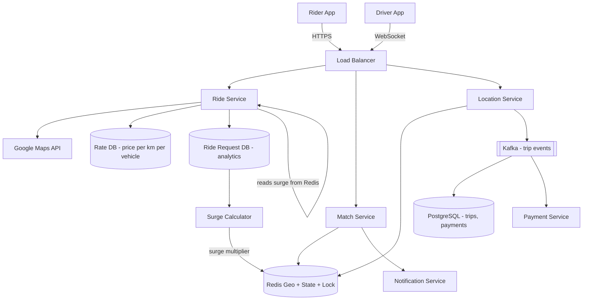
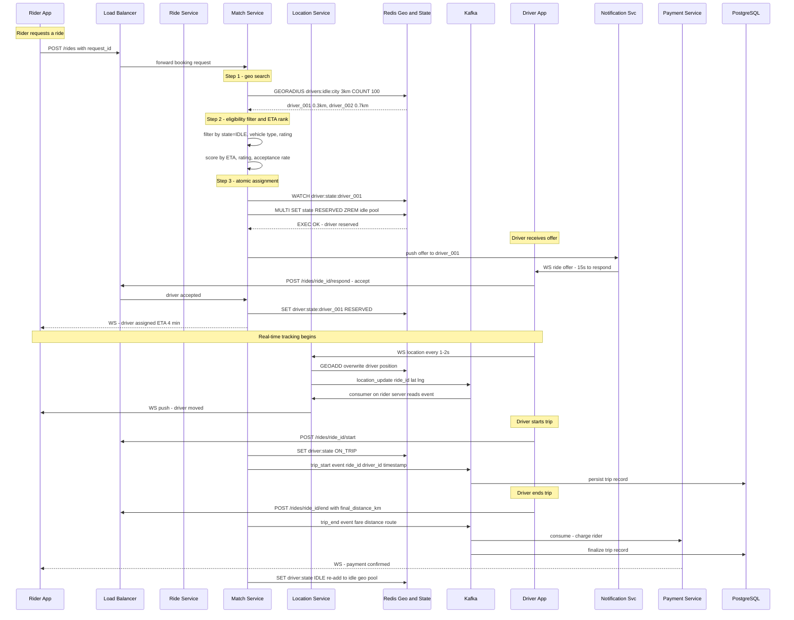
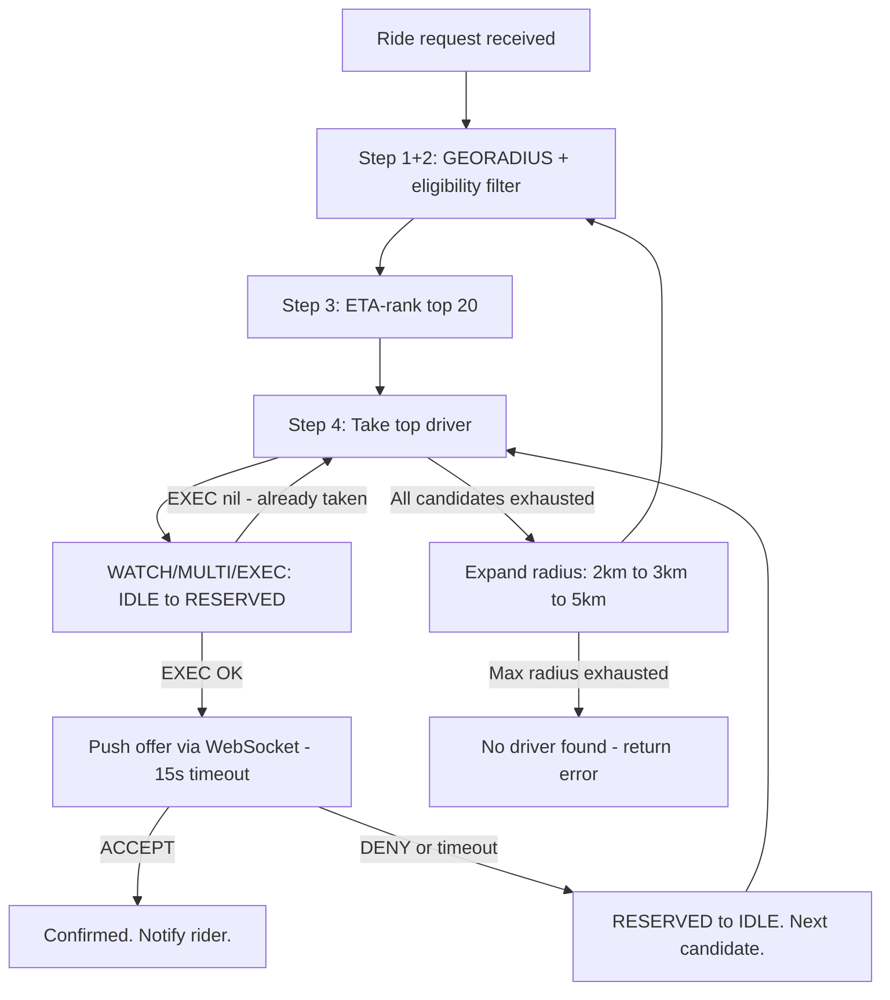
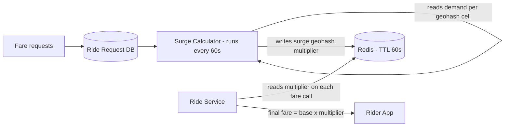
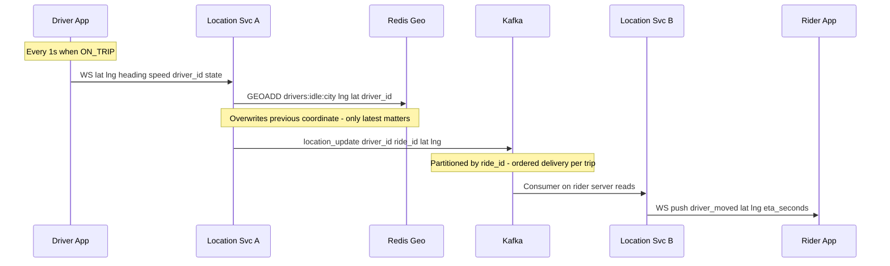

# System Design: Ride Booking (Uber / Rapido)

---

## 1. What Is Uber / Rapido?

Uber and Rapido are ride-booking platforms: a rider opens an app, requests a trip from their current location to a destination, and the app connects them with a nearby available driver who accepts the ride, picks them up, and drives them to their destination. The rider pays through the app, and both sides rate each other afterward.

At the scale these platforms operate — millions of riders and drivers active at the same time in the same cities — the hard part isn't the ride itself, it's connecting the right driver to the right rider fast enough, correctly enough (never double-booking a driver), while both sides' locations are constantly changing.

---

## 2. A Day in the Life

Priya finishes dinner and opens the app to head home. She taps "Request Ride," and the map already shows a few nearby cars. A few seconds later, her screen updates: "Driver assigned — Arjun, 4 minutes away." She watches Arjun's car icon creep closer to her pin on the map in real time.

Across town, Arjun had just dropped off another rider and was marked available again. His phone buzzed with the new offer — pickup 1.2km away — and he had 15 seconds to accept before it would go to the next closest driver. He tapped accept.

As Arjun drives toward her, Priya can see his position update every couple of seconds — smooth enough that it doesn't feel like she's watching a slideshow. When he arrives, he taps "Arrived," Priya gets in, and he starts the trip. Now his position updates even more frequently — she's actively tracking him drive her home.

At her destination, Arjun ends the trip. The fare is calculated automatically and charged to Priya's saved payment method — no cash, no negotiation. Both of them rate each other, and Arjun's app immediately shows him as available again, ready for the next rider.

The whole thing — from Priya's tap to Arjun being free again — usually takes under 20 minutes, and neither of them ever thought about a database, a queue, or a server. Everything from here on is how that experience actually gets built.

---

## 3. Requirements — and Why They Matter

**Scope.** In scope: fare estimation, ride booking, driver matching, real-time location tracking (rider and driver), trip start/end, ratings, payments, surge pricing. Out of scope: driver onboarding, fleet management, surge zone boundary drawing, fraud detection internals, driver incentive programs.

**Functional requirements:**

1. Rider gets a fare estimate (per vehicle type) for a pickup and drop location
2. Rider books a ride; system matches a nearby available driver within 60 seconds
3. Driver accepts or denies the ride offer (15-second window)
4. Both rider and driver track each other on a live map
5. Trip starts and ends; fare is finalized and payment is processed
6. Rider and driver rate each other after trip completion
7. Rider can cancel a ride before driver arrival; driver can cancel before trip start

<details markdown="1">
<summary><strong>Point to Ponder:</strong> What if two drivers are exactly equidistant from a rider — how do we pick?</summary>

It's not actually about distance — matching ranks by predicted ETA, not raw distance. A driver 0.5km away stuck in traffic can have a worse ETA than one 1.2km away on an open road, so ties are broken by ETA, which already accounts for real-world route and traffic conditions. See §8 Deep Dives for the full ranking pipeline.

</details>

**Non-functional requirements — and why each one matters to a real user, not just as a target:**

| Requirement | Target | Why it matters |
|---|---|---|
| Latency — driver matching | < 300ms to dispatch first offer | A slower dispatch means the rider stares at a spinner wondering if the app is broken — trust erodes fast in the first few seconds of any request. |
| Latency — location update visible to rider | < 2s end-to-end | If the driver's dot on the map lags noticeably behind their real position, the rider can't trust the ETA or know where to actually stand. |
| Availability (rider-facing) | 99.9% — app down = revenue loss | A rider trying to get home late at night with a dead app isn't a minor bug — it's a stranded person. |
| Consistency (driver assignment) | Strong — a driver must never be assigned to two rides simultaneously | If two riders are both told "you have Arjun's car," one of them gets left behind — and Arjun can't be in two places. |
| Durability (trip + billing data) | Zero loss — replicated DB + Kafka retention | A lost trip record means a driver doesn't get paid for a ride they completed, or a rider gets charged with no record of why. |
| Location update throughput | 1.67M writes/sec sustained | Not a promise to the user directly — it's the throughput the system must sustain merely to keep the two latency promises above true for millions of concurrent users. |
| WebSocket connections | 7M concurrent at peak | Same as above: this is what "real-time tracking for everyone online right now" costs in raw connection count. |

**Consistency Model by Component:**

| Component | Consistency | Why |
|---|---|---|
| Driver assignment (Redis WATCH/EXEC) | Strong | Prevents double-booking |
| Driver location (Redis Geo) | Eventual | Overwrites on next tick; ephemeral |
| Trip record (PostgreSQL) | Strong (ACID) | Financial correctness |
| Surge multiplier (Redis cache) | Eventual (60s TTL) | Slight staleness is acceptable |
| Ride history (read replica) | Eventual | Acceptable for non-real-time reads |

> [!IMPORTANT]
> **CAP Theorem framing:** This system intentionally makes different consistency trade-offs per component. Rider-facing read services (fare estimate, history) prefer availability. Driver assignment prefers strong consistency. Stating this explicitly in an interview shows CAP awareness at a component level — not a single global answer.

<details markdown="1">
<summary><strong>Point to Ponder:</strong> What if a rider requests a ride but there's no driver within a reasonable distance?</summary>

The system doesn't just fail immediately — it expands its search radius in rounds (2km → 3km → 5km, each with its own timeout), trading a longer wait for a match instead of giving up right away. Only after the widest radius is exhausted does it return "no driver found." See the Dispatch Expansion table in §8 Deep Dives.

</details>

---

## 4. Scale, From First Principles

Before designing anything, it's worth asking: how many drivers, riders, and requests are we actually dealing with — and what does that imply for the technology choices ahead?

**Starting assumptions:**
```
Total drivers online:       5 million
Daily rides:                20 million
Peak concurrent requests:   500,000
Location update frequency:  every 1s (ON_TRIP), every 2s (RESERVED), every 5s (IDLE)
```

**How many location writes per second does that create?** If 5 million drivers each send an update roughly every 3 seconds on average (blending the three frequencies above), that's:
```
5M drivers x (1 update / 3s avg) = ~1.67M writes/sec -> Redis must handle this
```
That single number rules out a relational database for driver location before we've designed anything else — no single PostgreSQL primary survives 1.67 million writes per second.

**How many persistent connections does live tracking require?** Every online driver plus every rider mid-trip needs an open connection to receive updates:
```
5M drivers + ~2M active riders = ~7M persistent connections
```
That's the number that rules out HTTP polling — see the bandwidth comparison below — and points toward WebSocket.

**What about the durable side — trip records, not location?** Trip starts/ends are far rarer events than location pings:
```
20M rides/day / 86,400s = ~232 events/sec (well within Kafka capacity)
```
232 events/sec is a completely different scale problem than 1.67M writes/sec — which is exactly why this system treats location (fast, ephemeral) and trip records (rare, durable) as two entirely different pipelines, not one.

**Storage:**
```
Trip record: ~1 KB x 20M rides/day = 20 GB/day (PostgreSQL)
Location history (waypoints): ~500 GPS points x 16B x 20M trips = ~160 GB/day (cold)
Driver metadata: 5M drivers x 1 KB = 5 GB (static, fits in memory)
```

**Why WebSocket beats HTTP polling at this scale:**
```
Location update frame (WebSocket): ~20 bytes
Location update frame (HTTP polling): ~2 KB (headers + body)
At 1.67M updates/sec: WebSocket = 33 MB/s vs HTTP = 3.3 GB/s -> WebSocket wins 100x
```

These numbers are what drive every major decision in this design: Redis for geospatial search (not PostGIS), WebSocket (not HTTP polling), Kafka for fan-out (not direct server-to-server calls), and state-adaptive location frequency (not a fixed 1-second tick for every driver regardless of what they're doing).

---

## 5. High-Level Architecture

Remember Priya's request and Arjun's acceptance from the story above — here's what actually happens underneath.

Uber is two concurrent real-time systems: **location tracking** and **driver matching**. Every 1–5 seconds, millions of drivers push their GPS coordinates into a geo-indexed in-memory store. When a rider requests a trip, the system finds the closest available driver by ETA (not distance), atomically assigns them via a state transition, and keeps both maps in sync — all under 300ms. The hardest problems are concurrency (preventing double-booking) and geospatial search at scale.

```
                ┌──────────────────────────────────────────────────────────────┐
                │                     FAST PATH                                 │
 ┌──────────┐  │  ┌───────────────┐  GEORADIUS   ┌──────────────┐             │
 │  Driver  │──►  │ Location Svc  │ ───────────► │ Match Engine │ ──► Driver  │
 │  App     │  │  │ (Redis Geo)   │              │ (top K score)│    notified  │
 └──────────┘  │  └───────────────┘              └──────┬───────┘             │
  every 1-5s   │                                        │ WATCH/MULTI/EXEC    │
               └────────────────────────────────────────┼─────────────────────┘
                                                         │
               ┌─────────────────────────────────────────▼────────────────────┐
               │                    RELIABLE PATH                               │
               │  Trip event ──► Kafka ──► Trip DB (PostgreSQL)                │
               │  (start, end, fare, route) — durable, for billing + history   │
               └──────────────────────────────────────────────────────────────┘
```

### Core Design Principles

| Path | Optimized For | Mechanism |
|---|---|---|
| Fast Path — matching | Latency (< 300ms end-to-end) | Driver WS → Redis GEOADD → GEORADIUS → WATCH/MULTI/EXEC → WS push to driver |
| Fast Path — live tracking | Low-latency map sync | Location Svc → Kafka → rider WebSocket (ON_TRIP only) |
| Reliable Path — billing | Durability (zero revenue loss) | trip_start / trip_end → Kafka → PostgreSQL (replicated) |
| Ephemeral data | Sub-ms reads, auto-expiry on disconnect | Driver state + location in Redis with TTL |
| Durable data | Correct billing, audit, replay | Trip events event-sourced into PostgreSQL via Kafka |

> [!IMPORTANT]
> **Driver location is fast path only.** Location is overwritten every 1–5 seconds — only the latest value matters. Trip events are reliable path — they drive billing. Never conflate ephemeral real-time data (location) with durable transactional data (trip records).

> [!NOTE]
> **Key Insight:** Both paths run concurrently on every event — they are not sequential. The fast path can fail and self-heal. The reliable path must not fail. Redis TTL is not a weakness; it is the correct primitive for data with a natural expiry.

<details markdown="1">
<summary><strong>Point to Ponder:</strong> Why does the fast path (matching) never touch PostgreSQL directly?</summary>

Because driver location and matching state are ephemeral — only the latest value matters, and it's fine if a value is lost on a crash since it'll be overwritten in 1-5 seconds anyway. PostgreSQL is for data that must never be lost (trip records for billing) — mixing the two would mean either slowing matching down to hit a durable disk on every update, or risking billing data with a fire-and-forget cache.

</details>

---

### From Simple to Evolved

The architecture starts simple and adds Kafka and surge pricing as the system matures — here's both versions.

### Simple Design


### Evolved Design (with Kafka and Surge Pricing)



### The Full Sequence

The diagrams above show the components; this shows the actual message sequence between them, end to end:



---

## 6. API Design

The API surface splits cleanly into two actors — riders requesting and tracking trips, and drivers reporting their status and location — because the mobile clients on either side of a ride have almost nothing in common except the `ride_id` connecting them.

### Rider APIs

A rider's journey through the API is short: request a ride, poll its status while a driver is being found and the trip runs, optionally cancel, and rate afterward.

| Method | Path | Description |
|---|---|---|
| POST | /api/v1/rides/request | Request ride {pickup_lat, pickup_lng, dest_lat, dest_lng}, returns {ride_id, fare_estimate, eta} |
| GET | /api/v1/rides/{id}/status | Poll ride status + driver location |
| DELETE | /api/v1/rides/{id} | Cancel ride (before driver assigned) |
| POST | /api/v1/rides/{id}/rating | Rate driver post-ride |

### Driver APIs

A driver's side is almost the mirror image, plus the constant background hum of location pings that riders never see directly.

| Method | Path | Description |
|---|---|---|
| PUT | /api/v1/drivers/availability | Toggle online/offline with current location |
| POST | /api/v1/rides/{id}/accept | Accept dispatched ride request |
| PUT | /api/v1/rides/{id}/status | Update status: ARRIVED, STARTED, COMPLETED |
| POST | /api/v1/drivers/location | GPS ping {lat, lng} every 5s |

The one design choice worth calling out explicitly: `POST /rides/request` is synchronous only for the fare estimate — it does not wait for a driver to be found. Driver matching happens asynchronously in the background, and the rider's app discovers the result by polling `GET /rides/{id}/status`. That's what lets the system try several drivers in sequence (§8.1's dispatch expansion) without holding the rider's original request open the whole time.

---

## 7. Data Model

Nine different pieces of data live in this system, and grouping them by how they're actually used — rather than treating them as one undifferentiated list — makes the storage choices almost obvious.

**The ephemeral, fast-path data lives in Redis.** Driver live location needs sub-millisecond geospatial queries at 1.67 million writes per second, and it's fine to lose it on a crash since it's stale within five seconds anyway — that's a Redis Geo sorted set (`drivers:idle:city → driver_id, lng, lat`), not a relational table. Driver state (`IDLE`/`RESERVED`/`ON_TRIP`) lives in Redis too, as a key with a TTL, specifically so the atomic `WATCH/MULTI/EXEC` transition from §8.1 has something to operate on, and so a crashed driver self-heals out of the pool when their TTL expires rather than needing a cleanup job. The surge multiplier follows the same pattern for a different reason: it only needs to be roughly right for 60 seconds at a time, so a Redis key with a 60-second TTL is both the cache and the staleness bound in one mechanism.

**The durable, financial data lives in PostgreSQL, because it's money.** Trip records and payment records need ACID guarantees — a trip's fare, status, and payment method can't be allowed to partially update or silently vanish — so both get a real relational database, with joins between them for reconciliation. Rider profiles (name, phone, payment method) sit in PostgreSQL for the same reason: infrequent writes, but the ones that happen need to be correct.

**Everything write-heavy and read-rarely goes somewhere cheaper than either of those.** The ride request log — every fare request, whether or not it turned into a trip — feeds the Surge Calculator and gets read for analytics, not for transactional correctness, so it belongs in a wide-column or analytics store (Cassandra or BigQuery) rather than competing for space in the trip database. GPS waypoint traces are similar but colder still: roughly 160 GB a day of location history that's genuinely useful for a trip replay or a dispute, essentially never queried after the trip ends, and needs no random access at all — that's a job for object storage (S3), not a database.

**Driver metadata (name, vehicle, rating) is the one entity that's genuinely both:** static enough to live in PostgreSQL as the source of truth, but read constantly enough during matching that a 5-minute Redis cache in front of it saves a database round-trip on every single match attempt.

| Entity | Storage | Key Columns |
|---|---|---|
| Driver live location | Redis Geo sorted set | drivers:idle:city → driver_id, lng, lat |
| Driver state | Redis key-value with TTL | driver:state:driver_id → IDLE / RESERVED / ON_TRIP |
| Trip record | PostgreSQL | trip_id, rider_id, driver_id, status, pickup, dropoff, fare, started_at, ended_at |
| Payment record | PostgreSQL | payment_id, trip_id, amount, status, method, created_at |
| Surge multiplier | Redis key-value with TTL 60s | surge:geohash → multiplier float |
| Ride request log | Analytics DB (Cassandra or BigQuery) | request_id, geohash, vehicle_type, timestamp |
| Waypoints (GPS trace) | Object storage (S3) | waypoints/trip_id.jsonl |
| Driver metadata | PostgreSQL + Redis cache | driver_id, name, vehicle, rating, acceptance_rate |
| User / rider profile | PostgreSQL | user_id, name, phone, email, payment_method |

---

## 8. Deep Dives

### 8.1 Driver Matching with Geohash and Atomic Assignment

Here's the problem: when a rider requests a trip, find the best available nearby driver, offer them the ride, and assign them atomically — without double-booking — in under 300ms, out of a pool of five million drivers.

The obvious approach doesn't survive contact with the numbers. Scanning the driver table for nearby idle drivers on every request, repeated across 500,000 peak requests per second against 5 million driver rows, works out to 2.5 trillion row scans per second — no relational database, however well-indexed, gets anywhere near that.

Whatever replaces the naive scan has to guard against three specific ways this can go wrong: two different ride requests both landing on the same driver at the same instant (double-booking); a driver getting offered a ride, timing out without responding, and never making it back into the available pool (driver starvation); and the search simply returning empty whenever there are only a couple of nearby drivers, instead of degrading gracefully by looking a little further out.

The pipeline that replaces the naive scan starts with a geo index search: Redis's `GEORADIUS` returns the top 100 candidates within 2km, using its built-in geohash indexing rather than anything hand-rolled. From there, an eligibility filter narrows that pool down to drivers who are actually `IDLE`, drive the right vehicle type, and clear a minimum rating and acceptance-rate bar — no point offering a ride to someone who's already on one. The routing engine then scores whoever survives that filter by predicted ETA, not raw distance, which turns out to matter a lot (more on that below). The top-scored driver gets a sequential offer with a 15-second window to respond, moving to the next candidate if they decline or time out — which is what prevents starvation, since a driver who doesn't respond just gets skipped, not stuck waiting on a request that'll never resolve. And the very last step, the one that actually rules out double-booking, is the driver's state flipping from `IDLE` to `RESERVED` atomically — not a plain write, for reasons worth walking through separately:

```
Step 1: Geo index search     -> GEORADIUS -> top 100 candidates within 2km
Step 2: Eligibility filter   -> state=IDLE, vehicle type, rating, acceptance rate
Step 3: ETA-based ranking    -> call routing engine for top 20; score by ETA + quality
Step 4: Sequential dispatch  -> offer to top driver, 15s window; expand if exhausted
Step 5: Atomic state lock    -> WATCH/MULTI/EXEC: IDLE -> RESERVED atomically
```

One detail worth pausing on before getting to that atomic lock: Redis's `GEORADIUS` is geohash-based under the hood, which means its search cells are rectangles — corner-to-corner distances are longer than edge-to-edge ones, so a radius search can be subtly inconsistent depending on which direction a driver sits from the search origin. Uber's own production system solves this with H3, a hexagonal grid where every cell has exactly six equidistant neighbors, so expanding outward is geometrically uniform in every direction. For a design at this scale, plain `GEORADIUS` is a perfectly reasonable choice — H3 is the upgrade you reach for once geohash's edge distortion actually starts costing match quality, not a day-one requirement.

Now, the mechanism behind step five, since it's the one piece of this system that has to be genuinely bulletproof. Two match-service instances can legitimately race to reserve the same driver — that's not a bug, it's just what concurrency at scale looks like — so the assignment can't be a plain `SET`. `WATCH` subscribes to changes on the driver's state key; the `MULTI/EXEC` that follows only commits if that key hasn't changed since the `WATCH` began:

```
WATCH driver:state:driver_001
  current = GET driver:state:driver_001
  IF current != "IDLE": DISCARD  -- another server got here first
MULTI
  SET driver:state:driver_001  RESERVED  EX 30
  ZREM drivers:idle:bangalore  driver_001
EXEC
  -> nil  EXEC failed -- state changed between WATCH and EXEC, skip driver
  -> OK   atomic commit -- driver is RESERVED, removed from idle pool
```

Whichever server's `EXEC` runs first wins and gets `OK` back; the other's `EXEC` returns `nil`, because the watched key changed underneath it, so it silently moves on to its next candidate.

And when nobody's close enough? The system doesn't just give up on the first empty search — it widens its net in rounds, trading a longer wait for an actual match instead of failing fast:

```
Round 1: 2km, 2-min timeout  -- quality match (close driver, good ETA)
Round 2: 3km, 2-min timeout  -- balance quality + availability
Round 3: 5km, 2-min timeout  -- availability over quality
Round 4: fail request        -- "no driver found"
```



> [!NOTE]
> **Key Insight:** Matching is not about finding the nearest driver — it is about finding the fastest pickup. ETA is the metric, not distance. A driver 0.5km away in traffic has a worse ETA than one 1.2km away on an open road. Every system that ranks by distance is optimizing for the wrong thing.

> [!IMPORTANT]
> **State machine replaces distributed locks.** The atomic IDLE → RESERVED transition ensures a driver is either fully available or fully reserved — never both. No ZooKeeper, no Redlock, no DB row lock. The state is the truth.

---

### 8.2 Surge Pricing Algorithm

Here's the problem: at peak demand, more riders want rides than there are drivers available. Without any price signal, every rider competes for the same shrinking pool of drivers, matching fails more often, and the drivers who are online earn nothing extra for absorbing that surge in demand. Surge pricing exists to fix that imbalance — it's a market-clearing mechanism, not a way to extract more revenue.

A static per-kilometer rate doesn't solve this: it charges the same price during a 3am downpour, when three drivers are online and thirty people want a ride, as it does on a quiet Tuesday morning. Matching rates drop, riders wait longer, and drivers have no extra incentive to come online exactly when they're needed most.

The fix is a demand-signal feedback loop that runs entirely independently of matching itself:



Every 60 seconds, the Surge Calculator looks at each geohash cell and computes a demand ratio — active ride requests divided by idle drivers in that cell — and maps it onto a multiplier:

```
demand_ratio = active_ride_requests / idle_drivers_in_cell
multiplier:
  ratio < 1.0   -> 1.0x  (supply exceeds demand)
  ratio 1.0-1.5 -> 1.2x
  ratio 1.5-2.0 -> 1.5x
  ratio 2.0-3.0 -> 2.0x
  ratio > 3.0   -> 3.0x  (capped -- prevents extreme pricing)
```

That multiplier gets written to `surge:{geohash}` in Redis with a 60-second TTL, and the Ride Service reads it on every fare calculation — a sub-millisecond lookup, not a query against whatever computed it. The rider sees the multiplier before confirming the ride, which isn't just good UX — informed consent on dynamic pricing is a legal requirement in most markets.

One architectural decision is worth pausing on before getting to the trade-off below: what surge pricing *doesn't* touch.

> [!NOTE]
> **Key Insight:** Surge pricing is a read-path concern only — it does not affect matching. The Surge Calculator is a separate service feeding data into Redis. The matching engine never reads it. Decoupling surge calculation from matching prevents a slow analytics query from blocking a 300ms matching window.

The trade-off worth naming explicitly is that this is eventually consistent, not strongly consistent: a 60-second Redis TTL means the multiplier can be up to a minute stale, so a rider booking 30 seconds after a sudden demand spike might still see the old price. That's acceptable because the fare shown at request time is the fare actually charged — it's contractual, not a live estimate — so a bounded staleness window doesn't harm either side. The alternative, reading demand data live on every fare call, would put a much larger analytics query on the hot path of every single fare estimate — at 500K peak requests/sec that becomes the bottleneck, for a level of precision nobody actually needs from a pricing signal.

---

### 8.3 Real-Time Location Write Architecture

Here's the problem: 1.67 million GPS updates arrive every second from driver devices. Each one needs to be indexed for sub-millisecond geospatial lookup, so the matching pipeline in §8.1 can find it. And whoever's tracking a trip live needs to see the driver move smoothly on their map — except the rider and the driver are, in general, connected to two completely different backend servers.

Neither obvious approach survives this. Writing 1.67 million rows a second to a relational database saturates disk I/O within minutes, long before it becomes an "add an index" problem. And a direct server-to-server push — the driver's server telling the rider's server "this driver just moved" — is impossible to wire up cleanly in a stateless, horizontally scaled deployment where you can't predict which server either side is connected to.

The actual solution is three layers, each solving a different part of the problem.

**Write batching** is the first layer. Instead of writing every GPS ping to Redis individually, the Location Service buffers 500 milliseconds of updates and pipeline-writes them to Redis in a single round trip. That cuts the number of Redis round-trips by 3-5x, and it's invisible to the rider — 500ms of batching delay is imperceptible against a 1-second update tick anyway.

**The Redis Geo sorted set** is the second layer, and it's what makes the write volume tractable in the first place. `GEOADD` simply overwrites the driver's previous coordinate — an O(log N) operation — and `GEORADIUS` scans a bounding box in O(N + log M). No locking, no transactions, because there's nothing to coordinate: each write just replaces the one thing that mattered, the driver's last known position. That's the whole reason Redis Geo can absorb 1.67 million concurrent writes while simultaneously serving the sub-10ms matching queries from §8.1 — writes and reads never contend for the same lock, because there isn't one.

**Kafka fan-out** is the third layer, and it's what actually solves the "different servers" problem from above. When a driver is `ON_TRIP`, every location update gets published to Kafka, partitioned by `ride_id` so updates for a single trip stay strictly ordered. Whichever server the *rider's* app happens to be connected to consumes that event independently and pushes it over the rider's own WebSocket:



None of this needs to run at the same intensity all the time, either. A driver who's `IDLE` and not currently near a rider doesn't need the same update frequency as one who's mid-trip with a rider staring at the map — pinging every `IDLE` driver once a second regardless would waste 60-70% of the system's Redis write capacity for zero benefit anyone would ever notice. So the update interval is derived directly from the driver's own state, not a single fixed tick applied uniformly — the state machine already knows which drivers actually need to be fresh, so the frequency comes for free instead of needing its own separate tuning knob:

| Driver state | Update frequency | Redis writes/sec at 5M drivers | Why this frequency |
|---|---|---|---|
| IDLE | Every 5s | 1M writes/sec | No rider watching — coarse position enough for matching |
| RESERVED | Every 2s | 2.5M writes/sec | Rider watching ETA countdown on map |
| ON_TRIP | Every 1s | 5M writes/sec | Rider watching live position; smooth animation required |

The last piece is what happens when a driver's connection just drops — a flaky signal, a phone going into a tunnel, an app crash. There's no separate cleanup process watching for this:

```
Driver phone disconnects -> WebSocket closes -> Location Svc detects
  -> EXPIRE driver:state:driver_id 30
  -> After 30s with no heartbeat: key expires -> auto-removed from idle pool
  -> No stale drivers offered to riders. No cron job needed.
```

The same TTL mechanism from §8.1's driver state does double duty as the cleanup job here: no heartbeat for 30 seconds and the key simply expires, silently pulling that driver out of the idle pool. No stale driver ever gets offered to a rider, and nobody had to write a background sweep to make that true.

> [!IMPORTANT]
> **Fan-out via Kafka is a correctness requirement, not a performance optimization.** Without it, location updates only reach the rider if they happen to be on the same server as the driver — never guaranteed in a distributed deployment.

> [!NOTE]
> **Key Insight:** Write path and read path never conflict in Redis Geo. Writes overwrite one sorted set entry (O(log N)). Reads scan a bounding box (O(N+log M)). No locking. This is why Redis Geo handles 1.67M concurrent writes while serving sub-10ms matching queries.

---

## 9. Bottlenecks & Scaling

Every component in this design has a point where it stops being the right shape for the traffic in front of it. Here's what breaks first as scale grows another 10x, and what actually changes when it does.

Redis's location write throughput is the first thing to give — that ceiling sits around 10 million writes per second on a single cluster. The fix isn't a bigger Redis instance, it's sharding by city or region (`drivers:idle:bangalore`, `drivers:idle:mumbai`, and so on), so each city's write load lands on its own independent Redis cluster instead of one global one absorbing all of them.

The Match Service hits its own wall around 500,000 ride requests per second during a surge — but because it's stateless, scaling it out horizontally is straightforward, and partitioning ride requests by pickup geohash means each Match Service shard only ever owns a specific set of geographic cells rather than contending for the whole city.

PostgreSQL's trip-write throughput tops out around 100,000 writes per second per primary — comfortably above the ~232 events/sec this system actually generates (§4), but worth knowing where the ceiling is. When it does become relevant, Kafka consumers batch-inserting 1000 rows at a time instead of one row per event buys a lot of headroom, and read replicas take ride-history queries off the primary entirely.

WebSocket connections cap out around 100,000 per server, which is why reaching 7 million concurrent connections means sticky load balancing by `driver_id` hash across 70-plus servers, not one server trying to hold everyone.

And the Surge Calculator, once the system spans 10x more cities, stops being able to just scan the ride request database directly — the fix there is pre-aggregating demand counts per geohash cell with Kafka Streams over a rolling 5-minute window, writing the results straight to Redis instead of re-scanning the full request log on every cycle.

Caching does a lot of the quiet work here too: driver metadata (name, vehicle, rating) sits in Redis with a 5-minute TTL since it's read on every single matching request; the surge multiplier gets its own 60-second TTL as already covered in §8.2; the rate table (price per km) is cached for a full hour since it changes rarely; and ride history deliberately isn't cached at all — a read replica plus application-level pagination is enough, since a user reads their own trip history once and moves on.

One thing that's explicitly *not* part of this scaling story: a CDN. It doesn't help the core matching path at all — rider and driver apps pull static assets like map tiles and app bundles from a CDN, but the dynamic API calls and WebSocket connections that actually run this system have to reach origin every time.

---

### 9.1 Failure Scenarios

Every piece of this system can fail independently, and the recovery story is different depending on whether what failed was holding ephemeral state or durable state.

When the Redis primary goes down — the store holding both location and matching state — matching halts and active trips lose their live map, but nothing is actually lost: Redis Sentinel or Cluster failover completes in under 30 seconds, drivers re-register into the pool within 15 seconds via their next heartbeat, and active trips re-establish tracking automatically because the reliable path (Kafka → PostgreSQL) was never touched by this at all. The double-booking race condition from §8.1 falls into the same bucket of "handled by design, not by luck": two servers racing to reserve the same driver always resolves to exactly one `EXEC` succeeding, the other getting `nil` and moving on — zero double-bookings, by construction.

A Match Service instance crashing mid-assignment is a narrower version of the same story: a driver can end up reserved with no offer ever sent, stuck in `RESERVED`. The same 30-second TTL that handles Redis failover handles this too — the state simply expires back to `IDLE`, and the original rider's request retries via a Kafka dead-letter queue rather than hanging forever.

The durable side of the system fails differently, and more slowly. A Kafka broker going down delays trip events and live-tracking fan-out, but replication factor 3 means nothing is actually lost — consumers just catch up on the backlog once the broker recovers. A PostgreSQL primary failing delays billing writes specifically, recovered by promoting a replica in under 60 seconds (RDS Multi-AZ), while Kafka keeps retaining events through the whole failover window so nothing gets dropped on the floor. If the Payment Service itself goes unavailable, the same pattern holds: Kafka retains the `trip_end` event until the service comes back, and an idempotency key on the charge prevents it from double-charging the rider once it does.

Two failures are worth calling out as intentionally low-stakes. A driver's app disconnecting mid-trip just shows the rider a "signal lost" state while the driver reconnects — and only escalates to marking the trip interrupted (with ops notified) if there's no reconnect within 30 seconds. A Surge Calculator crash means the multiplier goes stale and, once its 60-second TTL expires, silently falls back to 1x — a brief window of under-pricing that costs nothing structurally, since the calculator resumes writing within seconds of restarting.

---

### 9.2 Trade-offs

### Geohash vs Quadtree for Driver Geospatial Index

Redis Geo's geohash indexing divides the map into fixed rectangular cells — which means corner-to-corner distances are longer than edge-to-edge ones, and a search sitting near a cell boundary sometimes has to check up to 9 neighboring cells to be sure it hasn't missed anyone. A quadtree instead subdivides adaptively, so its cells match wherever drivers are actually dense, and neighbor lookups are a clean tree traversal — 4 children per node, no boundary special-casing. The trade is in write cost: Redis Geo's sorted set absorbs 1.67 million writes per second because there's no structure to rebalance, while a quadtree has to rebalance on write, which gets slower exactly as write volume grows. And operationally, `GEORADIUS` is one Redis command with zero extra infrastructure, where a quadtree means standing up and maintaining a custom service or library.

**Chosen:** Redis Geo — it's already in the stack for driver state and locking, and `GEORADIUS` is a single command rather than a system to build and run. The trade-off accepted is rectangular cells with slight edge distortion, which is fine here because the design already expands to adjacent cells on radius expansion (§8.1), and that distortion (under 5% area difference) doesn't meaningfully move ETA accuracy.

> [!NOTE]
> **Key Insight:** H3 hexagons (Uber's production choice) solve the corner-distance problem but require a custom indexing layer. For most systems, Redis GEORADIUS is the right default — zero extra infrastructure, built-in neighbor search, proven at scale.

---

### WebSocket vs HTTP Polling for Live Tracking

The two options differ most in what each connection costs, repeated across 5 million drivers. WebSocket pays for one TLS handshake up front and then just streams frames — about 20 bytes per location update. HTTP polling pays full request/response overhead, TLS included, on every single update — roughly 2KB of headers and body each time. Multiplied out: 1.67 million updates a second is 33 MB/s over WebSocket versus 3.3 GB/s over HTTP polling — a hundredfold gap. WebSocket is also bidirectional by default, so the server can push a dispatch offer to a driver the same way it pushes a location update — HTTP polling would need the driver to separately poll for offers on top of everything else. The one thing polling has going for it is statelessness: any server can handle any request, where WebSocket needs sticky routing to keep a driver's persistent connection pinned to one server, at some battery cost on the polling side too (repeated TLS handshakes drain a phone faster than one held-open connection).

**Chosen:** WebSocket — the header-overhead math alone rules out polling at this scale. The trade-off accepted is stateful sticky routing per city region, which is workable because the Location Service is already partitioned by city and drivers rarely cross a region boundary mid-shift.

> [!NOTE]
> **Key Insight:** WebSocket vs HTTP is a math problem. 5M drivers x 1 update/3s x 2KB HTTP overhead = 3.3 GB/s in headers alone. WebSocket frames are ~20 bytes. The transport choice is arithmetic, not preference.

---

### Surge Pricing Consistency — Eventual vs Strong

A strongly consistent surge multiplier would always reflect the latest demand exactly, but paying for that means reading from a database or a leader node on every single fare call, and coordinating a distributed transaction between the Surge Calculator and the Ride Service. The eventually consistent version — the one actually chosen — settles for a multiplier that can be up to 60 seconds stale, in exchange for a sub-millisecond Redis read and no cross-service coordination at all: the Surge Calculator fires off a write, and the Ride Service reads independently, with nothing synchronizing the two.

**Chosen:** Eventual consistency with a 60-second TTL. The fare shown at request time is the fare actually charged — it's contractual, not a live estimate — so a bounded staleness window doesn't materially harm either side.

> [!NOTE]
> **Key Insight:** Surge pricing staleness is a business tolerance decision, not a technical limitation. 60 seconds is enough granularity for a pricing signal. Exact real-time surge would require a synchronous distributed read on every fare request — the cost is not justified by the precision gained.

---

## 10. Evaluation: Did We Meet the Requirements?

Seven non-functional requirements were set out in §3. Here's how the design actually satisfies each one — not just what was promised, but the specific mechanism doing the work.

**Latency (dispatch < 300ms, location visible < 2s):** The fast path never touches a disk-backed database — `GEORADIUS` runs against an in-memory Redis sorted set, and the `WATCH/MULTI/EXEC` atomic assignment is a handful of Redis commands, not a distributed transaction. Location updates skip the database entirely and flow Driver → Redis GEOADD → Kafka → rider WebSocket, each hop sub-millisecond to low-single-digit milliseconds.

**Availability (99.9% rider-facing):** Redis Sentinel/Cluster failover recovers a lost primary in under 30 seconds, and drivers self-heal into the pool via heartbeat re-registration. Because location state is ephemeral (§9.1 Failure Scenarios), a Redis failover doesn't corrupt anything — it just means a brief gap in live tracking, not lost data or a stuck trip.

**Consistency (driver assignment must be strong):** This is the one place the design refuses to be eventually consistent. `WATCH/MULTI/EXEC` makes the IDLE→RESERVED transition atomic — two servers racing to reserve the same driver, only one EXEC commits, the other gets `nil` and moves to the next candidate. No separate lock service, because the state itself is the lock.

**Durability (zero loss on trip + billing data):** Trip events go through Kafka (replication factor 3) before landing in PostgreSQL — if a broker or the database briefly goes down, Kafka retains the event and replays it on recovery, so a billing event is never silently dropped, only delayed.

**Location throughput (1.67M writes/sec) and WebSocket connections (7M peak):** These aren't separately "achieved" — they're the reason Redis Geo and WebSocket were chosen over PostGIS and HTTP polling in the first place (§4 Scale, From First Principles). The design doesn't scale up to meet these numbers after the fact; they were the numbers that ruled out the alternatives before any component was chosen.

| Requirement | Mechanism |
|---|---|
| Latency — matching < 300ms | In-memory Redis GEORADIUS + WATCH/MULTI/EXEC, no disk-backed DB on the fast path |
| Latency — location < 2s | Driver → Redis GEOADD → Kafka → rider WebSocket, no polling |
| Availability 99.9% | Redis Sentinel/Cluster failover (<30s), driver heartbeat re-registration |
| Consistency — driver assignment | WATCH/MULTI/EXEC atomic state transition, state is the lock |
| Durability — trip/billing | Kafka (RF=3) buffers PostgreSQL writes, replays on recovery |
| 1.67M writes/sec, 7M connections | Architectural constraints that selected Redis Geo + WebSocket up front |

---

## 11. Conclusion

This design treats Uber/Rapido as two concurrent systems wearing one UI: a high-frequency, ephemeral location-tracking pipeline, and a low-frequency, durable trip-and-billing pipeline — and it never lets the two mix. The hardest problem wasn't finding a nearby driver; it was atomically reserving one without a separate lock service, and deciding, precisely, which data can be lost for a few seconds (location) and which never can (money). Every other decision — Redis over PostGIS, WebSocket over polling, Kafka in the middle — falls out of getting that one distinction right.

---

## 12. Interview Summary

> [!TIP]
> When the interviewer says "walk me through your Uber design," hit these points in order. Each is a decision with a clear WHY.

### Key Decisions

| Decision | Problem It Solves | Trade-off Accepted |
|---|---|---|
| WebSocket (not HTTP) for location | 3.3 GB/s HTTP header waste at 5M drivers | Stateful sticky routing per city region |
| Redis Geo (not PostGIS) for live positions | 1.67M location writes/sec; sub-ms spatial queries | Ephemeral — re-registers within 15s on crash |
| WATCH/MULTI/EXEC atomic state transition | Prevents double-booking without a separate lock service | 30s TTL on RESERVED state — rare retry on server crash |
| Driver State Machine (IDLE/RESERVED/ON_TRIP) | Controls pool membership, update frequency, and crash recovery in one mechanism | State lives in Redis — not durable, but self-healing via TTL |
| Kafka for trip events (not direct DB write) | Decouples 300ms fast matching path from reliable billing write | 5–20ms Kafka lag on durable writes — acceptable |
| ETA-based ranking (not distance) | Riders experience wait time, not map distance | Routing engine call for each top-K candidate — ~10ms per call |
| State-adaptive location frequency | 60–70% Redis write reduction vs fixed 1s tick; no rider-visible degradation | Requires state machine to be the source of truth for update interval |

### Fast Path vs Reliable Path

```
Fast Path   (latency):   Driver WS -> Redis GEOADD -> GEORADIUS -> WATCH/EXEC -> WS push to driver
                         ON_TRIP tracking: Redis -> Kafka -> WS push to rider map

Reliable Path (safety):  trip_start / trip_end -> Kafka -> PostgreSQL (billing, history)
                         Fare request -> Ride Request DB -> Surge Calculator -> Redis

Location = fast path only (ephemeral, overwritten every 1-5s, TTL self-heals)
Trip record = reliable path (durable, drives billing and audit, never lost)
```

### Key Insights Checklist

> [!IMPORTANT]
> These are the lines that make an interviewer lean forward. Know them cold.

- **"Matching is not about finding the nearest driver — it is about finding the fastest pickup."** We rank by ETA, not distance. Distance is a proxy; ETA is the truth. Every system that ranks by distance is optimizing for the wrong metric.
- **"Consistency in driver assignment is enforced through state transitions, not locks."** The atomic IDLE → RESERVED via WATCH/MULTI/EXEC is the mutual exclusion. No separate lock service. No ZooKeeper. The state is the truth.
- **"Location data is high-frequency and ephemeral — storing it in a DB creates write bottlenecks."** Redis holds only the current position. TTL self-evicts stale data. The previous coordinate has zero value the moment the next one arrives.
- **"Update frequency is a function of driver state, not a single tuning knob."** IDLE drivers waste 60–70% of Redis write capacity if pinged every second. The state machine already knows the state — frequency is derived from it for free.
- **"The Kafka queue is a correctness requirement."** Decoupling fast matching (Redis, sub-100ms) from reliable billing (Kafka → DB) is what makes both guarantees achievable simultaneously. Without Kafka, a slow DB write would block the matching path.
- **"CAP per component."** Rider-facing services are AP. Driver assignment is CP. The system is not uniformly one or the other — this is the right answer in an interview.
