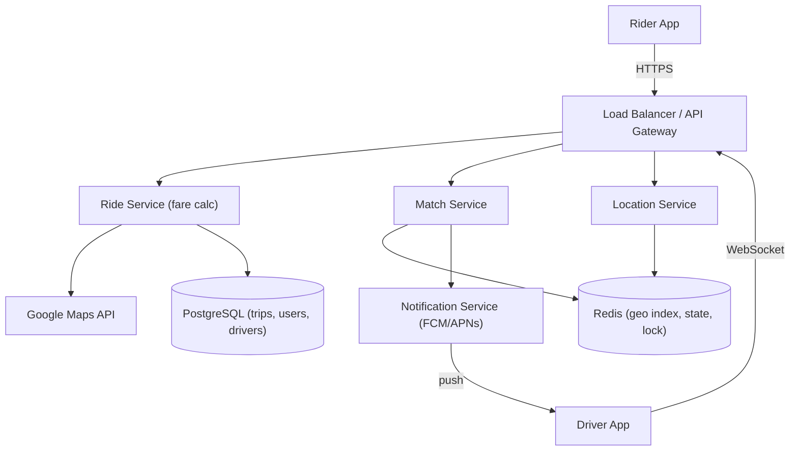
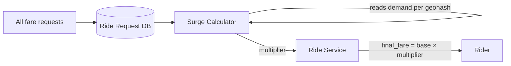
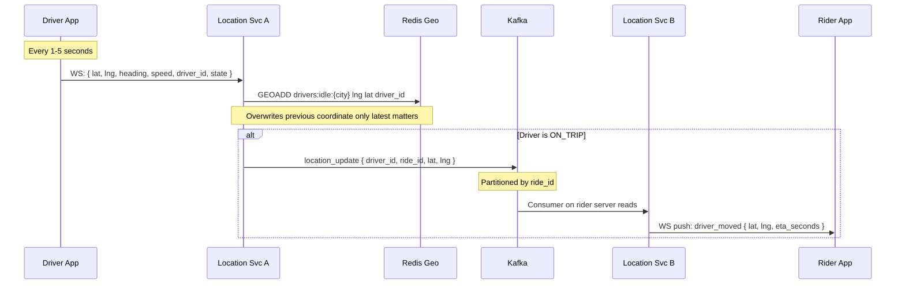
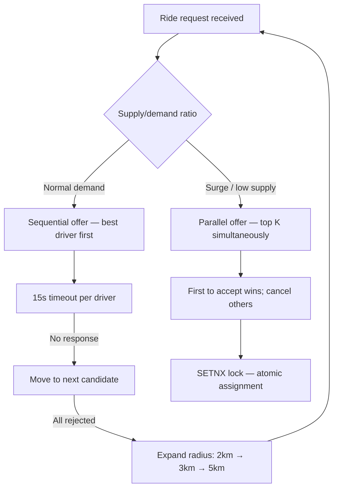
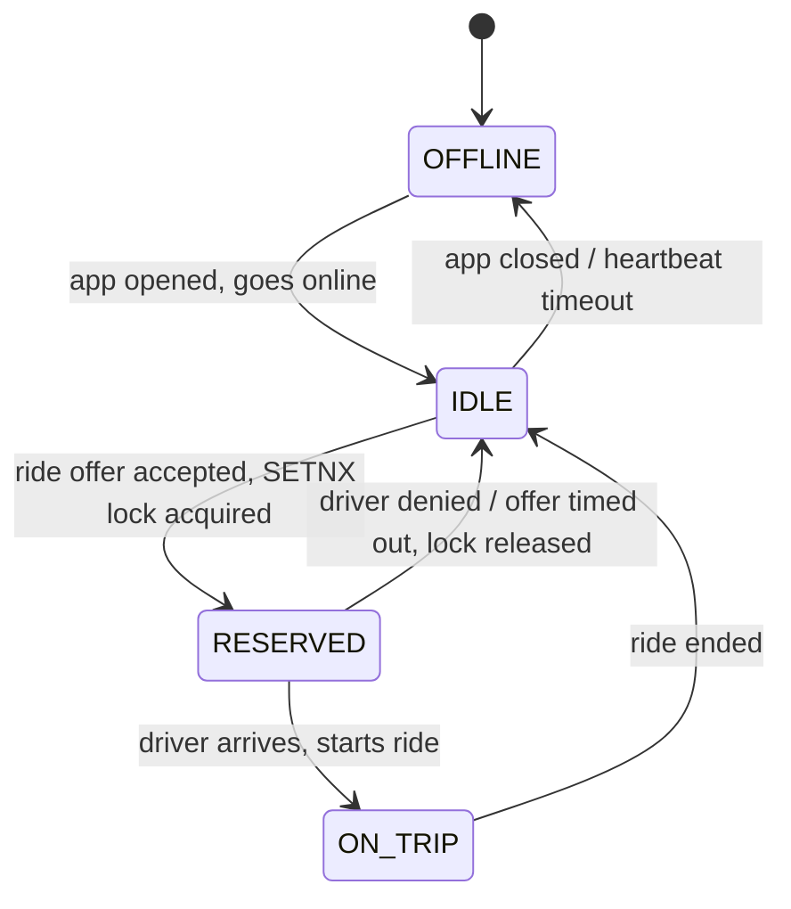
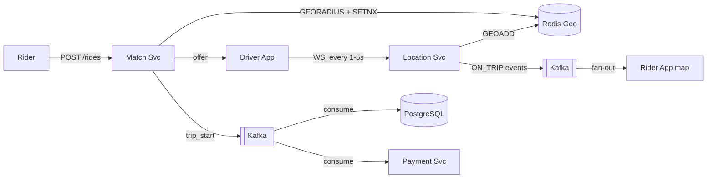

# System Design: Ride Booking (Uber / Ola)

---

## 🧠 Mental Model

> Uber is two concurrent real-time systems: **location tracking** and **driver matching**. Every second, millions of drivers push their GPS coordinates. When a rider requests a trip, the system finds the closest available driver, atomically assigns them, and keeps both maps in sync — all under 300ms. The hardest problems are concurrency (preventing double-booking) and geospatial search at scale.

```
                ┌──────────────────────────────────────────────────────────────┐
                │                     FAST PATH                                 │
 ┌──────────┐  │  ┌───────────────┐  GEORADIUS   ┌──────────────┐             │
 │  Driver  │──►│  │ Location Svc  │ ───────────► │ Match Engine │ ──► Driver  │
 │  App     │  │  │ (Redis Geo)   │              │ (top K score)│    notified  │
 └──────────┘  │  └───────────────┘              └──────┬───────┘             │
  every 3-5s   │                                        │ SETNX (atomic lock) │
               └────────────────────────────────────────┼─────────────────────┘
                                                         │
               ┌─────────────────────────────────────────▼────────────────────┐
               │                    RELIABLE PATH                               │
               │  Trip event ──► Kafka ──► Trip DB (Postgres)                  │
               │  (start, end, fare, route) — durable, for billing & history   │
               └──────────────────────────────────────────────────────────────┘
```

## ⚡ Core Design Principle

| Principle | Mechanism | Optimizes for | Can fail? |
|-----------|-----------|---------------|-----------|
| **Fast Path — matching** | Driver app → WebSocket → Location Svc → Redis GEOADD → GEORADIUS → SETNX → push | Latency (< 300ms end-to-end) | Yes — Redis in-memory; re-registers within 15s |
| **Reliable Path — billing** | Trip event → Kafka → Consumer → PostgreSQL | Durability (zero revenue loss) | No — Kafka durable log + replicated DB |
| **Ephemeral data lives in Redis** | Location, driver state, SETNX lock — all TTL-bound | Sub-ms reads, auto-expiry on crash | Yes — intentionally ephemeral |
| **Durable data lives in Kafka → DB** | trip_start, trip_end, fare, waypoints — event-sourced | Correct billing, audit, replay | No — Kafka retention + DB replication |
| **State machine drives everything** | IDLE → RESERVED → ON_TRIP controls matching pool, update frequency | Prevents double-booking; auto-heals | Yes — state in Redis; re-registers on reconnect |

> [!IMPORTANT]
> **Driver location is fast path only.** Location is overwritten every 3–5 seconds — only the latest value matters. Trip events are reliable path — they drive billing. Never conflate ephemeral real-time data (location) with durable transactional data (trip records).

> [!NOTE]
> **Key Insight:** Both paths run concurrently on every event. They are not sequential. The fast path can fail — the reliable path must not. Redis TTL is not a weakness; it is the correct primitive for data with a natural expiry.

---

## 1. Problem Statement & Scope

Design a ride-booking platform (Uber / Ola) supporting fare estimation, driver matching, real-time tracking, and payment — at millions of concurrent users and drivers.

**In Scope:** Fare estimation, ride booking, driver matching, real-time location tracking, trip start/end, ratings, payments.

**Out of Scope:** Driver onboarding, fleet management, surge zone boundary drawing, fraud detection internals.

---

## 2. Requirements

### Functional
1. Rider gets fare estimate (per vehicle type) for a pickup + drop location
2. Rider books a ride; system matches a nearby available driver
3. Driver accepts or denies the ride request
4. Both rider and driver track each other in near real-time
5. Trip starts and ends; rider pays; both rate each other

### Non-Functional

| Requirement | Target | Reasoning |
|---|---|---|
| Scale | Millions of users + drivers | Mandates microservices, horizontal scaling |
| Latency | Driver matched within 60 seconds | Fail the request if no match — never hang indefinitely |
| Availability (rider) | High availability | App down = rider cannot book; revenue loss |
| Consistency (driver assignment) | Strong consistency | A driver must never be assigned to two rides simultaneously |
| Location update | Every 3–5 seconds | Real-time map tracking |

> [!IMPORTANT]
> **CAP Theorem framing:** This system intentionally makes different trade-offs per component. Rider-facing services (fare, history) prefer high availability. Driver assignment prefers strong consistency. You can and should say this explicitly in an interview — it shows CAP awareness at a component level.

---

## 3. Back-of-Envelope Estimations

```
Inputs:
  Total drivers online:       5 million
  Daily rides:                20 million
  Peak concurrent requests:   500,000
  Location update frequency:  1 per 3s (ON_TRIP), 1 per 5s (IDLE)

Location writes/sec:
  5M drivers × (1 update / 3s) = ~1.67M writes/sec → Redis must handle this

WebSocket connections (peak):
  5M drivers + ~2M active riders = ~7M persistent connections

Trip events/sec (Kafka):
  20M rides/day ÷ 86,400s = ~232 events/sec (well within Kafka capacity)

Storage:
  Trip record: ~1 KB × 20M rides/day = 20 GB/day (PostgreSQL)
  Location history (waypoints): ~500 GPS points × 16B × 20M trips = ~160 GB/day (cold storage)
  Driver metadata: 5M drivers × 1 KB = 5 GB (static, fits in memory)

Bandwidth:
  Location update frame (WebSocket): ~20 bytes
  Location update frame (HTTP polling): ~2 KB (headers + body)
  At 1.67M updates/sec: WebSocket = 33 MB/s vs HTTP = 3.3 GB/s → WebSocket wins by 100x
```

---

## 4. API Design

### User-Facing Endpoints

| Method | Endpoint | Request | Response |
|---|---|---|---|
| `GET` | `/fare` | `?pickup_lat, pickup_lng, drop_lat, drop_lng` | `[{ request_id, vehicle_type, estimated_fare }]` |
| `POST` | `/rides` | `{ request_id }` | `{ ride_id, driver_id, driver_name, vehicle, eta_seconds }` |
| `GET` | `/rides/history` | — (auth token) | `[{ ride_id, date, from, to, fare, driver }]` |
| `DELETE` | `/rides/{ride_id}` | — | `{ status: "cancelled" }` |
| `POST` | `/rides/{ride_id}/rating` | `{ rating: 1–5, review }` | `{ status: "ok" }` |

### Driver-Facing Endpoints

| Method | Endpoint | Request | Response |
|---|---|---|---|
| `WS` | `/driver/location` | `{ lat, lng, heading, speed, state }` (every 1–5s) | Server push: `{ ride_offer }` |
| `POST` | `/rides/{ride_id}/respond` | `{ decision: "accept" | "deny" }` | `{ status }` |
| `POST` | `/rides/{ride_id}/start` | — | `{ status: "in_progress" }` |
| `POST` | `/rides/{ride_id}/end` | `{ final_distance_km }` | `{ final_fare, payment_status }` |

> [!NOTE]
> **Key Insight:** Driver location is a WebSocket, not REST. At 1.67M location updates/sec, HTTP overhead alone would cost 3.3 GB/sec in headers. WebSocket frames are ~20 bytes. The transport choice is arithmetic, not preference.

---

## 5. Architecture Diagrams

### Simple High-Level Design



### Evolved Design (with Kafka + Surge Pricing)

```mermaid
graph TD
    Rider["Rider App"]
    Driver["Driver App"]
    LB["Load Balancer"]
    RS["Ride Service"]
    SC["Surge Calculator"]
    MS["Match Service"]
    LS["Location Service"]
    NS["Notification Service"]
    PS["Payment Service"]
    RateDB[("Rate DB (price/km per vehicle)")]
    ReqDB[("Ride Request DB (analytics)")]
    Redis[("Redis Geo + State + Lock")]
    K[["Kafka (trip events)"]]
    TripDB[("PostgreSQL (trips, payments)"]]
    Maps["Google Maps API"]

    Rider -->|HTTPS| LB
    Driver -->|WebSocket| LB
    LB --> RS & MS & LS
    RS --> Maps
    RS --> RateDB
    RS --> ReqDB
    ReqDB --> SC
    SC -->|surge multiplier| RS
    MS --> Redis
    MS --> NS
    LS --> Redis
    LS --> K
    K --> TripDB
    K --> PS
```

---

## 6. Deep Dives

### 6.1 Fare Estimation + Surge Pricing

**Here is the problem:** Fare calculation requires real-time distance, traffic, vehicle rates, and a surge multiplier. These come from different sources and must compose into a single response in < 500ms.

**Flow — step by step:**

| Step | What happens | Why |
|---|---|---|
| 1 | Rider sends pickup + drop coordinates | Lat/lng is the unit of truth — addresses are resolved by the client |
| 2 | Ride Service calls Google Maps API | Returns distance (km) + ETA (minutes) — we don't implement routing |
| 3 | Ride Service reads Rate DB | Per-vehicle rates: e.g., bike = ₹20/km, car = ₹60/km, base fee + waiting charge |
| 4 | Ride Service calls Surge Calculator | Returns current multiplier (1x, 1.5x, 2x, 3x) for that geohash cell |
| 5 | `final_fare = (distance × rate + waiting_charge) × surge_multiplier` | One formula, all inputs composable |
| 6 | Returns `[{ request_id, vehicle_type, estimated_fare }]` | `request_id` is a token — used in the booking call to prevent tampering |

**Surge Pricing Design:**



- Every fare request is logged to the Ride Request DB (analytics store, not transactional)
- Surge Calculator reads this DB, computes `active_requests / idle_drivers` per geohash cell
- If ratio > threshold (e.g., 1.5×): multiplier increases
- Ride Service caches the multiplier in Redis (`surge:{geohash}` TTL 60s) — re-read on each fare call
- Rider sees surge multiplier before confirming — informed consent

> [!NOTE]
> **Key Insight:** Surge pricing is a read-path concern only — it does not affect matching. The Surge Calculator is a separate service feeding data into Redis. The matching engine never touches it.

---

### 6.2 Location System

**Here is the problem:** 1.67M driver location writes/sec, each needing sub-millisecond geospatial lookup for matching.

#### Write Path vs Read Path

| | Write Path | Read Path |
|---|---|---|
| Triggered by | Driver WebSocket push every 1–5s | Rider requests a trip (once per booking) |
| Volume | 1.67M writes/sec | ~500K ride requests/sec at peak |
| Operation | `GEOADD drivers:idle:{city} lng lat driver_id` | `GEORADIUS ... 3km WITHDIST COUNT 100 ASC` |
| Latency target | < 5ms (buffered pipeline) | < 10ms (bounding box scan) |

> [!NOTE]
> **Key Insight:** Write path and read path never conflict. Writes overwrite one sorted set entry (O(log N)). Reads scan a bounding box (O(N+log M)). No locking. No transactions. This is why Redis Geo handles 1.67M concurrent writes while serving sub-10ms matching queries.

#### Update Frequency by Driver State

```
Driver state      Update frequency    Reason
──────────────    ────────────────    ──────────────────────────────────
IDLE              Every 5 seconds     Low urgency — driver not en route
RESERVED          Every 2 seconds     Rider watching incoming driver ETA
ON_TRIP           Every 1 second      Rider tracking live position
```

**Batching:** Location Service buffers 500ms of updates, pipeline-writes to Redis. Publishes to Kafka only for ON_TRIP drivers. Reduces Redis write load 3–5× without increasing visible latency.

#### The Fan-Out Problem (ON_TRIP)

> The driver's WebSocket lands on **Server A**. The rider's WebSocket is on **Server B**. A direct A → B push does not exist in a distributed system.

**Solution: Kafka as the cross-server fan-out bus.**



> [!IMPORTANT]
> **Fan-out via Kafka is a correctness requirement, not a performance optimization.** Without it, location updates only reach the rider if they happen to be on the same server — never guaranteed.

#### Stale Location Self-Healing

```
Driver phone disconnects → WebSocket closes → Location Svc detects
  → EXPIRE driver:state:{driver_id} 30
  → After 30s with no heartbeat: key expires → auto-removed from idle pool
  → No stale drivers offered to riders. No cron job needed.
```

---

### 6.3 Driver Matching

**Here is the problem:** When a rider requests a trip, find the best available nearby driver, offer them the ride, and assign atomically — without double-booking — in under 300ms.

#### Step 1: Geospatial Search

```
Pickup: (12.9716, 77.5946) → Geohash: tdr1wc (~1.2km cell)

GEORADIUS drivers:idle:bangalore 77.5946 12.9716 3 km
         WITHDIST WITHCOORD COUNT 100 ASC

Returns: [(driver_001, 0.3km), (driver_002, 0.7km), ...]
```

| Geohash precision | Cell size | Use case |
|---|---|---|
| 6 chars | ~1.2km × 0.6km | Initial coarse search |
| 7 chars | ~150m × 150m | Dense urban areas |
| 8 chars | ~38m × 19m | Precise pickup matching |

#### Step 2: Filter + Score Top K

```
Eligibility filter: state = IDLE, vehicle_type match, acceptance_rate > 60%, not blocked

Score formula:
  score = 0.40 × (1 / distance_km)
        + 0.20 × acceptance_rate
        + 0.25 × driver_rating
        + 0.15 × (1 / trips_today)   # avoid driver fatigue
```

#### Step 3: Atomic Assignment (Preventing Double-Booking)

**The problem:** Two concurrent ride requests find the same top driver. Both servers try to assign driver_001. Without a lock, one driver gets two rides.

**Solution: Redis SETNX (atomic set-if-not-exists)**

```
SETNX lock:assignment:driver_001 ride_id_A  EX 30
  → OK (lock acquired): send offer to driver_001, remove from idle pool
  → FAIL (lock exists): this driver is already being offered — skip to next candidate
```

If the driver rejects or times out: `DEL lock:assignment:driver_001` → lock released → next cycle can offer them.
If the server crashes mid-assignment: TTL auto-expires the lock in 30s → self-healing.

> [!NOTE]
> **Key Insight:** SETNX is the right primitive for distributed mutual exclusion when the critical section is short (< 30s) and the system can tolerate a rare retry on crash. The alternative — a DB row lock (`SELECT FOR UPDATE`) — works correctly but costs 5–50ms per lock vs < 1ms for SETNX, and adds contention on the same DB already handling trip writes. See Trade-off 3.

#### Step 4: Dispatch Strategy



#### Step 5: Radius Expansion

```
Round 1: 2km radius, 2 min timeout → quality match
Round 2: 3km radius, 2 min timeout → balance quality + availability
Round 3: 5km radius, 2 min timeout → availability over quality
Round 4: fail request → return "no driver found"
```

---

### 6.4 Driver State Machine



**State storage in Redis:**

```
Key:   driver:state:{driver_id}
Value: IDLE | RESERVED | ON_TRIP | OFFLINE
TTL:   30s (refreshed by heartbeat every 15s)
```

```
Pool membership:
  IDLE     → member of sorted set: drivers:idle:{city}  (geospatial index)
  RESERVED → removed from idle pool on SETNX acquisition
  ON_TRIP  → not in idle pool; location published to Kafka for rider fan-out
  OFFLINE  → key expired; not in any pool
```

> [!NOTE]
> **Key Insight:** The state machine is the consistency mechanism. IDLE → RESERVED transition is a Redis atomic operation (SETNX + ZREM in a pipeline). A driver is either fully available or fully reserved — never both. TTL ensures crashed drivers auto-evict without a cleanup job.

---

### 6.5 Fast Path vs Reliable Path



| | Fast Path | Reliable Path |
|---|---|---|
| **What** | Location updates, matching, map sync | Trip events, fare, billing, history |
| **Mechanism** | Redis Geo + WebSocket | Kafka → PostgreSQL |
| **Latency** | < 10ms | 5–20ms Kafka lag (acceptable) |
| **Durability** | Ephemeral — Redis in-memory | Durable — replicated, retained |
| **Can fail?** | Yes — re-registers on reconnect | No — must not lose billing data |

---

## 7. ⚖️ Key Trade-offs

> [!TIP]
> Every decision below follows: **I chose X over Y because [reason at this scale]. The trade-off I accept is [downside], which is acceptable because [justification].**

---

### Trade-off 1: WebSocket vs HTTP Polling for Driver Location

| Dimension | WebSocket | HTTP Polling |
|---|---|---|
| Connection overhead | Persistent — one handshake, then frames | New HTTP request per update (TLS + headers = ~2KB each) |
| Write volume at 5M drivers | 1.67M × 20B frames = 33 MB/s | 1.67M × 2KB headers = **3.3 GB/s** |
| Bidirectional | Yes — server pushes dispatch offer | No — driver must poll for offers separately |
| Battery impact | Low | High — repeated TLS handshakes |

**Chosen: WebSocket.**

I chose WebSocket over HTTP polling because at 5M drivers updating every 3 seconds, HTTP header overhead alone generates 3.3 GB/s of wasted bytes. WebSocket frames are ~20 bytes. The trade-off I accept is stateful sticky routing (driver must reconnect to the same server region), which is acceptable because the Location Service is partitioned by city and drivers rarely cross region boundaries mid-shift.

> [!NOTE]
> **Key Insight:** WebSocket vs HTTP is a math problem. 5M drivers × 1 update/3s × 2KB HTTP overhead = 3.3 GB/s in headers. WebSocket frames are ~20 bytes. The transport choice is arithmetic.

---

### Trade-off 2: Redis Geo vs PostGIS for Geospatial Search

| Dimension | Redis + Geohash | PostGIS (PostgreSQL) |
|---|---|---|
| Write throughput | 1.67M writes/sec in-memory | Disk I/O bound — saturates ~100K writes/sec |
| Query latency | < 1ms (sorted set bounding box) | 10–100ms (index scan on disk) |
| Data durability | Ephemeral (TTL) — intentional | Durable |
| Right for | Ephemeral real-time positions | Durable spatial data (surge zones, geofences) |

**Chosen: Redis Geo for live driver positions. PostGIS for durable spatial data (surge zone boundaries, service area polygons).**

I chose Redis Geo over PostGIS because driver position data is ephemeral — the previous coordinate has zero value the moment the next arrives. The trade-off I accept is that driver locations are lost on Redis failure, which is acceptable because drivers re-register within 15 seconds via their heartbeat WebSocket.

> [!NOTE]
> **Key Insight:** Use the right tool for the data's lifetime. Ephemeral data belongs in Redis with TTL. Durable geospatial data belongs in PostGIS. Storing current driver locations in a DB is write amplification for data with a natural expiry.

---

### Trade-off 3: Redis SETNX vs Database Pessimistic Lock for Driver Assignment

Here is the problem: two concurrent ride requests find the same top-scored driver. Both servers try to assign driver_001. Without a lock, one driver gets two rides simultaneously.

| Dimension | Redis SETNX (chosen) | DB Pessimistic Lock (`SELECT FOR UPDATE`) |
|---|---|---|
| Lock acquisition | `SETNX lock:assignment:{driver_id} ride_id EX 30` — single atomic command | `BEGIN; SELECT ... FOR UPDATE; UPDATE ...; COMMIT;` — round-trip to DB |
| Latency | < 1ms (in-memory) | 5–50ms (disk I/O + network to DB) |
| DB write pressure | None — Redis handles lock separately | Adds row-level contention on the same DB handling trip writes |
| Crash recovery | TTL auto-expires lock in 30s — self-healing | Transaction rolls back automatically on connection drop |
| Dependency | Redis already in stack (for geospatial queries) | No new dependency — DB already exists |
| Scale | 100K+ lock ops/sec trivially | Contention at 500K concurrent requests degrades DB throughput |

**Chosen: Redis SETNX.**

I chose Redis SETNX over a DB row lock because the same DB is already absorbing trip_start and trip_end writes from Kafka consumers. Adding 500K concurrent row locks on top of that creates contention that degrades trip write throughput. Redis is already in the stack for geospatial queries — SETNX adds zero new operational cost. The trade-off I accept is that a server crash mid-assignment leaves the lock held for up to 30s (TTL), which is acceptable because the matching engine simply picks the next candidate and retries.

> [!NOTE]
> **Key Insight:** DB `SELECT FOR UPDATE` is correct but expensive at scale — it serializes lock acquisition through disk I/O on the same DB under write pressure. Redis SETNX is a single in-memory atomic operation. When Redis is already in the stack, SETNX is the obvious choice: < 1ms vs 5–50ms, zero DB contention.

---

### Trade-off 4: Sequential vs Parallel Driver Dispatch

| Dimension | Sequential | Parallel |
|---|---|---|
| Rider wait time | Higher (~45s avg) | Lower (~15s avg) |
| Match quality | Higher — best driver offered first | Lower — first-to-respond wins |
| Notification waste | Zero | K−1 drivers receive a cancelled offer |
| Surge behavior | Poor — bottleneck under high demand | Good — fast fill |

**Chosen: Dynamic — sequential in normal supply, parallel during surge.**

I chose dynamic dispatch because supply/demand ratio changes continuously. In normal conditions, sequential preserves quality with zero notification waste. In surge, parallel minimizes rider wait time. The trade-off I accept is dispatch engine complexity (surge detection, mode switching), acceptable given measurable improvement in rider wait time at peak demand.

> [!NOTE]
> **Key Insight:** The optimal dispatch strategy is a function of supply/demand ratio, not a fixed architecture. Hard-coding either strategy means optimal in one condition and suboptimal in the other. Surge = parallel. Normal = sequential. The threshold is tunable per city.

---

### Trade-off 5: Dynamic Radius Expansion vs Fixed Radius

| Dimension | Fixed 2km | Fixed 5km | Dynamic 2→3→5km |
|---|---|---|---|
| Match quality | High | Lower | High — starts small |
| Match rate in sparse areas | Poor | High | High — expands on timeout |
| ETA accuracy | Good | Poor (15+ min) | Good — expands only when needed |
| System load | Low | High (more candidates) | Adaptive |

**Chosen: Dynamic expansion — 2km → 3km → 5km with 2-minute timeout per round.**

I chose dynamic expansion over a fixed radius because city supply density varies by neighborhood, time of day, and surge. A fixed radius is a configuration that works in one city at one time. The trade-off I accept is higher matching latency on expansion rounds (up to 4 min worst case), acceptable compared to returning "no driver found."

> [!NOTE]
> **Key Insight:** Fixed radius is a false economy. Starting small preserves match quality. Expanding on timeout preserves match rate. The system adapts to local supply conditions without manual tuning per city.

---

### Trade-off 6: At-Least-Once vs Exactly-Once for Trip Events

| Dimension | Exactly-once (Kafka 2PC) | At-least-once + idempotency key |
|---|---|---|
| Delivery guarantee | True exactly-once | Effectively-once (consumer-side dedup) |
| Performance cost | High — 2-phase commit across brokers | Near-zero — Redis key check |
| Complexity | High — transactional producer config | Low — one Redis key per event_id |

**Chosen: At-least-once + idempotency key.**

```
Each event: { event_id: UUID, ride_id, type, timestamp }
Consumer:   SET processed:{event_id} EX 86400 NX
  → OK:   process event
  → FAIL: duplicate — skip
```

I chose at-least-once + dedup over Kafka exactly-once because 2-phase commit adds broker-side overhead for a guarantee achievable more cheaply. The trade-off I accept is that idempotency logic must be implemented in every consumer — a developer discipline requirement, well-understood and low-risk.

> [!NOTE]
> **Key Insight:** Exactly-once delivery in Kafka requires 2-phase commit — expensive. At-least-once + idempotency key gives effectively-once delivery at near-zero cost. The Kafka queue is a correctness requirement (decoupling fast matching from reliable billing) — not just a performance optimization.

---

## 8. 🏁 Interview Summary

> [!TIP]
> When the interviewer says "walk me through your Uber design," hit these points in order. Each is a decision with a clear WHY.

### The 7 Decisions That Define This System

| Decision | Problem It Solves | Trade-off Accepted |
|---|---|---|
| WebSocket (not HTTP) for location | 3.3 GB/s HTTP header waste at 5M drivers | Stateful sticky routing per city region |
| Redis Geo (not PostGIS) | 1.67M location writes/sec; sub-ms spatial queries | Ephemeral — re-registers within 15s on crash |
| SETNX atomic lock | Prevents double-booking; < 1ms vs 5–50ms DB row lock under write pressure | 30s TTL → rare retry on server crash |
| Driver State Machine | IDLE/RESERVED/ON_TRIP controls pool membership + update frequency | State in Redis — not durable, but self-healing |
| Dynamic radius expansion | Balances match quality vs match rate across all supply conditions | Up to 4-min match latency in worst case |
| Sequential vs parallel dispatch | Optimal in both normal and surge conditions | Dispatch engine complexity |
| Kafka for trip events | Decouples fast matching from reliable billing | 5–20ms Kafka lag on durable writes |

### Fast Path vs Reliable Path

```
Fast Path   (latency):   Driver WS → Redis GEOADD → GEORADIUS → SETNX → WS push to driver
                         ON_TRIP: Redis → Kafka → WS push to rider map

Reliable Path (safety):  trip_start / trip_end → Kafka → PostgreSQL (billing, history)
                         Fare request → Ride Request DB → Surge Calculator

Location = fast path only (ephemeral, overwritten every 1-5s)
Trip record = reliable path (durable, drives billing and audit)
```

### Key Insights Checklist

> [!IMPORTANT]
> These are the lines that make an interviewer lean forward. Know them cold.

- **"Driver location is ephemeral — only the current position matters."** Redis overwrites it every 1–5 seconds. Storing location in a DB = write amplification for data with a natural expiry.
- **"The state machine is the consistency mechanism, not just a label."** IDLE → RESERVED is a Redis atomic operation. A driver is either fully available or fully reserved — never both.
- **"SETNX, not a DB row lock."** `SELECT FOR UPDATE` is correct but serializes through disk I/O on the same DB already absorbing trip writes. Redis SETNX is a single in-memory atomic command — < 1ms, zero DB contention, and Redis is already in the stack for geospatial queries.
- **"Sequential vs parallel dispatch is a supply/demand decision."** Hard-coding either strategy is wrong — the system should switch dynamically at a configurable threshold.
- **"The Kafka queue is a correctness requirement."** Decoupling fast matching (Redis, sub-100ms) from reliable billing (Kafka → DB) is what makes both guarantees achievable simultaneously.
- **"CAP per component."** Rider-facing services are AP. Driver assignment is CP. The system is not uniformly one or the other — this is the right answer.

---

## 9. Frontend Notes

**Frontend / Backend split for Uber: 50% / 50%** — but the interview weight is heavily backend. Frontend deserves mention, not a full section.

| Concept | What to say in an interview |
|---|---|
| **Maps SDK** | Google Maps / Mapbox SDK renders driver markers. Real-time position updates come via WebSocket → client calls `marker.setPosition(lat, lng)` each frame. Dead reckoning (linear interpolation using heading + speed) smooths animation between 1s server ticks at 60fps. |
| **WebSocket client** | Single persistent connection per session. Driver app: push location on interval, listen for ride offers. Rider app: listen for driver position updates + trip status. On disconnect: exponential backoff reconnect, buffer location updates locally, flush on reconnect. |
| **Optimistic UI** | Booking confirmation shown immediately on `POST /rides` 200. Driver assignment details populated when WebSocket offer fires. Cancel is immediately reflected client-side; server reconciles async. |
