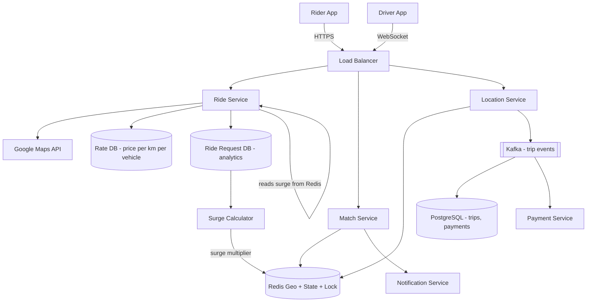
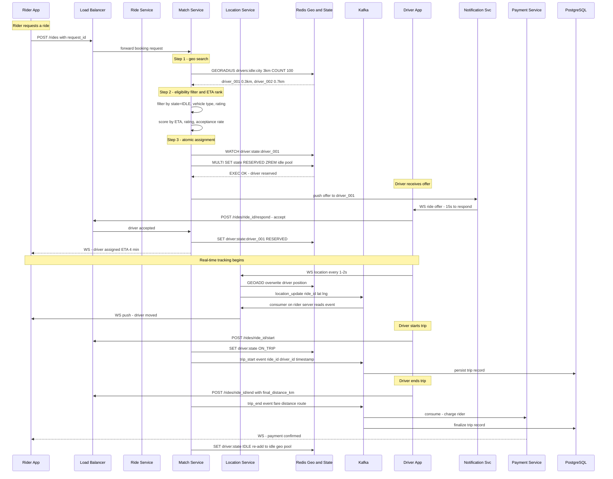
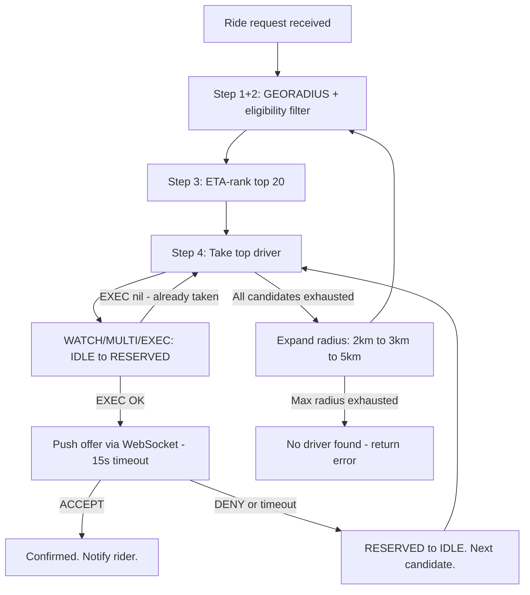
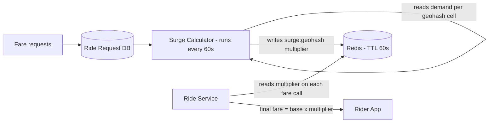
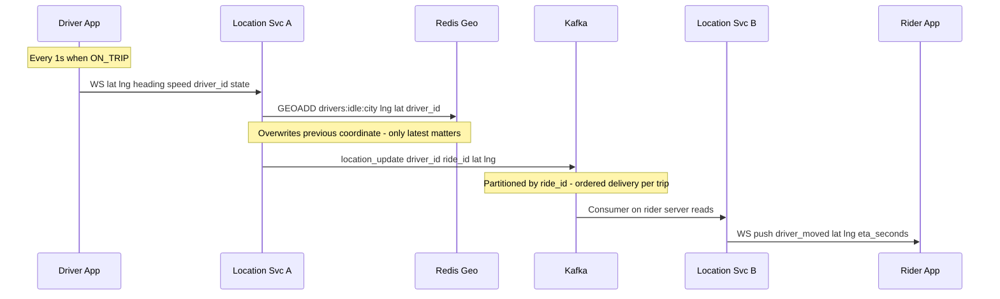

# System Design: Ride Booking (Uber / Rapido)

---

## 1. What Is Uber / Rapido?

Uber and Rapido are ride-booking platforms: a rider opens an app, requests a trip from their current location to a destination, and the app connects them with a nearby available driver who accepts the ride, picks them up, and drives them to their destination. The rider pays through the app, and both sides rate each other afterward.

At the scale these platforms operate — millions of riders and drivers active at the same time in the same cities — the hard part isn't the ride itself, it's connecting the right driver to the right rider fast enough, correctly enough (never double-booking a driver), while both sides' locations are constantly changing.

---

## 2. A Day in the Life

Priya finishes dinner and opens the app to head home. She taps "Request Ride," and the map already shows a few nearby cars. A few seconds later, her screen updates: "Driver assigned — Arjun, 4 minutes away." She watches Arjun's car icon creep closer to her pin on the map in real time.

Across town, Arjun had just dropped off another rider and was marked available again. His phone buzzed with the new offer — pickup 1.2km away — and he had 15 seconds to accept before it would go to the next closest driver. He tapped accept.

As Arjun drives toward her, Priya can see his position update every couple of seconds — smooth enough that it doesn't feel like she's watching a slideshow. When he arrives, he taps "Arrived," Priya gets in, and he starts the trip. Now his position updates even more frequently — she's actively tracking him drive her home.

At her destination, Arjun ends the trip. The fare is calculated automatically and charged to Priya's saved payment method — no cash, no negotiation. Both of them rate each other, and Arjun's app immediately shows him as available again, ready for the next rider.

The whole thing — from Priya's tap to Arjun being free again — usually takes under 20 minutes, and neither of them ever thought about a database, a queue, or a server. Everything from here on is how that experience actually gets built.

---

## 3. Requirements — and Why They Matter

**Scope.** In scope: fare estimation, ride booking, driver matching, real-time location tracking (rider and driver), trip start/end, ratings, payments, surge pricing. Out of scope: driver onboarding, fleet management, surge zone boundary drawing, fraud detection internals, driver incentive programs.

**Functional requirements:**

1. Rider gets a fare estimate (per vehicle type) for a pickup and drop location
2. Rider books a ride; system matches a nearby available driver within 60 seconds
3. Driver accepts or denies the ride offer (15-second window)
4. Both rider and driver track each other on a live map
5. Trip starts and ends; fare is finalized and payment is processed
6. Rider and driver rate each other after trip completion
7. Rider can cancel a ride before driver arrival; driver can cancel before trip start

<details markdown="1">
<summary><strong>Point to Ponder:</strong> What if two drivers are exactly equidistant from a rider — how do we pick?</summary>

It's not actually about distance — matching ranks by predicted ETA, not raw distance. A driver 0.5km away stuck in traffic can have a worse ETA than one 1.2km away on an open road, so ties are broken by ETA, which already accounts for real-world route and traffic conditions. See §8 Deep Dives for the full ranking pipeline.

</details>

**Non-functional requirements — and why each one matters to a real user, not just as a target:**

| Requirement | Target | Why it matters |
|---|---|---|
| Latency — driver matching | < 300ms to dispatch first offer | A slower dispatch means the rider stares at a spinner wondering if the app is broken — trust erodes fast in the first few seconds of any request. |
| Latency — location update visible to rider | < 2s end-to-end | If the driver's dot on the map lags noticeably behind their real position, the rider can't trust the ETA or know where to actually stand. |
| Availability (rider-facing) | 99.9% — app down = revenue loss | A rider trying to get home late at night with a dead app isn't a minor bug — it's a stranded person. |
| Consistency (driver assignment) | Strong — a driver must never be assigned to two rides simultaneously | If two riders are both told "you have Arjun's car," one of them gets left behind — and Arjun can't be in two places. |
| Durability (trip + billing data) | Zero loss — replicated DB + Kafka retention | A lost trip record means a driver doesn't get paid for a ride they completed, or a rider gets charged with no record of why. |
| Location update throughput | 1.67M writes/sec sustained | Not a promise to the user directly — it's the throughput the system must sustain merely to keep the two latency promises above true for millions of concurrent users. |
| WebSocket connections | 7M concurrent at peak | Same as above: this is what "real-time tracking for everyone online right now" costs in raw connection count. |

**Consistency Model by Component:**

| Component | Consistency | Why |
|---|---|---|
| Driver assignment (Redis WATCH/EXEC) | Strong | Prevents double-booking |
| Driver location (Redis Geo) | Eventual | Overwrites on next tick; ephemeral |
| Trip record (PostgreSQL) | Strong (ACID) | Financial correctness |
| Surge multiplier (Redis cache) | Eventual (60s TTL) | Slight staleness is acceptable |
| Ride history (read replica) | Eventual | Acceptable for non-real-time reads |

> [!IMPORTANT]
> **CAP Theorem framing:** This system intentionally makes different consistency trade-offs per component. Rider-facing read services (fare estimate, history) prefer availability. Driver assignment prefers strong consistency. Stating this explicitly in an interview shows CAP awareness at a component level — not a single global answer.

<details markdown="1">
<summary><strong>Point to Ponder:</strong> What if a rider requests a ride but there's no driver within a reasonable distance?</summary>

The system doesn't just fail immediately — it expands its search radius in rounds (2km → 3km → 5km, each with its own timeout), trading a longer wait for a match instead of giving up right away. Only after the widest radius is exhausted does it return "no driver found." See the Dispatch Expansion table in §8 Deep Dives.

</details>

---

## 4. Scale, From First Principles

Before designing anything, it's worth asking: how many drivers, riders, and requests are we actually dealing with — and what does that imply for the technology choices ahead?

**Starting assumptions:**
```
Total drivers online:       5 million
Daily rides:                20 million
Peak concurrent requests:   500,000
Location update frequency:  every 1s (ON_TRIP), every 2s (RESERVED), every 5s (IDLE)
```

**How many location writes per second does that create?** If 5 million drivers each send an update roughly every 3 seconds on average (blending the three frequencies above), that's:
```
5M drivers x (1 update / 3s avg) = ~1.67M writes/sec -> Redis must handle this
```
That single number rules out a relational database for driver location before we've designed anything else — no single PostgreSQL primary survives 1.67 million writes per second.

**How many persistent connections does live tracking require?** Every online driver plus every rider mid-trip needs an open connection to receive updates:
```
5M drivers + ~2M active riders = ~7M persistent connections
```
That's the number that rules out HTTP polling — see the bandwidth comparison below — and points toward WebSocket.

**What about the durable side — trip records, not location?** Trip starts/ends are far rarer events than location pings:
```
20M rides/day / 86,400s = ~232 events/sec (well within Kafka capacity)
```
232 events/sec is a completely different scale problem than 1.67M writes/sec — which is exactly why this system treats location (fast, ephemeral) and trip records (rare, durable) as two entirely different pipelines, not one.

**Storage:**
```
Trip record: ~1 KB x 20M rides/day = 20 GB/day (PostgreSQL)
Location history (waypoints): ~500 GPS points x 16B x 20M trips = ~160 GB/day (cold)
Driver metadata: 5M drivers x 1 KB = 5 GB (static, fits in memory)
```

**Why WebSocket beats HTTP polling at this scale:**
```
Location update frame (WebSocket): ~20 bytes
Location update frame (HTTP polling): ~2 KB (headers + body)
At 1.67M updates/sec: WebSocket = 33 MB/s vs HTTP = 3.3 GB/s -> WebSocket wins 100x
```

These numbers are what drive every major decision in this design: Redis for geospatial search (not PostGIS), WebSocket (not HTTP polling), Kafka for fan-out (not direct server-to-server calls), and state-adaptive location frequency (not a fixed 1-second tick for every driver regardless of what they're doing).

---

## 5. High-Level Architecture

Remember Priya's request and Arjun's acceptance from the story above — here's what actually happens underneath.

Uber is two concurrent real-time systems: **location tracking** and **driver matching**. Every 1–5 seconds, millions of drivers push their GPS coordinates into a geo-indexed in-memory store. When a rider requests a trip, the system finds the closest available driver by ETA (not distance), atomically assigns them via a state transition, and keeps both maps in sync — all under 300ms. The hardest problems are concurrency (preventing double-booking) and geospatial search at scale.

```
                ┌──────────────────────────────────────────────────────────────┐
                │                     FAST PATH                                 │
 ┌──────────┐  │  ┌───────────────┐  GEORADIUS   ┌──────────────┐             │
 │  Driver  │──►  │ Location Svc  │ ───────────► │ Match Engine │ ──► Driver  │
 │  App     │  │  │ (Redis Geo)   │              │ (top K score)│    notified  │
 └──────────┘  │  └───────────────┘              └──────┬───────┘             │
  every 1-5s   │                                        │ WATCH/MULTI/EXEC    │
               └────────────────────────────────────────┼─────────────────────┘
                                                         │
               ┌─────────────────────────────────────────▼────────────────────┐
               │                    RELIABLE PATH                               │
               │  Trip event ──► Kafka ──► Trip DB (PostgreSQL)                │
               │  (start, end, fare, route) — durable, for billing + history   │
               └──────────────────────────────────────────────────────────────┘
```

### Core Design Principles

| Path | Optimized For | Mechanism |
|---|---|---|
| Fast Path — matching | Latency (< 300ms end-to-end) | Driver WS → Redis GEOADD → GEORADIUS → WATCH/MULTI/EXEC → WS push to driver |
| Fast Path — live tracking | Low-latency map sync | Location Svc → Kafka → rider WebSocket (ON_TRIP only) |
| Reliable Path — billing | Durability (zero revenue loss) | trip_start / trip_end → Kafka → PostgreSQL (replicated) |
| Ephemeral data | Sub-ms reads, auto-expiry on disconnect | Driver state + location in Redis with TTL |
| Durable data | Correct billing, audit, replay | Trip events event-sourced into PostgreSQL via Kafka |

> [!IMPORTANT]
> **Driver location is fast path only.** Location is overwritten every 1–5 seconds — only the latest value matters. Trip events are reliable path — they drive billing. Never conflate ephemeral real-time data (location) with durable transactional data (trip records).

> [!NOTE]
> **Key Insight:** Both paths run concurrently on every event — they are not sequential. The fast path can fail and self-heal. The reliable path must not fail. Redis TTL is not a weakness; it is the correct primitive for data with a natural expiry.

<details markdown="1">
<summary><strong>Point to Ponder:</strong> Why does the fast path (matching) never touch PostgreSQL directly?</summary>

Because driver location and matching state are ephemeral — only the latest value matters, and it's fine if a value is lost on a crash since it'll be overwritten in 1-5 seconds anyway. PostgreSQL is for data that must never be lost (trip records for billing) — mixing the two would mean either slowing matching down to hit a durable disk on every update, or risking billing data with a fire-and-forget cache.

</details>

---

### From Simple to Evolved

### Simple Design


### Evolved Design (with Kafka and Surge Pricing)



### The Full Sequence

The diagrams above show the components; this shows the actual message sequence between them, end to end:



---

## 6. API Design

### Rider APIs

| Method | Path | Description |
|---|---|---|
| POST | /api/v1/rides/request | Request ride {pickup_lat, pickup_lng, dest_lat, dest_lng}, returns {ride_id, fare_estimate, eta} |
| GET | /api/v1/rides/{id}/status | Poll ride status + driver location |
| DELETE | /api/v1/rides/{id} | Cancel ride (before driver assigned) |
| POST | /api/v1/rides/{id}/rating | Rate driver post-ride |

### Driver APIs

| Method | Path | Description |
|---|---|---|
| PUT | /api/v1/drivers/availability | Toggle online/offline with current location |
| POST | /api/v1/rides/{id}/accept | Accept dispatched ride request |
| PUT | /api/v1/rides/{id}/status | Update status: ARRIVED, STARTED, COMPLETED |
| POST | /api/v1/drivers/location | GPS ping {lat, lng} every 5s |

> [!NOTE]
> **Async matching design:** POST /rides/request is synchronous only for fare estimation. Driver matching happens asynchronously — the client polls GET /rides/{id}/status. This is why the system can afford to try multiple drivers without blocking the rider.

---

## 7. Data Model

Seven different pieces of data live in this system, and none of them belong in the same store — each has different durability, consistency, and throughput needs. Driver location needs sub-millisecond geospatial queries and can tolerate total loss (it's stale in 5 seconds anyway) — that's Redis Geo, not a relational database. Trip and payment records need ACID guarantees because they're money — that's PostgreSQL, not a cache. Ride request logs are high-volume and read for analytics, not transactional correctness — that's a wide-column/analytics store, not a relational join target. The table below maps every entity to the store whose guarantees actually match what that entity needs:

| Entity | Storage | Key Columns | Why this store |
|---|---|---|---|
| Driver live location | Redis Geo sorted set | drivers:idle:city → driver_id, lng, lat | 1.67M writes/sec; ephemeral; sub-ms GEORADIUS queries |
| Driver state | Redis key-value with TTL | driver:state:driver_id → IDLE / RESERVED / ON_TRIP | Atomic WATCH/EXEC for double-booking prevention; TTL self-heals on disconnect |
| Trip record | PostgreSQL | trip_id, rider_id, driver_id, status, pickup, dropoff, fare, started_at, ended_at | ACID for financial correctness; strong consistency on fare and payment |
| Payment record | PostgreSQL | payment_id, trip_id, amount, status, method, created_at | ACID; joins with trip record for reconciliation |
| Surge multiplier | Redis key-value with TTL 60s | surge:geohash → multiplier float | Cache layer; 60s staleness acceptable; SC writes, RS reads |
| Ride request log | Analytics DB (Cassandra or BigQuery) | request_id, geohash, vehicle_type, timestamp | High-write analytics; feeds Surge Calculator; no ACID needed |
| Waypoints (GPS trace) | Object storage (S3) | waypoints/trip_id.jsonl | ~160 GB/day; cold after trip ends; no random access needed |
| Driver metadata | PostgreSQL + Redis cache | driver_id, name, vehicle, rating, acceptance_rate | Static metadata; cached in Redis TTL 5m after first read |
| User / rider profile | PostgreSQL | user_id, name, phone, email, payment_method | Relational; infrequent writes; strong consistency on payment method |

---

## 8. Deep Dives

### 8.1 Driver Matching with Geohash and Atomic Assignment

Here is the problem we are solving: when a rider requests a trip, find the best available nearby driver, offer them the ride, and assign atomically — without double-booking — in under 300ms. Five million drivers are in the pool. Naive: scan all drivers in the DB — impossible at scale.

**Naive solution fails:** A full-table scan of 5M driver rows per ride request at 500K peak requests/sec = 2.5 trillion row scans per second. No relational DB survives this.

**What this must prevent:**
- Two different ride requests both being assigned the same driver at the same moment (double-booking)
- A driver being offered a ride, timing out, and never being returned to the available pool (driver starvation)
- Search always returning empty when there are only a few nearby available drivers rather than degrading gracefully

**Chosen solution — five-step pipeline:**

```
Step 1: Geo index search     -> GEORADIUS -> top 100 candidates within 2km
Step 2: Eligibility filter   -> state=IDLE, vehicle type, rating, acceptance rate
Step 3: ETA-based ranking    -> call routing engine for top 20; score by ETA + quality
Step 4: Sequential dispatch  -> offer to top driver, 15s window; expand if exhausted
Step 5: Atomic state lock    -> WATCH/MULTI/EXEC: IDLE -> RESERVED atomically
```

**Why H3 over plain geohash for production:**

Geohash cells are rectangles — corner distances are longer than edge distances, causing search radius inconsistencies. Uber's H3 uses hexagons: every cell has exactly 6 equidistant neighbors, so "expand to adjacent cell" expands coverage uniformly in all directions. For this design, Redis built-in GEORADIUS (geohash-based) is acceptable; H3 is the production upgrade.

**The atomic assignment — no separate lock service:**

```
WATCH driver:state:driver_001
  current = GET driver:state:driver_001
  IF current != "IDLE": DISCARD  -- another server got here first
MULTI
  SET driver:state:driver_001  RESERVED  EX 30
  ZREM drivers:idle:bangalore  driver_001
EXEC
  -> nil  EXEC failed -- state changed between WATCH and EXEC, skip driver
  -> OK   atomic commit -- driver is RESERVED, removed from idle pool
```

Two servers racing to reserve the same driver: only one EXEC commits. The other gets nil and moves to the next candidate. No separate lock key. No lock service. The state is the truth.

**Dispatch expansion:**

```
Round 1: 2km, 2-min timeout  -- quality match (close driver, good ETA)
Round 2: 3km, 2-min timeout  -- balance quality + availability
Round 3: 5km, 2-min timeout  -- availability over quality
Round 4: fail request        -- "no driver found"
```



> [!NOTE]
> **Key Insight:** Matching is not about finding the nearest driver — it is about finding the fastest pickup. ETA is the metric, not distance. A driver 0.5km away in traffic has a worse ETA than one 1.2km away on an open road. Every system that ranks by distance is optimizing for the wrong thing.

> [!IMPORTANT]
> **State machine replaces distributed locks.** The atomic IDLE → RESERVED transition ensures a driver is either fully available or fully reserved — never both. No ZooKeeper, no Redlock, no DB row lock. The state is the truth.

---

### 8.2 Surge Pricing Algorithm

Here is the problem we are solving: at peak demand, more riders request rides than drivers are available. Without price adjustment, all riders compete for the same few drivers, matching fails, and drivers earn less. Surge pricing signals scarcity to both sides — it is a market-clearing mechanism, not a revenue grab.

**Naive solution fails:** Static per-km rates mean the same price during a 3am downpour as a sunny Tuesday morning. Matching rate drops. Rider wait times spike. Drivers have no incentive to come online.

**Chosen solution — demand-signal feedback loop:**



**Surge formula per geohash cell:**

```
demand_ratio = active_ride_requests / idle_drivers_in_cell
multiplier:
  ratio < 1.0   -> 1.0x  (supply exceeds demand)
  ratio 1.0-1.5 -> 1.2x
  ratio 1.5-2.0 -> 1.5x
  ratio 2.0-3.0 -> 2.0x
  ratio > 3.0   -> 3.0x  (capped -- prevents extreme pricing)
```

- Surge Calculator runs every 60 seconds, writes `surge:{geohash}` to Redis (TTL 60s)
- Ride Service reads the multiplier on each fare call (sub-ms Redis read)
- Rider sees the multiplier before confirming — informed consent (legal requirement in most markets)
- Surge does not affect matching logic — it only affects the fare shown to the rider

> [!NOTE]
> **Key Insight:** Surge pricing is a read-path concern only — it does not affect matching. The Surge Calculator is a separate service feeding data into Redis. The matching engine never reads it. Decoupling surge calculation from matching prevents a slow analytics query from blocking a 300ms matching window.

**Trade-off — eventual consistency on surge:** A 60-second Redis TTL means surge multiplier can be up to 60s stale. A rider booking 30 seconds after a demand spike may see the old price. This is acceptable: the fare shown at request time is the fare charged (contractual), and 60s staleness does not meaningfully harm either party.

---

### 8.3 Real-Time Location Write Architecture

Here is the problem we are solving: 1.67 million GPS updates arrive per second from driver devices. Each update must be indexed for sub-ms geospatial lookup. The rider tracking a trip must see the driver move smoothly on their map — but the rider and driver are on different backend servers.

**Naive solution fails:** Writing 1.67M rows/sec to a relational DB creates disk I/O saturation within minutes. Direct server-to-server WebSocket push (Server A to Server B) is impossible in a stateless distributed deployment.

**Chosen solution — three-layer architecture:**

**Layer 1 — Write batching:** Location Service buffers 500ms of updates and pipeline-writes to Redis in one round-trip. This reduces Redis round-trips 3–5x without increasing visible latency to the rider (500ms is imperceptible vs 1s update tick).

**Layer 2 — Redis Geo sorted set:** GEOADD overwrites the previous coordinate (O(log N) per write). GEORADIUS scans a bounding box (O(N+log M)). No locking. No transactions. This is why Redis Geo handles 1.67M concurrent writes while serving sub-10ms matching queries simultaneously.

**Layer 3 — Kafka fan-out for ON_TRIP tracking:**



**State-adaptive update frequency — accuracy vs cost:**

| Driver state | Update frequency | Redis writes/sec at 5M drivers | Why this frequency |
|---|---|---|---|
| IDLE | Every 5s | 1M writes/sec | No rider watching — coarse position enough for matching |
| RESERVED | Every 2s | 2.5M writes/sec | Rider watching ETA countdown on map |
| ON_TRIP | Every 1s | 5M writes/sec | Rider watching live position; smooth animation required |

Sending 1-second updates from IDLE drivers wastes 60–70% of Redis write capacity for zero rider-visible benefit. The state machine already knows each driver's state — frequency is derived from it for free.

**Stale location self-healing:**

```
Driver phone disconnects -> WebSocket closes -> Location Svc detects
  -> EXPIRE driver:state:driver_id 30
  -> After 30s with no heartbeat: key expires -> auto-removed from idle pool
  -> No stale drivers offered to riders. No cron job needed.
```

> [!IMPORTANT]
> **Fan-out via Kafka is a correctness requirement, not a performance optimization.** Without it, location updates only reach the rider if they happen to be on the same server as the driver — never guaranteed in a distributed deployment.

> [!NOTE]
> **Key Insight:** Write path and read path never conflict in Redis Geo. Writes overwrite one sorted set entry (O(log N)). Reads scan a bounding box (O(N+log M)). No locking. This is why Redis Geo handles 1.67M concurrent writes while serving sub-10ms matching queries.

---

## 9. Bottlenecks & Scaling

**What breaks first as scale grows 10x:**

| Bottleneck | Breaks at | Strategy |
|---|---|---|
| Redis location write throughput | ~10M writes/sec | Shard by city/region: drivers:idle:bangalore, drivers:idle:mumbai. Each shard is an independent Redis cluster. |
| Match Service fan-out at surge | 500K ride requests/sec | Horizontal scale (stateless service); partition ride requests by pickup geohash — each Match Service shard owns a set of cells. |
| PostgreSQL trip writes | ~100K writes/sec per primary | Kafka consumers batch-insert trips (bulk insert 1000 rows vs 1 per event). Add read replicas for ride history queries. |
| WebSocket server connections | ~100K connections per server | Sticky load balancing by driver_id hash; horizontal scale to 70+ servers for 7M connections. |
| Surge Calculator at 10x cities | Slow DB scan | Pre-aggregate demand counts per geohash cell using Kafka Streams (rolling 5-min window) — write results to Redis instead of scanning the full ride request DB. |

**Caching strategy:**
- Driver metadata (name, vehicle, rating): Redis cache TTL 5 minutes — reads on every matching request
- Surge multiplier: Redis TTL 60s — Surge Calculator writes, Ride Service reads
- Rate table (price/km): Redis TTL 1 hour — changes infrequently
- Ride history: read replica + application-level pagination — no caching needed (user reads once)

**CDN / Edge:** Not applicable to the core matching path. Rider and driver apps download static assets (map tiles, app bundles) via CDN. Dynamic API calls and WebSockets must reach origin.

---

## 9.1 Failure Scenarios

| Failure | Impact | Recovery |
|---|---|---|
| Redis primary fails (location + state) | Matching halts; active trips lose live map | Redis Sentinel / Cluster failover in < 30s. Drivers re-register within 15s via heartbeat. Active trips re-establish tracking via Kafka (reliable path unaffected). |
| Match Service instance crashes mid-assignment | Driver reserved but no offer sent; driver stuck in RESERVED | Redis TTL on driver:state expires in 30s → auto-reverts to IDLE. Rider request retries via Kafka dead-letter queue. |
| Kafka broker failure | Trip events delayed; live tracking fan-out delayed | Kafka cluster replication (RF=3); consumer lag; events replayed on broker recovery. No data loss. |
| PostgreSQL primary fails | Trip write fails; billing delayed | PostgreSQL replica promoted (RDS Multi-AZ: < 60s). Kafka retains events during failover — no billing data lost. |
| Driver app disconnects mid-trip | Location updates stop; rider map freezes | Rider shown "signal lost" UI. Driver reconnects and resumes. If no reconnect in 30s: TTL expires, trip marked as interrupted, ops notified. |
| Payment Service unavailable | Fare not charged at trip end | Kafka retains trip_end event. Payment Service processes on recovery. Idempotency key prevents double-charge. |
| Surge Calculator crash | Surge multiplier stale (60s TTL expiry) | Redis TTL expires → fallback to 1x. Surge Calculator restarts; resumes writing within seconds. Brief under-pricing acceptable. |
| Double-booking race condition | Two servers attempt to reserve the same driver | Redis WATCH/MULTI/EXEC: only one EXEC succeeds. Second server gets nil, skips driver, tries next candidate. Zero double-bookings. |

---

## 9.2 Trade-offs

### Geohash vs Quadtree for Driver Geospatial Index

| Dimension | Geohash (Redis Geo) | Quadtree |
|---|---|---|
| Cell shape | Rectangle — uneven diagonal vs edge distance | Adaptive subdivision — cells match data density |
| Neighbor lookup | Must check up to 9 cells for edge cases | Clean tree traversal — 4 children per node |
| Write throughput | In-memory sorted set — 1.67M writes/sec | Tree rebalancing on write — slower at high write rates |
| Operational cost | Redis built-in GEORADIUS — zero extra infra | Custom service or library — additional complexity |
| Production use | Industry standard for most systems | Better for non-uniform density (dense city vs rural) |

**Chosen:** Redis Geo (geohash) — already in the stack for driver state and locks. GEORADIUS is a single command. The trade-off I accept is rectangular cells with slight edge distortion, which is acceptable because we expand to adjacent cells on radius expansion and the distortion (< 5% area difference) does not materially affect ETA accuracy.

> [!NOTE]
> **Key Insight:** H3 hexagons (Uber's production choice) solve the corner-distance problem but require a custom indexing layer. For most systems, Redis GEORADIUS is the right default — zero extra infrastructure, built-in neighbor search, proven at scale.

---

### WebSocket vs HTTP Polling for Live Tracking

| Dimension | WebSocket | HTTP Polling |
|---|---|---|
| Connection overhead | Persistent — one TLS handshake, then frames | New HTTP request per update — TLS + headers each time |
| Write volume at 5M drivers | 1.67M x 20B frames = 33 MB/s | 1.67M x 2KB headers = 3.3 GB/s |
| Bidirectional | Yes — server pushes dispatch offer to driver | No — driver must poll for offers separately |
| Server state | Stateful sticky routing needed | Stateless — any server handles any request |
| Battery impact | Low — persistent connection | High — repeated TLS handshakes |

**Chosen:** WebSocket — at 5M drivers updating every 3 seconds, HTTP header overhead alone generates 3.3 GB/s of wasted bytes. WebSocket frames are ~20 bytes. The trade-off I accept is stateful sticky routing (drivers must reconnect to the same server region), which is acceptable because the Location Service is partitioned by city and drivers rarely cross region boundaries mid-shift.

> [!NOTE]
> **Key Insight:** WebSocket vs HTTP is a math problem. 5M drivers x 1 update/3s x 2KB HTTP overhead = 3.3 GB/s in headers alone. WebSocket frames are ~20 bytes. The transport choice is arithmetic, not preference.

---

### Surge Pricing Consistency — Eventual vs Strong

| Dimension | Strong consistency (read-your-writes) | Eventual consistency (Redis TTL 60s) |
|---|---|---|
| Accuracy | Multiplier always reflects latest demand | Up to 60s stale |
| Latency impact | Must read from DB or leader on every fare call | Redis sub-ms read |
| Complexity | Distributed transaction across Surge Calc + Ride Svc | Fire-and-forget write to Redis; Ride Svc reads independently |
| Rider impact | Price always reflects current demand | Rider may see slightly outdated price |

**Chosen:** Eventual consistency with 60s TTL. The fare shown at request time is the fare charged (contractual). A 60-second staleness window does not materially harm riders or drivers. The strong-consistency alternative adds a synchronous DB read on every fare call — at 500K peak requests/sec this becomes a DB bottleneck.

> [!NOTE]
> **Key Insight:** Surge pricing staleness is a business tolerance decision, not a technical limitation. 60 seconds is enough granularity for a pricing signal. Exact real-time surge would require a synchronous distributed read on every fare request — the cost is not justified by the precision gained.

---

## 10. Evaluation: Did We Meet the Requirements?

Six non-functional requirements were set out in §3. Here's how the design actually satisfies each one — not just what was promised, but the specific mechanism doing the work.

**Latency (dispatch < 300ms, location visible < 2s):** The fast path never touches a disk-backed database — `GEORADIUS` runs against an in-memory Redis sorted set, and the `WATCH/MULTI/EXEC` atomic assignment is a handful of Redis commands, not a distributed transaction. Location updates skip the database entirely and flow Driver → Redis GEOADD → Kafka → rider WebSocket, each hop sub-millisecond to low-single-digit milliseconds.

**Availability (99.9% rider-facing):** Redis Sentinel/Cluster failover recovers a lost primary in under 30 seconds, and drivers self-heal into the pool via heartbeat re-registration. Because location state is ephemeral (§9.1 Failure Scenarios), a Redis failover doesn't corrupt anything — it just means a brief gap in live tracking, not lost data or a stuck trip.

**Consistency (driver assignment must be strong):** This is the one place the design refuses to be eventually consistent. `WATCH/MULTI/EXEC` makes the IDLE→RESERVED transition atomic — two servers racing to reserve the same driver, only one EXEC commits, the other gets `nil` and moves to the next candidate. No separate lock service, because the state itself is the lock.

**Durability (zero loss on trip + billing data):** Trip events go through Kafka (replication factor 3) before landing in PostgreSQL — if a broker or the database briefly goes down, Kafka retains the event and replays it on recovery, so a billing event is never silently dropped, only delayed.

**Location throughput (1.67M writes/sec) and WebSocket connections (7M peak):** These aren't separately "achieved" — they're the reason Redis Geo and WebSocket were chosen over PostGIS and HTTP polling in the first place (§4 Scale, From First Principles). The design doesn't scale up to meet these numbers after the fact; they were the numbers that ruled out the alternatives before any component was chosen.

| Requirement | Mechanism |
|---|---|
| Latency — matching < 300ms | In-memory Redis GEORADIUS + WATCH/MULTI/EXEC, no disk-backed DB on the fast path |
| Latency — location < 2s | Driver → Redis GEOADD → Kafka → rider WebSocket, no polling |
| Availability 99.9% | Redis Sentinel/Cluster failover (<30s), driver heartbeat re-registration |
| Consistency — driver assignment | WATCH/MULTI/EXEC atomic state transition, state is the lock |
| Durability — trip/billing | Kafka (RF=3) buffers PostgreSQL writes, replays on recovery |
| 1.67M writes/sec, 7M connections | Architectural constraints that selected Redis Geo + WebSocket up front |

---

## 11. Conclusion

This design treats Uber/Rapido as two concurrent systems wearing one UI: a high-frequency, ephemeral location-tracking pipeline, and a low-frequency, durable trip-and-billing pipeline — and it never lets the two mix. The hardest problem wasn't finding a nearby driver; it was atomically reserving one without a separate lock service, and deciding, precisely, which data can be lost for a few seconds (location) and which never can (money). Every other decision — Redis over PostGIS, WebSocket over polling, Kafka in the middle — falls out of getting that one distinction right.

---

## 12. Interview Summary

> [!TIP]
> When the interviewer says "walk me through your Uber design," hit these points in order. Each is a decision with a clear WHY.

### Key Decisions

| Decision | Problem It Solves | Trade-off Accepted |
|---|---|---|
| WebSocket (not HTTP) for location | 3.3 GB/s HTTP header waste at 5M drivers | Stateful sticky routing per city region |
| Redis Geo (not PostGIS) for live positions | 1.67M location writes/sec; sub-ms spatial queries | Ephemeral — re-registers within 15s on crash |
| WATCH/MULTI/EXEC atomic state transition | Prevents double-booking without a separate lock service | 30s TTL on RESERVED state — rare retry on server crash |
| Driver State Machine (IDLE/RESERVED/ON_TRIP) | Controls pool membership, update frequency, and crash recovery in one mechanism | State lives in Redis — not durable, but self-healing via TTL |
| Kafka for trip events (not direct DB write) | Decouples 300ms fast matching path from reliable billing write | 5–20ms Kafka lag on durable writes — acceptable |
| ETA-based ranking (not distance) | Riders experience wait time, not map distance | Routing engine call for each top-K candidate — ~10ms per call |
| State-adaptive location frequency | 60–70% Redis write reduction vs fixed 1s tick; no rider-visible degradation | Requires state machine to be the source of truth for update interval |

### Fast Path vs Reliable Path

```
Fast Path   (latency):   Driver WS -> Redis GEOADD -> GEORADIUS -> WATCH/EXEC -> WS push to driver
                         ON_TRIP tracking: Redis -> Kafka -> WS push to rider map

Reliable Path (safety):  trip_start / trip_end -> Kafka -> PostgreSQL (billing, history)
                         Fare request -> Ride Request DB -> Surge Calculator -> Redis

Location = fast path only (ephemeral, overwritten every 1-5s, TTL self-heals)
Trip record = reliable path (durable, drives billing and audit, never lost)
```

### Key Insights Checklist

> [!IMPORTANT]
> These are the lines that make an interviewer lean forward. Know them cold.

- **"Matching is not about finding the nearest driver — it is about finding the fastest pickup."** We rank by ETA, not distance. Distance is a proxy; ETA is the truth. Every system that ranks by distance is optimizing for the wrong metric.
- **"Consistency in driver assignment is enforced through state transitions, not locks."** The atomic IDLE → RESERVED via WATCH/MULTI/EXEC is the mutual exclusion. No separate lock service. No ZooKeeper. The state is the truth.
- **"Location data is high-frequency and ephemeral — storing it in a DB creates write bottlenecks."** Redis holds only the current position. TTL self-evicts stale data. The previous coordinate has zero value the moment the next one arrives.
- **"Update frequency is a function of driver state, not a single tuning knob."** IDLE drivers waste 60–70% of Redis write capacity if pinged every second. The state machine already knows the state — frequency is derived from it for free.
- **"The Kafka queue is a correctness requirement."** Decoupling fast matching (Redis, sub-100ms) from reliable billing (Kafka → DB) is what makes both guarantees achievable simultaneously. Without Kafka, a slow DB write would block the matching path.
- **"CAP per component."** Rider-facing services are AP. Driver assignment is CP. The system is not uniformly one or the other — this is the right answer in an interview.
