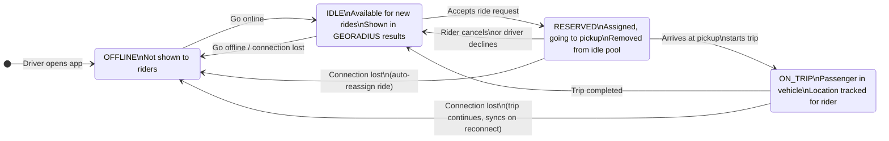
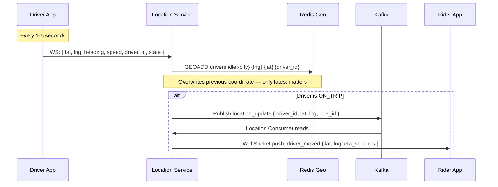
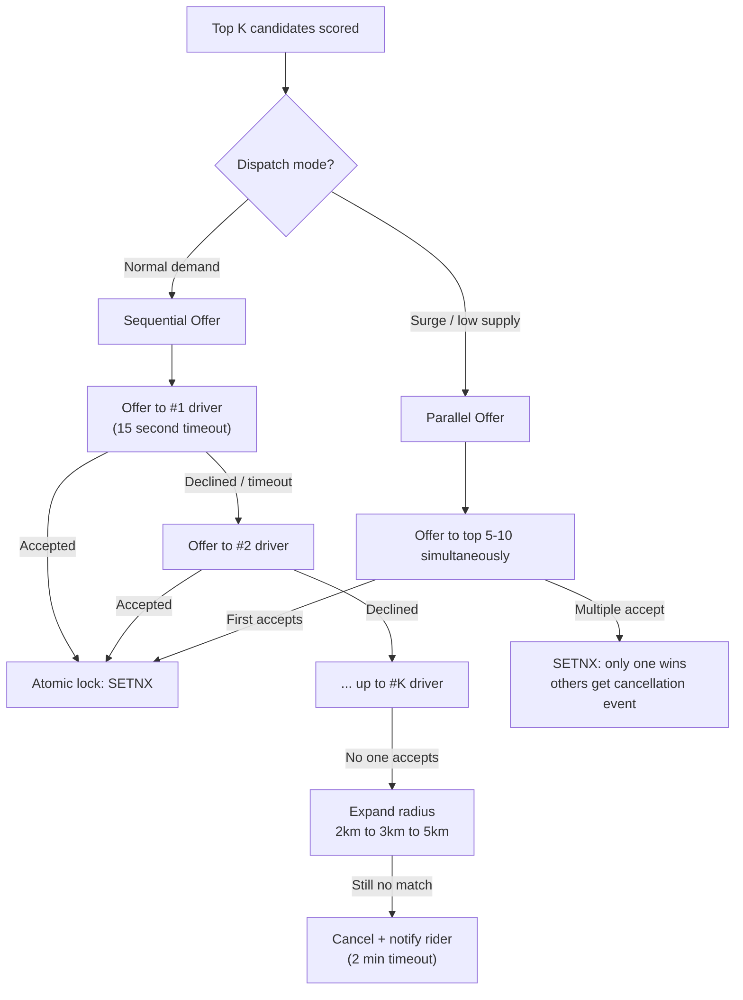
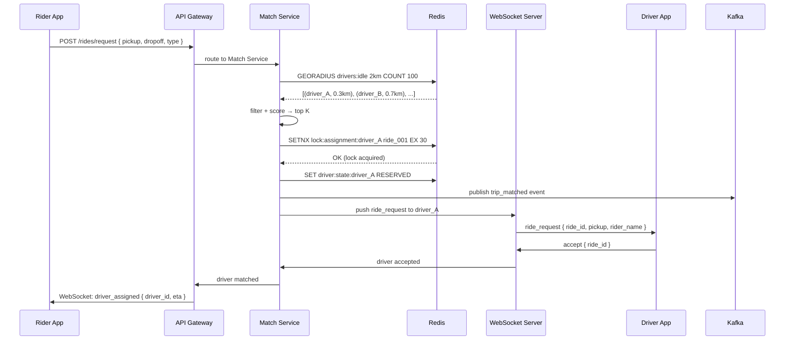

# System Design: Ride Booking (Uber / Rapido)

---

## 🧠 Mental Model

> Uber is built on two concurrent real-time systems: **location tracking** and **driver matching**. Every second, millions of drivers push their GPS coordinates. When a rider requests a trip, the system must find the closest available driver, atomically assign them, and keep both parties' maps in sync — all under 300ms. The hardest problems are concurrency (preventing double-booking) and geospatial search at scale.

```
                ┌──────────────────────────────────────────────────────────────┐
                │                     FAST PATH                                 │
 ┌──────────┐  │  ┌───────────────┐  GEORADIUS   ┌──────────────┐             │
 │  Driver  │──►│  │ Location Svc  │ ───────────► │ Match Engine │ ──► Driver  │
 │  App     │  │  │ (Redis Geo)   │              │ (top K score)│    notified  │
 └──────────┘  │  └───────────────┘              └──────┬───────┘             │
  every 3-5s   │                                        │ SETNX (atomic lock) │
               └────────────────────────────────────────┼─────────────────────┘
                                                         │
               ┌─────────────────────────────────────────▼────────────────────┐
               │                    RELIABLE PATH                               │
               │  Trip event ──► Kafka ──► Trip DB (Postgres/Cassandra)        │
               │  (start, end, fare, route) — durable, for billing & history   │
               └──────────────────────────────────────────────────────────────┘
```

## ⚡ Core Design Principle

| Path | Mechanism | Optimizes for | Example |
|------|-----------|---------------|---------|
| **Fast Path** | Redis GEOADD + GEORADIUS + SETNX | Latency (< 300ms) | Driver location updates, matching, map sync |
| **Reliable Path** | Kafka → PostgreSQL / Cassandra | Durability (billing, audit) | Trip start/end events, fare calculation, history |

> [!IMPORTANT]
> **Driver location is fast path only.** Current location is overwritten every 3–5 seconds — only the latest value matters. Trip events (start, pickup, dropoff) are reliable path — persisted durably because they drive billing. Never conflate real-time ephemeral data (location) with durable transactional data (trip records).

---

## Table of Contents

1. [Problem Statement & Requirements](#1-problem-statement--requirements)
2. [High-Level Architecture](#2-high-level-architecture)
3. [Component Architecture](#3-component-architecture)
4. [Data Flow](#4-data-flow)
5. [API Design & Communication Protocols](#5-api-design--communication-protocols)
6. [Database Design](#6-database-design)
7. [Caching Strategy](#7-caching-strategy)
8. [State Management](#8-state-management)
9. [Performance Optimization](#9-performance-optimization)
10. [Error Handling & Edge Cases](#10-error-handling--edge-cases)
11. [Interview Cross-Questions](#11-interview-cross-questions)
12. [Accessibility (a11y)](#12-accessibility-a11y)
13. [Security & Safety Features](#13-security--safety-features)
14. [Mobile & Touch Interactions](#14-mobile--touch-interactions)
15. [Testing Strategy](#15-testing-strategy)
16. [Offline/PWA Capabilities](#16-offlinepwa-capabilities)
17. [Maps Deep Dive](#17-maps-deep-dive)
18. [Internationalization (i18n)](#18-internationalization-i18n)
19. [Analytics & Monitoring](#19-analytics--monitoring)
20. [Notification System](#20-notification-system)
21. [Payment Integration Deep Dive](#21-payment-integration-deep-dive)

---

## 1. Problem Statement & Requirements

### Functional Requirements

- Location input (pickup & drop) with autocomplete
- Real-time map with driver locations
- Ride type selection (Auto, Bike, Car, Premium)
- Fare estimation before booking
- Real-time driver matching
- Driver tracking during ride
- Payment integration
- Ride history
- Ratings and reviews
- Cancel/modify ride

### Non-Functional Requirements

- **Latency**: Fare estimate < 500ms, driver match < 5s
- **Availability**: 99.99% uptime
- **Scalability**: Handle 10M concurrent requests
- **Real-time**: Driver location updates every 3-5 seconds
- **Consistency**: Payment must be strongly consistent

### Capacity Estimation

```
Daily Active Users: 50 million
Rides per day: 20 million
Peak concurrent ride requests: 500,000
Driver location updates: 50 updates/driver/min
Total drivers online: 5 million
Location updates per second: 4 million
WebSocket connections: 10 million (users + drivers)
```

---

## 2. High-Level Architecture

```
┌─────────────────────────────────────────────────────────────────────────────┐
│                              CLIENT LAYER                                    │
├─────────────────────────────────────────────────────────────────────────────┤
│  ┌─────────────────┐  ┌─────────────────┐  ┌─────────────────┐             │
│  │   Rider App     │  │   Driver App    │  │     Web App     │             │
│  │   (Mobile)      │  │   (Mobile)      │  │   (React)       │             │
│  └────────┬────────┘  └────────┬────────┘  └────────┬────────┘             │
│           │                    │                    │                       │
│           └────────────────────┴────────────────────┘                       │
│                         │ WebSocket │ HTTPS                                 │
└─────────────────────────┼───────────┼────────────────────────────────────────┘
                          │           │
                          ▼           ▼
┌─────────────────────────────────────────────────────────────────────────────┐
│                           EDGE LAYER                                         │
│  ┌─────────────────────────────────────────────────────────────────────┐   │
│  │                    Load Balancer (L7)                                │   │
│  │   • SSL Termination  • Geographic Routing  • Rate Limiting          │   │
│  └─────────────────────────────────────────────────────────────────────┘   │
└───────────────────────────────────┬──────────────────────────────────────────┘
                                    │
         ┌──────────────────────────┼──────────────────────────┐
         ▼                          ▼                          ▼
┌─────────────────┐      ┌─────────────────┐      ┌─────────────────┐
│   REST API      │      │   WebSocket     │      │   Location      │
│   Gateway       │      │   Gateway       │      │   Service       │
│                 │      │                 │      │                 │
│ • Auth          │      │ • Real-time     │      │ • Driver pos    │
│ • Booking       │      │   tracking      │      │ • ETA calc      │
│ • Payments      │      │ • Notifications │      │ • Geo queries   │
└────────┬────────┘      └────────┬────────┘      └────────┬────────┘
         │                        │                        │
         └────────────────────────┴────────────────────────┘
                                  │
                                  ▼
┌─────────────────────────────────────────────────────────────────────────────┐
│                           CORE SERVICES                                      │
├─────────────────┬─────────────────┬─────────────────┬───────────────────────┤
│   Matching      │   Pricing       │   Trip          │   Payment             │
│   Service       │   Service       │   Service       │   Service             │
│                 │                 │                 │                       │
│ • Find nearby   │ • Fare calc     │ • Trip CRUD     │ • Charge user         │
│   drivers       │ • Surge pricing │ • Status mgmt   │ • Pay driver          │
│ • Optimal match │ • Promo codes   │ • History       │ • Refunds             │
└────────┬────────┴────────┬────────┴────────┬────────┴───────────┬───────────┘
         │                 │                 │                    │
         └─────────────────┴─────────────────┴────────────────────┘
                                    │
                                    ▼
┌─────────────────────────────────────────────────────────────────────────────┐
│                           DATA LAYER                                         │
│  ┌─────────────────┐  ┌─────────────────┐  ┌─────────────────┐             │
│  │   PostgreSQL    │  │     Redis       │  │   Kafka         │             │
│  │   (Trips, Users)│  │   (Geo, Cache)  │  │   (Events)      │             │
│  └─────────────────┘  └─────────────────┘  └─────────────────┘             │
│                                                                              │
│  ┌─────────────────┐  ┌─────────────────┐  ┌─────────────────┐             │
│  │   Cassandra     │  │   Elasticsearch │  │    S3           │             │
│  │   (Location     │  │   (Search)      │  │   (Receipts)    │             │
│  │    History)     │  │                 │  │                 │             │
│  └─────────────────┘  └─────────────────┘  └─────────────────┘             │
└─────────────────────────────────────────────────────────────────────────────┘
```

### Ride Booking State Machine

```
┌─────────────────────────────────────────────────────────────────────────────┐
│                       RIDE STATE MACHINE                                     │
├─────────────────────────────────────────────────────────────────────────────┤
│                                                                              │
│   ┌──────────┐    request    ┌───────────────┐                             │
│   │   IDLE   │──────────────>│  SEARCHING    │                             │
│   └──────────┘               │  FOR DRIVER   │                             │
│        ▲                     └───────┬───────┘                             │
│        │                             │                                       │
│        │ cancel                      │ driver_found                         │
│        │                             ▼                                       │
│   ┌──────────┐    timeout    ┌───────────────┐                             │
│   │ CANCELLED│<──────────────│   MATCHED     │                             │
│   └──────────┘               │               │                             │
│        ▲                     └───────┬───────┘                             │
│        │                             │                                       │
│        │ cancel                      │ driver_arrives                       │
│        │                             ▼                                       │
│        │                     ┌───────────────┐                             │
│        ├─────────────────────│  DRIVER EN    │                             │
│        │                     │  ROUTE TO     │                             │
│        │                     │  PICKUP       │                             │
│        │                     └───────┬───────┘                             │
│        │                             │                                       │
│        │ no_show                     │ picked_up                            │
│        │                             ▼                                       │
│        │                     ┌───────────────┐                             │
│        │                     │  IN PROGRESS  │                             │
│        │                     │  (RIDING)     │                             │
│        │                     └───────┬───────┘                             │
│        │                             │                                       │
│        │                             │ dropped_off                          │
│        │                             ▼                                       │
│        │                     ┌───────────────┐    payment    ┌───────────┐ │
│        │                     │  AWAITING     │──────────────>│ COMPLETED │ │
│        │                     │  PAYMENT      │               └───────────┘ │
│        │                     └───────────────┘                             │
│        │                             │                                       │
│        │                             │ payment_failed                       │
│        │                             ▼                                       │
│        │                     ┌───────────────┐                             │
│        └─────────────────────│   DISPUTED    │                             │
│                              └───────────────┘                             │
│                                                                              │
└─────────────────────────────────────────────────────────────────────────────┘
```

### 🚦 Driver State Machine

The driver state machine is what prevents double-booking. Only `IDLE` drivers can receive ride requests. The state is stored in Redis (`driver:state:{driver_id}`) — not in the database — because it changes at high frequency and must be readable in sub-millisecond.



**State storage in Redis:**
```
Key:   driver:state:{driver_id}
Value: IDLE | RESERVED | ON_TRIP | OFFLINE
TTL:   30 seconds (refreshed by heartbeat every 15s)
       If heartbeat stops → TTL expires → driver set OFFLINE automatically
```

**Why this matters:**
- `GEORADIUS` query only returns drivers in the `IDLE` pool (`drivers:idle:{city}`)
- On `RESERVED`: driver is atomically removed from idle pool → invisible to new ride requests
- On trip completion: driver re-added to idle pool → immediately available again
- TTL-based OFFLINE: no explicit logout needed — heartbeat absence auto-cleans the state

> [!NOTE]
> **Key Insight:** The driver state machine is the consistency mechanism. It is not enough to have a "driver is available" boolean. The state machine with atomic transitions (SETNX on assignment + ZREM from idle pool in a Lua script or pipeline) ensures a driver is either fully available or fully reserved — never partially in both. This is the distributed systems equivalent of a mutex.

---

## 3. Component Architecture

### Frontend Component Hierarchy

```
┌─────────────────────────────────────────────────────────────────────────────┐
│                              RideApp                                         │
│  ┌───────────────────────────────────────────────────────────────────────┐  │
│  │                            MapView                                     │  │
│  │  ┌─────────────────────────────────────────────────────────────────┐  │  │
│  │  │                                                                  │  │  │
│  │  │   ┌─────┐                                          ┌─────────┐  │  │  │
│  │  │   │ 🚗  │  Driver markers (real-time)             │ 🚗 🏍️ 🛺 │ │  │  │
│  │  │   └─────┘                                          └─────────┘  │  │  │
│  │  │                                                                  │  │  │
│  │  │                    📍 Pickup Pin                                │  │  │
│  │  │                         │                                        │  │  │
│  │  │                         │ Route line                            │  │  │
│  │  │                         │                                        │  │  │
│  │  │                    🎯 Drop Pin                                  │  │  │
│  │  │                                                                  │  │  │
│  │  │   ┌──────────────────────────────────────────────────────────┐  │  │  │
│  │  │   │                 CurrentLocationButton                     │  │  │  │
│  │  │   │                        📍                                 │  │  │  │
│  │  │   └──────────────────────────────────────────────────────────┘  │  │  │
│  │  └─────────────────────────────────────────────────────────────────┘  │  │
│  └───────────────────────────────────────────────────────────────────────┘  │
│                                                                              │
│  ┌───────────────────────────────────────────────────────────────────────┐  │
│  │                      BottomSheet (Draggable)                          │  │
│  │  ┌─────────────────────────────────────────────────────────────────┐  │  │
│  │  │  STATE: LOCATION_INPUT                                          │  │  │
│  │  │  ┌────────────────────────────────────────────────────────────┐ │  │  │
│  │  │  │ 📍 Pickup: [Current Location            ]  🎤              │ │  │  │
│  │  │  │ 🎯 Drop:   [Search destination...       ]  🎤              │ │  │  │
│  │  │  └────────────────────────────────────────────────────────────┘ │  │  │
│  │  │  ┌────────────────────────────────────────────────────────────┐ │  │  │
│  │  │  │ Recent Searches / Saved Places                             │ │  │  │
│  │  │  │ 🏠 Home    🏢 Work    ★ Saved                               │ │  │  │
│  │  │  └────────────────────────────────────────────────────────────┘ │  │  │
│  │  └─────────────────────────────────────────────────────────────────┘  │  │
│  │                                                                        │  │
│  │  ┌─────────────────────────────────────────────────────────────────┐  │  │
│  │  │  STATE: RIDE_SELECTION                                          │  │  │
│  │  │  ┌────────────────────────────────────────────────────────────┐ │  │  │
│  │  │  │ RideOptionCard (Selected)                                  │ │  │  │
│  │  │  │ ┌────────┬────────────────────────────────────────────────┐│ │  │  │
│  │  │  │ │ 🛺     │  UberAuto   │  ₹85-95   │  3 min away        ││ │  │  │
│  │  │  │ └────────┴────────────────────────────────────────────────┘│ │  │  │
│  │  │  └────────────────────────────────────────────────────────────┘ │  │  │
│  │  │  ┌────────────────────────────────────────────────────────────┐ │  │  │
│  │  │  │ RideOptionCard                                              │ │  │  │
│  │  │  │ ┌────────┬────────────────────────────────────────────────┐│ │  │  │
│  │  │  │ │ 🏍️     │  UberMoto   │  ₹45-55   │  2 min away        ││ │  │  │
│  │  │  │ └────────┴────────────────────────────────────────────────┘│ │  │  │
│  │  │  └────────────────────────────────────────────────────────────┘ │  │  │
│  │  │  ┌────────────────────────────────────────────────────────────┐ │  │  │
│  │  │  │ RideOptionCard                                              │ │  │  │
│  │  │  │ ┌────────┬────────────────────────────────────────────────┐│ │  │  │
│  │  │  │ │ 🚗     │  UberGo     │  ₹120-140 │  5 min away        ││ │  │  │
│  │  │  │ └────────┴────────────────────────────────────────────────┘│ │  │  │
│  │  │  └────────────────────────────────────────────────────────────┘ │  │  │
│  │  │                                                                  │  │  │
│  │  │  ┌────────────────────────────────────────────────────────────┐ │  │  │
│  │  │  │        💳  Payment: Paytm ▼      [Book UberAuto]          │ │  │  │
│  │  │  └────────────────────────────────────────────────────────────┘ │  │  │
│  │  └─────────────────────────────────────────────────────────────────┘  │  │
│  │                                                                        │  │
│  │  ┌─────────────────────────────────────────────────────────────────┐  │  │
│  │  │  STATE: SEARCHING_DRIVER                                        │  │  │
│  │  │  ┌────────────────────────────────────────────────────────────┐ │  │  │
│  │  │  │                    🔄 Finding your ride...                 │ │  │  │
│  │  │  │                    ━━━━━━━━━━ 45%                          │ │  │  │
│  │  │  │                                                            │ │  │  │
│  │  │  │                    [Cancel Request]                        │ │  │  │
│  │  │  └────────────────────────────────────────────────────────────┘ │  │  │
│  │  └─────────────────────────────────────────────────────────────────┘  │  │
│  │                                                                        │  │
│  │  ┌─────────────────────────────────────────────────────────────────┐  │  │
│  │  │  STATE: DRIVER_MATCHED                                          │  │  │
│  │  │  ┌────────────────────────────────────────────────────────────┐ │  │  │
│  │  │  │ DriverCard                                                  │ │  │  │
│  │  │  │ ┌────────┬────────────────────────────────────────────────┐│ │  │  │
│  │  │  │ │ 👤     │  Rajesh K.  │  ⭐ 4.8   │  KA-01-AB-1234     ││ │  │  │
│  │  │  │ │ Avatar │  Honda Activa (White)  │  Arriving in 3 min  ││ │  │  │
│  │  │  │ └────────┴────────────────────────────────────────────────┘│ │  │  │
│  │  │  │                                                            │ │  │  │
│  │  │  │ OTP: 4 5 2 1                                               │ │  │  │
│  │  │  │                                                            │ │  │  │
│  │  │  │ [📞 Call]  [💬 Chat]  [❌ Cancel]                          │ │  │  │
│  │  │  └────────────────────────────────────────────────────────────┘ │  │  │
│  │  └─────────────────────────────────────────────────────────────────┘  │  │
│  │                                                                        │  │
│  │  ┌─────────────────────────────────────────────────────────────────┐  │  │
│  │  │  STATE: RIDE_IN_PROGRESS                                        │  │  │
│  │  │  ┌────────────────────────────────────────────────────────────┐ │  │  │
│  │  │  │  📍 → 🎯   ETA: 15 min   │   Distance: 5.2 km            │ │  │  │
│  │  │  │                                                            │ │  │  │
│  │  │  │  Share Trip  │  Emergency SOS  │  Reroute                 │ │  │  │
│  │  │  └────────────────────────────────────────────────────────────┘ │  │  │
│  │  └─────────────────────────────────────────────────────────────────┘  │  │
│  └───────────────────────────────────────────────────────────────────────┘  │
└─────────────────────────────────────────────────────────────────────────────┘
```

### Key Component Responsibilities

| Component        | Responsibility                                         |
| ---------------- | ------------------------------------------------------ |
| `MapView`        | Google Maps integration, driver markers, route display |
| `LocationInput`  | Autocomplete, recent searches, saved places            |
| `RideOptionCard` | Display ride type, price estimate, ETA                 |
| `DriverCard`     | Driver info, vehicle details, OTP display              |
| `TripTracker`    | Real-time location updates, ETA countdown              |
| `BottomSheet`    | State-based UI container (draggable)                   |

---

## 4. Data Flow

### Ride Booking Flow

```
┌──────────┐     ┌──────────┐     ┌──────────┐     ┌──────────┐     ┌──────────┐
│  Rider   │     │    UI    │     │   API    │     │ Matching │     │  Driver  │
│          │     │          │     │  Gateway │     │ Service  │     │          │
└────┬─────┘     └────┬─────┘     └────┬─────┘     └────┬─────┘     └────┬─────┘
     │                │                │                │                │
     │ 1. Enter       │                │                │                │
     │    locations   │                │                │                │
     │───────────────>│                │                │                │
     │                │                │                │                │
     │                │ 2. Fetch fare  │                │                │
     │                │    estimates   │                │                │
     │                │───────────────>│                │                │
     │                │                │                │                │
     │                │<───────────────│                │                │
     │                │  (Fare options)│                │                │
     │                │                │                │                │
     │ 3. See options │                │                │                │
     │<───────────────│                │                │                │
     │                │                │                │                │
     │ 4. Select &    │                │                │                │
     │    Book        │                │                │                │
     │───────────────>│                │                │                │
     │                │                │                │                │
     │                │ 5. POST        │                │                │
     │                │    /rides      │                │                │
     │                │───────────────>│                │                │
     │                │                │                │                │
     │                │                │ 6. Find nearby │                │
     │                │                │    drivers     │                │
     │                │                │───────────────>│                │
     │                │                │                │                │
     │                │                │                │ 7. Query Redis │
     │                │                │                │    GEORADIUS   │
     │                │                │                │                │
     │                │                │                │ 8. Notify      │
     │                │                │                │    drivers     │
     │                │                │                │───────────────>│
     │                │                │                │    (WebSocket) │
     │                │                │                │                │
     │                │                │                │<───────────────│
     │                │                │                │ 9. Driver      │
     │                │                │                │    accepts     │
     │                │                │                │                │
     │                │                │<───────────────│                │
     │                │                │ 10. Match      │                │
     │                │                │     confirmed  │                │
     │                │                │                │                │
     │                │<───────────────│                │                │
     │                │ 11. WS: driver │                │                │
     │                │     assigned   │                │                │
     │                │                │                │                │
     │ 12. See driver │                │                │                │
     │     details    │                │                │                │
     │<───────────────│                │                │                │
     │                │                │                │                │
```

### 📍 Real-Time Driver Location System

Driver location is the foundation of Uber's system. Without accurate, low-latency location data, matching is impossible. Here is how it works end to end.

#### Why Redis for Location (Not a Database)

| | Redis | PostgreSQL |
|---|---|---|
| Write frequency | 1M+ writes/sec (all drivers, every 3-5s) | Would saturate the primary |
| Read pattern | Geospatial radius query | No native geospatial index |
| Data lifetime | Ephemeral — only latest position matters | Would accumulate stale rows |
| Native geo support | `GEOADD`, `GEORADIUS`, `GEODIST` | PostGIS extension needed |

> [!NOTE]
> **Key Insight:** Location data is ephemeral. The previous GPS coordinate is worthless the moment the next one arrives. Storing location history in a transactional DB adds write amplification for data with zero long-term value. Redis holds only the *current* location. Trip waypoints (for route reconstruction) are written to durable storage via Kafka.

#### Update Frequency and Batching

```
Driver state         Update frequency    Reason
─────────────────    ────────────────    ──────────────────────────────────────
IDLE (searching)     Every 5 seconds     Low urgency — driver not en route
RESERVED (to pickup) Every 2 seconds     Rider watching ETA on map
ON_TRIP              Every 1 second      Rider tracking live position
```

**Batching strategy:**
- Location Service buffers updates for 500ms
- Batch-writes to Redis using pipeline (reduces round trips)
- Publishes to Kafka only for ON_TRIP drivers (rider needs real-time map)
- Reduces Redis write load by 3–5x without increasing visible latency

#### Location Update Flow



#### Geohash-Based Proximity Search

```
Pickup coordinate: (12.9716, 77.5946)
Geohash (6 chars): tdr1wc  ← ~1.2km cell

Adjacent cells to search:
  tdr1wc (center)
  tdr1wb, tdr1wf, tdr1wd, tdr1w9, tdr1we, tdr1w3, tdr1w6, tdr1w7

Redis GEORADIUS searches all cells within radius automatically.
No manual cell enumeration needed — built into the Redis Geo command.
```

### 🎯 Driver Matching — The Core Backend Problem

Driver matching is the heart of Uber's system design. It must solve three hard problems simultaneously: **geospatial search at scale**, **concurrency control** (prevent double-booking), and **dispatch strategy** (sequential vs parallel offers).

---

#### Step 1: Geospatial Search with Geohashing

Every driver's location is stored in Redis using the `GEOADD` command, which indexes coordinates into a geohash under the hood.

**Why geohashing?**
- Geohash converts (latitude, longitude) into a string prefix (e.g., `tdr1wc`)
- Nearby locations share common prefixes — `tdr1wc` and `tdr1wd` are adjacent cells
- Querying nearby drivers = querying a single Redis Sorted Set key, not scanning a DB table
- Redis `GEORADIUS` executes this in O(N+log(M)) — fast enough for sub-100ms matching

```
Pickup location: (12.9716, 77.5946) → Geohash: tdr1wc

Redis command:
GEORADIUS drivers:idle:bangalore 77.5946 12.9716 3 km
         WITHDIST WITHCOORD COUNT 100 ASC

Returns: [(driver_001, 0.3km, lng, lat), (driver_002, 0.7km, ...), ...]
```

**Geohash precision levels:**
| Precision | Cell size | Use case |
|---|---|---|
| 6 chars | ~1.2 km × 0.6 km | Initial coarse search |
| 7 chars | ~150m × 150m | Refined search in dense areas |
| 8 chars | ~38m × 19m | Precise pickup matching |

> [!NOTE]
> **Key Insight:** Redis stores driver locations in a geospatially-indexed Sorted Set (Geo index). The score is an integer encoding of the geohash. `GEORADIUS` queries this sorted set by bounding box — no full scan, no DB join. This is why location lookup at 1M concurrent drivers is sub-millisecond.

---

#### Step 2: Filter and Score Top K Drivers

From the 100 candidates returned by `GEORADIUS`, filter by eligibility:
- Driver state = `IDLE` (not `RESERVED` or `ON_TRIP`)
- Vehicle type matches rider's request
- Acceptance rate > threshold (e.g., > 60%)
- Not blocked by this rider
- Rating above minimum threshold

Score the remaining candidates:

```
score = 0.40 × (1 / distance_km)      # Closer is better
      + 0.20 × acceptance_rate         # Reliable drivers preferred
      + 0.20 × rating                  # Quality signal
      + 0.10 × recent_trips_count      # Active drivers preferred
      - 0.10 × cancellation_rate       # Penalize frequent cancellers
```

Select **Top K** (K = 5–10 in normal conditions, K = 15–20 during surge).

---

#### Step 3: Dispatch Strategy — Sequential vs Parallel



| Strategy | Wait time | Acceptance rate | Risk |
|---|---|---|---|
| Sequential | Higher (~45s) | Higher (drivers get exclusive window) | Slow during surge |
| Parallel | Lower (~15s) | Lower (drivers may decline if they see others) | Duplicate notifications |

> [!NOTE]
> **Key Insight:** Sequential vs parallel is a latency-vs-quality trade-off. Sequential gives the best driver the first shot — improving rider experience but increasing wait time. Parallel minimizes wait time at the cost of wasted notifications. Uber uses **parallel in high-demand areas**, **sequential in low-demand areas** — the system switches dynamically based on supply/demand ratio.

---

#### Step 4: Atomic Driver Assignment (Preventing Double-Booking)

This is the concurrency problem. Multiple rides could match the same driver simultaneously. Without atomic assignment, the same driver gets assigned to two rides.

**Solution: Redis SETNX as a distributed lock**

```
Command: SETNX lock:assignment:{driver_id} {ride_id} EX 30

Behavior:
  → If key does NOT exist: set succeeds → this ride "wins" the driver
  → If key already EXISTS: set fails → another ride already claimed this driver
  → EX 30: lock auto-expires in 30s if crash prevents cleanup

After successful SETNX:
  1. Update driver state: SET driver:state:{driver_id} RESERVED
  2. Remove driver from idle pool: ZREM drivers:idle:{city} {driver_id}
  3. Publish trip_matched event to Kafka (reliable path)
  4. Push WebSocket notification to both rider and driver
```

> [!IMPORTANT]
> **This is the key concurrency insight.** `SETNX` (Set if Not eXists) is an atomic Redis operation. It is the correct primitive for distributed mutual exclusion in this context — not ZooKeeper, not database transactions, not application-level locks. Redis atomicity guarantees that even if 100 concurrent matching requests race for the same driver, exactly one wins.

---

#### Step 5: Radius Expansion on No Match

If no driver accepts within the timeout:

```
Round 1: GEORADIUS ... 2 km → no match after 60s
Round 2: GEORADIUS ... 3 km → no match after 60s
Round 3: GEORADIUS ... 5 km → no match after 60s
Final:   Cancel ride, notify rider: "No drivers available"
```

Total timeout: ~2 minutes. Rider can retry or change vehicle type.

---

#### Full Matching Flow (Sequence Diagram)



---

## 5. API Design & Communication Protocols

### Protocol Comparison

```
┌─────────────────────────────────────────────────────────────────────────────┐
│                    PROTOCOL COMPARISON FOR RIDE BOOKING                      │
├─────────────────┬───────────────┬───────────────┬───────────────────────────┤
│    Protocol     │     Pros      │     Cons      │     Use Case              │
├─────────────────┼───────────────┼───────────────┼───────────────────────────┤
│                 │ • Cacheable   │ • No push     │ • Fare estimates          │
│    REST         │ • Simple      │ • Polling     │ • Ride history            │
│                 │ • Stateless   │   required    │ • User profile            │
│                 │               │               │ • Payments                 │
├─────────────────┼───────────────┼───────────────┼───────────────────────────┤
│                 │ • Bi-direct   │ • Connection  │ • ✅ Driver location      │
│   WebSocket     │ • Real-time   │   overhead    │ • ✅ Ride status updates  │
│                 │ • Low latency │ • Scaling     │ • ✅ Driver matching      │
│                 │               │               │ • ✅ Notifications         │
├─────────────────┼───────────────┼───────────────┼───────────────────────────┤
│                 │ • One-way     │ • Can't send  │ • Notifications (fallback)│
│    SSE          │   server push │   to server   │ • NOT for location        │
│                 │ • Simple      │               │   (need bi-directional)   │
├─────────────────┼───────────────┼───────────────┼───────────────────────────┤
│                 │ • Works when  │ • Wasteful    │ • ❌ NOT for location     │
│  Long Polling   │   WS blocked  │ • High latency│ • Fallback only           │
│                 │               │ • Server load │                           │
├─────────────────┼───────────────┼───────────────┼───────────────────────────┤
│                 │ • Efficient   │ • No browser  │ • Driver app ↔ Server    │
│    gRPC         │ • Streaming   │   support     │ • Backend services        │
│                 │ • Type-safe   │               │                           │
└─────────────────┴───────────────┴───────────────┴───────────────────────────┘
```

### Why WebSocket for Location Tracking

```
┌─────────────────────────────────────────────────────────────────────────────┐
│              WEBSOCKET vs POLLING FOR LOCATION TRACKING                      │
├─────────────────────────────────────────────────────────────────────────────┤
│                                                                              │
│  Scenario: Track driver during 15-minute ride                               │
│  Updates needed: Every 3 seconds = 300 updates                              │
│                                                                              │
│  POLLING (REST every 3 seconds):                                            │
│  ────────────────────────────────                                            │
│  • 300 HTTP requests                                                        │
│  • Each: TCP handshake + TLS + HTTP headers                                │
│  • Bandwidth: ~150 KB (500 bytes × 300)                                    │
│  • Server load: 300 request/response cycles                                │
│  • Latency: Up to 3 seconds delay                                          │
│                                                                              │
│  WEBSOCKET:                                                                 │
│  ──────────                                                                  │
│  • 1 connection for entire ride                                             │
│  • 300 small messages (~50 bytes each)                                     │
│  • Bandwidth: ~15 KB                                                        │
│  • Server: Single connection, push model                                   │
│  • Latency: < 100ms                                                         │
│                                                                              │
│  Savings: 90% bandwidth, 10x lower latency                                 │
│                                                                              │
│                                                                              │
│  Additional Benefits of WebSocket for Ride:                                 │
│  ──────────────────────────────────────────                                  │
│  • Driver can send location (bi-directional)                               │
│  • Instant ride status updates                                             │
│  • Real-time cancellation notification                                     │
│  • OTP verification without polling                                        │
│                                                                              │
└─────────────────────────────────────────────────────────────────────────────┘
```

### REST API Endpoints

```
┌─────────────────────────────────────────────────────────────────────────────┐
│                           REST API DESIGN                                    │
├─────────────────────────────────────────────────────────────────────────────┤
│                                                                              │
│  LOCATION & AUTOCOMPLETE                                                    │
│  ───────────────────────                                                     │
│  GET /api/v1/places/autocomplete                                            │
│      ?query=airport&lat=12.9&lng=77.6&sessionToken=xxx                     │
│      → Returns: { predictions: [...] }                                     │
│                                                                              │
│  GET /api/v1/places/:placeId                                                │
│      → Returns: { lat, lng, address, name }                                │
│                                                                              │
│  GET /api/v1/geocode/reverse                                                │
│      ?lat=12.9&lng=77.6                                                    │
│      → Returns: { address, placeId }                                       │
│                                                                              │
│  FARE ESTIMATION                                                            │
│  ───────────────                                                             │
│  POST /api/v1/rides/estimate                                                │
│      Body: { pickup: {lat, lng}, drop: {lat, lng} }                        │
│      → Returns:                                                             │
│        {                                                                     │
│          "options": [                                                       │
│            {                                                                 │
│              "type": "auto",                                                │
│              "fareRange": { "min": 85, "max": 95 },                        │
│              "eta": 3,    // minutes to pickup                             │
│              "duration": 15,  // trip duration                             │
│              "distance": 5.2, // km                                        │
│              "surge": 1.2     // multiplier                                │
│            }                                                                 │
│          ]                                                                   │
│        }                                                                     │
│                                                                              │
│  RIDE BOOKING                                                               │
│  ────────────                                                                │
│  POST /api/v1/rides                                                         │
│      Body: {                                                                 │
│        pickup: { lat, lng, address },                                      │
│        drop: { lat, lng, address },                                        │
│        rideType: "auto",                                                   │
│        paymentMethod: "wallet"                                             │
│      }                                                                       │
│      → Returns: { rideId, status: "searching" }                            │
│                                                                              │
│  GET /api/v1/rides/:rideId                                                  │
│      → Returns: Full ride details with driver info                         │
│                                                                              │
│  POST /api/v1/rides/:rideId/cancel                                          │
│      Body: { reason: "..." }                                               │
│                                                                              │
│  POST /api/v1/rides/:rideId/rate                                            │
│      Body: { rating: 5, feedback: "..." }                                  │
│                                                                              │
│  RIDE HISTORY                                                               │
│  ────────────                                                                │
│  GET /api/v1/rides?status=completed&cursor=xxx&limit=20                    │
│                                                                              │
│  PAYMENTS                                                                   │
│  ────────                                                                    │
│  GET  /api/v1/payment-methods                                               │
│  POST /api/v1/payment-methods                                               │
│  POST /api/v1/rides/:rideId/pay                                             │
│                                                                              │
└─────────────────────────────────────────────────────────────────────────────┘
```

### WebSocket Events

```
┌─────────────────────────────────────────────────────────────────────────────┐
│                      WEBSOCKET EVENT SCHEMA                                  │
├─────────────────────────────────────────────────────────────────────────────┤
│                                                                              │
│  Connection:                                                                │
│  ───────────                                                                 │
│  wss://api.ride.com/ws?token=JWT&role=rider                                │
│                                                                              │
│                                                                              │
│  RIDER ← SERVER EVENTS:                                                     │
│  ─────────────────────                                                       │
│                                                                              │
│  // Driver found                                                            │
│  {                                                                           │
│    "type": "driver_matched",                                                │
│    "rideId": "ride_123",                                                    │
│    "driver": {                                                              │
│      "id": "driver_456",                                                    │
│      "name": "Rajesh K.",                                                   │
│      "phone": "+91XXXXXX1234",                                              │
│      "rating": 4.8,                                                         │
│      "vehicle": {                                                           │
│        "model": "Honda Activa",                                             │
│        "color": "White",                                                    │
│        "plate": "KA-01-AB-1234"                                             │
│      },                                                                      │
│      "location": { "lat": 12.9, "lng": 77.6 }                              │
│    },                                                                        │
│    "otp": "4521",                                                           │
│    "eta": 3                                                                 │
│  }                                                                           │
│                                                                              │
│  // Driver location update (every 3s during approach/trip)                 │
│  {                                                                           │
│    "type": "driver_location",                                               │
│    "rideId": "ride_123",                                                    │
│    "location": { "lat": 12.91, "lng": 77.61, "heading": 45 },              │
│    "eta": 2,                                                                │
│    "distanceRemaining": 0.5  // km                                         │
│  }                                                                           │
│                                                                              │
│  // Ride status updates                                                     │
│  {                                                                           │
│    "type": "ride_status",                                                   │
│    "rideId": "ride_123",                                                    │
│    "status": "driver_arrived" | "trip_started" | "trip_completed",         │
│    "timestamp": "2024-12-22T10:30:00Z"                                      │
│  }                                                                           │
│                                                                              │
│  // Cancellation                                                            │
│  {                                                                           │
│    "type": "ride_cancelled",                                                │
│    "rideId": "ride_123",                                                    │
│    "cancelledBy": "driver",                                                 │
│    "reason": "Vehicle breakdown"                                            │
│  }                                                                           │
│                                                                              │
│                                                                              │
│  DRIVER ← SERVER EVENTS:                                                    │
│  ─────────────────────                                                       │
│                                                                              │
│  // New ride request                                                        │
│  {                                                                           │
│    "type": "ride_request",                                                  │
│    "rideId": "ride_123",                                                    │
│    "pickup": { "lat": 12.9, "lng": 77.6, "address": "..." },               │
│    "drop": { "lat": 12.95, "lng": 77.65, "address": "..." },               │
│    "fareEstimate": 85,                                                      │
│    "distance": 5.2,                                                         │
│    "timeout": 15  // seconds to respond                                    │
│  }                                                                           │
│                                                                              │
│                                                                              │
│  DRIVER → SERVER EVENTS:                                                    │
│  ─────────────────────                                                       │
│                                                                              │
│  // Accept ride                                                             │
│  { "type": "accept_ride", "rideId": "ride_123" }                           │
│                                                                              │
│  // Decline ride                                                            │
│  { "type": "decline_ride", "rideId": "ride_123" }                          │
│                                                                              │
│  // Location update                                                         │
│  {                                                                           │
│    "type": "location_update",                                               │
│    "lat": 12.91,                                                            │
│    "lng": 77.61,                                                            │
│    "heading": 45,                                                           │
│    "speed": 30  // km/h                                                    │
│  }                                                                           │
│                                                                              │
│  // Status updates                                                          │
│  { "type": "arrived_pickup", "rideId": "ride_123" }                        │
│  { "type": "start_trip", "rideId": "ride_123", "otp": "4521" }             │
│  { "type": "end_trip", "rideId": "ride_123" }                              │
│                                                                              │
└─────────────────────────────────────────────────────────────────────────────┘
```

---

## 6. Database Design

### SQL vs NoSQL Decision

```
┌─────────────────────────────────────────────────────────────────────────────┐
│                    DATABASE CHOICE RATIONALE                                 │
├─────────────────────────────────────────────────────────────────────────────┤
│                                                                              │
│  ┌─────────────────────────────────────────────────────────────────────┐   │
│  │                     PostgreSQL (Transactional Data)                  │   │
│  │                                                                      │   │
│  │  USE FOR:                                                            │   │
│  │  • Users (riders, drivers)                                          │   │
│  │  • Rides (booking records)                                          │   │
│  │  • Payments (ACID required)                                         │   │
│  │  • Ratings & reviews                                                 │   │
│  │  • Vehicles                                                          │   │
│  │                                                                      │   │
│  │  WHY SQL:                                                            │   │
│  │  • ACID for payments (can't double-charge)                          │   │
│  │  • Complex queries (ride history, analytics)                        │   │
│  │  • Strong consistency for bookings                                  │   │
│  │  • Relational data (rider ↔ rides ↔ driver)                        │   │
│  └─────────────────────────────────────────────────────────────────────┘   │
│                                                                              │
│  ┌─────────────────────────────────────────────────────────────────────┐   │
│  │                     Redis (Real-time + Geo)                          │   │
│  │                                                                      │   │
│  │  USE FOR:                                                            │   │
│  │  • Driver locations (GEOADD, GEORADIUS)                             │   │
│  │  • Driver availability status                                       │   │
│  │  • Session management                                                │   │
│  │  • Rate limiting                                                     │   │
│  │  • Distributed locks (ride matching)                                │   │
│  │  • Pub/Sub for real-time updates                                   │   │
│  │                                                                      │   │
│  │  Data Structures:                                                    │   │
│  │  • GEO: drivers:active:{city}                                       │   │
│  │  • HASH: driver:{id}:status                                         │   │
│  │  • STRING: ride:{id}:driver (distributed lock)                      │   │
│  │  • PUBSUB: ride:{id} (status updates)                               │   │
│  │                                                                      │   │
│  │  WHY Redis for Geo:                                                  │   │
│  │  • Built-in GEORADIUS for nearby queries                           │   │
│  │  • In-memory = sub-millisecond latency                              │   │
│  │  • Can't use SQL for 4M location updates/second                     │   │
│  └─────────────────────────────────────────────────────────────────────┘   │
│                                                                              │
│  ┌─────────────────────────────────────────────────────────────────────┐   │
│  │                     Cassandra (Location History)                     │   │
│  │                                                                      │   │
│  │  USE FOR:                                                            │   │
│  │  • Driver location history (audit trail)                            │   │
│  │  • Trip route tracking points                                       │   │
│  │  • Analytics data                                                    │   │
│  │                                                                      │   │
│  │  WHY Cassandra:                                                      │   │
│  │  • 4M writes/second (location updates)                              │   │
│  │  • Time-series data (natural fit)                                   │   │
│  │  • Horizontal scaling                                               │   │
│  │  • TTL for automatic cleanup                                        │   │
│  └─────────────────────────────────────────────────────────────────────┘   │
│                                                                              │
│  ┌─────────────────────────────────────────────────────────────────────┐   │
│  │                     Elasticsearch (Search)                           │   │
│  │                                                                      │   │
│  │  USE FOR:                                                            │   │
│  │  • Place search (autocomplete)                                      │   │
│  │  • Driver search by area                                            │   │
│  │                                                                      │   │
│  │  Alternative: Google Places API (simpler, but costly)               │   │
│  └─────────────────────────────────────────────────────────────────────┘   │
│                                                                              │
└─────────────────────────────────────────────────────────────────────────────┘
```

### Database Schema

```
┌─────────────────────────────────────────────────────────────────────────────┐
│                         PostgreSQL Schema                                    │
├─────────────────────────────────────────────────────────────────────────────┤
│                                                                              │
│  users                                                                       │
│  ├── id (UUID, PK)                                                          │
│  ├── phone (VARCHAR, UNIQUE)                                                │
│  ├── email (VARCHAR)                                                        │
│  ├── name (VARCHAR)                                                         │
│  ├── role (ENUM: rider, driver, both)                                       │
│  ├── rating (DECIMAL)                                                       │
│  ├── total_trips (INT)                                                      │
│  ├── created_at (TIMESTAMP)                                                 │
│  └── updated_at (TIMESTAMP)                                                 │
│                                                                              │
│  drivers (extends users)                                                    │
│  ├── id (UUID, PK, FK → users)                                              │
│  ├── vehicle_id (UUID, FK → vehicles)                                       │
│  ├── license_number (VARCHAR)                                               │
│  ├── is_verified (BOOLEAN)                                                  │
│  ├── is_online (BOOLEAN)                                                    │
│  ├── current_location (GEOGRAPHY) -- PostGIS                               │
│  ├── acceptance_rate (DECIMAL)                                              │
│  └── cancellation_rate (DECIMAL)                                            │
│                                                                              │
│  vehicles                                                                   │
│  ├── id (UUID, PK)                                                          │
│  ├── driver_id (UUID, FK → drivers)                                         │
│  ├── type (ENUM: bike, auto, car, premium)                                  │
│  ├── model (VARCHAR)                                                        │
│  ├── color (VARCHAR)                                                        │
│  ├── plate_number (VARCHAR)                                                 │
│  └── seats (INT)                                                            │
│                                                                              │
│  rides                                                                       │
│  ├── id (UUID, PK)                                                          │
│  ├── rider_id (UUID, FK → users)                                            │
│  ├── driver_id (UUID, FK → drivers, NULLABLE)                               │
│  ├── vehicle_type (ENUM)                                                    │
│  ├── status (ENUM: searching, matched, driver_arriving,                    │
│  │           trip_started, trip_completed, cancelled)                       │
│  ├── pickup_location (GEOGRAPHY)                                            │
│  ├── pickup_address (VARCHAR)                                               │
│  ├── drop_location (GEOGRAPHY)                                              │
│  ├── drop_address (VARCHAR)                                                 │
│  ├── estimated_fare (DECIMAL)                                               │
│  ├── actual_fare (DECIMAL)                                                  │
│  ├── surge_multiplier (DECIMAL)                                             │
│  ├── distance_km (DECIMAL)                                                  │
│  ├── duration_minutes (INT)                                                 │
│  ├── otp (VARCHAR)                                                          │
│  ├── requested_at (TIMESTAMP)                                               │
│  ├── matched_at (TIMESTAMP)                                                 │
│  ├── started_at (TIMESTAMP)                                                 │
│  ├── completed_at (TIMESTAMP)                                               │
│  ├── cancelled_at (TIMESTAMP)                                               │
│  └── cancellation_reason (VARCHAR)                                          │
│                                                                              │
│  payments                                                                   │
│  ├── id (UUID, PK)                                                          │
│  ├── ride_id (UUID, FK → rides)                                             │
│  ├── amount (DECIMAL)                                                       │
│  ├── method (ENUM: wallet, card, cash, upi)                                │
│  ├── status (ENUM: pending, success, failed)                               │
│  ├── transaction_id (VARCHAR)                                               │
│  └── created_at (TIMESTAMP)                                                 │
│                                                                              │
│  Indexes:                                                                    │
│  • GIST on rides.pickup_location, rides.drop_location                      │
│  • B-tree on rides(rider_id, requested_at DESC)                            │
│  • B-tree on rides(driver_id, requested_at DESC)                           │
│  • B-tree on rides(status)                                                  │
│                                                                              │
└─────────────────────────────────────────────────────────────────────────────┘
```

### Redis Geo Commands

```
┌─────────────────────────────────────────────────────────────────────────────┐
│                      REDIS GEO FOR DRIVER TRACKING                           │
├─────────────────────────────────────────────────────────────────────────────┤
│                                                                              │
│  Add/Update Driver Location:                                                │
│  ────────────────────────────                                                │
│  GEOADD drivers:active:bangalore 77.5946 12.9716 driver_123                │
│                                                                              │
│                                                                              │
│  Find Nearby Drivers (3km radius):                                         │
│  ──────────────────────────────────                                          │
│  GEORADIUS drivers:active:bangalore 77.5946 12.9716 3 km                   │
│    WITHDIST    // Include distance                                         │
│    WITHCOORD   // Include coordinates                                      │
│    ASC         // Sort by distance                                         │
│    COUNT 50    // Limit results                                            │
│                                                                              │
│  Returns:                                                                   │
│  1) "driver_456"                                                            │
│     "0.8"  (0.8 km away)                                                   │
│     "77.5950" "12.9720"                                                    │
│  2) "driver_789"                                                            │
│     "1.2"                                                                   │
│     ...                                                                     │
│                                                                              │
│                                                                              │
│  Driver Status Hash:                                                        │
│  ───────────────────                                                         │
│  HSET driver:123:status                                                     │
│    is_online "true"                                                         │
│    is_available "true"                                                      │
│    vehicle_type "auto"                                                      │
│    current_ride ""                                                          │
│    last_updated "1703239800"                                                │
│                                                                              │
│                                                                              │
│  Distributed Lock for Ride Matching:                                       │
│  ────────────────────────────────────                                        │
│  SET ride:123:driver driver_456 NX EX 30                                   │
│  // Only first driver to accept wins                                       │
│  // NX = set only if not exists                                            │
│  // EX 30 = expire in 30 seconds (safety)                                  │
│                                                                              │
│                                                                              │
│  Pub/Sub for Ride Updates:                                                 │
│  ─────────────────────────                                                   │
│  PUBLISH ride:123 '{"type":"driver_location","lat":12.97,"lng":77.59}'    │
│                                                                              │
│  // Rider's WebSocket gateway subscribes to:                               │
│  SUBSCRIBE ride:123                                                         │
│                                                                              │
└─────────────────────────────────────────────────────────────────────────────┘
```

---

## 7. Caching Strategy

### Multi-Layer Cache

```
┌─────────────────────────────────────────────────────────────────────────────┐
│                         CACHING ARCHITECTURE                                 │
├─────────────────────────────────────────────────────────────────────────────┤
│                                                                              │
│  LAYER 1: Client Cache (In-Memory)                                          │
│  ──────────────────────────────────                                          │
│  ┌─────────────────────────────────────────────────────────────────────┐   │
│  │  • Recent places (autocomplete history)                             │   │
│  │  • Saved places (home, work)                                        │   │
│  │  • Driver info during ride (avoid re-fetch)                        │   │
│  │  • Map tiles (Google Maps handles this)                            │   │
│  │                                                                      │   │
│  │  Storage: React Query + AsyncStorage (mobile)                       │   │
│  └─────────────────────────────────────────────────────────────────────┘   │
│                                                                              │
│  LAYER 2: CDN (Static Assets)                                               │
│  ─────────────────────────────                                               │
│  ┌─────────────────────────────────────────────────────────────────────┐   │
│  │  • App assets (JS, CSS, images)                                     │   │
│  │  • Map marker icons                                                  │   │
│  │  • Vehicle type icons                                                │   │
│  │                                                                      │   │
│  │  NOT cached: API responses (too dynamic)                            │   │
│  └─────────────────────────────────────────────────────────────────────┘   │
│                                                                              │
│  LAYER 3: Redis (Backend)                                                   │
│  ─────────────────────────                                                   │
│  ┌─────────────────────────────────────────────────────────────────────┐   │
│  │  Real-time (no TTL or very short):                                  │   │
│  │  • Driver locations (constantly updated)                            │   │
│  │  • Driver availability                                              │   │
│  │  • Active ride status                                                │   │
│  │                                                                      │   │
│  │  Cached (TTL: 1-5 minutes):                                         │   │
│  │  • Fare estimates for route                                         │   │
│  │    Key: fare:{pickup_geohash}:{drop_geohash}:{vehicle_type}        │   │
│  │    TTL: 5 minutes                                                    │   │
│  │                                                                      │   │
│  │  • ETA calculations                                                  │   │
│  │    Key: eta:{origin_geohash}:{dest_geohash}                         │   │
│  │    TTL: 1 minute (traffic changes)                                  │   │
│  │                                                                      │   │
│  │  • Surge pricing by zone                                            │   │
│  │    Key: surge:{zone_id}                                             │   │
│  │    TTL: 5 minutes                                                    │   │
│  │                                                                      │   │
│  │  • User sessions                                                     │   │
│  │    Key: session:{token}                                             │   │
│  │    TTL: 30 days                                                      │   │
│  └─────────────────────────────────────────────────────────────────────┘   │
│                                                                              │
│  LAYER 4: Elasticsearch (Search Cache)                                     │
│  ─────────────────────────────────────                                       │
│  ┌─────────────────────────────────────────────────────────────────────┐   │
│  │  • Place autocomplete results                                       │   │
│  │  • Precomputed suggestions by location                              │   │
│  └─────────────────────────────────────────────────────────────────────┘   │
│                                                                              │
└─────────────────────────────────────────────────────────────────────────────┘
```

### ETA Caching Strategy

```
┌─────────────────────────────────────────────────────────────────────────────┐
│                        ETA CACHING STRATEGY                                  │
├─────────────────────────────────────────────────────────────────────────────┤
│                                                                              │
│  Problem: ETA API calls are expensive (Google Maps, external)              │
│  Solution: Geohash-based caching                                           │
│                                                                              │
│  ┌─────────────────────────────────────────────────────────────────────┐   │
│  │                                                                      │   │
│  │  Pickup: (12.9716, 77.5946) → Geohash: tdr1wc                       │   │
│  │  Drop:   (12.9352, 77.6245) → Geohash: tdr1u4                       │   │
│  │                                                                      │   │
│  │  Cache Key: eta:tdr1wc:tdr1u4                                       │   │
│  │  Value: { duration: 25, distance: 8.5, updated: timestamp }        │   │
│  │  TTL: 60 seconds                                                     │   │
│  │                                                                      │   │
│  │  Geohash Precision:                                                  │   │
│  │  • 6 chars → ~1.2km accuracy                                        │   │
│  │  • Good enough for ETA (nearby points share cache)                  │   │
│  │                                                                      │   │
│  └─────────────────────────────────────────────────────────────────────┘   │
│                                                                              │
│  Cache Hit Rate: ~70% (significant cost savings)                           │
│                                                                              │
│  When to Invalidate:                                                        │
│  • Traffic conditions change significantly                                 │
│  • Time-based TTL (1 minute)                                               │
│  • Major events (accidents, road closures)                                 │
│                                                                              │
└─────────────────────────────────────────────────────────────────────────────┘
```

---

## 8. State Management

### State Categories

```
┌─────────────────────────────────────────────────────────────────────────────┐
│                       STATE MANAGEMENT STRATEGY                              │
├─────────────────────────────────────────────────────────────────────────────┤
│                                                                              │
│  ┌─────────────────────────────────────────────────────────────────────┐   │
│  │  RIDE STATE (Zustand/Redux)                                         │   │
│  │  ──────────────────────────                                          │   │
│  │  • Current ride object                                               │   │
│  │  • Ride status (state machine)                                      │   │
│  │  • Driver details                                                    │   │
│  │  • OTP                                                               │   │
│  │  • Real-time driver location                                        │   │
│  │                                                                      │   │
│  │  Why global: Accessed across many screens                           │   │
│  └─────────────────────────────────────────────────────────────────────┘   │
│                                                                              │
│  ┌─────────────────────────────────────────────────────────────────────┐   │
│  │  LOCATION STATE (Context)                                           │   │
│  │  ─────────────────────────                                           │   │
│  │  • User's current location                                          │   │
│  │  • Pickup location (selected)                                       │   │
│  │  • Drop location (selected)                                         │   │
│  │  • Saved places                                                      │   │
│  │                                                                      │   │
│  │  Why context: Shared by map and forms                               │   │
│  └─────────────────────────────────────────────────────────────────────┘   │
│                                                                              │
│  ┌─────────────────────────────────────────────────────────────────────┐   │
│  │  SERVER STATE (React Query)                                         │   │
│  │  ─────────────────────────────                                       │   │
│  │  • Fare estimates                                                    │   │
│  │  • Ride history                                                      │   │
│  │  • Payment methods                                                   │   │
│  │  • User profile                                                      │   │
│  │                                                                      │   │
│  │  Why React Query: Caching, background refresh                       │   │
│  └─────────────────────────────────────────────────────────────────────┘   │
│                                                                              │
│  ┌─────────────────────────────────────────────────────────────────────┐   │
│  │  WEBSOCKET STATE (Custom Provider)                                  │   │
│  │  ──────────────────────────────                                      │   │
│  │  • Connection status                                                 │   │
│  │  • Reconnection handling                                             │   │
│  │  • Event dispatch to other stores                                   │   │
│  │                                                                      │   │
│  │  Events update Ride State directly                                  │   │
│  └─────────────────────────────────────────────────────────────────────┘   │
│                                                                              │
│  ┌─────────────────────────────────────────────────────────────────────┐   │
│  │  UI STATE (Local useState)                                          │   │
│  │  ─────────────────────────────                                       │   │
│  │  • Bottom sheet position                                            │   │
│  │  • Selected ride type                                               │   │
│  │  • Payment method modal open                                        │   │
│  │  • Loading states                                                    │   │
│  └─────────────────────────────────────────────────────────────────────┘   │
│                                                                              │
└─────────────────────────────────────────────────────────────────────────────┘
```

### Ride State Machine Implementation

```
┌─────────────────────────────────────────────────────────────────────────────┐
│                   RIDE STATE MACHINE (XState / Zustand)                      │
├─────────────────────────────────────────────────────────────────────────────┤
│                                                                              │
│  States and Transitions:                                                    │
│  ─────────────────────────                                                   │
│                                                                              │
│  {                                                                           │
│    state: 'idle' | 'selecting' | 'searching' | 'matched' |                 │
│            'driver_arriving' | 'on_trip' | 'completed' | 'cancelled',      │
│                                                                              │
│    ride: null | {                                                           │
│      id: string,                                                            │
│      pickup: Location,                                                      │
│      drop: Location,                                                        │
│      vehicleType: string,                                                   │
│      fare: { min, max },                                                   │
│      driver: null | DriverInfo,                                            │
│      otp: string,                                                           │
│      eta: number,                                                           │
│    },                                                                        │
│                                                                              │
│    driverLocation: null | { lat, lng, heading },                           │
│  }                                                                           │
│                                                                              │
│                                                                              │
│  Actions:                                                                   │
│  ────────                                                                    │
│  • setLocations(pickup, drop)     → idle → selecting                       │
│  • requestRide(vehicleType)       → selecting → searching                  │
│  • driverMatched(driver, otp)     → searching → matched                    │
│  • driverArrived()                → matched → driver_arriving              │
│  • tripStarted()                  → driver_arriving → on_trip             │
│  • tripCompleted(fare)            → on_trip → completed                   │
│  • rideCancelled(reason)          → any → cancelled                        │
│  • updateDriverLocation(loc)      → updates driverLocation                 │
│  • reset()                        → any → idle                             │
│                                                                              │
│                                                                              │
│  WebSocket Event Handler:                                                   │
│  ─────────────────────────                                                   │
│  onMessage(event) {                                                         │
│    switch(event.type) {                                                     │
│      case 'driver_matched':                                                 │
│        rideStore.driverMatched(event.driver, event.otp);                   │
│        break;                                                               │
│      case 'driver_location':                                               │
│        rideStore.updateDriverLocation(event.location);                     │
│        break;                                                               │
│      case 'ride_status':                                                    │
│        // Handle status transitions                                        │
│        break;                                                               │
│    }                                                                         │
│  }                                                                           │
│                                                                              │
└─────────────────────────────────────────────────────────────────────────────┘
```

---

## 9. Performance Optimization

### Map Optimization

```
┌─────────────────────────────────────────────────────────────────────────────┐
│                        MAP OPTIMIZATION                                      │
├─────────────────────────────────────────────────────────────────────────────┤
│                                                                              │
│  1. Marker Clustering                                                       │
│  ────────────────────                                                        │
│  • When showing many drivers, cluster nearby markers                       │
│  • Show count badge on cluster                                             │
│  • Expand on zoom or tap                                                   │
│  • Reduces rendering overhead                                               │
│                                                                              │
│  2. Marker Animation                                                        │
│  ───────────────────                                                         │
│  • Interpolate between location updates                                    │
│  • Smooth movement instead of jumping                                      │
│  • Use requestAnimationFrame                                               │
│  • CSS transforms for rotation (heading)                                   │
│                                                                              │
│  3. Limit Driver Markers                                                    │
│  ────────────────────────                                                    │
│  • Show only nearest 20-50 drivers                                         │
│  • Recalculate on map move                                                 │
│  • Debounce map move events                                                │
│                                                                              │
│  4. Route Polyline                                                          │
│  ─────────────────                                                           │
│  • Fetch encoded polyline from Directions API                              │
│  • Decode on client                                                         │
│  • Cache route for session                                                 │
│  • Simplify polyline at lower zoom levels                                  │
│                                                                              │
│  5. Tile Caching                                                            │
│  ──────────────                                                              │
│  • Google Maps SDK handles this                                            │
│  • Preload tiles for common areas                                          │
│  • Offline maps for poor connectivity                                      │
│                                                                              │
└─────────────────────────────────────────────────────────────────────────────┘
```

### Location Updates Optimization

```
┌─────────────────────────────────────────────────────────────────────────────┐
│                   LOCATION UPDATES OPTIMIZATION                              │
├─────────────────────────────────────────────────────────────────────────────┤
│                                                                              │
│  Driver App (Sending Updates):                                              │
│  ─────────────────────────────                                               │
│                                                                              │
│  1. Adaptive Frequency                                                      │
│     • Moving: Every 3 seconds                                              │
│     • Stopped: Every 30 seconds                                            │
│     • Detect via speed/distance delta                                      │
│                                                                              │
│  2. Delta Encoding                                                          │
│     • Send only changes from last position                                 │
│     • Full update every N deltas                                           │
│     • Reduces payload size 60%                                             │
│                                                                              │
│  3. Battery Optimization                                                    │
│     • Use fused location provider                                          │
│     • Balance accuracy vs battery                                          │
│     • High accuracy only during active ride                                │
│                                                                              │
│                                                                              │
│  Rider App (Receiving Updates):                                            │
│  ──────────────────────────────                                              │
│                                                                              │
│  1. Throttle UI Updates                                                     │
│     • Receive every 3 seconds                                              │
│     • Render at most 10 fps (100ms)                                       │
│     • Prevents UI jank                                                      │
│                                                                              │
│  2. ETA Calculation                                                         │
│     • Recalculate only when significant change                             │
│     • Cache ETA, update incrementally                                      │
│     • Countdown locally between updates                                    │
│                                                                              │
│  3. Smooth Animation                                                        │
│     • Interpolate position between updates                                 │
│     • CSS transition for marker movement                                   │
│     • Predictive movement using heading/speed                              │
│                                                                              │
└─────────────────────────────────────────────────────────────────────────────┘
```

---

## 10. Error Handling & Edge Cases

### Critical Scenarios

```
┌─────────────────────────────────────────────────────────────────────────────┐
│                        CRITICAL SCENARIOS                                    │
├─────────────────────────────────────────────────────────────────────────────┤
│                                                                              │
│  1. No Drivers Available                                                    │
│     • Show "No drivers nearby" message                                     │
│     • Suggest trying again in 5 minutes                                    │
│     • Offer to notify when available                                       │
│     • Show estimated wait time based on demand                             │
│                                                                              │
│  2. Driver Cancels After Match                                              │
│     • Immediately restart matching                                          │
│     • Show "Finding another driver"                                        │
│     • No cancellation fee to rider                                         │
│     • Prioritize in matching queue                                         │
│                                                                              │
│  3. Rider Cancels After Match                                               │
│     • Confirm cancellation                                                  │
│     • Apply cancellation fee if driver en route > 2 min                   │
│     • Release driver back to pool                                          │
│                                                                              │
│  4. GPS Issues                                                              │
│     • Fallback to cell tower location                                      │
│     • Show accuracy indicator                                               │
│     • Allow manual pin adjustment                                          │
│     • "Having trouble finding your location" prompt                        │
│                                                                              │
│  5. Payment Failure                                                         │
│     • Retry with backoff                                                    │
│     • Offer alternate payment method                                       │
│     • Allow cash fallback                                                   │
│     • Mark ride as "pending payment"                                       │
│                                                                              │
│  6. Connection Loss During Ride                                             │
│     • Continue ride (driver handles)                                       │
│     • Store location updates locally                                       │
│     • Sync when reconnected                                                │
│     • Show "Reconnecting..." banner                                        │
│                                                                              │
│  7. App Crash/Kill                                                          │
│     • Persist ride state to AsyncStorage                                   │
│     • Restore on relaunch                                                   │
│     • WebSocket reconnects automatically                                   │
│     • Fetch current ride status from server                                │
│                                                                              │
│  8. Driver No-Show                                                          │
│     • Auto-cancel after 5 min wait at pickup                              │
│     • Full refund to rider                                                 │
│     • Penalty to driver                                                     │
│     • Auto-rebook option                                                    │
│                                                                              │
└─────────────────────────────────────────────────────────────────────────────┘
```

---

## ⚖️ Key Trade-offs

> [!TIP]
> This is the section interviewers love. Every decision below follows the structure: **problem → options → chosen → trade-off accepted**.

---

### Trade-off 1: Geohashing vs PostGIS for Geospatial Search

| | Redis + Geohash | PostGIS (PostgreSQL) |
|---|---|---|
| Throughput | 1M+ writes/sec (in-memory) | Bounded by disk I/O |
| Query latency | < 1ms (GEORADIUS) | 10–100ms (index scan) |
| Data durability | Ephemeral (TTL) | Durable |
| Operational cost | Low (Redis is simple) | Higher (PostGIS tuning) |

**Chosen: Redis Geohashing**

> [!NOTE]
> **Key Insight:** Location data is ephemeral. Only the current position matters. Redis Geo gives sub-millisecond spatial queries on ephemeral data. PostGIS is the right choice when you need durable geospatial data (e.g., storing trip routes for audit). Use the right tool for the data's lifetime.

---

### Trade-off 2: Sequential vs Parallel Driver Dispatch

| | Sequential | Parallel |
|---|---|---|
| Rider wait time | Higher (~45s avg) | Lower (~15s avg) |
| Driver quality | Higher (best driver first) | Lower (first responder wins) |
| Notification waste | Zero | High (K-1 drivers get cancelled) |
| Surge behavior | Poor (bottleneck) | Good (fast fill) |

**Chosen: Dynamic — parallel during surge, sequential in normal demand**

> [!NOTE]
> **Key Insight:** The optimal dispatch strategy is a function of supply/demand ratio. When supply is scarce (surge), speed matters most — parallel. When supply is plentiful, quality matters — sequential. Hard-coding one strategy means either slow matching in normal conditions or poor quality during surge.

---

### Trade-off 3: Accuracy vs Latency in Driver Matching Radius

| | Small radius (2km) | Large radius (5km+) |
|---|---|---|
| Match quality | High (nearby drivers) | Lower (distant drivers) |
| Match rate | Lower in sparse areas | Higher |
| ETA accuracy | Good | Poor (ETA can be 15+ min) |
| System load | Low | High (more candidates to score) |

**Chosen: Dynamic radius expansion — start small, expand on timeout**

> [!NOTE]
> **Key Insight:** Fixed radius is a false economy. Starting at 2km preserves match quality. Expanding on timeout preserves match rate. The system adapts to local supply conditions without manual tuning per city.

---

### Trade-off 4: Driver State in Redis vs Database

| | Redis (chosen) | Database |
|---|---|---|
| Read latency | < 1ms | 5–50ms |
| Write frequency | Every heartbeat (15s) | Same — unsustainable |
| Durability | Ephemeral (TTL) | Durable |
| Failure mode | State reset on crash (drivers re-register) | Stale state persists |

**Chosen: Redis with TTL**

> [!NOTE]
> **Key Insight:** Driver availability state is ephemeral. If a driver's app crashes, their state should automatically become OFFLINE — not persist indefinitely. Redis TTL does this for free. A database would require a separate staleness-detection cron job. Redis TTL is the correct primitive for data with a natural expiry.

---

### Trade-off 5: At-Least-Once vs Exactly-Once for Trip Events

Kafka delivers trip events (trip_start, trip_end, fare_calculated) at-least-once. If the consumer crashes mid-processing, it reprocesses the event. This means a trip_end event could be processed twice.

**Solution: Idempotency key on trip events**

```
Each event carries: { event_id: UUID, ride_id, type, timestamp }
Consumer: before processing, check Redis SET processed:{event_id}
  → exists: skip (duplicate)
  → missing: process, then SET processed:{event_id} EX 86400
```

> [!NOTE]
> **Key Insight:** Exactly-once delivery in Kafka requires 2-phase commit — expensive. At-least-once + idempotency key gives effectively-once delivery at near-zero cost. The event_id UUID is the deduplication key. This pattern is identical to the WhatsApp client_message_id dedup pattern.

---

## 🏁 Interview Summary

> [!TIP]
> When the interviewer says "walk me through your Uber design," hit these points in order. Each is a decision with a clear WHY.

### The 6 Decisions That Define This System

| Decision | Problem It Solves | Trade-off Accepted |
|---|---|---|
| Redis Geo (not PostGIS) | 1M+ location writes/sec; sub-ms spatial queries | Ephemeral — state lost on Redis failure (re-registers within 15s via heartbeat) |
| Driver State Machine | Prevents double-booking; only IDLE drivers in idle pool | State in Redis = not durable. Acceptable: drivers re-register automatically |
| SETNX for assignment | Atomic mutual exclusion — one driver, one ride | 30s lock TTL means rare lock expiry on crash; handled by retry logic |
| Dynamic radius expansion | Balances match quality (small radius) vs match rate (large radius) | Higher latency on expansion rounds; acceptable vs "no ride found" |
| Sequential vs parallel dispatch | Adapts to supply/demand; optimal in both normal and surge | Parallel wastes K-1 driver notifications in normal conditions |
| Kafka for trip events | Decouples matching (fast) from billing/history (reliable) | Adds 5–20ms latency to durable writes; acceptable |

### Fast Path vs Reliable Path

```
Fast Path   (latency):   Driver location → Redis Geo → GEORADIUS → SETNX → WebSocket push
Reliable Path (safety):  Trip events → Kafka → PostgreSQL/Cassandra (billing, history)

Location = fast path only (ephemeral, overwritten every 3-5s)
Trip record = reliable path (durable, drives billing and audit)
```

### Key Insights Checklist

> [!IMPORTANT]
> These are the lines that make an interviewer lean forward. Know them cold.

- **"Driver location is ephemeral — only the current position matters."** Redis overwrites it every 3–5 seconds. Storing location history in a DB = write amplification for zero-value data.
- **"The driver state machine is the consistency mechanism, not a lock."** IDLE → RESERVED transition (SETNX + ZREM from idle pool) is atomic. A driver is either fully available or fully reserved — never both.
- **"SETNX, not ZooKeeper, not DB transactions."** Redis SETNX is the right primitive for distributed mutual exclusion when the critical section is short (< 30s) and the system can tolerate a rare retry on crash.
- **"Sequential vs parallel dispatch is a supply/demand decision, not a fixed architecture."** Hard-coding one strategy is wrong — the system should adapt dynamically.
- **"Push notification = wake-up call, not delivery vehicle."** Driver app receives a push when offline, then WebSocket delivers the actual ride request on reconnect.

---

## 11. Interview Cross-Questions

### Common Questions & Answers

```
┌─────────────────────────────────────────────────────────────────────────────┐
│                    INTERVIEW CROSS-QUESTIONS                                 │
├─────────────────────────────────────────────────────────────────────────────┤
│                                                                              │
│  Q: Why WebSocket instead of Polling for driver location?                  │
│  A: • 4M location updates/second would overwhelm REST API                  │
│     • WebSocket: Single connection, push model                             │
│     • 90% bandwidth reduction                                               │
│     • Sub-100ms latency vs 3s polling delay                               │
│     • Bi-directional (driver sends, rider receives)                        │
│                                                                              │
│  ─────────────────────────────────────────────────────────────────────────  │
│                                                                              │
│  Q: Why Redis for driver locations, not PostgreSQL?                        │
│  A: • 4M writes/second impossible with SQL                                 │
│     • Redis GEOADD/GEORADIUS for spatial queries                          │
│     • In-memory = sub-millisecond latency                                  │
│     • Built-in Pub/Sub for real-time broadcasting                         │
│     • Horizontal scaling with Redis Cluster                               │
│                                                                              │
│  ─────────────────────────────────────────────────────────────────────────  │
│                                                                              │
│  Q: How do you prevent double-booking a driver?                            │
│  A: • Distributed lock: SET ride:{id}:driver {driver_id} NX EX 30         │
│     • Only first SET succeeds (NX = not exists)                           │
│     • Race condition: Multiple requests, one wins                          │
│     • Loser sees "Ride no longer available"                               │
│                                                                              │
│  ─────────────────────────────────────────────────────────────────────────  │
│                                                                              │
│  Q: How does surge pricing work?                                            │
│  A: • Divide city into hexagonal zones (H3)                                │
│     • Calculate demand/supply ratio per zone                               │
│     • demand = ride requests in last 5 min                                 │
│     • supply = available drivers in zone                                   │
│     • surge = max(1, demand / (supply * threshold))                       │
│     • Cache surge per zone in Redis (5 min TTL)                           │
│                                                                              │
│  ─────────────────────────────────────────────────────────────────────────  │
│                                                                              │
│  Q: How do you ensure ride consistency (ACID)?                             │
│  A: • Ride creation in PostgreSQL transaction                             │
│     • Payment: Stripe/Razorpay handles consistency                        │
│     • State machine prevents invalid transitions                          │
│     • Idempotency keys for retry safety                                   │
│                                                                              │
│  ─────────────────────────────────────────────────────────────────────────  │
│                                                                              │
│  Q: How do you handle high demand periods?                                 │
│  A: • Horizontal scaling of all services                                   │
│     • Pre-warm instances before predicted peaks                           │
│     • Degrade gracefully (longer ETAs, no surge cap)                      │
│     • Queue ride requests if overwhelmed                                   │
│     • Shed load: Reject new requests beyond capacity                      │
│                                                                              │
│  ─────────────────────────────────────────────────────────────────────────  │
│                                                                              │
│  Q: What metrics would you track?                                          │
│  A: • Time to first ride option shown                                      │
│     • Driver matching time                                                  │
│     • Driver ETA accuracy                                                   │
│     • Cancellation rate (rider/driver)                                     │
│     • WebSocket connection success rate                                    │
│     • Location update latency                                              │
│     • Payment success rate                                                  │
│                                                                              │
└─────────────────────────────────────────────────────────────────────────────┘
```

---

## 12. Accessibility (a11y)

### Map Accessibility

```
┌─────────────────────────────────────────────────────────────────────────────┐
│                    ACCESSIBLE MAP IMPLEMENTATION                             │
├─────────────────────────────────────────────────────────────────────────────┤
│                                                                              │
│  Challenge: Maps are inherently visual                                      │
│  Solution: Provide alternative interactions and announcements               │
│                                                                              │
│  ┌─────────────────────────────────────────────────────────────────────┐   │
│  │  <div                                                                │   │
│  │    role="application"                                                │   │
│  │    aria-label="Interactive map for ride booking"                    │   │
│  │    aria-describedby="map-instructions"                              │   │
│  │  >                                                                   │   │
│  │    <div id="map-instructions" class="sr-only">                      │   │
│  │      Use arrow keys to pan map. Press Enter to drop pin.           │   │
│  │      Press Escape to exit map navigation.                          │   │
│  │    </div>                                                            │   │
│  │                                                                      │   │
│  │    <!-- Map renders here -->                                        │   │
│  │                                                                      │   │
│  │    <div aria-live="polite" class="sr-only" id="map-announcer">     │   │
│  │      <!-- Dynamic announcements -->                                 │   │
│  │    </div>                                                            │   │
│  │  </div>                                                              │   │
│  └─────────────────────────────────────────────────────────────────────┘   │
│                                                                              │
│  Screen Reader Announcements:                                               │
│  • "Pickup location set to MG Road Metro Station"                         │
│  • "3 drivers nearby, closest is 2 minutes away"                          │
│  • "Driver location updated, now 500 meters away"                         │
│                                                                              │
└─────────────────────────────────────────────────────────────────────────────┘
```

### Location Input Accessibility

```typescript
// Accessible Autocomplete Component
const LocationAutocomplete = () => {
  const [suggestions, setSuggestions] = useState([]);
  const [activeIndex, setActiveIndex] = useState(-1);
  const [isOpen, setIsOpen] = useState(false);
  const inputRef = useRef<HTMLInputElement>(null);
  const listId = useId();

  return (
    <div className="location-input">
      <label htmlFor="pickup-input" className="sr-only">
        Enter pickup location
      </label>

      <input
        id="pickup-input"
        ref={inputRef}
        type="text"
        role="combobox"
        aria-expanded={isOpen}
        aria-controls={listId}
        aria-activedescendant={
          activeIndex >= 0 ? `suggestion-${activeIndex}` : undefined
        }
        aria-autocomplete="list"
        aria-describedby="pickup-hint"
        placeholder="Enter pickup location"
        onKeyDown={handleKeyDown}
      />

      <span id="pickup-hint" className="sr-only">
        Type to search locations. Use up and down arrows to navigate
        suggestions. Press Enter to select.
      </span>

      {isOpen && (
        <ul id={listId} role="listbox" aria-label="Location suggestions">
          {suggestions.map((suggestion, index) => (
            <li
              key={suggestion.placeId}
              id={`suggestion-${index}`}
              role="option"
              aria-selected={index === activeIndex}
              onClick={() => selectSuggestion(suggestion)}
            >
              <span className="suggestion-name">{suggestion.name}</span>
              <span className="suggestion-address">{suggestion.address}</span>
            </li>
          ))}
        </ul>
      )}

      {/* Live region for announcements */}
      <div aria-live="polite" className="sr-only">
        {suggestions.length > 0 &&
          `${suggestions.length} suggestions available`}
      </div>
    </div>
  );
};
```

### Ride Status Announcements

```typescript
// useRideStatusAnnouncer.ts
const useRideStatusAnnouncer = () => {
  const announcer = useRef<HTMLDivElement>(null);
  const prevStatus = useRef<string>("");

  const announce = useCallback(
    (message: string, priority: "polite" | "assertive" = "polite") => {
      if (announcer.current) {
        announcer.current.setAttribute("aria-live", priority);
        announcer.current.textContent = message;

        // Clear after announcement
        setTimeout(() => {
          if (announcer.current) {
            announcer.current.textContent = "";
          }
        }, 1000);
      }
    },
    []
  );

  const announceStatus = useCallback(
    (status: RideStatus, details: RideDetails) => {
      if (status === prevStatus.current) return;
      prevStatus.current = status;

      const messages: Record<RideStatus, string> = {
        searching: "Searching for nearby drivers. Please wait.",
        matched:
          `Driver found! ${details.driverName} will arrive in ${details.eta} minutes. ` +
          `Vehicle: ${details.vehicleColor} ${details.vehicleModel}, ` +
          `License plate: ${details.vehiclePlate}. Your OTP is ${details.otp}.`,
        driver_arriving: `Driver is arriving. ${details.eta} minute away.`,
        driver_arrived:
          "Driver has arrived at pickup location. Please proceed to vehicle.",
        trip_started: `Trip started. Estimated arrival at destination: ${details.tripEta} minutes.`,
        trip_completed: `Trip completed. Total fare: ${details.fare}. Please rate your ride.`,
        cancelled: "Ride has been cancelled.",
      };

      announce(messages[status], status === "matched" ? "assertive" : "polite");
    },
    [announce]
  );

  return { announce, announceStatus, announcer };
};

// Announcer component
const RideStatusAnnouncer = () => {
  const { announcer } = useRideStatusAnnouncer();

  return (
    <div
      ref={announcer}
      role="status"
      aria-live="polite"
      aria-atomic="true"
      className="sr-only"
    />
  );
};
```

### Keyboard Navigation

```
┌─────────────────────────────────────────────────────────────────────────────┐
│                    KEYBOARD SHORTCUTS                                        │
├─────────────────────────────────────────────────────────────────────────────┤
│                                                                              │
│  Global Shortcuts:                                                          │
│  ─────────────────                                                           │
│  Tab / Shift+Tab    Navigate between interactive elements                  │
│  Enter              Activate focused element                                │
│  Escape             Close modals, cancel current action                    │
│  ?                  Show keyboard shortcuts help                           │
│                                                                              │
│  Map Navigation:                                                            │
│  ────────────────                                                            │
│  Arrow keys         Pan map in that direction                              │
│  +/-                Zoom in/out                                             │
│  Enter              Drop pin at map center                                 │
│  M                  Toggle map focus mode                                   │
│                                                                              │
│  Ride Flow:                                                                 │
│  ──────────                                                                  │
│  P                  Focus pickup input                                      │
│  D                  Focus destination input                                 │
│  R                  Cycle through ride types                               │
│  B                  Book ride (when ready)                                 │
│  C                  Cancel ride (with confirmation)                        │
│  S                  Share trip                                              │
│  E                  Emergency SOS                                           │
│                                                                              │
│  Implementation:                                                            │
│  ───────────────                                                             │
│  useEffect(() => {                                                          │
│    const handleKeyDown = (e: KeyboardEvent) => {                           │
│      // Don't trigger if typing in input                                   │
│      if (e.target instanceof HTMLInputElement) return;                     │
│                                                                              │
│      switch(e.key) {                                                        │
│        case 'p': focusPickupInput(); break;                                │
│        case 'd': focusDropInput(); break;                                  │
│        case 'b': if(canBook) bookRide(); break;                           │
│        case 'Escape': handleEscape(); break;                               │
│      }                                                                      │
│    };                                                                       │
│                                                                              │
│    window.addEventListener('keydown', handleKeyDown);                      │
│    return () => window.removeEventListener('keydown', handleKeyDown);      │
│  }, []);                                                                    │
│                                                                              │
└─────────────────────────────────────────────────────────────────────────────┘
```

### Driver Card Accessibility

```typescript
// Accessible Driver Card
const DriverCard = ({ driver, otp, eta }: DriverCardProps) => {
  return (
    <article
      aria-labelledby="driver-name"
      aria-describedby="driver-details"
      className="driver-card"
    >
      <div className="driver-avatar">
        
      </div>

      <div className="driver-info">
        <h2 id="driver-name">{driver.name}</h2>

        <p id="driver-details">
          <span aria-label={`Rating: ${driver.rating} out of 5 stars`}>
            {"★".repeat(Math.floor(driver.rating))}
            {"☆".repeat(5 - Math.floor(driver.rating))}
            <span className="sr-only">{driver.rating} stars</span>
          </span>

          <span aria-label={`${driver.totalTrips} trips completed`}>
            {driver.totalTrips} trips
          </span>
        </p>

        <p
          aria-label={`Vehicle: ${driver.vehicle.color} ${driver.vehicle.model}`}
        >
          {driver.vehicle.color} {driver.vehicle.model}
        </p>

        <p aria-label={`License plate: ${driver.vehicle.plate}`}>
          {driver.vehicle.plate}
        </p>
      </div>

      <div
        className="otp-display"
        role="alert"
        aria-label={`Your OTP is ${otp.split("").join(" ")}`}
      >
        <span className="otp-label">OTP</span>
        <span className="otp-digits" aria-hidden="true">
          {otp}
        </span>
      </div>

      <p aria-live="polite" aria-label={`Driver arriving in ${eta} minutes`}>
        Arriving in {eta} min
      </p>

      <div
        className="driver-actions"
        role="group"
        aria-label="Driver contact options"
      >
        <button aria-label={`Call driver ${driver.name}`}>
          <PhoneIcon aria-hidden="true" />
          <span>Call</span>
        </button>

        <button aria-label={`Send message to ${driver.name}`}>
          <MessageIcon aria-hidden="true" />
          <span>Chat</span>
        </button>
      </div>
    </article>
  );
};
```

---

## 13. Security & Safety Features

### OTP Verification Flow

```
┌─────────────────────────────────────────────────────────────────────────────┐
│                         OTP VERIFICATION FLOW                                │
├─────────────────────────────────────────────────────────────────────────────┤
│                                                                              │
│  Purpose: Ensure rider gets into correct vehicle                           │
│                                                                              │
│   Rider App              Server                Driver App                  │
│   ──────────              ──────                ──────────                  │
│       │                     │                       │                       │
│       │  Ride Matched       │   Ride Matched        │                       │
│       │<────────────────────│──────────────────────>│                       │
│       │  (shows OTP: 4521)  │                       │                       │
│       │                     │                       │                       │
│       │                     │                       │                       │
│       │         Rider tells OTP verbally            │                       │
│       │─ ─ ─ ─ ─ ─ ─ ─ ─ ─ ─ ─ ─ ─ ─ ─ ─ ─ ─ ─ ─ ─>│                       │
│       │                     │                       │                       │
│       │                     │   Verify OTP: 4521   │                       │
│       │                     │<──────────────────────│                       │
│       │                     │                       │                       │
│       │                     │   ✓ OTP Valid        │                       │
│       │                     │──────────────────────>│                       │
│       │                     │                       │                       │
│       │   Trip Started      │   Trip Started        │                       │
│       │<────────────────────│──────────────────────>│                       │
│       │                     │                       │                       │
│                                                                              │
│  Security Measures:                                                         │
│  • OTP expires after 10 minutes                                            │
│  • OTP regenerates if driver changes                                       │
│  • Max 3 verification attempts                                             │
│  • OTP not stored in logs (masked)                                         │
│                                                                              │
└─────────────────────────────────────────────────────────────────────────────┘
```

### SOS Emergency Button

```typescript
// SOSButton.tsx - Emergency Safety Feature
const SOSButton = ({ rideId, riderLocation }: SOSProps) => {
  const [isPressed, setIsPressed] = useState(false);
  const [countdown, setCountdown] = useState(5);
  const pressTimer = useRef<NodeJS.Timeout>();
  const countdownTimer = useRef<NodeJS.Timeout>();

  // Long press to activate (prevent accidental triggers)
  const handlePressStart = () => {
    pressTimer.current = setTimeout(() => {
      setIsPressed(true);
      startCountdown();
    }, 3000); // 3 second hold required
  };

  const handlePressEnd = () => {
    if (pressTimer.current) {
      clearTimeout(pressTimer.current);
    }
  };

  const startCountdown = () => {
    countdownTimer.current = setInterval(() => {
      setCountdown((prev) => {
        if (prev <= 1) {
          triggerSOS();
          return 0;
        }
        return prev - 1;
      });
    }, 1000);
  };

  const cancelSOS = () => {
    if (countdownTimer.current) {
      clearInterval(countdownTimer.current);
    }
    setIsPressed(false);
    setCountdown(5);
  };

  const triggerSOS = async () => {
    // Vibrate pattern for confirmation
    if (navigator.vibrate) {
      navigator.vibrate([200, 100, 200, 100, 200]);
    }

    try {
      await fetch("/api/v1/sos", {
        method: "POST",
        body: JSON.stringify({
          rideId,
          location: riderLocation,
          timestamp: new Date().toISOString(),
          batteryLevel: await getBatteryLevel(),
        }),
      });

      // Actions triggered:
      // 1. Alert emergency contacts
      // 2. Share live location with police
      // 3. Record audio (with consent)
      // 4. Flag ride for immediate support review
    } catch (error) {
      // Fallback: Direct call to emergency number
      window.location.href = "tel:112";
    }
  };

  return (
    <div className="sos-container">
      {!isPressed ? (
        <button
          className="sos-button"
          onTouchStart={handlePressStart}
          onTouchEnd={handlePressEnd}
          onMouseDown={handlePressStart}
          onMouseUp={handlePressEnd}
          aria-label="Emergency SOS. Hold for 3 seconds to activate."
        >
          <span className="sos-icon">🆘</span>
          <span className="sos-text">Hold for SOS</span>
        </button>
      ) : (
        <div className="sos-countdown" role="alert">
          <p>Contacting emergency services in</p>
          <span className="countdown-number">{countdown}</span>
          <button onClick={cancelSOS} className="cancel-sos">
            Cancel
          </button>
        </div>
      )}
    </div>
  );
};
```

### Trip Sharing

```typescript
// TripSharing.tsx
const TripSharing = ({ ride }: { ride: RideDetails }) => {
  const [sharedWith, setSharedWith] = useState<Contact[]>([]);
  const [shareLink, setShareLink] = useState<string>("");

  const generateShareLink = async () => {
    const response = await fetch("/api/v1/rides/share", {
      method: "POST",
      body: JSON.stringify({
        rideId: ride.id,
        expiresAt: ride.estimatedEndTime,
      }),
    });

    const { shareToken } = await response.json();
    const link = `${window.location.origin}/track/${shareToken}`;
    setShareLink(link);
    return link;
  };

  const shareViaWhatsApp = async () => {
    const link = shareLink || (await generateShareLink());
    const message = encodeURIComponent(
      `I'm on a ride with ${ride.driver.name}. ` +
        `Track my trip: ${link}\n\n` +
        `Vehicle: ${ride.driver.vehicle.plate} (${ride.driver.vehicle.model})\n` +
        `From: ${ride.pickup.address}\n` +
        `To: ${ride.drop.address}`
    );
    window.open(`https://wa.me/?text=${message}`);
  };

  const shareViaSMS = async (phoneNumber: string) => {
    const link = shareLink || (await generateShareLink());
    window.location.href = `sms:${phoneNumber}?body=${encodeURIComponent(
      `Track my ride: ${link}`
    )}`;
  };

  const autoShareWithEmergencyContacts = async () => {
    // Auto-share with pre-configured emergency contacts
    const contacts = await getEmergencyContacts();
    for (const contact of contacts) {
      await sendShareNotification(contact, shareLink);
    }
    setSharedWith(contacts);
  };

  return (
    <div className="trip-sharing">
      <h3>Share Trip</h3>

      <div className="share-options">
        <button onClick={shareViaWhatsApp}>
          <WhatsAppIcon /> Share via WhatsApp
        </button>

        <button onClick={() => navigator.clipboard.writeText(shareLink)}>
          <LinkIcon /> Copy Link
        </button>

        <button onClick={autoShareWithEmergencyContacts}>
          <ContactsIcon /> Share with Emergency Contacts
        </button>
      </div>

      {sharedWith.length > 0 && (
        <div className="shared-with">
          <p>Shared with:</p>
          {sharedWith.map((contact) => (
            <span key={contact.id} className="contact-chip">
              {contact.name} ✓
            </span>
          ))}
        </div>
      )}

      {/* Shared trip viewer sees */}
      <div className="share-preview">
        <p>Recipients will see:</p>
        <ul>
          <li>Live location on map</li>
          <li>Driver details & vehicle info</li>
          <li>ETA to destination</li>
          <li>Your current status</li>
        </ul>
      </div>
    </div>
  );
};
```

### Driver Verification Display

```
┌─────────────────────────────────────────────────────────────────────────────┐
│                    DRIVER VERIFICATION INDICATORS                            │
├─────────────────────────────────────────────────────────────────────────────┤
│                                                                              │
│  ┌─────────────────────────────────────────────────────────────────────┐   │
│  │                        Driver Card                                   │   │
│  │  ┌──────────┐                                                       │   │
│  │  │  Photo   │  Rajesh Kumar           ⭐ 4.8                       │   │
│  │  │  [Live]  │  ✓ Background Verified                               │   │
│  │  └──────────┘  ✓ License Verified                                  │   │
│  │                 ✓ 2,450 trips completed                            │   │
│  │                                                                      │   │
│  │  Vehicle: White Honda Activa                                        │   │
│  │  Plate: KA-01-AB-1234  ✓ RC Verified                              │   │
│  │                                                                      │   │
│  │  [Photo shows real-time selfie for face match]                     │   │
│  │                                                                      │   │
│  └─────────────────────────────────────────────────────────────────────┘   │
│                                                                              │
│  Verification Badges:                                                       │
│  ────────────────────                                                        │
│  ✓ Background Verified  - Criminal background check passed                 │
│  ✓ License Verified     - Driving license validated with RTO              │
│  ✓ RC Verified          - Vehicle registration confirmed                  │
│  ✓ Face Match           - Real-time selfie matches profile photo          │
│  ✓ COVID Vaccinated     - Vaccination certificate verified                │
│                                                                              │
│  Real-time Face Verification:                                              │
│  ─────────────────────────────                                               │
│  • Driver takes selfie before going online                                 │
│  • ML model compares with profile photo                                    │
│  • Prevents account sharing/fraud                                          │
│  • Rider sees "Photo verified today" indicator                            │
│                                                                              │
└─────────────────────────────────────────────────────────────────────────────┘
```

### Fraud Prevention UI

```typescript
// FraudDetection.tsx - Client-side fraud signals
const useFraudDetection = (ride: RideDetails) => {
  const [alerts, setAlerts] = useState<FraudAlert[]>([]);

  useEffect(() => {
    const checkFraudSignals = () => {
      const newAlerts: FraudAlert[] = [];

      // 1. Route deviation detection
      if (ride.status === "on_trip") {
        const expectedRoute = ride.expectedPolyline;
        const currentLocation = ride.driverLocation;

        if (isDeviatingFromRoute(currentLocation, expectedRoute, 500)) {
          // 500m threshold
          newAlerts.push({
            type: "route_deviation",
            severity: "warning",
            message: "Driver appears to be taking a different route",
            action: "report_route",
          });
        }
      }

      // 2. Unusual stop detection
      if (ride.status === "on_trip" && hasUnusualStop(ride.locationHistory)) {
        newAlerts.push({
          type: "unusual_stop",
          severity: "info",
          message: "Vehicle has stopped for an extended period",
          action: "check_status",
        });
      }

      // 3. Fare tampering indication
      if (ride.currentFare > ride.estimatedFare * 1.5) {
        newAlerts.push({
          type: "fare_warning",
          severity: "warning",
          message: "Fare is significantly higher than estimate",
          action: "view_breakdown",
        });
      }

      setAlerts(newAlerts);
    };

    const interval = setInterval(checkFraudSignals, 30000);
    return () => clearInterval(interval);
  }, [ride]);

  return alerts;
};

// Alert Display Component
const SafetyAlerts = ({ alerts }: { alerts: FraudAlert[] }) => {
  if (alerts.length === 0) return null;

  return (
    <div className="safety-alerts" role="alert">
      {alerts.map((alert, index) => (
        <div key={index} className={`alert alert-${alert.severity}`}>
          <AlertIcon type={alert.severity} />
          <p>{alert.message}</p>
          <button onClick={() => handleAlertAction(alert.action)}>
            {getActionLabel(alert.action)}
          </button>
        </div>
      ))}
    </div>
  );
};
```

---

## 14. Mobile & Touch Interactions

### Bottom Sheet Gestures

```typescript
// DraggableBottomSheet.tsx
import { useSpring, animated, config } from "@react-spring/web";
import { useDrag } from "@use-gesture/react";

const SNAP_POINTS = {
  collapsed: 120, // Just the handle visible
  half: window.innerHeight * 0.5,
  full: window.innerHeight * 0.9,
};

const DraggableBottomSheet = ({ children, state }: BottomSheetProps) => {
  const [{ y }, api] = useSpring(() => ({
    y: SNAP_POINTS.half,
    config: config.stiff,
  }));

  const bind = useDrag(
    ({
      movement: [, my],
      velocity: [, vy],
      direction: [, dy],
      cancel,
      active,
    }) => {
      // Prevent dragging beyond bounds
      if (my < -SNAP_POINTS.full) cancel();

      if (active) {
        api.start({ y: SNAP_POINTS.half - my, immediate: true });
      } else {
        // Snap to nearest point based on velocity and position
        const currentY = SNAP_POINTS.half - my;

        let snapTo: number;
        if (vy > 0.5 && dy > 0) {
          // Fast swipe down
          snapTo = SNAP_POINTS.collapsed;
        } else if (vy > 0.5 && dy < 0) {
          // Fast swipe up
          snapTo = SNAP_POINTS.full;
        } else {
          // Snap to nearest
          snapTo = findNearestSnapPoint(currentY);
        }

        api.start({ y: snapTo });

        // Haptic feedback on snap
        if (navigator.vibrate) {
          navigator.vibrate(10);
        }
      }
    },
    {
      from: () => [0, SNAP_POINTS.half - y.get()],
      filterTaps: true,
      bounds: { top: -SNAP_POINTS.full, bottom: SNAP_POINTS.half },
      rubberband: true,
    }
  );

  // Auto-expand based on ride state
  useEffect(() => {
    const stateSnapPoints: Record<RideState, number> = {
      idle: SNAP_POINTS.collapsed,
      selecting: SNAP_POINTS.half,
      searching: SNAP_POINTS.half,
      matched: SNAP_POINTS.full,
      on_trip: SNAP_POINTS.half,
    };

    api.start({ y: stateSnapPoints[state] });
  }, [state]);

  return (
    <animated.div
      {...bind()}
      className="bottom-sheet"
      style={{
        height: y,
        touchAction: "none",
      }}
    >
      <div className="drag-handle" aria-hidden="true">
        <div className="handle-bar" />
      </div>
      {children}
    </animated.div>
  );
};
```

### Map Gestures

```
┌─────────────────────────────────────────────────────────────────────────────┐
│                        MAP GESTURE HANDLING                                  │
├─────────────────────────────────────────────────────────────────────────────┤
│                                                                              │
│  Supported Gestures:                                                        │
│  ───────────────────                                                         │
│                                                                              │
│  ┌─────────────────┬────────────────────────────────────────────────────┐  │
│  │    Gesture      │                    Action                          │  │
│  ├─────────────────┼────────────────────────────────────────────────────┤  │
│  │  Single tap     │  Select location / drop pin                       │  │
│  │  Double tap     │  Zoom in at tap point                             │  │
│  │  Two-finger tap │  Zoom out                                          │  │
│  │  Pan            │  Move map                                          │  │
│  │  Pinch          │  Zoom in/out                                       │  │
│  │  Long press     │  Drop pickup/destination pin                      │  │
│  │  Rotate         │  Rotate map (if enabled)                          │  │
│  │  Tilt           │  Change map tilt (3D view)                        │  │
│  └─────────────────┴────────────────────────────────────────────────────┘  │
│                                                                              │
│  Drag-to-Adjust Pin:                                                        │
│  ───────────────────                                                         │
│                                                                              │
│  const DraggablePin = ({ position, onPositionChange }) => {                │
│    const [isDragging, setIsDragging] = useState(false);                    │
│                                                                              │
│    return (                                                                  │
│      <Marker                                                                │
│        position={position}                                                  │
│        draggable={true}                                                     │
│        onDragStart={() => {                                                │
│          setIsDragging(true);                                              │
│          // Lift pin animation                                             │
│          // Vibrate feedback                                               │
│          navigator.vibrate?.(20);                                          │
│        }}                                                                   │
│        onDrag={(e) => {                                                    │
│          // Show address preview while dragging                            │
│          reverseGeocode(e.latlng);                                        │
│        }}                                                                   │
│        onDragEnd={(e) => {                                                 │
│          setIsDragging(false);                                             │
│          onPositionChange(e.latlng);                                       │
│          // Drop animation                                                  │
│          navigator.vibrate?.(30);                                          │
│        }}                                                                   │
│      >                                                                      │
│        <PinIcon lifted={isDragging} />                                     │
│      </Marker>                                                              │
│    );                                                                       │
│  };                                                                         │
│                                                                              │
└─────────────────────────────────────────────────────────────────────────────┘
```

### Swipe Actions

```typescript
// SwipeableRideOption.tsx
import { useSwipeable } from "react-swipeable";

const SwipeableRideCard = ({
  ride,
  onSchedule,
  onShare,
}: SwipeableCardProps) => {
  const [swipeOffset, setSwipeOffset] = useState(0);
  const [showActions, setShowActions] = useState<"left" | "right" | null>(null);

  const handlers = useSwipeable({
    onSwiping: (e) => {
      setSwipeOffset(e.deltaX);

      if (e.deltaX > 50) {
        setShowActions("right"); // Schedule action
      } else if (e.deltaX < -50) {
        setShowActions("left"); // Share action
      } else {
        setShowActions(null);
      }
    },
    onSwipedLeft: () => {
      if (swipeOffset < -100) {
        onShare(ride);
        navigator.vibrate?.(30);
      }
      resetSwipe();
    },
    onSwipedRight: () => {
      if (swipeOffset > 100) {
        onSchedule(ride);
        navigator.vibrate?.(30);
      }
      resetSwipe();
    },
    onTouchEndOrOnMouseUp: () => {
      resetSwipe();
    },
    trackMouse: true,
    preventScrollOnSwipe: true,
  });

  const resetSwipe = () => {
    setSwipeOffset(0);
    setShowActions(null);
  };

  return (
    <div className="swipeable-container">
      {/* Background actions */}
      <div className="swipe-actions">
        <div
          className={`action-left ${showActions === "left" ? "active" : ""}`}
        >
          <ShareIcon /> Share
        </div>
        <div
          className={`action-right ${showActions === "right" ? "active" : ""}`}
        >
          <ClockIcon /> Schedule
        </div>
      </div>

      {/* Card content */}
      <div
        {...handlers}
        className="ride-card"
        style={{
          transform: `translateX(${swipeOffset}px)`,
          transition: swipeOffset === 0 ? "transform 0.3s ease" : "none",
        }}
      >
        <RideOptionCard ride={ride} />
      </div>
    </div>
  );
};
```

### Haptic Feedback Patterns

```typescript
// useHaptics.ts
const useHaptics = () => {
  const vibrate = useCallback((pattern: number | number[]) => {
    if ("vibrate" in navigator) {
      navigator.vibrate(pattern);
    }
  }, []);

  return {
    // Light tap for selections
    tap: () => vibrate(10),

    // Medium for confirmations
    confirm: () => vibrate(30),

    // Success pattern
    success: () => vibrate([30, 50, 30]),

    // Error/warning pattern
    error: () => vibrate([50, 30, 50, 30, 50]),

    // Notification pattern
    notification: () => vibrate([100, 50, 100]),

    // Long press acknowledgment
    longPress: () => vibrate(50),

    // SOS pattern (urgent)
    sos: () => vibrate([200, 100, 200, 100, 200]),
  };
};

// Usage in components
const BookButton = () => {
  const haptics = useHaptics();

  const handleBook = async () => {
    haptics.tap();

    try {
      await bookRide();
      haptics.success();
    } catch (error) {
      haptics.error();
    }
  };

  return <button onClick={handleBook}>Book Ride</button>;
};
```

### Pull-to-Refresh

```typescript
// PullToRefresh.tsx
const PullToRefresh = ({ onRefresh, children }: PullToRefreshProps) => {
  const [pulling, setPulling] = useState(false);
  const [pullDistance, setPullDistance] = useState(0);
  const [refreshing, setRefreshing] = useState(false);
  const containerRef = useRef<HTMLDivElement>(null);
  const startY = useRef(0);

  const THRESHOLD = 80;

  const handleTouchStart = (e: TouchEvent) => {
    if (containerRef.current?.scrollTop === 0) {
      startY.current = e.touches[0].clientY;
      setPulling(true);
    }
  };

  const handleTouchMove = (e: TouchEvent) => {
    if (!pulling) return;

    const currentY = e.touches[0].clientY;
    const distance = Math.max(0, currentY - startY.current);

    // Apply resistance
    const resistance = 0.4;
    const adjustedDistance = distance * resistance;

    setPullDistance(Math.min(adjustedDistance, THRESHOLD * 1.5));
  };

  const handleTouchEnd = async () => {
    if (pullDistance >= THRESHOLD) {
      setRefreshing(true);
      navigator.vibrate?.(30);

      try {
        await onRefresh();
      } finally {
        setRefreshing(false);
      }
    }

    setPulling(false);
    setPullDistance(0);
  };

  return (
    <div
      ref={containerRef}
      onTouchStart={handleTouchStart}
      onTouchMove={handleTouchMove}
      onTouchEnd={handleTouchEnd}
      className="pull-to-refresh-container"
    >
      <div
        className="refresh-indicator"
        style={{
          height: pullDistance,
          opacity: pullDistance / THRESHOLD,
        }}
      >
        {refreshing ? (
          <Spinner />
        ) : (
          <ArrowDown
            style={{
              transform: `rotate(${pullDistance >= THRESHOLD ? 180 : 0}deg)`,
              transition: "transform 0.2s",
            }}
          />
        )}
      </div>

      <div
        style={{
          transform: `translateY(${pullDistance}px)`,
          transition: pulling ? "none" : "transform 0.3s ease",
        }}
      >
        {children}
      </div>
    </div>
  );
};
```

### Responsive Touch Targets

```
┌─────────────────────────────────────────────────────────────────────────────┐
│                    TOUCH TARGET GUIDELINES                                   │
├─────────────────────────────────────────────────────────────────────────────┤
│                                                                              │
│  Minimum Touch Target Sizes:                                                │
│  ───────────────────────────                                                 │
│  • Minimum: 44×44px (Apple HIG) / 48×48dp (Material Design)                │
│  • Recommended for primary actions: 56×56px                                │
│  • Critical actions (SOS, Book): 64×64px                                   │
│                                                                              │
│  CSS Implementation:                                                        │
│  ───────────────────                                                         │
│  .touch-target {                                                            │
│    /* Visual size can be smaller */                                        │
│    width: 24px;                                                             │
│    height: 24px;                                                            │
│                                                                              │
│    /* But hit area is larger */                                            │
│    position: relative;                                                      │
│  }                                                                          │
│                                                                              │
│  .touch-target::before {                                                   │
│    content: '';                                                             │
│    position: absolute;                                                      │
│    top: -12px;                                                              │
│    left: -12px;                                                             │
│    right: -12px;                                                            │
│    bottom: -12px;                                                           │
│    /* Creates 48×48px hit area around 24×24px icon */                     │
│  }                                                                          │
│                                                                              │
│  Spacing Between Targets:                                                   │
│  ─────────────────────────                                                   │
│  • Minimum 8px gap between touch targets                                   │
│  • Recommended 16px for related actions                                    │
│  • 24px+ for unrelated actions to prevent mis-taps                        │
│                                                                              │
│  Example - Action Buttons:                                                  │
│  ─────────────────────────                                                   │
│  ┌──────────────────────────────────────────────────────────────────────┐  │
│  │                                                                       │  │
│  │   ┌─────────────┐    16px    ┌─────────────┐    16px   ┌──────────┐ │  │
│  │   │   📞 Call   │   <──>    │  💬 Chat   │   <──>   │ ❌ Cancel│ │  │
│  │   │   (56×48)   │            │   (56×48)   │           │  (56×48) │ │  │
│  │   └─────────────┘            └─────────────┘           └──────────┘ │  │
│  │                                                                       │  │
│  └──────────────────────────────────────────────────────────────────────┘  │
│                                                                              │
└─────────────────────────────────────────────────────────────────────────────┘
```

---

## 15. Testing Strategy

### Testing Pyramid for Ride Booking

```
┌─────────────────────────────────────────────────────────────────────────────┐
│                         TESTING PYRAMID                                      │
├─────────────────────────────────────────────────────────────────────────────┤
│                                                                              │
│                           ┌─────────┐                                       │
│                          /   E2E    \          5%                          │
│                         /  (Cypress/ \         • Critical booking flow     │
│                        /  Playwright) \        • Payment completion        │
│                       /───────────────-\                                    │
│                      /   Integration    \      20%                         │
│                     /   (MSW + RTL)      \     • WebSocket events          │
│                    /─────────────────────-\    • Map interactions          │
│                   /        Unit Tests      \   75%                         │
│                  /     (Jest + RTL)         \  • State machine             │
│                 /────────────────────────────\ • Fare calculations         │
│                                               • Components                  │
│                                                                              │
└─────────────────────────────────────────────────────────────────────────────┘
```

### Unit Tests - Ride State Machine

```typescript
// rideStateMachine.test.ts
import { rideReducer, initialState, RideAction } from "./rideStateMachine";

describe("Ride State Machine", () => {
  it("should transition from idle to searching on ride request", () => {
    const action: RideAction = {
      type: "REQUEST_RIDE",
      payload: {
        pickup: { lat: 12.97, lng: 77.59, address: "MG Road" },
        drop: { lat: 12.93, lng: 77.62, address: "Indiranagar" },
        vehicleType: "auto",
      },
    };

    const newState = rideReducer(initialState, action);

    expect(newState.status).toBe("searching");
    expect(newState.pickup).toEqual(action.payload.pickup);
    expect(newState.drop).toEqual(action.payload.drop);
  });

  it("should transition from searching to matched when driver found", () => {
    const searchingState = { ...initialState, status: "searching" };

    const action: RideAction = {
      type: "DRIVER_MATCHED",
      payload: {
        driver: {
          id: "driver_123",
          name: "Rajesh",
          rating: 4.8,
          vehicle: { model: "Activa", plate: "KA-01-1234" },
        },
        otp: "4521",
        eta: 3,
      },
    };

    const newState = rideReducer(searchingState, action);

    expect(newState.status).toBe("matched");
    expect(newState.driver).toEqual(action.payload.driver);
    expect(newState.otp).toBe("4521");
  });

  it("should allow cancellation from any active state", () => {
    const activeStates = ["searching", "matched", "driver_arriving"];

    activeStates.forEach((status) => {
      const state = { ...initialState, status };
      const action: RideAction = {
        type: "CANCEL_RIDE",
        payload: { reason: "Changed plans" },
      };

      const newState = rideReducer(state, action);
      expect(newState.status).toBe("cancelled");
    });
  });

  it("should NOT allow cancellation once trip started", () => {
    const onTripState = { ...initialState, status: "on_trip" };

    const action: RideAction = {
      type: "CANCEL_RIDE",
      payload: { reason: "Changed plans" },
    };

    const newState = rideReducer(onTripState, action);

    // State should not change
    expect(newState.status).toBe("on_trip");
  });

  it("should update driver location without changing ride status", () => {
    const matchedState = {
      ...initialState,
      status: "matched",
      driverLocation: { lat: 12.97, lng: 77.59 },
    };

    const action: RideAction = {
      type: "UPDATE_DRIVER_LOCATION",
      payload: { lat: 12.971, lng: 77.591, heading: 45 },
    };

    const newState = rideReducer(matchedState, action);

    expect(newState.status).toBe("matched"); // Unchanged
    expect(newState.driverLocation).toEqual(action.payload);
  });
});
```

### WebSocket Mocking

```typescript
// websocket.test.ts
import { render, screen, waitFor } from "@testing-library/react";
import WS from "jest-websocket-mock";
import { RideTracker } from "./RideTracker";
import { WebSocketProvider } from "./WebSocketContext";

describe("WebSocket Integration", () => {
  let server: WS;

  beforeEach(() => {
    server = new WS("wss://api.ride.com/ws");
  });

  afterEach(() => {
    WS.clean();
  });

  it("should update driver location on WebSocket message", async () => {
    render(
      <WebSocketProvider>
        <RideTracker rideId="ride_123" />
      </WebSocketProvider>
    );

    await server.connected;

    // Simulate server sending driver location
    server.send(
      JSON.stringify({
        type: "driver_location",
        rideId: "ride_123",
        location: { lat: 12.97, lng: 77.59 },
        eta: 2,
      })
    );

    await waitFor(() => {
      expect(screen.getByText("2 min away")).toBeInTheDocument();
    });
  });

  it("should show driver matched notification", async () => {
    render(
      <WebSocketProvider>
        <RideTracker rideId="ride_123" />
      </WebSocketProvider>
    );

    await server.connected;

    server.send(
      JSON.stringify({
        type: "driver_matched",
        rideId: "ride_123",
        driver: {
          name: "Rajesh",
          rating: 4.8,
          vehicle: { model: "Honda Activa", plate: "KA-01-1234" },
        },
        otp: "4521",
        eta: 3,
      })
    );

    await waitFor(() => {
      expect(screen.getByText("Rajesh")).toBeInTheDocument();
      expect(screen.getByText("4521")).toBeInTheDocument();
    });
  });

  it("should handle WebSocket reconnection", async () => {
    const onReconnect = jest.fn();

    render(
      <WebSocketProvider onReconnect={onReconnect}>
        <RideTracker rideId="ride_123" />
      </WebSocketProvider>
    );

    await server.connected;

    // Simulate connection drop
    server.close();

    // Create new server for reconnection
    server = new WS("wss://api.ride.com/ws");

    await waitFor(() => {
      expect(onReconnect).toHaveBeenCalled();
    });
  });

  it("should queue messages during reconnection", async () => {
    render(
      <WebSocketProvider>
        <RideTracker rideId="ride_123" />
      </WebSocketProvider>
    );

    await server.connected;

    // Close connection
    server.close();

    // Try to send location update while disconnected
    // (would be queued)

    // Reconnect
    server = new WS("wss://api.ride.com/ws");
    await server.connected;

    // Verify queued message was sent
    await expect(server).toReceiveMessage(
      expect.stringContaining("location_update")
    );
  });
});
```

### Geolocation Mocking

```typescript
// geolocation.test.ts
import { renderHook, act } from "@testing-library/react";
import { useCurrentLocation } from "./useCurrentLocation";

const mockGeolocation = {
  getCurrentPosition: jest.fn(),
  watchPosition: jest.fn(),
  clearWatch: jest.fn(),
};

Object.defineProperty(global.navigator, "geolocation", {
  value: mockGeolocation,
  writable: true,
});

describe("useCurrentLocation", () => {
  beforeEach(() => {
    jest.clearAllMocks();
  });

  it("should return current location on success", async () => {
    const mockPosition = {
      coords: {
        latitude: 12.9716,
        longitude: 77.5946,
        accuracy: 10,
      },
      timestamp: Date.now(),
    };

    mockGeolocation.getCurrentPosition.mockImplementation((success) => {
      success(mockPosition);
    });

    const { result } = renderHook(() => useCurrentLocation());

    await act(async () => {
      await result.current.getLocation();
    });

    expect(result.current.location).toEqual({
      lat: 12.9716,
      lng: 77.5946,
    });
    expect(result.current.error).toBeNull();
  });

  it("should handle permission denied error", async () => {
    const permissionError = {
      code: 1,
      message: "User denied geolocation",
      PERMISSION_DENIED: 1,
    };

    mockGeolocation.getCurrentPosition.mockImplementation((_, error) => {
      error(permissionError);
    });

    const { result } = renderHook(() => useCurrentLocation());

    await act(async () => {
      await result.current.getLocation();
    });

    expect(result.current.location).toBeNull();
    expect(result.current.error).toBe("Location permission denied");
  });

  it("should watch location updates", async () => {
    const watchId = 123;
    mockGeolocation.watchPosition.mockReturnValue(watchId);

    const { result, unmount } = renderHook(() => useCurrentLocation());

    act(() => {
      result.current.startWatching();
    });

    expect(mockGeolocation.watchPosition).toHaveBeenCalled();

    // Cleanup on unmount
    unmount();
    expect(mockGeolocation.clearWatch).toHaveBeenCalledWith(watchId);
  });
});
```

### Integration Tests - Booking Flow

```typescript
// bookingFlow.integration.test.tsx
import { render, screen, fireEvent, waitFor } from "@testing-library/react";
import userEvent from "@testing-library/user-event";
import { rest } from "msw";
import { setupServer } from "msw/node";
import { RideBookingApp } from "./RideBookingApp";

const server = setupServer(
  // Autocomplete API
  rest.get("/api/v1/places/autocomplete", (req, res, ctx) => {
    return res(
      ctx.json({
        predictions: [
          { placeId: "place_1", name: "MG Road", address: "Bangalore" },
          { placeId: "place_2", name: "MG Road Metro", address: "Bangalore" },
        ],
      })
    );
  }),

  // Fare estimate API
  rest.post("/api/v1/rides/estimate", (req, res, ctx) => {
    return res(
      ctx.json({
        options: [
          { type: "auto", fareRange: { min: 85, max: 95 }, eta: 3 },
          { type: "bike", fareRange: { min: 45, max: 55 }, eta: 2 },
        ],
      })
    );
  }),

  // Book ride API
  rest.post("/api/v1/rides", (req, res, ctx) => {
    return res(
      ctx.json({
        rideId: "ride_123",
        status: "searching",
      })
    );
  })
);

beforeAll(() => server.listen());
afterEach(() => server.resetHandlers());
afterAll(() => server.close());

describe("Ride Booking Flow", () => {
  it("should complete full booking flow", async () => {
    const user = userEvent.setup();
    render(<RideBookingApp />);

    // Step 1: Enter pickup location
    const pickupInput = screen.getByPlaceholderText("Enter pickup location");
    await user.type(pickupInput, "MG Road");

    await waitFor(() => {
      expect(screen.getByText("MG Road Metro")).toBeInTheDocument();
    });

    await user.click(screen.getByText("MG Road Metro"));

    // Step 2: Enter drop location
    const dropInput = screen.getByPlaceholderText("Enter destination");
    await user.type(dropInput, "Indiranagar");

    await waitFor(() => {
      expect(screen.getByText("Indiranagar")).toBeInTheDocument();
    });

    await user.click(screen.getByText("Indiranagar"));

    // Step 3: Verify fare options shown
    await waitFor(() => {
      expect(screen.getByText("₹85-95")).toBeInTheDocument();
      expect(screen.getByText("Auto")).toBeInTheDocument();
    });

    // Step 4: Select ride type and book
    await user.click(screen.getByText("Auto"));
    await user.click(screen.getByRole("button", { name: /book/i }));

    // Step 5: Verify searching state
    await waitFor(() => {
      expect(screen.getByText(/finding your ride/i)).toBeInTheDocument();
    });
  });

  it("should handle fare estimation error gracefully", async () => {
    server.use(
      rest.post("/api/v1/rides/estimate", (req, res, ctx) => {
        return res(ctx.status(500), ctx.json({ error: "Service unavailable" }));
      })
    );

    const user = userEvent.setup();
    render(<RideBookingApp />);

    // Enter locations...
    // ...

    await waitFor(() => {
      expect(screen.getByText(/unable to get fare/i)).toBeInTheDocument();
      expect(
        screen.getByRole("button", { name: /retry/i })
      ).toBeInTheDocument();
    });
  });
});
```

### E2E Tests - Critical Paths

```typescript
// ride-booking.e2e.spec.ts (Playwright)
import { test, expect } from "@playwright/test";

test.describe("Ride Booking E2E", () => {
  test.beforeEach(async ({ page }) => {
    // Mock geolocation
    await page
      .context()
      .setGeolocation({ latitude: 12.9716, longitude: 77.5946 });
    await page.context().grantPermissions(["geolocation"]);
  });

  test("complete ride booking from search to driver match", async ({
    page,
  }) => {
    await page.goto("/");

    // Enter pickup
    await page.getByPlaceholder("Enter pickup location").fill("MG Road");
    await page.getByText("MG Road Metro Station").click();

    // Enter destination
    await page.getByPlaceholder("Enter destination").fill("Indiranagar");
    await page.getByText("Indiranagar 100ft Road").click();

    // Wait for fare estimates
    await expect(page.getByText("Auto")).toBeVisible();
    await expect(page.getByText(/₹\d+-\d+/)).toBeVisible();

    // Select ride type
    await page.getByText("Auto").click();

    // Click book
    await page.getByRole("button", { name: "Book Auto" }).click();

    // Verify searching state
    await expect(page.getByText("Finding your ride")).toBeVisible();

    // Wait for driver match (mocked via WebSocket)
    await expect(page.getByText("Driver found!")).toBeVisible({
      timeout: 10000,
    });

    // Verify driver details shown
    await expect(page.getByText("OTP")).toBeVisible();
    await expect(page.getByText(/KA-\d{2}-[A-Z]{2}-\d{4}/)).toBeVisible();
  });

  test("should handle ride cancellation", async ({ page }) => {
    await page.goto("/ride/active");

    // Assume we're in matched state
    await page.getByRole("button", { name: "Cancel" }).click();

    // Confirm cancellation
    await page.getByRole("button", { name: "Yes, Cancel Ride" }).click();

    // Verify cancellation
    await expect(page.getByText("Ride cancelled")).toBeVisible();

    // Should show cancellation fee if applicable
    // await expect(page.getByText(/cancellation fee/i)).toBeVisible();
  });

  test("should show SOS button during active ride", async ({ page }) => {
    await page.goto("/ride/active?status=on_trip");

    // SOS button should be visible
    const sosButton = page.getByRole("button", { name: /sos/i });
    await expect(sosButton).toBeVisible();

    // Long press to activate
    await sosButton.click({ delay: 3500 });

    // Countdown should appear
    await expect(page.getByText(/contacting emergency/i)).toBeVisible();

    // Cancel before it triggers
    await page.getByRole("button", { name: "Cancel" }).click();
  });
});
```

---

## 16. Offline/PWA Capabilities

### Service Worker Strategy

```
┌─────────────────────────────────────────────────────────────────────────────┐
│                    SERVICE WORKER CACHING STRATEGY                           │
├─────────────────────────────────────────────────────────────────────────────┤
│                                                                              │
│  ┌────────────────────┬─────────────────────────────────────────────────┐  │
│  │     Resource       │              Strategy                            │  │
│  ├────────────────────┼─────────────────────────────────────────────────┤  │
│  │  App Shell         │  Cache-First (precache)                         │  │
│  │  (HTML, JS, CSS)   │  Update in background                           │  │
│  ├────────────────────┼─────────────────────────────────────────────────┤  │
│  │  Map Tiles         │  Cache-First with fallback                      │  │
│  │                    │  Store frequently accessed areas                │  │
│  ├────────────────────┼─────────────────────────────────────────────────┤  │
│  │  Static Assets     │  Cache-First                                     │  │
│  │  (icons, images)   │  Long-lived cache                               │  │
│  ├────────────────────┼─────────────────────────────────────────────────┤  │
│  │  API: User Profile │  Stale-While-Revalidate                         │  │
│  │                    │  Show cached, update in background              │  │
│  ├────────────────────┼─────────────────────────────────────────────────┤  │
│  │  API: Ride History │  Network-First, Cache fallback                  │  │
│  │                    │  Need fresh data, but show cached if offline   │  │
│  ├────────────────────┼─────────────────────────────────────────────────┤  │
│  │  API: Fare/ETA     │  Network-Only                                    │  │
│  │                    │  Must be real-time, no caching                  │  │
│  ├────────────────────┼─────────────────────────────────────────────────┤  │
│  │  Active Ride       │  Network-First + Background Sync                │  │
│  │                    │  Queue actions, sync when online               │  │
│  └────────────────────┴─────────────────────────────────────────────────┘  │
│                                                                              │
└─────────────────────────────────────────────────────────────────────────────┘
```

### Workbox Configuration

```typescript
// service-worker.ts (Workbox)
import { precacheAndRoute } from "workbox-precaching";
import { registerRoute } from "workbox-routing";
import {
  CacheFirst,
  NetworkFirst,
  StaleWhileRevalidate,
} from "workbox-strategies";
import { ExpirationPlugin } from "workbox-expiration";
import { BackgroundSyncPlugin } from "workbox-background-sync";

// Precache app shell
precacheAndRoute(self.__WB_MANIFEST);

// Map tiles - Cache first with expiration
registerRoute(
  ({ url }) =>
    url.hostname.includes("maps.googleapis.com") ||
    url.hostname.includes("tiles.mapbox.com"),
  new CacheFirst({
    cacheName: "map-tiles",
    plugins: [
      new ExpirationPlugin({
        maxEntries: 500, // Limit cache size
        maxAgeSeconds: 7 * 24 * 60 * 60, // 7 days
      }),
    ],
  })
);

// User profile - Stale while revalidate
registerRoute(
  ({ url }) => url.pathname.includes("/api/v1/users/me"),
  new StaleWhileRevalidate({
    cacheName: "user-profile",
  })
);

// Ride history - Network first with cache fallback
registerRoute(
  ({ url }) =>
    url.pathname.includes("/api/v1/rides") && url.searchParams.has("history"),
  new NetworkFirst({
    cacheName: "ride-history",
    networkTimeoutSeconds: 5,
    plugins: [
      new ExpirationPlugin({
        maxEntries: 50,
        maxAgeSeconds: 24 * 60 * 60, // 24 hours
      }),
    ],
  })
);

// Background sync for ride actions
const bgSyncPlugin = new BackgroundSyncPlugin("rideActions", {
  maxRetentionTime: 24 * 60, // 24 hours in minutes
});

registerRoute(
  ({ url }) =>
    url.pathname.includes("/api/v1/rides") &&
    ["POST", "PUT", "DELETE"].includes(request.method),
  new NetworkFirst({
    plugins: [bgSyncPlugin],
  }),
  "POST"
);
```

### Offline Ride History

```typescript
// offlineRideHistory.ts
import Dexie from "dexie";

interface RideRecord {
  id: string;
  pickup: { address: string; lat: number; lng: number };
  drop: { address: string; lat: number; lng: number };
  fare: number;
  date: Date;
  driver: { name: string; rating: number };
  status: string;
  synced: boolean;
}

class RideDatabase extends Dexie {
  rides!: Dexie.Table<RideRecord, string>;

  constructor() {
    super("RideBookingDB");
    this.version(1).stores({
      rides: "id, date, status, synced",
    });
  }
}

const db = new RideDatabase();

// Save ride locally
export const saveRideLocally = async (ride: RideRecord) => {
  await db.rides.put({ ...ride, synced: navigator.onLine });
};

// Get ride history (offline-capable)
export const getRideHistory = async (limit = 20): Promise<RideRecord[]> => {
  return await db.rides.orderBy("date").reverse().limit(limit).toArray();
};

// Sync unsynced rides when online
export const syncPendingRides = async () => {
  const unsyncedRides = await db.rides.where("synced").equals(false).toArray();

  for (const ride of unsyncedRides) {
    try {
      await fetch("/api/v1/rides/sync", {
        method: "POST",
        body: JSON.stringify(ride),
      });
      await db.rides.update(ride.id, { synced: true });
    } catch (error) {
      console.error("Failed to sync ride:", ride.id);
    }
  }
};

// Listen for online event
window.addEventListener("online", syncPendingRides);
```

### Connection Status Handler

```typescript
// useConnectionStatus.ts
const useConnectionStatus = () => {
  const [isOnline, setIsOnline] = useState(navigator.onLine);
  const [connectionQuality, setConnectionQuality] = useState<
    "good" | "slow" | "offline"
  >("good");

  useEffect(() => {
    const handleOnline = () => {
      setIsOnline(true);
      checkConnectionQuality();
    };

    const handleOffline = () => {
      setIsOnline(false);
      setConnectionQuality("offline");
    };

    window.addEventListener("online", handleOnline);
    window.addEventListener("offline", handleOffline);

    // Check connection quality periodically
    const checkConnectionQuality = async () => {
      if (!navigator.onLine) {
        setConnectionQuality("offline");
        return;
      }

      const connection = (navigator as any).connection;
      if (connection) {
        if (connection.effectiveType === "4g") {
          setConnectionQuality("good");
        } else if (["3g", "2g"].includes(connection.effectiveType)) {
          setConnectionQuality("slow");
        }
      }
    };

    const interval = setInterval(checkConnectionQuality, 30000);

    return () => {
      window.removeEventListener("online", handleOnline);
      window.removeEventListener("offline", handleOffline);
      clearInterval(interval);
    };
  }, []);

  return { isOnline, connectionQuality };
};

// ConnectionBanner.tsx
const ConnectionBanner = () => {
  const { isOnline, connectionQuality } = useConnectionStatus();

  if (isOnline && connectionQuality === "good") return null;

  return (
    <div
      className={`connection-banner ${connectionQuality}`}
      role="alert"
      aria-live="polite"
    >
      {!isOnline ? (
        <>
          <WifiOffIcon />
          <span>You're offline. Some features may be limited.</span>
        </>
      ) : connectionQuality === "slow" ? (
        <>
          <SlowConnectionIcon />
          <span>Slow connection detected. Updates may be delayed.</span>
        </>
      ) : null}
    </div>
  );
};
```

### Queued Actions (Cancellation, Rating)

```typescript
// queuedActions.ts
interface QueuedAction {
  id: string;
  type: "cancel_ride" | "rate_ride" | "report_issue";
  payload: any;
  timestamp: number;
  retries: number;
}

const ACTION_QUEUE_KEY = "ride_action_queue";

// Add action to queue
export const queueAction = (
  action: Omit<QueuedAction, "id" | "timestamp" | "retries">
) => {
  const queue = getActionQueue();
  const newAction: QueuedAction = {
    ...action,
    id: generateId(),
    timestamp: Date.now(),
    retries: 0,
  };

  queue.push(newAction);
  localStorage.setItem(ACTION_QUEUE_KEY, JSON.stringify(queue));

  // Try to process immediately if online
  if (navigator.onLine) {
    processActionQueue();
  }
};

// Get queued actions
export const getActionQueue = (): QueuedAction[] => {
  const stored = localStorage.getItem(ACTION_QUEUE_KEY);
  return stored ? JSON.parse(stored) : [];
};

// Process queue when online
export const processActionQueue = async () => {
  const queue = getActionQueue();
  const remainingActions: QueuedAction[] = [];

  for (const action of queue) {
    try {
      await processAction(action);
    } catch (error) {
      if (action.retries < 3) {
        remainingActions.push({ ...action, retries: action.retries + 1 });
      } else {
        // Log failed action for manual review
        console.error("Action failed after 3 retries:", action);
      }
    }
  }

  localStorage.setItem(ACTION_QUEUE_KEY, JSON.stringify(remainingActions));
};

const processAction = async (action: QueuedAction) => {
  const endpoints: Record<string, string> = {
    cancel_ride: "/api/v1/rides/cancel",
    rate_ride: "/api/v1/rides/rate",
    report_issue: "/api/v1/support/report",
  };

  const response = await fetch(endpoints[action.type], {
    method: "POST",
    headers: { "Content-Type": "application/json" },
    body: JSON.stringify(action.payload),
  });

  if (!response.ok) {
    throw new Error(`Action failed: ${response.status}`);
  }
};

// Register background sync
if ("serviceWorker" in navigator && "SyncManager" in window) {
  navigator.serviceWorker.ready.then((registration) => {
    // Request background sync when actions are queued
    return registration.sync.register("sync-ride-actions");
  });
}
```

### PWA Install Prompt

```typescript
// usePWAInstall.ts
const usePWAInstall = () => {
  const [installPrompt, setInstallPrompt] = useState<any>(null);
  const [isInstalled, setIsInstalled] = useState(false);

  useEffect(() => {
    // Check if already installed
    if (window.matchMedia("(display-mode: standalone)").matches) {
      setIsInstalled(true);
      return;
    }

    const handleBeforeInstall = (e: Event) => {
      e.preventDefault();
      setInstallPrompt(e);
    };

    const handleAppInstalled = () => {
      setIsInstalled(true);
      setInstallPrompt(null);
    };

    window.addEventListener("beforeinstallprompt", handleBeforeInstall);
    window.addEventListener("appinstalled", handleAppInstalled);

    return () => {
      window.removeEventListener("beforeinstallprompt", handleBeforeInstall);
      window.removeEventListener("appinstalled", handleAppInstalled);
    };
  }, []);

  const promptInstall = async () => {
    if (!installPrompt) return false;

    installPrompt.prompt();
    const { outcome } = await installPrompt.userChoice;

    setInstallPrompt(null);
    return outcome === "accepted";
  };

  return {
    canInstall: !!installPrompt && !isInstalled,
    isInstalled,
    promptInstall,
  };
};

// InstallBanner.tsx
const InstallBanner = () => {
  const { canInstall, promptInstall } = usePWAInstall();
  const [dismissed, setDismissed] = useState(false);

  if (!canInstall || dismissed) return null;

  return (
    <div className="install-banner">
      <div className="install-content">
        <AppIcon />
        <div>
          <p>Install RideApp for faster booking</p>
          <span>Works offline • Quick access</span>
        </div>
      </div>
      <div className="install-actions">
        <button onClick={() => setDismissed(true)}>Not now</button>
        <button onClick={promptInstall} className="primary">
          Install
        </button>
      </div>
    </div>
  );
};
```

---

## 17. Maps Deep Dive

### Map Provider Comparison

```
┌─────────────────────────────────────────────────────────────────────────────┐
│                    MAP PROVIDER COMPARISON                                   │
├─────────────────────────────────────────────────────────────────────────────┤
│                                                                              │
│  ┌─────────────────┬─────────────────┬─────────────────┬─────────────────┐ │
│  │    Feature      │  Google Maps    │    Mapbox       │   OpenStreetMap │ │
│  ├─────────────────┼─────────────────┼─────────────────┼─────────────────┤ │
│  │  Pricing        │  Pay-per-use    │  Subscription   │  Free           │ │
│  │                 │  $7/1K loads    │  + pay-per-use  │  (self-host)    │ │
│  ├─────────────────┼─────────────────┼─────────────────┼─────────────────┤ │
│  │  India Coverage │  Excellent      │  Good           │  Variable       │ │
│  │                 │  Best POI data  │                 │                 │ │
│  ├─────────────────┼─────────────────┼─────────────────┼─────────────────┤ │
│  │  Directions API │  ✓ Included     │  ✓ Included     │  OSRM needed    │ │
│  ├─────────────────┼─────────────────┼─────────────────┼─────────────────┤ │
│  │  Places API     │  ✓ Best-in-class│  ✓ Good         │  Nominatim      │ │
│  ├─────────────────┼─────────────────┼─────────────────┼─────────────────┤ │
│  │  Customization  │  Limited        │  Full control   │  Full control   │ │
│  ├─────────────────┼─────────────────┼─────────────────┼─────────────────┤ │
│  │  Offline Maps   │  Limited        │  ✓ Supported    │  ✓ Supported    │ │
│  ├─────────────────┼─────────────────┼─────────────────┼─────────────────┤ │
│  │  Real-time      │  ✓ Traffic      │  ✓ Traffic      │  ✗ Limited      │ │
│  │  Traffic        │  Best in India  │                 │                 │ │
│  └─────────────────┴─────────────────┴─────────────────┴─────────────────┘ │
│                                                                              │
│  Recommendation for India:                                                  │
│  ─────────────────────────                                                   │
│  Google Maps for: Rider-facing apps (best POI, traffic, directions)       │
│  Mapbox for: Custom branding, advanced visualizations                      │
│                                                                              │
└─────────────────────────────────────────────────────────────────────────────┘
```

### Custom Driver Markers with Rotation

```typescript
// DriverMarker.tsx
import { useEffect, useRef, useState } from "react";

interface DriverMarkerProps {
  position: { lat: number; lng: number };
  heading: number; // 0-360 degrees
  vehicleType: "auto" | "bike" | "car";
  isSelected?: boolean;
}

const DriverMarker = ({
  position,
  heading,
  vehicleType,
  isSelected,
}: DriverMarkerProps) => {
  const markerRef = useRef<google.maps.Marker | null>(null);
  const [prevPosition, setPrevPosition] = useState(position);

  // Smooth position animation
  useEffect(() => {
    if (!markerRef.current) return;

    const animate = () => {
      const startLat = prevPosition.lat;
      const startLng = prevPosition.lng;
      const endLat = position.lat;
      const endLng = position.lng;

      const duration = 1000; // 1 second animation
      const startTime = performance.now();

      const step = (currentTime: number) => {
        const elapsed = currentTime - startTime;
        const progress = Math.min(elapsed / duration, 1);

        // Ease-out animation
        const easeProgress = 1 - Math.pow(1 - progress, 3);

        const currentLat = startLat + (endLat - startLat) * easeProgress;
        const currentLng = startLng + (endLng - startLng) * easeProgress;

        markerRef.current?.setPosition({ lat: currentLat, lng: currentLng });

        if (progress < 1) {
          requestAnimationFrame(step);
        } else {
          setPrevPosition(position);
        }
      };

      requestAnimationFrame(step);
    };

    animate();
  }, [position]);

  // Update rotation
  useEffect(() => {
    if (!markerRef.current) return;

    const icon = markerRef.current.getIcon() as google.maps.Symbol;
    markerRef.current.setIcon({
      ...icon,
      rotation: heading,
    });
  }, [heading]);

  // Create custom SVG icon
  const getVehicleIcon = (): google.maps.Symbol => {
    const icons = {
      auto: `M12 2L4 8v6l8 6 8-6V8l-8-6z`, // Auto rickshaw shape
      bike: `M12 2L6 8v4l6 6 6-6V8l-6-6z`, // Bike shape
      car: `M5 11l2-6h10l2 6H5zm1 3a2 2 0 104 0 2 2 0 00-4 0zm8 0a2 2 0 104 0 2 2 0 00-4 0z`,
    };

    return {
      path: icons[vehicleType],
      fillColor: isSelected ? "#2196F3" : "#4CAF50",
      fillOpacity: 1,
      strokeColor: "#FFFFFF",
      strokeWeight: 2,
      scale: isSelected ? 2 : 1.5,
      rotation: heading,
      anchor: new google.maps.Point(12, 12),
    };
  };

  return (
    <Marker
      ref={markerRef}
      position={position}
      icon={getVehicleIcon()}
      zIndex={isSelected ? 1000 : 100}
    />
  );
};

// Usage with multiple drivers
const DriversOnMap = ({ drivers, selectedDriverId }: DriversOnMapProps) => {
  return (
    <>
      {drivers.map((driver) => (
        <DriverMarker
          key={driver.id}
          position={driver.location}
          heading={driver.heading}
          vehicleType={driver.vehicleType}
          isSelected={driver.id === selectedDriverId}
        />
      ))}
    </>
  );
};
```

### Route Polyline with Animation

```typescript
// AnimatedRoute.tsx
const AnimatedRoute = ({ encodedPath, isActive }: AnimatedRouteProps) => {
  const [decodedPath, setDecodedPath] = useState<google.maps.LatLng[]>([]);
  const [animatedPath, setAnimatedPath] = useState<google.maps.LatLng[]>([]);

  useEffect(() => {
    // Decode polyline from Google Directions API
    const path = google.maps.geometry.encoding.decodePath(encodedPath);
    setDecodedPath(path);

    // Animate path drawing
    if (isActive) {
      animatePathDrawing(path);
    } else {
      setAnimatedPath(path);
    }
  }, [encodedPath, isActive]);

  const animatePathDrawing = (path: google.maps.LatLng[]) => {
    const totalPoints = path.length;
    const duration = 1500; // 1.5 seconds
    const startTime = performance.now();

    const step = (currentTime: number) => {
      const elapsed = currentTime - startTime;
      const progress = Math.min(elapsed / duration, 1);
      const pointsToShow = Math.floor(progress * totalPoints);

      setAnimatedPath(path.slice(0, pointsToShow));

      if (progress < 1) {
        requestAnimationFrame(step);
      }
    };

    requestAnimationFrame(step);
  };

  return (
    <>
      {/* Background path (gray) */}
      <Polyline
        path={decodedPath}
        options={{
          strokeColor: "#E0E0E0",
          strokeWeight: 6,
          strokeOpacity: 0.8,
        }}
      />

      {/* Animated foreground path (blue) */}
      <Polyline
        path={animatedPath}
        options={{
          strokeColor: "#2196F3",
          strokeWeight: 6,
          strokeOpacity: 1,
          icons: [
            {
              icon: {
                path: google.maps.SymbolPath.FORWARD_CLOSED_ARROW,
                scale: 3,
                fillColor: "#2196F3",
                fillOpacity: 1,
              },
              offset: "100%",
            },
          ],
        }}
      />
    </>
  );
};
```

### Marker Clustering

```typescript
// MarkerClusterer.tsx
import { MarkerClusterer } from "@googlemaps/markerclusterer";

const DriverClusterer = ({ map, drivers }: DriverClustererProps) => {
  const clustererRef = useRef<MarkerClusterer | null>(null);

  useEffect(() => {
    if (!map) return;

    // Create markers
    const markers = drivers.map((driver) => {
      return new google.maps.Marker({
        position: driver.location,
        icon: getDriverIcon(driver.vehicleType),
        title: `${driver.vehicleType} - ${driver.eta} min`,
      });
    });

    // Create clusterer with custom renderer
    clustererRef.current = new MarkerClusterer({
      map,
      markers,
      renderer: {
        render: ({ count, position }) => {
          return new google.maps.Marker({
            position,
            icon: {
              path: google.maps.SymbolPath.CIRCLE,
              scale: 20 + Math.log(count) * 5,
              fillColor: "#4CAF50",
              fillOpacity: 0.9,
              strokeColor: "#FFFFFF",
              strokeWeight: 2,
            },
            label: {
              text: String(count),
              color: "#FFFFFF",
              fontSize: "12px",
              fontWeight: "bold",
            },
            zIndex: 1000 + count,
          });
        },
      },
      // Only cluster when zoomed out
      algorithm: new SuperClusterAlgorithm({
        maxZoom: 14, // Don't cluster above zoom 14
        radius: 100,
      }),
    });

    return () => {
      clustererRef.current?.clearMarkers();
    };
  }, [map, drivers]);

  return null;
};
```

### Geocoding & Reverse Geocoding

```typescript
// useGeocoding.ts
const useGeocoding = () => {
  const geocoder = useMemo(() => new google.maps.Geocoder(), []);
  const [cache, setCache] = useState<Map<string, string>>(new Map());

  const reverseGeocode = useCallback(
    async (lat: number, lng: number): Promise<string> => {
      const cacheKey = `${lat.toFixed(4)},${lng.toFixed(4)}`;

      // Check cache first
      if (cache.has(cacheKey)) {
        return cache.get(cacheKey)!;
      }

      try {
        const response = await geocoder.geocode({
          location: { lat, lng },
        });

        if (response.results[0]) {
          // Get most relevant address component
          const result = response.results[0];
          const address = formatAddress(result);

          // Cache result
          setCache((prev) => new Map(prev).set(cacheKey, address));

          return address;
        }

        return "Unknown location";
      } catch (error) {
        console.error("Geocoding failed:", error);
        return "Unknown location";
      }
    },
    [geocoder, cache]
  );

  const formatAddress = (result: google.maps.GeocoderResult): string => {
    // Prioritize: sublocality > locality > route
    const components = result.address_components;

    const sublocality = components.find((c) =>
      c.types.includes("sublocality_level_1")
    )?.long_name;

    const locality = components.find((c) =>
      c.types.includes("locality")
    )?.long_name;

    const route = components.find((c) => c.types.includes("route"))?.long_name;

    return sublocality || route || locality || result.formatted_address;
  };

  // Debounced version for real-time dragging
  const debouncedReverseGeocode = useMemo(
    () => debounce(reverseGeocode, 300),
    [reverseGeocode]
  );

  return { reverseGeocode, debouncedReverseGeocode };
};

// Usage in draggable pin
const DraggablePickupPin = ({ onAddressChange }: DraggablePickupPinProps) => {
  const { debouncedReverseGeocode } = useGeocoding();

  const handleDrag = async (e: google.maps.MapMouseEvent) => {
    if (e.latLng) {
      const address = await debouncedReverseGeocode(
        e.latLng.lat(),
        e.latLng.lng()
      );
      onAddressChange(address);
    }
  };

  return (
    <Marker
      draggable
      onDrag={handleDrag}
      // ...
    />
  );
};
```

### Fit Bounds for Pickup & Drop

```typescript
// useFitBounds.ts
const useFitBounds = (
  map: google.maps.Map | null,
  pickup: LatLng | null,
  drop: LatLng | null,
  driverLocation: LatLng | null
) => {
  useEffect(() => {
    if (!map) return;

    const bounds = new google.maps.LatLngBounds();
    let hasPoints = false;

    if (pickup) {
      bounds.extend(pickup);
      hasPoints = true;
    }

    if (drop) {
      bounds.extend(drop);
      hasPoints = true;
    }

    if (driverLocation) {
      bounds.extend(driverLocation);
      hasPoints = true;
    }

    if (hasPoints) {
      // Fit with padding for bottom sheet
      map.fitBounds(bounds, {
        top: 50,
        right: 50,
        bottom: 300, // Space for bottom sheet
        left: 50,
      });

      // Don't zoom in too much for nearby points
      const listener = google.maps.event.addListenerOnce(map, "idle", () => {
        const zoom = map.getZoom();
        if (zoom && zoom > 16) {
          map.setZoom(16);
        }
      });

      return () => {
        google.maps.event.removeListener(listener);
      };
    }
  }, [map, pickup, drop, driverLocation]);
};
```

---

## 18. Internationalization (i18n)

### Multi-Language Setup

```typescript
// i18n/config.ts
import i18n from "i18next";
import { initReactI18next } from "react-i18next";
import LanguageDetector from "i18next-browser-languagedetector";

const resources = {
  en: {
    translation: {
      booking: {
        whereToGo: "Where to?",
        pickupLocation: "Pickup location",
        destination: "Destination",
        findingRide: "Finding your ride...",
        driverFound: "Driver found!",
        arrivingIn: "Arriving in {{minutes}} min",
        tripStarted: "Trip started",
        tripCompleted: "Trip completed",
        yourOtp: "Your OTP",
      },
      fare: {
        estimate: "₹{{min}}-{{max}}",
        surge: "{{multiplier}}x surge pricing",
        total: "Total fare: ₹{{amount}}",
      },
      actions: {
        book: "Book {{vehicleType}}",
        cancel: "Cancel ride",
        call: "Call driver",
        share: "Share trip",
        sos: "Emergency SOS",
      },
    },
  },
  hi: {
    translation: {
      booking: {
        whereToGo: "कहाँ जाना है?",
        pickupLocation: "पिकअप लोकेशन",
        destination: "गंतव्य",
        findingRide: "आपकी राइड खोज रहे हैं...",
        driverFound: "ड्राइवर मिल गया!",
        arrivingIn: "{{minutes}} मिनट में आ रहे हैं",
        tripStarted: "यात्रा शुरू हुई",
        tripCompleted: "यात्रा पूरी हुई",
        yourOtp: "आपका OTP",
      },
      fare: {
        estimate: "₹{{min}}-{{max}}",
        surge: "{{multiplier}}x सर्ज प्राइसिंग",
        total: "कुल किराया: ₹{{amount}}",
      },
      actions: {
        book: "{{vehicleType}} बुक करें",
        cancel: "राइड कैंसल करें",
        call: "ड्राइवर को कॉल करें",
        share: "ट्रिप शेयर करें",
        sos: "आपातकालीन SOS",
      },
    },
  },
  kn: {
    /* Kannada translations */
  },
  ta: {
    /* Tamil translations */
  },
  te: {
    /* Telugu translations */
  },
};

i18n
  .use(LanguageDetector)
  .use(initReactI18next)
  .init({
    resources,
    fallbackLng: "en",
    interpolation: {
      escapeValue: false,
    },
    detection: {
      order: ["localStorage", "navigator"],
      caches: ["localStorage"],
    },
  });

export default i18n;
```

### Currency & Number Formatting

```typescript
// utils/formatters.ts
export const formatCurrency = (
  amount: number,
  currency: string = "INR",
  locale: string = "en-IN"
): string => {
  return new Intl.NumberFormat(locale, {
    style: "currency",
    currency,
    minimumFractionDigits: 0,
    maximumFractionDigits: 0,
  }).format(amount);
};

// ₹85 (en-IN), ₹ 85 (hi-IN)
formatCurrency(85, "INR", "en-IN"); // "₹85"
formatCurrency(85, "INR", "hi-IN"); // "₹85"

export const formatDistance = (
  meters: number,
  locale: string = "en-IN",
  unit: "metric" | "imperial" = "metric"
): string => {
  if (unit === "imperial") {
    const miles = meters / 1609.344;
    return `${miles.toFixed(1)} mi`;
  }

  if (meters < 1000) {
    return new Intl.NumberFormat(locale, {
      style: "unit",
      unit: "meter",
      maximumFractionDigits: 0,
    }).format(meters);
  }

  const km = meters / 1000;
  return new Intl.NumberFormat(locale, {
    style: "unit",
    unit: "kilometer",
    maximumFractionDigits: 1,
  }).format(km);
};

// "5.2 km" (en-IN), "5.2 किमी" (hi-IN)

export const formatDuration = (
  seconds: number,
  locale: string = "en-IN"
): string => {
  const minutes = Math.round(seconds / 60);

  if (minutes < 60) {
    return new Intl.NumberFormat(locale, {
      style: "unit",
      unit: "minute",
    }).format(minutes);
  }

  const hours = Math.floor(minutes / 60);
  const remainingMinutes = minutes % 60;

  const hoursStr = new Intl.NumberFormat(locale, {
    style: "unit",
    unit: "hour",
  }).format(hours);

  if (remainingMinutes === 0) {
    return hoursStr;
  }

  const minutesStr = new Intl.NumberFormat(locale, {
    style: "unit",
    unit: "minute",
  }).format(remainingMinutes);

  return `${hoursStr} ${minutesStr}`;
};

// Relative time for ride history
export const formatRelativeTime = (
  date: Date,
  locale: string = "en-IN"
): string => {
  const rtf = new Intl.RelativeTimeFormat(locale, { numeric: "auto" });
  const now = new Date();
  const diffInSeconds = (date.getTime() - now.getTime()) / 1000;

  const units: [Intl.RelativeTimeFormatUnit, number][] = [
    ["year", 31536000],
    ["month", 2592000],
    ["week", 604800],
    ["day", 86400],
    ["hour", 3600],
    ["minute", 60],
  ];

  for (const [unit, secondsInUnit] of units) {
    if (Math.abs(diffInSeconds) >= secondsInUnit) {
      const value = Math.round(diffInSeconds / secondsInUnit);
      return rtf.format(value, unit);
    }
  }

  return rtf.format(Math.round(diffInSeconds), "second");
};

// "2 days ago", "कल", "अगले हफ्ते"
```

### RTL Support

```
┌─────────────────────────────────────────────────────────────────────────────┐
│                    RTL (Right-to-Left) SUPPORT                               │
├─────────────────────────────────────────────────────────────────────────────┤
│                                                                              │
│  Languages requiring RTL: Arabic, Urdu, Hebrew                             │
│                                                                              │
│  CSS Logical Properties:                                                    │
│  ────────────────────────                                                    │
│                                                                              │
│  /* Instead of physical properties */                                      │
│  .card {                                                                    │
│    margin-left: 16px;    /* ❌ Physical */                                 │
│    padding-right: 12px;  /* ❌ Physical */                                 │
│    text-align: left;     /* ❌ Physical */                                 │
│  }                                                                          │
│                                                                              │
│  /* Use logical properties */                                              │
│  .card {                                                                    │
│    margin-inline-start: 16px;  /* ✓ Logical */                            │
│    padding-inline-end: 12px;   /* ✓ Logical */                            │
│    text-align: start;          /* ✓ Logical */                            │
│  }                                                                          │
│                                                                              │
│  Logical Property Mapping:                                                  │
│  ─────────────────────────                                                   │
│  left/right       → inline-start/inline-end                                │
│  top/bottom       → block-start/block-end                                  │
│  margin-left      → margin-inline-start                                    │
│  padding-right    → padding-inline-end                                     │
│  border-left      → border-inline-start                                    │
│  text-align: left → text-align: start                                      │
│                                                                              │
│  Implementation:                                                            │
│  ───────────────                                                             │
│  // Set dir attribute based on language                                    │
│  useEffect(() => {                                                          │
│    const rtlLanguages = ['ar', 'ur', 'he'];                                │
│    const isRTL = rtlLanguages.includes(i18n.language);                     │
│    document.documentElement.dir = isRTL ? 'rtl' : 'ltr';                   │
│    document.documentElement.lang = i18n.language;                          │
│  }, [i18n.language]);                                                       │
│                                                                              │
│  // Tailwind CSS RTL plugin                                                │
│  className="mr-4 rtl:ml-4 rtl:mr-0"                                        │
│                                                                              │
└─────────────────────────────────────────────────────────────────────────────┘
```

### Language Selector Component

```typescript
// LanguageSelector.tsx
const LANGUAGES = [
  { code: "en", name: "English", nativeName: "English" },
  { code: "hi", name: "Hindi", nativeName: "हिन्दी" },
  { code: "kn", name: "Kannada", nativeName: "ಕನ್ನಡ" },
  { code: "ta", name: "Tamil", nativeName: "தமிழ்" },
  { code: "te", name: "Telugu", nativeName: "తెలుగు" },
  { code: "mr", name: "Marathi", nativeName: "मराठी" },
  { code: "bn", name: "Bengali", nativeName: "বাংলা" },
];

const LanguageSelector = () => {
  const { i18n } = useTranslation();
  const [isOpen, setIsOpen] = useState(false);

  const currentLanguage =
    LANGUAGES.find((l) => l.code === i18n.language) || LANGUAGES[0];

  const changeLanguage = (code: string) => {
    i18n.changeLanguage(code);
    setIsOpen(false);

    // Update document direction
    const rtlLanguages = ["ar", "ur"];
    document.documentElement.dir = rtlLanguages.includes(code) ? "rtl" : "ltr";
  };

  return (
    <div className="language-selector">
      <button
        onClick={() => setIsOpen(!isOpen)}
        aria-haspopup="listbox"
        aria-expanded={isOpen}
      >
        <GlobeIcon />
        <span>{currentLanguage.nativeName}</span>
        <ChevronDownIcon />
      </button>

      {isOpen && (
        <ul role="listbox" className="language-dropdown">
          {LANGUAGES.map((lang) => (
            <li
              key={lang.code}
              role="option"
              aria-selected={lang.code === i18n.language}
              onClick={() => changeLanguage(lang.code)}
              className={lang.code === i18n.language ? "selected" : ""}
            >
              <span className="native-name">{lang.nativeName}</span>
              <span className="english-name">{lang.name}</span>
              {lang.code === i18n.language && <CheckIcon />}
            </li>
          ))}
        </ul>
      )}
    </div>
  );
};
```

### Pluralization & Grammar

```typescript
// i18n/pluralization.ts
// Handle complex pluralization rules for Indian languages

const resources = {
  en: {
    translation: {
      drivers: {
        count_zero: "No drivers available",
        count_one: "{{count}} driver nearby",
        count_other: "{{count}} drivers nearby",
      },
      minutes: {
        arriving_one: "Arriving in {{count}} minute",
        arriving_other: "Arriving in {{count}} minutes",
      },
    },
  },
  hi: {
    translation: {
      drivers: {
        // Hindi uses same form for 2+
        count_zero: "कोई ड्राइवर उपलब्ध नहीं",
        count_one: "{{count}} ड्राइवर पास में",
        count_other: "{{count}} ड्राइवर पास में",
      },
      minutes: {
        arriving_one: "{{count}} मिनट में पहुंच रहे हैं",
        arriving_other: "{{count}} मिनट में पहुंच रहे हैं",
      },
    },
  },
};

// Usage
const { t } = useTranslation();
t("drivers.count", { count: 5 }); // "5 drivers nearby"
t("minutes.arriving", { count: 3 }); // "Arriving in 3 minutes"

// Gender agreement (important for Hindi/Marathi)
const resources_extended = {
  hi: {
    translation: {
      driver: {
        arriving_male: "ड्राइवर आ रहा है",
        arriving_female: "ड्राइवर आ रही है",
      },
    },
  },
};

// Usage with gender context
t("driver.arriving", { context: driver.gender }); // Uses correct verb form
```

---

## 19. Analytics & Monitoring

### Booking Funnel Tracking

```
┌─────────────────────────────────────────────────────────────────────────────┐
│                        BOOKING FUNNEL ANALYTICS                              │
├─────────────────────────────────────────────────────────────────────────────┤
│                                                                              │
│  Funnel Steps & Drop-off Points:                                           │
│  ────────────────────────────────                                            │
│                                                                              │
│  App Open                    100%  ████████████████████                    │
│       │                                                                      │
│       ▼  (Drop: Location permission denied)                                │
│  Location Set                85%   █████████████████                       │
│       │                                                                      │
│       ▼  (Drop: Destination not entered)                                   │
│  Destination Entered         70%   ██████████████                          │
│       │                                                                      │
│       ▼  (Drop: Price too high, no drivers)                               │
│  Fare Estimate Viewed        65%   █████████████                           │
│       │                                                                      │
│       ▼  (Drop: Changed mind, switched app)                               │
│  Book Button Tapped          45%   █████████                               │
│       │                                                                      │
│       ▼  (Drop: No driver found, timeout)                                 │
│  Driver Matched              38%   ████████                                │
│       │                                                                      │
│       ▼  (Drop: Cancellation by rider/driver)                             │
│  Ride Completed              32%   ██████                                  │
│       │                                                                      │
│       ▼  (Drop: Payment failure)                                          │
│  Payment Successful          31%   ██████                                  │
│                                                                              │
└─────────────────────────────────────────────────────────────────────────────┘
```

### Event Tracking Implementation

```typescript
// analytics/events.ts
interface AnalyticsEvent {
  name: string;
  properties: Record<string, any>;
  timestamp: number;
  sessionId: string;
  userId?: string;
}

const analytics = {
  track: (name: string, properties: Record<string, any> = {}) => {
    const event: AnalyticsEvent = {
      name,
      properties: {
        ...properties,
        platform: getPlatform(),
        appVersion: APP_VERSION,
        locale: navigator.language,
      },
      timestamp: Date.now(),
      sessionId: getSessionId(),
      userId: getUserId(),
    };

    // Send to analytics backend
    sendToAnalytics(event);

    // Also log to console in dev
    if (process.env.NODE_ENV === "development") {
      console.log("[Analytics]", name, properties);
    }
  },
};

// Booking funnel events
export const trackBookingFunnel = {
  appOpened: () => {
    analytics.track("app_opened", {
      entry_point: document.referrer || "direct",
    });
  },

  locationSet: (method: "gps" | "search" | "saved" | "map") => {
    analytics.track("location_set", {
      method,
      has_permission: "geolocation" in navigator,
    });
  },

  destinationEntered: (method: "search" | "saved" | "map" | "recent") => {
    analytics.track("destination_entered", { method });
  },

  fareEstimateViewed: (options: FareOption[]) => {
    analytics.track("fare_estimate_viewed", {
      options_count: options.length,
      cheapest: Math.min(...options.map((o) => o.fareRange.min)),
      has_surge: options.some((o) => o.surge > 1),
    });
  },

  rideTypeSelected: (vehicleType: string, fare: number) => {
    analytics.track("ride_type_selected", {
      vehicle_type: vehicleType,
      fare_estimate: fare,
    });
  },

  bookButtonTapped: (vehicleType: string, fare: number) => {
    analytics.track("book_button_tapped", {
      vehicle_type: vehicleType,
      fare_estimate: fare,
      time_since_estimate: getTimeSinceEstimate(),
    });
  },

  driverMatched: (waitTime: number, driverRating: number) => {
    analytics.track("driver_matched", {
      wait_time_seconds: waitTime,
      driver_rating: driverRating,
    });
  },

  rideCompleted: (details: RideDetails) => {
    analytics.track("ride_completed", {
      duration_minutes: details.duration,
      distance_km: details.distance,
      fare: details.fare,
      surge_applied: details.surgeFare > 0,
      rating_given: details.rating,
    });
  },

  rideCancelled: (
    stage: string,
    reason: string,
    cancelledBy: "rider" | "driver"
  ) => {
    analytics.track("ride_cancelled", {
      stage,
      reason,
      cancelled_by: cancelledBy,
    });
  },
};
```

### Core Web Vitals Monitoring

```typescript
// performance/webVitals.ts
import { getCLS, getFID, getLCP, getFCP, getTTFB } from "web-vitals";

interface PerformanceMetric {
  name: string;
  value: number;
  rating: "good" | "needs-improvement" | "poor";
}

const sendToAnalytics = (metric: PerformanceMetric) => {
  analytics.track("web_vital", {
    metric_name: metric.name,
    metric_value: metric.value,
    rating: metric.rating,
    page: window.location.pathname,
  });
};

// Initialize web vitals tracking
export const initWebVitals = () => {
  getCLS((metric) =>
    sendToAnalytics({
      name: "CLS",
      value: metric.value,
      rating: metric.rating,
    })
  );

  getFID((metric) =>
    sendToAnalytics({
      name: "FID",
      value: metric.value,
      rating: metric.rating,
    })
  );

  getLCP((metric) =>
    sendToAnalytics({
      name: "LCP",
      value: metric.value,
      rating: metric.rating,
    })
  );

  getFCP((metric) =>
    sendToAnalytics({
      name: "FCP",
      value: metric.value,
      rating: metric.rating,
    })
  );

  getTTFB((metric) =>
    sendToAnalytics({
      name: "TTFB",
      value: metric.value,
      rating: metric.rating,
    })
  );
};

// Custom performance metrics for ride booking
export const trackCustomMetrics = {
  timeToFirstFareEstimate: () => {
    const start = performance.mark("fare_estimate_start");
    return {
      end: () => {
        const measure = performance.measure(
          "time_to_fare_estimate",
          "fare_estimate_start"
        );
        analytics.track("custom_metric", {
          name: "time_to_fare_estimate",
          value: measure.duration,
        });
      },
    };
  },

  timeToDriverMatch: () => {
    const start = Date.now();
    return {
      end: () => {
        analytics.track("custom_metric", {
          name: "time_to_driver_match",
          value: Date.now() - start,
        });
      },
    };
  },

  mapLoadTime: () => {
    const start = performance.now();
    return {
      end: () => {
        analytics.track("custom_metric", {
          name: "map_load_time",
          value: performance.now() - start,
        });
      },
    };
  },
};
```

### Real-Time Dashboard Metrics

```
┌─────────────────────────────────────────────────────────────────────────────┐
│                    REAL-TIME DASHBOARD METRICS                               │
├─────────────────────────────────────────────────────────────────────────────┤
│                                                                              │
│  Key Metrics to Track:                                                      │
│  ─────────────────────                                                       │
│                                                                              │
│  1. AVAILABILITY METRICS                                                    │
│     • Active drivers by zone                                               │
│     • Driver utilization rate                                              │
│     • Average idle time                                                    │
│                                                                              │
│  2. BOOKING METRICS                                                         │
│     • Requests per minute (RPM)                                            │
│     • Booking success rate                                                 │
│     • Average time to match                                                │
│     • No-driver-found rate                                                 │
│                                                                              │
│  3. COMPLETION METRICS                                                      │
│     • Ride completion rate                                                 │
│     • Cancellation rate (rider vs driver)                                  │
│     • Average ride duration                                                │
│     • Average fare                                                         │
│                                                                              │
│  4. PERFORMANCE METRICS                                                     │
│     • API latency (p50, p95, p99)                                         │
│     • WebSocket connection rate                                            │
│     • Map tile load time                                                   │
│     • App crash rate                                                       │
│                                                                              │
│  5. USER EXPERIENCE METRICS                                                │
│     • Time to first fare estimate                                          │
│     • Driver ETA accuracy                                                  │
│     • Rating distribution                                                  │
│     • NPS score                                                            │
│                                                                              │
└─────────────────────────────────────────────────────────────────────────────┘
```

### Error Tracking

```typescript
// errorTracking.ts
import * as Sentry from "@sentry/react";

Sentry.init({
  dsn: process.env.SENTRY_DSN,
  environment: process.env.NODE_ENV,
  tracesSampleRate: 0.1, // 10% of transactions
  beforeSend(event) {
    // Filter out known non-critical errors
    if (event.exception?.values?.[0]?.type === "ChunkLoadError") {
      return null; // Ignore chunk load errors (handled by retry)
    }
    return event;
  },
});

// Custom error boundaries for ride flow
export const captureRideError = (
  error: Error,
  context: {
    rideId?: string;
    stage: "booking" | "matching" | "tracking" | "payment";
    userId?: string;
  }
) => {
  Sentry.withScope((scope) => {
    scope.setTag("ride_stage", context.stage);
    if (context.rideId) {
      scope.setExtra("ride_id", context.rideId);
    }
    if (context.userId) {
      scope.setUser({ id: context.userId });
    }
    Sentry.captureException(error);
  });
};

// WebSocket error tracking
export const trackWebSocketError = (
  error: Event | Error,
  reconnectAttempt: number
) => {
  Sentry.captureMessage("WebSocket connection error", {
    level: "warning",
    extra: {
      error: error.toString(),
      reconnect_attempt: reconnectAttempt,
      connection_state: getConnectionState(),
    },
  });
};

// Location error tracking
export const trackLocationError = (error: GeolocationPositionError) => {
  const errorMessages: Record<number, string> = {
    1: "Permission denied",
    2: "Position unavailable",
    3: "Timeout",
  };

  analytics.track("location_error", {
    error_code: error.code,
    error_message: errorMessages[error.code],
  });
};
```

### A/B Testing Integration

```typescript
// abTesting.ts
interface Experiment {
  id: string;
  variant: string;
  properties: Record<string, any>;
}

const experiments = new Map<string, Experiment>();

export const initExperiments = async (userId: string) => {
  const response = await fetch(`/api/v1/experiments?userId=${userId}`);
  const data = await response.json();

  data.experiments.forEach((exp: Experiment) => {
    experiments.set(exp.id, exp);
  });
};

export const getVariant = (experimentId: string): string | null => {
  return experiments.get(experimentId)?.variant || null;
};

export const trackExperimentExposure = (experimentId: string) => {
  const experiment = experiments.get(experimentId);
  if (experiment) {
    analytics.track("experiment_exposure", {
      experiment_id: experimentId,
      variant: experiment.variant,
    });
  }
};

// Usage in components
const BookingButton = () => {
  const buttonVariant = getVariant("booking_button_v2");

  useEffect(() => {
    trackExperimentExposure("booking_button_v2");
  }, []);

  if (buttonVariant === "large_green") {
    return <LargeGreenButton />;
  }

  return <DefaultButton />;
};
```

---

## 20. Notification System

### Push Notification Architecture

```
┌─────────────────────────────────────────────────────────────────────────────┐
│                    PUSH NOTIFICATION ARCHITECTURE                            │
├─────────────────────────────────────────────────────────────────────────────┤
│                                                                              │
│   Server                    Push Service              Client                │
│   ──────                    ────────────              ──────                │
│      │                          │                        │                  │
│      │   1. Driver matched     │                        │                  │
│      │──────────────────────-->│                        │                  │
│      │                          │                        │                  │
│      │                          │   2. Push notification │                  │
│      │                          │───────────────────────>│                  │
│      │                          │                        │                  │
│      │                          │                        │ 3. Display       │
│      │                          │                        │    notification  │
│      │                          │                        │                  │
│      │                          │                        │ 4. User taps     │
│      │                          │                        │                  │
│      │   5. App opens to ride   │                        │                  │
│      │<─────────────────────────────────────────────────│                  │
│      │                          │                        │                  │
│                                                                              │
│   Push Services:                                                            │
│   • FCM (Firebase Cloud Messaging) - Android & Web                         │
│   • APNs (Apple Push Notification service) - iOS                           │
│   • Web Push API - Browsers                                                │
│                                                                              │
└─────────────────────────────────────────────────────────────────────────────┘
```

### Web Push Implementation

```typescript
// notifications/webPush.ts
const VAPID_PUBLIC_KEY = process.env.NEXT_PUBLIC_VAPID_KEY;

export const initPushNotifications = async (): Promise<boolean> => {
  // Check support
  if (!("serviceWorker" in navigator) || !("PushManager" in window)) {
    console.log("Push notifications not supported");
    return false;
  }

  // Request permission
  const permission = await Notification.requestPermission();
  if (permission !== "granted") {
    console.log("Notification permission denied");
    return false;
  }

  // Get service worker registration
  const registration = await navigator.serviceWorker.ready;

  // Subscribe to push
  try {
    const subscription = await registration.pushManager.subscribe({
      userVisibleOnly: true,
      applicationServerKey: urlBase64ToUint8Array(VAPID_PUBLIC_KEY),
    });

    // Send subscription to server
    await fetch("/api/v1/push/subscribe", {
      method: "POST",
      headers: { "Content-Type": "application/json" },
      body: JSON.stringify(subscription),
    });

    return true;
  } catch (error) {
    console.error("Push subscription failed:", error);
    return false;
  }
};

// Service worker push handler
// sw.js
self.addEventListener("push", (event: PushEvent) => {
  const data = event.data?.json() || {};

  const options: NotificationOptions = {
    body: data.body,
    icon: "/icons/app-icon-192.png",
    badge: "/icons/badge-72.png",
    tag: data.tag || "ride-update",
    renotify: true,
    data: {
      url: data.url,
      rideId: data.rideId,
    },
    actions: data.actions || [],
    vibrate: [200, 100, 200],
  };

  event.waitUntil(self.registration.showNotification(data.title, options));
});

// Handle notification click
self.addEventListener("notificationclick", (event: NotificationEvent) => {
  event.notification.close();

  const { url, rideId } = event.notification.data;

  // Handle action buttons
  if (event.action === "call_driver") {
    // Open phone dialer
    clients.openWindow(`tel:${event.notification.data.driverPhone}`);
    return;
  }

  // Open app to ride screen
  event.waitUntil(
    clients.matchAll({ type: "window" }).then((windowClients) => {
      // Focus existing window if open
      for (const client of windowClients) {
        if (client.url.includes(url) && "focus" in client) {
          return client.focus();
        }
      }
      // Otherwise open new window
      return clients.openWindow(url || `/ride/${rideId}`);
    })
  );
});
```

### Notification Types

```typescript
// notifications/types.ts
interface RideNotification {
  type: NotificationType;
  title: string;
  body: string;
  priority: "high" | "normal";
  data: Record<string, any>;
  actions?: NotificationAction[];
}

type NotificationType =
  | "driver_matched"
  | "driver_arriving"
  | "driver_arrived"
  | "trip_started"
  | "trip_completed"
  | "payment_received"
  | "ride_cancelled"
  | "promo_offer";

const notificationTemplates: Record<
  NotificationType,
  (data: any) => RideNotification
> = {
  driver_matched: (data) => ({
    type: "driver_matched",
    title: "Driver Found!",
    body: `${data.driverName} is on the way. ETA: ${data.eta} min. OTP: ${data.otp}`,
    priority: "high",
    data: {
      rideId: data.rideId,
      url: `/ride/${data.rideId}`,
      driverPhone: data.driverPhone,
    },
    actions: [
      { action: "call_driver", title: "Call Driver" },
      { action: "view_ride", title: "View Details" },
    ],
  }),

  driver_arriving: (data) => ({
    type: "driver_arriving",
    title: "Driver is Close!",
    body: `${data.driverName} is ${data.distance}m away. Please be ready.`,
    priority: "high",
    data: { rideId: data.rideId },
    actions: [],
  }),

  driver_arrived: (data) => ({
    type: "driver_arrived",
    title: "Driver Has Arrived",
    body: `${data.driverName} is waiting at pickup. Look for ${data.vehicleColor} ${data.vehicleModel}.`,
    priority: "high",
    data: { rideId: data.rideId },
    actions: [{ action: "call_driver", title: "Call Driver" }],
  }),

  trip_completed: (data) => ({
    type: "trip_completed",
    title: "Trip Completed",
    body: `Your ride is complete. Total fare: ₹${data.fare}. Rate your ride!`,
    priority: "normal",
    data: { rideId: data.rideId, url: `/ride/${data.rideId}/rate` },
    actions: [{ action: "rate_ride", title: "Rate Now" }],
  }),

  promo_offer: (data) => ({
    type: "promo_offer",
    title: data.title,
    body: data.body,
    priority: "normal",
    data: { promoCode: data.code, url: "/promos" },
    actions: [{ action: "apply_promo", title: "Use Code" }],
  }),
};
```

### In-App Notification Center

```typescript
// NotificationCenter.tsx
interface AppNotification {
  id: string;
  type: NotificationType;
  title: string;
  body: string;
  timestamp: Date;
  read: boolean;
  data: Record<string, any>;
}

const NotificationCenter = () => {
  const [notifications, setNotifications] = useState<AppNotification[]>([]);
  const [unreadCount, setUnreadCount] = useState(0);
  const [isOpen, setIsOpen] = useState(false);

  // Fetch notifications
  useEffect(() => {
    const fetchNotifications = async () => {
      const response = await fetch("/api/v1/notifications");
      const data = await response.json();
      setNotifications(data.notifications);
      setUnreadCount(
        data.notifications.filter((n: AppNotification) => !n.read).length
      );
    };

    fetchNotifications();

    // Subscribe to real-time updates via WebSocket
    const unsubscribe = subscribeToNotifications((notification) => {
      setNotifications((prev) => [notification, ...prev]);
      setUnreadCount((prev) => prev + 1);
    });

    return unsubscribe;
  }, []);

  const markAsRead = async (id: string) => {
    await fetch(`/api/v1/notifications/${id}/read`, { method: "POST" });
    setNotifications((prev) =>
      prev.map((n) => (n.id === id ? { ...n, read: true } : n))
    );
    setUnreadCount((prev) => Math.max(0, prev - 1));
  };

  const markAllAsRead = async () => {
    await fetch("/api/v1/notifications/read-all", { method: "POST" });
    setNotifications((prev) => prev.map((n) => ({ ...n, read: true })));
    setUnreadCount(0);
  };

  return (
    <div className="notification-center">
      <button
        className="notification-bell"
        onClick={() => setIsOpen(!isOpen)}
        aria-label={`Notifications. ${unreadCount} unread.`}
      >
        <BellIcon />
        {unreadCount > 0 && (
          <span className="badge" aria-hidden="true">
            {unreadCount > 99 ? "99+" : unreadCount}
          </span>
        )}
      </button>

      {isOpen && (
        <div
          className="notification-panel"
          role="dialog"
          aria-label="Notifications"
        >
          <div className="panel-header">
            <h2>Notifications</h2>
            {unreadCount > 0 && (
              <button onClick={markAllAsRead}>Mark all read</button>
            )}
          </div>

          <ul className="notification-list">
            {notifications.length === 0 ? (
              <li className="empty-state">No notifications</li>
            ) : (
              notifications.map((notification) => (
                <li
                  key={notification.id}
                  className={`notification-item ${
                    notification.read ? "" : "unread"
                  }`}
                  onClick={() => {
                    markAsRead(notification.id);
                    handleNotificationClick(notification);
                  }}
                >
                  <NotificationIcon type={notification.type} />
                  <div className="notification-content">
                    <p className="notification-title">{notification.title}</p>
                    <p className="notification-body">{notification.body}</p>
                    <span className="notification-time">
                      {formatRelativeTime(notification.timestamp)}
                    </span>
                  </div>
                </li>
              ))
            )}
          </ul>
        </div>
      )}
    </div>
  );
};
```

### Smart Notification Scheduling

```typescript
// notifications/scheduler.ts
const shouldSendNotification = (
  userId: string,
  notificationType: NotificationType,
  context: NotificationContext
): boolean => {
  // Don't spam users
  const recentNotifications = getRecentNotifications(userId, 5 * 60 * 1000); // 5 min
  if (recentNotifications.length > 3) {
    return false;
  }

  // Don't send promo during active ride
  if (notificationType === "promo_offer" && context.hasActiveRide) {
    return false;
  }

  // Respect quiet hours (configurable per user)
  const userPrefs = getUserNotificationPrefs(userId);
  if (userPrefs.quietHours) {
    const now = new Date();
    const hour = now.getHours();
    if (hour >= userPrefs.quietHoursStart || hour < userPrefs.quietHoursEnd) {
      // Queue for later
      queueNotificationForLater(userId, notificationType, context);
      return false;
    }
  }

  // Check if user has disabled this type
  if (userPrefs.disabledTypes?.includes(notificationType)) {
    return false;
  }

  return true;
};

// Notification grouping for multiple updates
const groupNotifications = (
  notifications: RideNotification[]
): RideNotification[] => {
  // Group location updates into single notification
  const locationUpdates = notifications.filter(
    (n) => n.type === "driver_arriving"
  );
  const others = notifications.filter((n) => n.type !== "driver_arriving");

  if (locationUpdates.length > 1) {
    // Keep only the latest location update
    others.push(locationUpdates[locationUpdates.length - 1]);
  } else {
    others.push(...locationUpdates);
  }

  return others;
};
```

---

## 21. Payment Integration Deep Dive

### Payment Flow Architecture

```
┌─────────────────────────────────────────────────────────────────────────────┐
│                    PAYMENT FLOW ARCHITECTURE                                 │
├─────────────────────────────────────────────────────────────────────────────┤
│                                                                              │
│   Ride Complete                                                             │
│        │                                                                     │
│        ▼                                                                     │
│   ┌─────────────────────────────────────────────────────────────────────┐  │
│   │                    PAYMENT METHOD SELECTION                          │  │
│   │  ┌─────────────┐ ┌─────────────┐ ┌─────────────┐ ┌─────────────┐   │  │
│   │  │   Wallet    │ │    UPI      │ │   Card      │ │    Cash     │   │  │
│   │  │   ₹500      │ │  GPay/PhonePe│ │  ****1234  │ │   Pay Later │   │  │
│   │  └─────────────┘ └─────────────┘ └─────────────┘ └─────────────┘   │  │
│   └─────────────────────────────────────────────────────────────────────┘  │
│        │                                                                     │
│        ▼                                                                     │
│   ┌─────────────────────────────────────────────────────────────────────┐  │
│   │                    PAYMENT PROCESSING                                │  │
│   │                                                                      │  │
│   │   [Client]     [API Gateway]    [Payment Service]   [Gateway]       │  │
│   │      │              │                  │               │             │  │
│   │      │── Initiate ─>│                  │               │             │  │
│   │      │              │── Create Order ─>│               │             │  │
│   │      │              │                  │── Charge ────>│             │  │
│   │      │              │                  │               │  Razorpay/  │  │
│   │      │              │                  │<── Response ──│  Stripe     │  │
│   │      │              │<── Order ID ─────│               │             │  │
│   │      │<── SDK Init ─│                  │               │             │  │
│   │      │              │                  │               │             │  │
│   │      │── Payment ───────────────────────────────────────>│           │  │
│   │      │<── Callback ──────────────────────────────────────│           │  │
│   │      │              │                  │               │             │  │
│   │      │── Verify ───>│── Verify ───────>│               │             │  │
│   │      │<── Success ──│<── Confirmed ────│               │             │  │
│   │                                                                      │  │
│   └─────────────────────────────────────────────────────────────────────┘  │
│                                                                              │
└─────────────────────────────────────────────────────────────────────────────┘
```

### Payment Methods Component

```typescript
// PaymentMethods.tsx
interface PaymentMethod {
  id: string;
  type: "wallet" | "upi" | "card" | "cash";
  displayName: string;
  details: string;
  isDefault: boolean;
  balance?: number; // For wallet
  last4?: string; // For cards
}

const PaymentMethods = ({
  fare,
  onSelect,
  selectedMethod,
}: PaymentMethodsProps) => {
  const { data: methods, isLoading } = useQuery(
    "paymentMethods",
    fetchPaymentMethods
  );
  const [showAddCard, setShowAddCard] = useState(false);

  const canPayWithWallet =
    methods?.find((m) => m.type === "wallet")?.balance >= fare;

  return (
    <div className="payment-methods">
      <h3>Payment Method</h3>

      {isLoading ? (
        <Skeleton count={3} />
      ) : (
        <ul role="radiogroup" aria-label="Select payment method">
          {methods?.map((method) => (
            <li key={method.id}>
              <label
                className={`payment-option ${
                  selectedMethod === method.id ? "selected" : ""
                }`}
              >
                <input
                  type="radio"
                  name="payment-method"
                  value={method.id}
                  checked={selectedMethod === method.id}
                  onChange={() => onSelect(method.id)}
                  disabled={method.type === "wallet" && !canPayWithWallet}
                />

                <PaymentIcon type={method.type} />

                <div className="payment-details">
                  <span className="payment-name">{method.displayName}</span>
                  <span className="payment-info">
                    {method.type === "wallet" && `Balance: ₹${method.balance}`}
                    {method.type === "card" && `****${method.last4}`}
                    {method.type === "upi" && method.details}
                  </span>
                </div>

                {method.isDefault && (
                  <span className="default-badge">Default</span>
                )}

                {method.type === "wallet" && !canPayWithWallet && (
                  <span className="insufficient">
                    Insufficient balance
                    <button onClick={() => navigate("/wallet/add")}>
                      Add ₹{fare - method.balance!}
                    </button>
                  </span>
                )}
              </label>
            </li>
          ))}

          {/* Add new card option */}
          <li>
            <button
              className="add-payment-method"
              onClick={() => setShowAddCard(true)}
            >
              <PlusIcon /> Add new card
            </button>
          </li>
        </ul>
      )}

      {showAddCard && <AddCardModal onClose={() => setShowAddCard(false)} />}
    </div>
  );
};
```

### Razorpay Integration

```typescript
// payments/razorpay.ts
interface RazorpayOptions {
  key: string;
  amount: number;
  currency: string;
  name: string;
  description: string;
  order_id: string;
  prefill: {
    name: string;
    email: string;
    contact: string;
  };
  theme: {
    color: string;
  };
  handler: (response: RazorpayResponse) => void;
  modal: {
    ondismiss: () => void;
  };
}

export const initiateRazorpayPayment = async (
  rideId: string,
  amount: number,
  user: User
): Promise<boolean> => {
  try {
    // 1. Create order on server
    const orderResponse = await fetch("/api/v1/payments/create-order", {
      method: "POST",
      headers: { "Content-Type": "application/json" },
      body: JSON.stringify({
        rideId,
        amount: amount * 100, // Razorpay expects paise
        currency: "INR",
      }),
    });

    const { orderId, key } = await orderResponse.json();

    // 2. Open Razorpay checkout
    return new Promise((resolve) => {
      const options: RazorpayOptions = {
        key,
        amount: amount * 100,
        currency: "INR",
        name: "RideApp",
        description: `Ride Payment - ${rideId}`,
        order_id: orderId,
        prefill: {
          name: user.name,
          email: user.email,
          contact: user.phone,
        },
        theme: {
          color: "#2196F3",
        },
        handler: async (response) => {
          // 3. Verify payment on server
          const verifyResponse = await fetch("/api/v1/payments/verify", {
            method: "POST",
            headers: { "Content-Type": "application/json" },
            body: JSON.stringify({
              orderId: response.razorpay_order_id,
              paymentId: response.razorpay_payment_id,
              signature: response.razorpay_signature,
              rideId,
            }),
          });

          if (verifyResponse.ok) {
            resolve(true);
          } else {
            resolve(false);
          }
        },
        modal: {
          ondismiss: () => {
            resolve(false);
          },
        },
      };

      const razorpay = new window.Razorpay(options);
      razorpay.open();
    });
  } catch (error) {
    console.error("Payment initiation failed:", error);
    return false;
  }
};
```

### Promo Code Application

```typescript
// PromoCodeInput.tsx
const PromoCodeInput = ({
  fare,
  onApply,
  appliedPromo,
}: PromoCodeInputProps) => {
  const [code, setCode] = useState("");
  const [isValidating, setIsValidating] = useState(false);
  const [error, setError] = useState<string | null>(null);

  const validatePromo = async () => {
    if (!code.trim()) return;

    setIsValidating(true);
    setError(null);

    try {
      const response = await fetch("/api/v1/promos/validate", {
        method: "POST",
        headers: { "Content-Type": "application/json" },
        body: JSON.stringify({
          code: code.toUpperCase(),
          fare,
        }),
      });

      const data = await response.json();

      if (response.ok) {
        onApply({
          code: data.code,
          discount: data.discount,
          discountType: data.discountType, // 'percentage' | 'flat'
          maxDiscount: data.maxDiscount,
        });
        setCode("");
      } else {
        setError(data.message || "Invalid promo code");
      }
    } catch (error) {
      setError("Failed to validate promo code");
    } finally {
      setIsValidating(false);
    }
  };

  const calculateDiscount = (promo: AppliedPromo): number => {
    if (promo.discountType === "percentage") {
      const discount = (fare * promo.discount) / 100;
      return Math.min(discount, promo.maxDiscount || Infinity);
    }
    return Math.min(promo.discount, fare);
  };

  return (
    <div className="promo-code-section">
      {appliedPromo ? (
        <div className="applied-promo">
          <TagIcon />
          <span>{appliedPromo.code}</span>
          <span className="discount">-₹{calculateDiscount(appliedPromo)}</span>
          <button onClick={() => onApply(null)} aria-label="Remove promo">
            <XIcon />
          </button>
        </div>
      ) : (
        <div className="promo-input">
          <input
            type="text"
            value={code}
            onChange={(e) => setCode(e.target.value.toUpperCase())}
            placeholder="Enter promo code"
            aria-label="Promo code"
            aria-invalid={!!error}
            aria-describedby={error ? "promo-error" : undefined}
          />
          <button
            onClick={validatePromo}
            disabled={!code.trim() || isValidating}
          >
            {isValidating ? <Spinner size="small" /> : "Apply"}
          </button>
        </div>
      )}

      {error && (
        <p id="promo-error" className="error-message" role="alert">
          {error}
        </p>
      )}
    </div>
  );
};
```

### Fare Breakdown Component

```typescript
// FareBreakdown.tsx
interface FareBreakdownProps {
  baseFare: number;
  distanceFare: number;
  timeFare: number;
  surgeFare: number;
  discount: number;
  taxes: number;
  total: number;
}

const FareBreakdown = ({
  baseFare,
  distanceFare,
  timeFare,
  surgeFare,
  discount,
  taxes,
  total,
}: FareBreakdownProps) => {
  const [isExpanded, setIsExpanded] = useState(false);

  return (
    <div className="fare-breakdown">
      <button
        className="fare-header"
        onClick={() => setIsExpanded(!isExpanded)}
        aria-expanded={isExpanded}
      >
        <span>Total Fare</span>
        <span className="total">₹{total}</span>
        <ChevronIcon direction={isExpanded ? "up" : "down"} />
      </button>

      {isExpanded && (
        <dl className="fare-details">
          <div className="fare-row">
            <dt>Base fare</dt>
            <dd>₹{baseFare}</dd>
          </div>

          <div className="fare-row">
            <dt>Distance fare</dt>
            <dd>₹{distanceFare}</dd>
          </div>

          <div className="fare-row">
            <dt>Time fare</dt>
            <dd>₹{timeFare}</dd>
          </div>

          {surgeFare > 0 && (
            <div className="fare-row surge">
              <dt>
                <SurgeIcon /> Surge pricing
              </dt>
              <dd>+₹{surgeFare}</dd>
            </div>
          )}

          {discount > 0 && (
            <div className="fare-row discount">
              <dt>
                <TagIcon /> Discount
              </dt>
              <dd>-₹{discount}</dd>
            </div>
          )}

          <div className="fare-row">
            <dt>Taxes & fees</dt>
            <dd>₹{taxes}</dd>
          </div>

          <div className="fare-row total">
            <dt>Total</dt>
            <dd>₹{total}</dd>
          </div>
        </dl>
      )}
    </div>
  );
};
```

### Payment Error Handling

```typescript
// payments/errorHandling.ts
type PaymentErrorCode =
  | "INSUFFICIENT_BALANCE"
  | "CARD_DECLINED"
  | "NETWORK_ERROR"
  | "TIMEOUT"
  | "FRAUD_DETECTED"
  | "INVALID_UPI"
  | "BANK_SERVER_DOWN";

interface PaymentError {
  code: PaymentErrorCode;
  message: string;
  retry: boolean;
  fallbackOptions: string[];
}

const paymentErrorHandlers: Record<PaymentErrorCode, PaymentError> = {
  INSUFFICIENT_BALANCE: {
    code: "INSUFFICIENT_BALANCE",
    message:
      "Insufficient wallet balance. Please add money or use another method.",
    retry: false,
    fallbackOptions: ["card", "upi", "cash"],
  },
  CARD_DECLINED: {
    code: "CARD_DECLINED",
    message: "Card declined. Please try another card or payment method.",
    retry: true,
    fallbackOptions: ["upi", "wallet", "cash"],
  },
  NETWORK_ERROR: {
    code: "NETWORK_ERROR",
    message: "Network error. Please check your connection and try again.",
    retry: true,
    fallbackOptions: [],
  },
  TIMEOUT: {
    code: "TIMEOUT",
    message: "Payment timed out. Please try again.",
    retry: true,
    fallbackOptions: [],
  },
  FRAUD_DETECTED: {
    code: "FRAUD_DETECTED",
    message: "Payment could not be processed. Please contact support.",
    retry: false,
    fallbackOptions: ["cash"],
  },
  INVALID_UPI: {
    code: "INVALID_UPI",
    message: "Invalid UPI ID. Please check and try again.",
    retry: true,
    fallbackOptions: ["card", "wallet"],
  },
  BANK_SERVER_DOWN: {
    code: "BANK_SERVER_DOWN",
    message:
      "Bank server is temporarily unavailable. Please try another method.",
    retry: true,
    fallbackOptions: ["upi", "wallet", "cash"],
  },
};

// Payment error UI component
const PaymentErrorModal = ({
  error,
  onRetry,
  onChangMethod,
}: PaymentErrorModalProps) => {
  const errorInfo = paymentErrorHandlers[error.code];

  return (
    <div className="payment-error-modal" role="alertdialog">
      <ErrorIcon />
      <h2>Payment Failed</h2>
      <p>{errorInfo.message}</p>

      <div className="error-actions">
        {errorInfo.retry && (
          <button onClick={onRetry} className="primary">
            Try Again
          </button>
        )}

        {errorInfo.fallbackOptions.length > 0 && (
          <>
            <p>Or pay with:</p>
            <div className="fallback-options">
              {errorInfo.fallbackOptions.map((option) => (
                <button
                  key={option}
                  onClick={() => onChangMethod(option)}
                  className="fallback-option"
                >
                  <PaymentIcon type={option} />
                  {option.toUpperCase()}
                </button>
              ))}
            </div>
          </>
        )}
      </div>
    </div>
  );
};
```

---

## Quick Reference Cheat Sheet

```
┌─────────────────────────────────────────────────────────────────────────────┐
│                         QUICK REFERENCE                                      │
├─────────────────────────────────────────────────────────────────────────────┤
│                                                                              │
│  Protocol Choice:                                                           │
│  • Location tracking → WebSocket (MUST)                                     │
│  • Fare estimate, booking → REST                                            │
│  • NOT: Polling (too expensive)                                             │
│                                                                              │
│  Database Choice:                                                           │
│  • Users, Rides, Payments → PostgreSQL (ACID)                              │
│  • Driver locations → Redis GEO                                            │
│  • Location history → Cassandra                                            │
│  • Search → Elasticsearch / Google Places                                  │
│                                                                              │
│  Real-time Features:                                                        │
│  • Driver location → WebSocket + Redis Pub/Sub                             │
│  • Ride status → WebSocket                                                  │
│  • Driver matching → Redis GEORADIUS + distributed lock                   │
│                                                                              │
│  Caching:                                                                   │
│  • Fare estimates → Redis (geohash key, 5 min TTL)                        │
│  • ETA → Redis (1 min TTL)                                                 │
│  • Surge → Redis (5 min TTL)                                               │
│                                                                              │
│  State Management:                                                          │
│  • Ride state → Zustand (state machine)                                    │
│  • Server data → React Query                                                │
│  • WebSocket → Custom provider                                              │
│                                                                              │
│  Key Algorithms:                                                            │
│  • Driver matching → Score-based (distance, rating, acceptance)            │
│  • Surge pricing → Demand/supply ratio per zone                            │
│  • ETA → Google Directions API + caching                                   │
│                                                                              │
└─────────────────────────────────────────────────────────────────────────────┘
```
