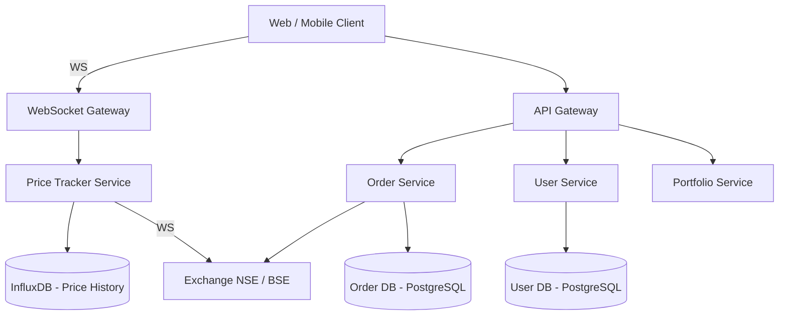
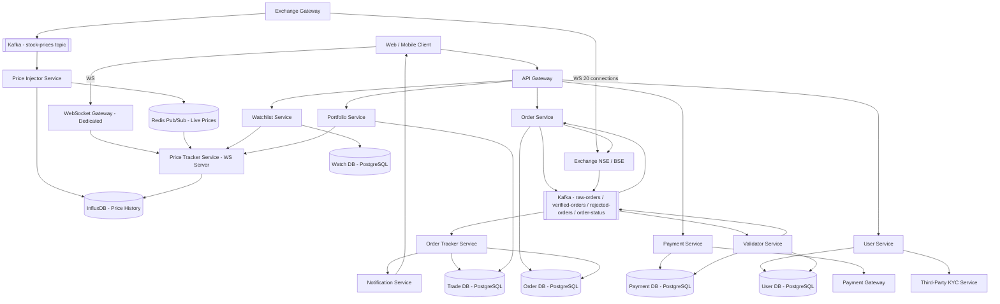
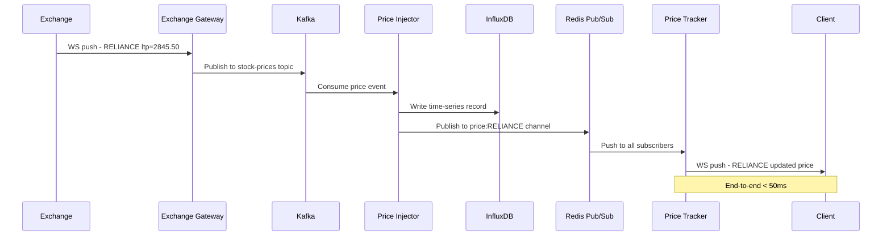
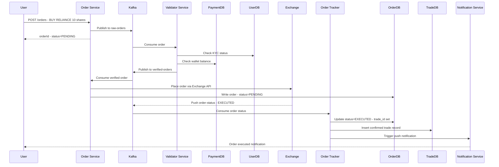

# Stock Broker Platform — Zerodha / Groww

> **Backend / Frontend Split: 85% Backend · 15% Frontend**
> The interesting engineering is in the backend: WebSocket-based real-time price streaming from the exchange, Kafka-buffered high-frequency order pipeline, order validation before hitting the expensive exchange API, two-phase order tracking (Order DB vs Trade DB), InfluxDB time-series for historical prices, and Redis pub/sub for fanout to millions of subscribers. Frontend is a standard WebSocket consumer — worth mentioning but not a deep focus.

---

## 1. What Is a Stock Broker Platform?

Zerodha and Groww are stock broker platforms: a user checks a stock's price, decides to buy or sell, places an order, and later checks their portfolio to see what it's worth. Before any of that, they prove who they are through KYC verification, since real money and financial regulation are involved from the very first tap.

A stock broker is **not** a stock exchange. NSE and BSE are where a share of RELIANCE actually changes hands — the exchange runs the matching engine that decides who buys from whom. The broker never touches that matching; it's the client-facing layer that streams prices, takes the order, forwards it to the exchange, and reports back what happened. Everything in this design sits in front of that black box: show prices, validate orders before they cost anything, forward what's valid, track status, and keep an accurate ledger of holdings and profit/loss.

---

## 2. A Day in the Life

Ravi opens the app a few minutes before the market opens at 9:15 AM. His watchlist is already on screen — RELIANCE, INFY, TATASTEEL — each price ticking gently as pre-market activity builds. He's been watching RELIANCE all week; this morning it's sitting at ₹2,845.50, right where he wanted to buy.

At 9:15 sharp, he taps **Buy — Market — 10 shares**. The app doesn't make him wait: within a moment it shows his order as "Pending," and RELIANCE's price keeps updating live underneath it, same as always. Behind the scenes, the app is checking that Ravi actually is who his KYC documents say he is, that the market is genuinely open, and that he has enough money in his wallet to cover ten shares at the current price — before it commits to spending a single rupee or bothering the exchange with a request that might fail anyway.

A couple of seconds later his phone buzzes: "Order executed — 10 shares of RELIANCE bought at ₹2,845.50." His wallet balance has dropped by exactly that amount — no more — even though he happened to place another order for INFY in almost the same instant. The app made sure only one of those two orders could touch his balance at a time, so he never risked spending money he didn't actually have.

Through the rest of the trading day, Ravi checks his portfolio a few times. Each time, it shows his RELIANCE holding's current value against what he paid for it — the unrealised profit or loss updating as the live price moves, without him ever refreshing the page or waiting more than a second or two for the number to catch up. By 3:30 PM, when the market closes, his order history shows the full trail: what he bought, when, at what price, and what it's worth right now.

That whole loop — watch a price, tap buy, get confirmed, see it reflected in a portfolio — is what the rest of this design has to make fast, correct, and impossible to get wrong with someone's money, at the scale of millions of Ravis doing exactly this in the same six-and-a-quarter hours every trading day.

---

## 3. Requirements — and Why They Matter

**Scope.** In scope: user registration with KYC, real-time and historical stock price feeds, order placement (market and limit orders), order validation, order tracking (pending → confirmed/rejected), portfolio P&L, watchlist, and wallet/fund management. Out of scope: the exchange's own matching engine (NSE/BSE internals), high-frequency trading algorithms, margin lending, and options/futures derivatives (worth mentioning as extensions, not designing here).

**Functional requirements:**

1. User registration with KYC verification (Aadhaar/PAN via a third-party KYC service)
2. View real-time stock prices, with under 50ms latency from exchange update to client screen
3. View historical stock price charts (intraday and multi-day)
4. Place buy/sell orders — market orders (execute at current price) and limit orders (execute at a target price)
5. Cancel pending orders
6. View all orders and their current status (pending / executed / rejected / cancelled)
7. Portfolio dashboard: holdings, positions, and P&L calculated against current price
8. Watchlist: save and monitor a custom list of stocks
9. Wallet: deposit funds, withdraw funds, view transaction history

<details markdown="1">
<summary><strong>Point to Ponder:</strong> Ravi places two orders — ₹7,000 for RELIANCE and ₹6,000 for INFY — within the same second, against a ₹10,000 wallet. What stops him overspending?</summary>

Nothing about reading his balance twice is unusual — the danger is that both orders could read "₹10,000 available" *before either one writes back a deduction*, and both would pass their individual funds check even though together they add up to more than he has. The fix is a row-level lock (`SELECT ... FOR UPDATE`) on his wallet during the funds check: the second order's check is forced to wait until the first order's transaction commits, so it sees the *already-reduced* balance, not the stale one. See §8.2 Deep Dives for the full walkthrough of why this matters and how the lock actually works.

</details>

<details markdown="1">
<summary><strong>Point to Ponder:</strong> A limit order for 100 shares only fills 30 of them today — is the user just stuck waiting indefinitely?</summary>

No — the order doesn't sit in one binary pending/done state. The exchange can acknowledge a fill in batches, and the Order Tracker updates the Trade DB incrementally as each batch confirms, keeping the order in a `PARTIALLY_FILLED` status until the remaining shares fill or the order expires. See §8.3 Deep Dives for how the pipeline handles this.

</details>

**Non-functional requirements — and why each one matters to a real user, not just as a target:**

| Requirement | Target | Why it matters |
|---|---|---|
| Stock price update latency | < 50ms from exchange event to client display | A price the user is looking at needs to still be *real* — a screen that's even a second stale can talk someone into buying or selling at a number that no longer exists. |
| Order placement latency | < 100ms from user submit to durable acceptance | Users judge responsiveness by how fast a tap turns into a visible "Pending" — a slow acknowledgement makes them wonder if the tap even registered, especially in a fast-moving market. |
| Availability | 99.9% during market hours (9:15 AM – 3:30 PM IST) | The app going down at 9:20 AM isn't a minor outage — every user who planned to buy or sell at that moment is locked out of their own money for as long as it lasts. |
| Consistency | High consistency over availability — money and stocks must never be in an inconsistent state | If a trade partially fails, a user can end up with money missing from their wallet and no stock to show for it — that's not a UX bug, it's a provable financial loss. |
| Order durability | Zero order loss — Kafka ensures at-least-once delivery | A dropped order isn't an inconvenience — it's a user who tapped Buy, believed it went through, and finds out later it never did (or worse, that it silently happened twice). |
| Historical data retention | 5+ years | Users pull up old trades for tax filing and dispute resolution long after the trading day is over — that history isn't recoverable after the fact if it's gone. |

**Consistency Model — CAP applied per domain:**

| Domain | Model | Justification |
|---|---|---|
| Order placement | Strong (CP) | Payment deducted ↔ stock allocated must be atomic. Inconsistency = financial loss. |
| User registration / KYC | Strong (CP) | Regulatory requirement — KYC status must be accurate before any trade |
| Portfolio P&L | Eventual | P&L recalculated on price changes — 1–2 second staleness acceptable |
| Price display | Eventual | Stock price is a market observable — slight delay acceptable, never misleading |
| Watchlist | Eventual | Low stakes — eventual consistency fine |

> [!IMPORTANT]
> This system prioritizes **consistency over availability** — the opposite of most consumer apps. Reason: if our system shows a trade succeeded but the exchange rejected it, the user has lost money from their wallet with no stock to show for it. Financial systems always choose CP over AP.

---

## 4. Scale, From First Principles

Before designing anything, it's worth establishing what these platforms actually deal with in volume — and letting the numbers, not intuition, pick the technology.

**Starting point:** roughly 50 million registered users, about 5 million of whom are active on a given trading day. Somewhere between 8,000 and 10,000 stocks are listed across NSE and BSE combined — that's the entire universe of things whose price this system has to track continuously.

**How often does a price actually change?** If every one of those ~10,000 stocks updates roughly once a second during market hours, that's **10,000 price events a second** the system has to move from exchange to screen — continuously, for the full 6.25-hour trading window (9:15 AM – 3:30 PM IST), every single trading day. That rate alone rules out anything that puts a general-purpose database in the hot path of a live tick — no disk-backed lookup belongs in a loop running that fast for that long.

**How many people are watching prices live at once?** If roughly 20% of the 5 million daily active users have the app open with a live connection at any given moment, that's **1 million concurrent WebSocket connections** the system has to hold open and fan updates out to, continuously.

**What about connecting to the exchange itself?** The exchange can't sensibly hold 10,000 separate connections open, one per stock — connections get grouped instead. At roughly 500 stocks per exchange WebSocket connection, **20 persistent connections** cover all 10,000 stocks. That's a small, fixed number the Exchange Gateway maintains all day — not one per user, and not one per stock.

**What about orders?** Market open is where volume spikes hardest: everyone who queued up an overnight order fires more or less simultaneously, pushing peak load to **100,000 orders a second** in that opening burst — dramatically higher than the steady trickle through the rest of the day.

**And historical storage?** Storing every price tick for every stock, for the full trading day, every trading day: 10,000 stocks × 1 update/sec × 6.25 hours × 250 trading days a year works out to roughly **56 billion rows a year**. That's an append-only, time-indexed write pattern with almost nothing in common with a typical transactional table.

**One structural constraint simplifies everything else:** this system runs single-region, with all infrastructure and all clients based in India. That's not a limitation so much as what makes the < 50ms price-latency and < 100ms order-latency targets achievable at all — a global, multi-region version of this platform would need a materially different architecture.

These numbers are what drive every major decision ahead: WebSocket over SSE (subscription changes are bidirectional and constant), InfluxDB for the 56-billion-row time-series price history, Kafka as the buffer standing between a 100K-orders/sec spike and the exchange's paid, rate-limited API, and Redis pub/sub to fan price updates out to a million live subscribers without ever touching disk.

---

## 5. High-Level Architecture

Remember Ravi's morning from the story above — a price he was watching, a tap that became a Pending order, a confirmation a couple of seconds later. Here's what actually makes that happen underneath.

A stock broker platform is really **three independent but interconnected flows** running at once, each with a different shape.

**The price feed flow** is the one Ravi is watching passively the whole time. The exchange pushes a tick — `{symbol: "RELIANCE", ltp: 2845.50, timestamp: ...}` — over one of the Exchange Gateway's 20 persistent connections. The Gateway publishes it straight to Kafka's `stock-prices` topic, partitioned by symbol so that every update for RELIANCE lands on the same partition and stays strictly ordered. From there, the Price Injector Service writes the tick to InfluxDB (the permanent historical record) and publishes it to a Redis pub/sub channel (`price:RELIANCE`) at the same time — two destinations, in parallel, for two different jobs. The Price Tracker Service subscribes to whichever Redis channels its connected users care about and pushes each update straight over their open WebSocket. Nothing in this path ever waits on a database write; the historical record happens alongside the live push, not before it.

**The order flow** is what fires the moment Ravi taps Buy. `POST /orders` lands at the API Gateway, which checks his JWT and rate-limits him to a handful of orders per second — a basic guard against a runaway client. The Order Service immediately generates a UUID order ID (which doubles as a client-side deduplication key later on) and writes the order to Kafka's `raw-orders` topic before doing anything else — that write is what makes the order durable the instant it's accepted, and it's why Ravi sees "Pending" back almost immediately rather than waiting on validation to finish. From there, the Validator Service consumes the order and runs the checks that actually decide whether it's real: is Ravi KYC-verified, is the market open, does he have the funds. A pass publishes to `verified-orders`; a fail publishes to `rejected-orders` and nothing further happens to his wallet. Only verified orders reach the Order Service's call to the Exchange Gateway — the single, deliberately narrow doorway this design uses to talk to the exchange at all (more on why in §8.4). Whatever the exchange decides comes back as an `order-status` event, which the Order Tracker Service consumes to update the Order DB, write a confirmed record to the Trade DB, and fire a notification — "Order executed — 10 shares of RELIANCE bought at ₹2,845.50" is that notification landing on Ravi's phone.

**The portfolio flow** is the quieter one Ravi checks between trades. The Portfolio Service reads only from the Trade DB — confirmed trades, never pending or rejected ones — and combines each holding with its current price from the Price Tracker to compute `(current_price − avg_buy_price) × quantity`. That result is cached in Redis for five seconds and invalidated the moment a new trade confirms, which is why Ravi's portfolio number updates within a second or two of a price move without the app hammering a database on every screen refresh.

### Core Design Principles

| Path | Optimized For | Mechanism |
|---|---|---|
| Fast Path | Price latency < 50ms | Exchange WebSocket → Kafka → Redis pub/sub → client WS — no DB in the hot path |
| Reliable Path | Zero order loss | Every order persisted in Kafka before processing; Order DB written before exchange call |

<details markdown="1">
<summary><strong>Point to Ponder:</strong> Funds get deducted from Ravi's wallet <em>before</em> the exchange even confirms the order. Why not wait for confirmation first?</summary>

Because the exchange doesn't guarantee an immediate rejection response — there's a real window where an order is live at the exchange but unconfirmed either way. If the broker didn't hold the funds during that window, Ravi could place a second order using the same money the first order is about to spend, and both could end up "succeeding" against funds that only exist once. Holding funds the moment an order is verified (not waiting for exchange confirmation) is what prevents that overselling — and if the exchange later rejects the order, the held amount is simply released back to the wallet, no harm done.

</details>

### From Simple to Evolved

The architecture starts simple and grows into the full pipeline as the pieces above come together — here's both versions.

### Simple Design



### Evolved Design (Full Pipeline)



### The Full Sequence

The diagrams above show the components; these two show the actual message sequence between them, end to end — one for the price feed Ravi watches passively, one for the order he places actively.





---

## 6. API Design

The API splits into four groups that mirror the four things a user actually does with this app — prove who they are, watch the market, trade, and manage money — because each of those has a genuinely different consistency and latency profile baked into how its endpoints behave.

**User & KYC**

| Method | Path | Description |
|---|---|---|
| POST | `/api/v1/users/register` | Register user. Triggers KYC flow with third-party service. |
| POST | `/api/v1/users/kyc` | Submit KYC documents. Calls external KYC provider (e.g., Aadhaar/PAN verification). Returns `kyc_verified` flag. |
| POST | `/api/v1/users/login` | Authenticate. Returns JWT. |

**Market Data**

| Method | Path | Description |
|---|---|---|
| GET | `/api/v1/stocks?page=&limit=` | Paginated list of all stocks with last known price. |
| WS | `/ws/prices?symbols=RELIANCE,INFY` | WebSocket connection. Client subscribes/unsubscribes to symbols over the same connection. Bidirectional — this is why WS over SSE. |
| GET | `/api/v1/stocks/:symbol/history?from=&to=&interval=` | Historical OHLCV data from InfluxDB. |

**Orders**

| Method | Path | Description |
|---|---|---|
| POST | `/api/v1/orders` | Place order. Body: `{ symbol, type: MARKET/LIMIT, side: BUY/SELL, quantity, price? }`. Returns `orderId` with status `PENDING`. |
| GET | `/api/v1/orders?status=&page=` | List user's orders. `userId` from JWT header — never in URL. |
| GET | `/api/v1/orders/:orderId` | Order detail with current status. |
| DELETE | `/api/v1/orders/:orderId` | Cancel a pending limit order. |

**Portfolio & Funds**

| Method | Path | Description |
|---|---|---|
| GET | `/api/v1/portfolio/holdings` | Current holdings with avg buy price + current price + unrealised P&L. |
| GET | `/api/v1/portfolio/positions` | Intraday positions. |
| POST | `/api/v1/funds/deposit` | Add funds to wallet. Calls payment gateway. |
| POST | `/api/v1/funds/withdraw` | Withdraw funds. Validates available balance. |

Two choices in this table aren't self-evident from the columns alone. First, `userId` is read from the JWT header on every order and portfolio call, never taken as a URL or body parameter — a user simply cannot construct a request that reads or cancels someone else's order, because the identity comes from something they can't forge. Second, `POST /orders` returns `PENDING` the instant the order is durably queued in Kafka — it does not wait for the exchange to respond. That's a deliberate asynchronous design (walked through fully in §8.3): the API contract is "your order is safely accepted," not "your order has executed," and the client discovers the real outcome later via `GET /orders/:orderId` or a push notification.

> [!TIP]
> **Interview tip on WebSocket vs SSE for price feed:** say it out loud as a subscription-management problem. "With SSE, every time a user wants to add a new stock to their view, the client has to close and reopen the connection with an updated symbol list. With WebSocket, they just send a subscribe/unsubscribe message over the connection that's already open." That one sentence is usually enough to justify the choice in an interview.

---

## 7. Data Model

Seven distinct pieces of data live in this system, and grouping them by how they're actually used — rather than as one flat list — makes each storage choice close to inevitable.

**The ephemeral, in-memory data is live price only.** A single tick's value has zero lasting importance the moment the next one arrives — nobody ever needs to query "what was RELIANCE's price four ticks ago" from this store, because that's what the historical record is for. Redis pub/sub (`price:{symbol}` → `{ltp, timestamp}`) fits because it has no persistence to pay for and delivers sub-millisecond fanout to every subscriber — exactly what a value with no future is worth building.

**The durable, financial data lives in PostgreSQL, because it's money and regulation.** User records need ACID guarantees around `is_kyc_verified`, since that flag gates every trade a user is allowed to place — the sensitive KYC documents themselves (PAN/Aadhaar) stay with the third-party KYC provider, encrypted, not in this table. Wallet transactions need the same guarantee for the obvious reason. Orders need it too: every state change from pending to executed has to be durable, and `trade_id` deliberately stays `null` until the exchange actually confirms — an order row existing is not the same claim as a trade having happened. That distinction is exactly why trades get their own table: Trade DB holds only exchange-confirmed executions, separately from the full order audit trail, and Portfolio P&L and end-of-day reconciliation both read Trade DB exclusively so a rejected or cancelled order can never quietly corrupt an average buy price (the full reasoning for keeping these two tables separate is in §8.5).

**The append-only, high-volume data needs a store built for exactly that shape.** At roughly 56 billion rows a year, stock price history would collapse a general-purpose relational database — InfluxDB is purpose-built for time-indexed, append-only writes and the range-based aggregation queries (OHLCV candles) this data actually gets queried with, including automatic downsampling as data ages.

**Watchlist is the one genuinely low-stakes entity**, and it's ordinary relational data: a user has many watchlists, each with many symbols, write volume is low, and the joins involved are simple — nothing here needs anything more specialized than PostgreSQL.

| Entity | Storage | Key Columns |
|---|---|---|
| User | PostgreSQL | `user_id`, `email`, `phone`, `name`, `is_kyc_verified`, `created_at` |
| Payment/Wallet | PostgreSQL | `transaction_id`, `user_id`, `amount`, `type` (DEPOSIT/WITHDRAW), `status`, `timestamp` |
| Order | PostgreSQL | `order_id`, `user_id`, `symbol`, `order_type` (MARKET/LIMIT), `side` (BUY/SELL), `price`, `quantity`, `status`, `trade_id`, `created_at` |
| Trade | PostgreSQL | `trade_id`, `order_id`, `user_id`, `symbol`, `quantity`, `executed_price`, `exchange_trade_id`, `status`, `timestamp` |
| Stock Price (time-series) | InfluxDB | `symbol` (tag), `timestamp`, `open`, `high`, `low`, `close`, `ltp`, `volume` |
| Live Price | Redis pub/sub | Channel: `price:{symbol}` → `{ ltp, timestamp }` |
| Watchlist | PostgreSQL | `watchlist_id`, `user_id`, `name` + `watchlist_items: watchlist_id, symbol` |

---

## 8. Deep Dives

### 8.1 Real-Time Price Feed — WebSocket vs SSE

Here's the problem: 10,000 stocks update roughly every second during market hours, and that needs to reach 1 million concurrent user connections in under 50ms — while users are constantly changing which stocks they're actually watching.

Polling doesn't survive contact with those numbers at all: a client calling `GET /stocks/RELIANCE/price` once a second, multiplied across 1 million users watching even one stock each, is 1 million HTTP requests a second for a single symbol — ten stocks each and it's 10 million requests a second, most of them returning a price that hasn't even changed. That's ruled out before any real design work starts.

Server-Sent Events looks more promising until the "constantly changing" part of the problem shows up. SSE is server-to-client only — the server can push, but the client has no channel to say "also send me TATA Steel now." The only way to change a subscription is to close the existing connection and open a new one with the updated symbol list. At 1 million concurrent connections, a reconnection storm on every single subscription change isn't a minor inefficiency, it's a stampede.

WebSocket solves this because it's a conversation, not a broadcast: one persistent connection stays open for a user's entire session, and adding or dropping a symbol is just a message — `{ action: "subscribe", symbols: ["RELIANCE", "INFY"] }` — sent over the connection that's already there. The same logic applies on the exchange side of the system, at a smaller scale: one WebSocket connection already covers 500 stock subscriptions, so subscribing to stock 501 is another message on that same connection, not a new TCP handshake. That's how 20 connections stay open all day covering all 10,000 stocks without ever reconnecting.

The price this pays is that WebSocket connections are stateful — the WebSocket Gateway has to actually remember which server holds which user's connection, which means sticky routing or a shared session map in Redis, more operational surface than SSE's "any server can handle any request" simplicity.

> [!NOTE]
> **Key Insight:** WebSocket vs SSE is fundamentally a subscription-management problem, not a bandwidth problem. SSE only lets the server push; the moment the client needs to say "change what I'm subscribed to" — which happens constantly in a trading app — a persistent, bidirectional connection stops being a nice-to-have and becomes a correctness requirement at this connection count.

---

### 8.2 Strong Consistency and Concurrency — Preventing Double Spend

This is the hardest domain-specific problem in this system, because unlike almost every other kind of app, there is zero tolerance for getting it wrong.

Here's the scenario that breaks a naive implementation. Ravi has ₹10,000 in his wallet and places two orders within the same second — ₹7,000 for RELIANCE, ₹6,000 for INFY. Each order, checked in isolation, looks fine: ₹10,000 covers ₹7,000, and ₹10,000 also covers ₹6,000. The problem is that both checks can run against the *same* ₹10,000 balance if neither order's write has committed yet by the time the other order reads. The first order reads ₹10,000, passes its check, and deducts ₹7,000, leaving the true balance at ₹3,000. But the second order also read ₹10,000 — before the first order's deduction was visible — passed its own check against that stale number, and now deducts ₹6,000 from what it still believes is a ₹10,000 balance, landing on ₹4,000. The stored balance ends up at ₹4,000, positive, while the actual math says Ravi has spent ₹13,000 he never had — a ₹3,000 hole the system's own records don't even show as a problem. In a system where a "bug" like this is a straightforward, provable loss of someone's money, this is not a UX defect to fix later — it has to be impossible by construction.

Most systems get to relax about this kind of thing. Facebook's feed can be a few seconds stale; email can take a moment to arrive. A stock broker doesn't get that luxury anywhere near money: the wallet balance and the stock allocation both have to be correct at all times, a trade must never be silently duplicated, and once the exchange confirms a trade, the Trade DB has to reflect it — no exceptions, no eventual catching-up.

The fix is a pessimistic lock, taken inside a single database transaction, on the exact row that's contested: the user's wallet balance. `SELECT ... FOR UPDATE` acquires a row-level exclusive lock the instant the Validator Service starts checking Ravi's funds. If a second order for the same user arrives while that lock is held, its own `SELECT ... FOR UPDATE` simply blocks — it cannot even read the balance until the first transaction commits. Once the first order commits (balance now ₹3,000), the second order's read unblocks, sees the accurate ₹3,000, fails its `>= ₹6,000` check, and gets rejected cleanly instead of silently overspending. The lock is only held for the few milliseconds a single-row update takes, so at the order rates a typical retail user generates, the serialization is invisible.

```sql
-- Validator Service, inside a single DB transaction:
BEGIN;
  SELECT balance FROM wallets WHERE user_id = ? FOR UPDATE;  -- acquires row lock
  -- second concurrent order blocks here until this transaction commits
  IF balance >= order_value THEN
    UPDATE wallets SET balance = balance - order_value WHERE user_id = ?;
    INSERT INTO held_funds (order_id, user_id, amount) VALUES (?, ?, ?);
  END IF;
COMMIT;  -- lock released here
```

The Validator doesn't immediately treat that deducted amount as spent, either. It moves `order_value` out of the spendable balance and into a `held_funds` record in the same transaction — money that's unavailable for new orders but not yet gone for good. Only once the exchange confirms `EXECUTED` does the held amount become a genuine, final deduction; if the exchange instead comes back `REJECTED`, the held amount moves straight back to the spendable balance. That two-step hold-then-settle is what keeps a user from actually losing money on an order the exchange never let through.

There's a second, related failure mode this same design guards against: sending the same order to the exchange twice, which would mean an actual double purchase. Every call to the exchange carries the order's UUID as an idempotency key:

```
Order Service → Exchange API call with header: Idempotency-Key: {order_id}
Exchange sees same order_id twice → ignores the second call, returns same result
```

If the Order Service crashes after sending the request but before receiving the acknowledgement, it simply retries with the same `order_id` on restart — the exchange recognizes the duplicate and returns the original result instead of executing it a second time.

The trade-off this design accepts is real: `SELECT ... FOR UPDATE` serializes every concurrent order from the same user, so two of Ravi's own orders literally cannot pass funds validation in parallel. For someone placing one or two orders a second, that's imperceptible. For an algorithmic trader firing hundreds of orders a second against their own account, this row lock would become a genuine throughput ceiling — which is why high-frequency traders in real systems are typically handled through a separate pre-allocated margin mechanism rather than this per-order lock path.

> [!NOTE]
> **Key Insight:** The `SELECT FOR UPDATE` row lock costs under 5ms of serialization per user — that's not a performance tax being paid reluctantly, it's the actual mechanism that makes "the balance is always correct" true. Removing it wouldn't just be a small optimization; it would remove the guarantee entirely.

---

### 8.3 Order Pipeline — High Frequency With Validation

Here's the problem: 100,000 orders a second arrive at market open, and every one of them has to be validated — KYC status, market hours, funds — before it's allowed anywhere near the exchange, because every exchange API call has a real cost attached to it. Each of those validation checks is a database lookup, and database lookups take time.

A synchronous pipeline — receive the order, run the checks against the User DB and Payment DB, call the exchange, then respond — falls apart under that load specifically because of where the time goes. Each DB lookup adds 5–10ms, so a synchronous round trip lands somewhere around 20–50ms per order even before contention; at 100,000 orders a second, the database itself becomes the bottleneck, and if the validating service goes down mid-request, whatever order it was holding is simply gone.

The fix is to stop making the user's request wait on any of that. The Order Service's only job on the way in is to write the order to Kafka's `raw-orders` topic and return `PENDING` — a durable, cheap operation that happens before a single validation check runs, which is why the response the user sees is fast regardless of how backed up validation is behind it. The Validator Service then consumes from that topic at whatever pace it can actually sustain, completely decoupled from how fast orders are arriving, and only orders that pass its checks ever generate an exchange API call — rejected orders never touch that expensive, rate-limited external dependency at all. Once the exchange responds, the Order Tracker Service consumes the resulting `order-status` events and reconciles them back into the Order DB and Trade DB.

```
User → Order Service → Kafka (raw-orders) → Validator Service
                                                    ↓
                                        Kafka (verified-orders OR rejected-orders)
                                                    ↓
                                           Order Service → Exchange
                                                    ↓
                                        Kafka (order-status from Exchange WS)
                                                    ↓
                                            Order Tracker → Order DB + Trade DB
```

Limit orders complicate the "confirmed" step, because a single order doesn't always resolve in one shot. A limit order for 100 shares might fill 30 now and the remaining 70 over the following fifteen minutes, in whatever batches the exchange's matching engine actually produces. The Order Tracker handles each partial fill acknowledgement as its own event, updating the Trade DB incrementally rather than waiting for a single final number, and the order's status stays `PARTIALLY_FILLED` the entire time — it only moves to fully executed once every share is accounted for, or expires if it never fills completely.

The trade-off this pipeline accepts is that order placement and order confirmation are no longer the same moment: a user can legitimately see `PENDING` for a few seconds while validation and the exchange round trip complete behind the scenes. That's an accepted, standard behavior in real-world brokers, not a bug to hide — the strong consistency guarantee that actually matters (funds deducted matches stock allocated) is maintained by the locking mechanism in §8.2, independent of how long the exchange itself takes to respond.

> [!NOTE]
> **Key Insight:** Writing every order to Kafka before any processing happens is what makes a Validator Service crash a non-event. On restart, it simply resumes from its last committed Kafka offset — nothing in flight was ever only in memory, so nothing in flight is ever lost.

---

### 8.4 Exchange Gateway — Why a Dedicated Proxy

Here's the problem: several different internal services legitimately need to talk to the exchange — the Price Tracker needs live feeds, the Order Service needs to place orders, the Order Tracker needs to receive confirmations. If each of them opened its own connection to the exchange independently, the result is uncontrolled connection sprawl against an API that charges per connection and per request.

The fix is to let exactly one service own all exchange communication. The Exchange Gateway manages the 20 WebSocket connections that carry the price feed, routes every order placement request from the Order Service, and receives every order status callback — no other internal service talks to the exchange directly; they either go through the Gateway or consume from the Kafka topics it publishes into.

That centralization matters for reasons beyond tidiness. Exchange API access in India is billed per connection and per request, running into crores a month for a broker at this scale, so a single choke point is also the natural place to apply rate limiting, deduplicate unnecessary calls, batch where the exchange allows it, and get one unified view of exchange connectivity health instead of piecing it together from several services independently.

> [!NOTE]
> **Key Insight:** The Exchange Gateway is the same pattern as an API Gateway, applied to an expensive external dependency instead of internal traffic — it exists so that no internal service can accidentally spam a paid API and turn a bug into a bill.

---

### 8.5 Trade DB vs Order DB — Why Two Tables

Here's the problem: an order can end up rejected by the Validator before it ever reaches the exchange, cancelled by the user, partially filled, or fully executed — but Portfolio P&L only ever wants to know about shares that actually, confirmedly changed hands, and end-of-day reconciliation with the exchange needs exactly that same clean list.

Order DB is the full audit trail: every order ever placed lands here, including ones the Validator rejected before the exchange ever saw them, with `trade_id` staying `null` until the exchange actually confirms a fill. Trade DB is narrower and stricter — only orders the exchange itself acknowledged as executed get a row here, each carrying an `exchange_trade_id` that ties it back to the exchange's own settlement record. Portfolio Service reads exclusively from Trade DB, so a rejected or cancelled order is structurally invisible to it, and end-of-day reconciliation compares Trade DB directly against the exchange's settlement report.

Collapsing these into one table would corrupt the one calculation this whole separation exists to protect: P&L is `(current_price − avg_buy_price) × quantity`, and `avg_buy_price` is computed purely from Trade DB. Let a rejected or cancelled order leak into that average, and every P&L number built on top of it is wrong.

> [!NOTE]
> **Key Insight:** Order DB is the broker's internal audit trail. Trade DB is financial truth — what actually happened at the exchange. Portfolio P&L, reconciliation, and regulatory reporting all read Trade DB exclusively, and never Order DB, on purpose.

---

## 9. Bottlenecks & Scaling

The numbers worth anchoring every decision below to: 50 million registered users, 5 million daily active; a peak of 100,000 orders a second at 9:15 AM market open — roughly 50 times the order rate at 2:00 PM the same day; 10,000 price events a second during market hours and zero outside them; 1 million concurrent WebSocket connections; 56 billion InfluxDB rows accumulating every year; and effectively zero downtime tolerance during market hours, since a 30-second outage at 9:15 AM costs a broker real commissions and real user trust in a single stroke.

The 9:15 AM spike is the hardest engineering problem in this entire design, precisely because it isn't gradual — every pre-placed overnight order flushes into the system in the same few seconds. Kafka is the only reason that burst doesn't take the Validator Service down with it: the queue absorbs the spike instantly, and validation proceeds at whatever pace the consumers can actually sustain, not at whatever pace orders happen to be arriving.

At ten times today's scale, the Price Injector is the first thing under real pressure, moving from 10,000 to 100,000 stock updates a second. Kafka handles that by adding more partitioned consumers, since the topic is already partitioned by symbol; Redis pub/sub, which comfortably handles roughly a million pub/sub messages a second on a single node today, would need to move to a Redis Cluster with consistent hashing on channel name at the extreme end; and InfluxDB scales by adding nodes and sharding by symbol prefix.

The Order Service faces a parallel jump, from 100,000 to 1 million orders a second. Kafka absorbs the ingestion side by adding partitions to `raw-orders`, and the Validator Service scales out horizontally as just another Kafka consumer group. Order DB shards by `user_id`, which works cleanly because every order query is already scoped to a single user. The one piece that doesn't scale by adding infrastructure is the exchange itself — it has its own rate limits regardless of how much broker-side capacity exists, so at this scale the broker has to actively throttle its own order flow to stay under those limits rather than simply scaling out and hoping.

WebSocket connections are the third pressure point, growing toward 10 million concurrent. A dedicated WebSocket Gateway cluster, with each node handling roughly 100,000 connections, is the base scaling move; Redis pub/sub handles cross-node fanout so a price update landing on one node still reaches a subscriber connected to a different node; and sticky session routing (or a shared Redis session map) keeps a reconnecting user landing back on a server that actually knows about them.

Portfolio P&L, finally, scales on the read side rather than the write side. P&L snapshots are cached in Redis as `portfolio:{userId}`, five-second TTL, invalidated the moment a new trade confirms — and InfluxDB's own downsampling keeps old historical queries cheap regardless of scale, collapsing to minute-level candles beyond a month old and daily candles beyond a year old.

---

### 9.1 Failure Scenarios

The recovery story splits cleanly by what actually failed: the exchange-facing edge of the system, the Kafka-buffered processing path, the durable data stores, financial edge cases, and the load spike itself each fail — and recover — differently.

On the exchange-facing edge, an exchange WebSocket dropping pauses the price feed but doesn't touch order acceptance — the Exchange Gateway reconnects immediately, InfluxDB keeps serving the last known prices in the meantime, and the client shows a "Delayed data" indicator rather than a stale number with no explanation. A straightforward exchange rejection is handled the same way every rejection is: the Order Tracker marks the order `REJECTED`, funds were never actually deducted, and the user gets a notification with the reason. A true exchange timeout — no acknowledgement at all — triggers a retry with the same `order_id`, relying on the idempotency key from §8.2 so the exchange deduplicates rather than double-executing; after three retries with no response, the order is marked `STUCK` and ops is alerted, with a nightly reconciliation job comparing the Order DB against the exchange's own settlement report to catch anything that still slipped through.

On the Kafka-buffered processing path, nothing is ever actually lost, only delayed. A Kafka broker going down (out of a cluster of three or more, replication factor three) pauses processing but loses no messages — orders resume the moment the broker recovers. A Validator Service crash just means orders queue up in `raw-orders`; the consumer group resumes from its last committed offset, and the same idempotent `order_id` check that prevents duplicate exchange calls also makes at-least-once redelivery safe here. An Order Service crash after the Validator has already published to `verified-orders` but before the exchange call went out resolves the same way — the service re-consumes on restart and re-sends, with the idempotency key preventing a duplicate at the exchange. And an order stuck in `PENDING` because of exactly this kind of crash or Kafka lag isn't left to sit forever: any order still `PENDING` past 30 seconds gets flagged by the reconciliation job for manual review.

On the durable stores themselves, an Order DB primary failing pauses new order-status writes only briefly — PostgreSQL read replicas stay available for reads, and Multi-AZ auto-failover promotes a replica with only a short write pause during the transition. An InfluxDB outage takes down historical price charts specifically — real-time prices keep flowing over Redis pub/sub completely unaffected — and the UI simply shows "Historical data unavailable" until it's restored.

Two financial edge cases get their own explicit handling because silent money is the one thing this system cannot tolerate. A partial execution — 30 of 100 limit-order shares filled — is handled incrementally by the Order Tracker exactly as described in §8.3, staying `PARTIALLY_FILLED` until the remainder fills or the order expires. Funds deducted with a failed exchange call is the scarier case on paper but not in practice: the money never left the system, it just sits in the `held_funds` table with the order marked `EXCHANGE_ERROR`, the reconciliation job detects the mismatch and auto-releases the hold back to the wallet, and every state transition along the way is written to an audit log for dispute resolution.

Finally, the 9:15 AM spike itself: when the Validator Service is genuinely overwhelmed by the full 100,000-orders-a-second burst, Kafka is what keeps the front door open — the Order Service keeps accepting orders and returning `PENDING` regardless of how backed up validation is, the Validator's consumer group auto-scales via Kubernetes HPA against Kafka consumer lag, and the backpressure this creates shows up to users as a delayed confirmation, never as an error.

---

### 9.2 Trade-offs

### WebSocket vs SSE for Price Feed

The two differ across almost every dimension that matters here. WebSocket is bidirectional; SSE is server-to-client only. Changing a subscription on WebSocket is a message on the existing connection; on SSE it means closing and reopening the connection entirely, which is also where SSE's reconnect cost balloons compared to WebSocket's near-zero cost for the same change. The one place SSE wins outright is connection overhead — a plain HTTP connection is lighter than a persistent TCP one — and both are universally supported by browsers, so that's not a factor either way.

**Chosen:** WebSocket — dynamic subscription changes (a user opening a different stock's chart) demand bidirectional communication, and SSE's reconnect storm at 1 million concurrent connections is not a cost this system can absorb.

> [!NOTE]
> **Key Insight:** The trade-off actually being accepted here isn't about the mechanism being right — it's the operational cost of the mechanism being right: stateful connections mean the WebSocket Gateway has to maintain session state, requiring sticky routing or a Redis session map, real infrastructure SSE would never have needed.

---

### InfluxDB vs PostgreSQL for Stock Prices

The two aren't close on the dimension that matters most here: InfluxDB sustains over a million points a second per node, where PostgreSQL tops out around 50,000 rows a second. InfluxDB's query model is built around time-range aggregations — exactly what an OHLCV candle query is — where PostgreSQL offers general-purpose SQL with no particular advantage for that access pattern. Storage compounds the gap further: InfluxDB compresses time-series data automatically, where PostgreSQL's row-based storage is comparatively inefficient for the same shape of data, and InfluxDB's downsampling is a built-in continuous query where PostgreSQL would need hand-rolled batch jobs to do the same aging-out. The one thing PostgreSQL wins on is operational simplicity — InfluxDB is a second, less familiar system to run well.

**Chosen:** InfluxDB — at roughly 56 billion rows a year, PostgreSQL would require extreme sharding just to survive the write rate, and would still be a poor fit for range-based aggregation once it got there. InfluxDB is purpose-built for precisely this access pattern.

> [!NOTE]
> **Key Insight:** Time-series data has two properties general-purpose databases handle poorly: extremely high append-only write throughput, and queries that are almost always range-based aggregations rather than point lookups. InfluxDB is built around exactly those two properties — OHLCV queries over billions of rows come back sub-second.

---

### Strong Consistency vs Latency (the core fintech trade-off)

Strong consistency (CP) guarantees the wallet balance is always correct and never negative, order deduplication is enforced through the idempotency key and a DB constraint, and any failure shows up as a safely rejected order — at the cost of higher read latency (lock acquisition, quorum reads) and lower write throughput, since writes to the same user's wallet are serialized. Eventual consistency (AP) inverts every one of those trade-offs: lower latency, higher throughput, no coordination overhead — but it opens a real double-spend window and can let a bad order through as an accepted-but-wrong outcome instead of a clean rejection.

**Chosen:** Strong consistency for all financial state — wallet, orders, trades. Eventual consistency is reserved for the non-financial display layer: P&L calculations, portfolio UI, price charts.

> [!NOTE]
> **Key Insight:** This is the opposite of Facebook's default. Facebook chooses AP because a two-second-stale feed costs nothing. A trading platform chooses CP because ₹10,000 deducted twice is a legal liability, not a UX hiccup. The CAP choice has to follow the actual consequence of being wrong, not a general architectural preference.

---

### Sync vs Async Order Processing

A synchronous pipeline gives lower user-facing latency — a direct response, no waiting on a queue — but it loses an order outright if the service handling it crashes mid-request, and every single order hits the exchange's paid API regardless of whether it was ever going to be valid. The async version accepted here trades that immediacy for durability: Kafka gives at-least-once delivery, so nothing is lost to a crash, only validated orders ever reach the exchange (saving real money on API calls), and each stage of the pipeline scales independently instead of the whole thing being bottlenecked by however fast the validation database can respond.

**Chosen:** Async — every exchange API call has a real cost, and this pipeline guarantees only orders that actually pass validation ever generate one, while durably queuing every order the instant it arrives regardless of how fast downstream processing is running.

> [!NOTE]
> **Key Insight:** In a stock broker, async order processing isn't purely a performance choice — it's a cost-control mechanism. Every unnecessary exchange API call is a direct financial expense, and the Kafka buffer plus Validator layer is what stands between "every order" and "only the orders that deserve to reach the exchange."

---

## Frontend Design (15% of this system — your differentiator)

> A trading frontend is the most latency-sensitive UI in consumer software. Every millisecond of price update delay is visible to users. The frontend engineering is about streaming, rendering performance, and state management under continuous mutation.

### WebSocket Price Streaming

**Problem:** 10,000 stocks updating every second. Client is viewing 5–10 stocks at a time. Don't stream all 10K — subscribe to only what's visible.

```
On component mount (stock chart opens):
  ws.send({ action: "subscribe", symbols: ["RELIANCE", "INFY"] })

On component unmount (user navigates away):
  ws.send({ action: "unsubscribe", symbols: ["RELIANCE"] })

On WS message:
  dispatch({ type: "PRICE_UPDATE", symbol: "RELIANCE", ltp: 2845.50 })
```

- One WebSocket connection for the entire app session — not per chart, not per page
- Subscribe/unsubscribe messages sent over the same connection (why WS over SSE)
- Redux slice `priceSlice` holds `{ [symbol]: { ltp, change, changePercent } }` — all charts read from this single source
- On WS disconnect: reconnect with exponential backoff + re-send full subscription list

### Candlestick Chart Rendering

**Problem:** A 60-day intraday chart has ~58,000 candles (1 per minute × 6.25 hrs × 60 days). Rendering 58K SVG/canvas elements = 15fps on any device.

**Solution — time-windowed rendering + downsampling:**
```
User selects "1D" view → fetch 1-min OHLCV candles (375 candles) from InfluxDB
User selects "1W" view → fetch 5-min candles (375 candles, downsampled server-side)
User selects "3M" view → fetch 1-hour candles (375 candles, downsampled server-side)
```
- Always render ~375 candles regardless of time window — server-side downsampling in InfluxDB continuous queries
- Live candle: the last candle on the chart is updated in-place by WebSocket ticks (update `close`, `high`, `low` without re-fetching history)
- Render with `<canvas>` not SVG — canvas handles 375 draw operations at 60fps; SVG at this density causes layout thrash

### Optimistic UI for Order Placement

**Problem:** Order goes through Kafka async pipeline — PENDING confirmation can take 1–3 seconds. User taps Buy and sees nothing for 3 seconds = feels broken.

**Solution:**
```
User taps BUY
  → Immediately show order in "Pending" state in Orders list (optimistic insert)
  → Immediately grey out wallet balance by order amount (optimistic deduction UI)
  → POST /orders fires in background

On WebSocket order-status event:
  → status=EXECUTED: update order row to "Executed", show green tick, play sound
  → status=REJECTED: remove optimistic entry, restore wallet display, show error toast
```
- Optimistic state lives in a separate Redux slice (`pendingOrders`) — not mixed with confirmed orders
- On app refresh / WS reconnect: `GET /orders?status=PENDING` reconciles optimistic state with server truth

### Order Status Tracking (Real-Time)

**Problem:** User wants to know when a limit order fills — could be minutes or hours after placement.

**Solution:**
- Order detail page maintains a WebSocket subscription to `order-status:{orderId}` channel
- Server pushes updates: PENDING → PARTIALLY_FILLED → EXECUTED
- Each status change animates a step indicator (progress bar through lifecycle states)
- On EXECUTED: confetti animation + sound — reinforces the action completed

### Caching Recent Stock Data

**Problem:** User switches between stocks frequently. Re-fetching OHLCV history from InfluxDB on every chart open = 150–300ms latency per switch.

**Solution — client-side LRU cache:**
```javascript
// In-memory LRU cache, max 20 stocks
const chartCache = new LRUCache({ max: 20, ttl: 5 * 60 * 1000 }) // 5 min TTL

async function fetchChart(symbol, interval) {
  const cached = chartCache.get(`${symbol}:${interval}`)
  if (cached) return cached          // instant
  const data = await api.getHistory(symbol, interval)
  chartCache.set(`${symbol}:${interval}`, data)
  return data
}
```
- TTL = 5 minutes — acceptable staleness for historical candles
- Live candle always updated via WebSocket regardless of cache
- Watchlist pre-warms: when user opens watchlist, prefetch charts for top 5 stocks in background

### CDN for Static Assets + Market Data

| Asset | Strategy |
|---|---|
| Company logos, icons | CDN with immutable cache headers (content-hash filenames) |
| Stock metadata (name, sector, ISIN) | CDN with 24h TTL — changes rarely |
| Historical OHLCV data (> 1 month old) | CDN-cached via InfluxDB read replica — never changes |
| Live prices | Never CDN — WebSocket direct from Price Tracker |
| Order status | Never CDN — WebSocket direct from Order Tracker |

---

## 10. Evaluation: Did We Meet the Requirements?

Six non-functional requirements were set out in §3. Here's how the design actually satisfies each one — the specific mechanism doing the work, not just a restatement of the promise.

**Price latency (< 50ms):** The entire price path is fast-path only — Exchange WebSocket → Kafka → Redis pub/sub → client WebSocket — with no database read or write blocking any hop. The InfluxDB write happens in parallel with the Redis publish (§5), never before it, so historical durability never taxes the number a live user is actually staring at.

**Order latency (< 100ms):** This target holds for the part of the flow that's genuinely synchronous: the Kafka write that durably accepts the order and returns `PENDING` to the client. Full exchange confirmation is deliberately asynchronous (§8.3) — the < 100ms promise is about the order being safely and durably *accepted*, not about the exchange having executed it yet, and that distinction is the entire reason the API returns `PENDING` rather than making the user wait.

**Availability (99.9% during market hours):** Kafka's replication factor of 3 means a broker failure never loses in-flight orders, and PostgreSQL's Multi-AZ failover recovers a lost primary with only a brief write pause (§9.1). Because the price feed and the order pipeline are two separate flows, a failure in one doesn't take the other down with it.

**Consistency (money and stock never inconsistent):** This is the requirement the whole design bends around. `SELECT ... FOR UPDATE` makes the wallet-balance check-and-deduct atomic per user (§8.2), the funds-hold pattern means a rejected order never actually costs the user money, and the idempotency key on every exchange call rules out an accidental duplicate trade. Everything financial is strongly consistent; only the display layer (P&L, watchlist, price charts) is allowed to be eventually consistent.

**Order durability (zero loss):** Every order is written to Kafka before any processing touches it at all — not after validation, not after the exchange call, before either. A crash anywhere downstream of that write just means replaying from the last committed Kafka offset, with the idempotent `order_id` check making that replay safe rather than a source of duplicates.

**Historical data retention (5+ years):** InfluxDB's append-only, time-indexed storage absorbs the roughly 56 billion rows a year this system generates, with built-in downsampling keeping years-old data queryable without the storage cost growing without bound.

| Requirement | Technique |
|---|---|
| Price latency < 50ms | Fast path with no DB read/write in the hot loop; InfluxDB write happens in parallel, not before |
| Order latency < 100ms | Kafka write is the synchronous, durable part; exchange confirmation is deliberately async |
| Availability 99.9% | Kafka replication factor 3; PostgreSQL Multi-AZ failover; independent price/order flows |
| Consistency — money never wrong | `SELECT FOR UPDATE` row lock, funds-hold pattern, idempotency key on exchange calls |
| Zero order loss | Kafka write before any processing; idempotent replay from last committed offset |
| 5+ years historical retention | InfluxDB append-only time-series storage with built-in downsampling |

---

## 11. Conclusion

This design treats a stock broker as three concurrent flows layered in front of one expensive, authoritative black box: a low-latency price feed nobody can afford to block with a database write, an order pipeline that has to be both durable and cheap to the exchange, and a portfolio view that only ever trusts confirmed trades. The hardest problem wasn't the price feed's throughput — it was making the wallet-and-order path impossible to get wrong under real concurrency, without slowing every other order down to guarantee it. Every other decision in this design — Kafka before validation, a single Exchange Gateway, Order DB split from Trade DB — exists in service of that one non-negotiable fact: the broker's job is to validate, forward, track, and display, and it can never let its own convenience touch someone else's money.

---

## 12. Interview Summary

### Key Decisions

| Decision | Problem it solves | Trade-off accepted |
|---|---|---|
| WebSocket over SSE | Dynamic stock subscription changes without reconnects | Stateful connections — need sticky sessions or Redis session map |
| Exchange Gateway (single proxy) | Centralised, controlled, cost-managed exchange access | Single point of failure — mitigated with multi-instance deployment |
| Kafka buffer before order processing | Durability at 100K orders/sec; decouple validation from ingestion | Async = user sees PENDING before EXECUTED; eventual confirmation |
| InfluxDB for price history | 56B rows/year time-series — PostgreSQL can't handle this write rate | Higher operational complexity; separate query language |
| Redis pub/sub for live prices | Sub-millisecond fanout to 1M subscribers | Ephemeral — no message persistence; replay not possible |
| Trade DB separate from Order DB | Clean separation: all orders vs exchange-confirmed trades | Extra DB to maintain; sync logic in Order Tracker |

### Fast Path vs Reliable Path

```
PRICE FAST PATH (optimised for < 50ms latency)
  Exchange WS push
      │
  Exchange Gateway → Kafka (no DB write in hot path)
      │
  Price Injector → Redis pub/sub (in-memory, sub-ms)
      │
  Price Tracker → WebSocket → Client
  (InfluxDB write is async, does not block the hot path)


ORDER RELIABLE PATH (optimised for zero loss + consistency)
  User places order
      │
  Order Service → Kafka raw-orders (durable before any processing)
      │
  Validator (KYC + funds) → Kafka verified-orders
      │
  Order Service → Exchange API (only validated orders touch exchange)
      │
  Exchange acknowledgement → Kafka order-status
      │
  Order Tracker → Order DB + Trade DB + Notification
  (every state change is persisted before notifying user)
```

### Key Insights Checklist

- "Broker ≠ Exchange. The exchange is a black box with paid APIs. The broker's job is validate, forward, track, display. Every unnecessary exchange call costs money — the Kafka buffer + Validator layer is a cost control mechanism, not just a scaling choice."
- "The order lifecycle is: Place → Validate (KYC + funds with SELECT FOR UPDATE) → Hold funds → Exchange call → Ack → Execute + deduct → Notify. Every step has a Kafka topic and a DB write. Nothing is fire-and-forget."
- "Strong consistency for money, eventual for display. Wallet balance uses pessimistic locking — SELECT FOR UPDATE serialises concurrent orders per user. P&L calculations use eventual consistency — 2-second staleness is fine. The CAP choice follows the failure mode consequence."
- "Double-spend prevention is SELECT FOR UPDATE on the wallet row. Two simultaneous orders: second one blocks at the lock, reads the reduced balance after first commits, fails the funds check. This is a correctness guarantee, not a pessimisation."
- "Exchange timeout → retry with same order_id (idempotency key). Exchange deduplicates. Nightly reconciliation job compares Trade DB against exchange settlement report — any drift triggers automatic correction."
- "The 9:15 AM market open is the hardest engineering problem. 100K orders/sec simultaneously. Kafka is the only reason this doesn't crash the system — it absorbs the burst and validators consume at their own pace."
- "WebSocket over SSE because subscription changes are bidirectional. SSE = new connection on every subscribe change. At 1M connections, reconnect storms are catastrophic. WebSocket = subscribe message on same connection, no reconnect."
- "Candlestick charts render ~375 candles regardless of time window — server-side downsampling in InfluxDB. Always 375 candles at 60fps. Rendering 58K candles for a 60-day view = 15fps. The downsampling is the performance feature."
