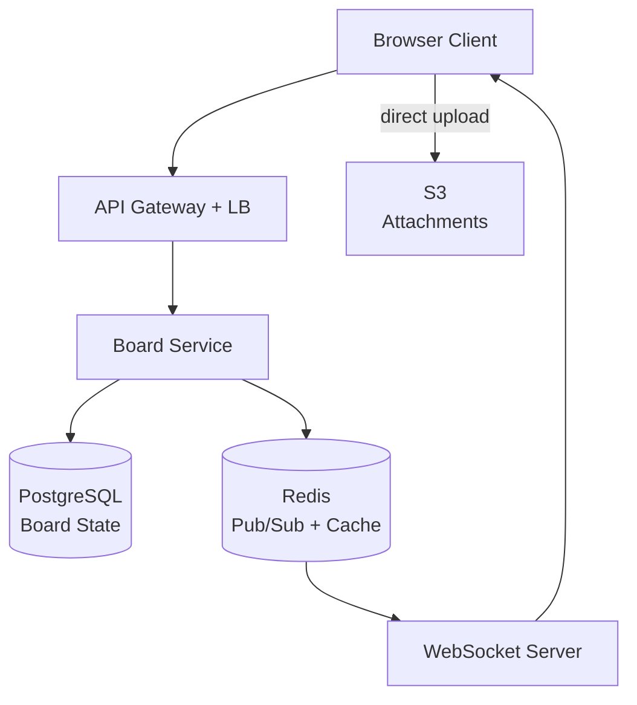
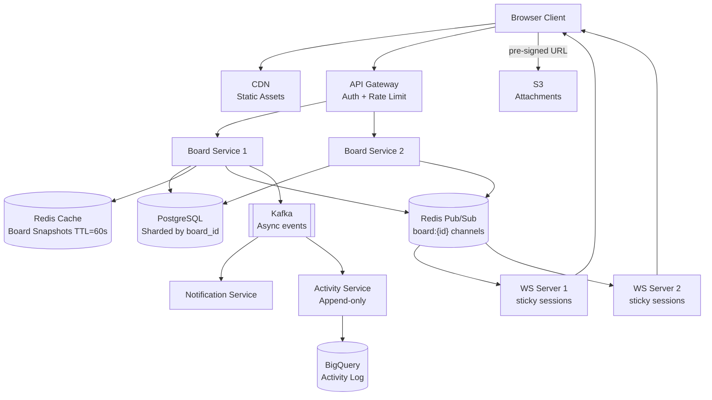
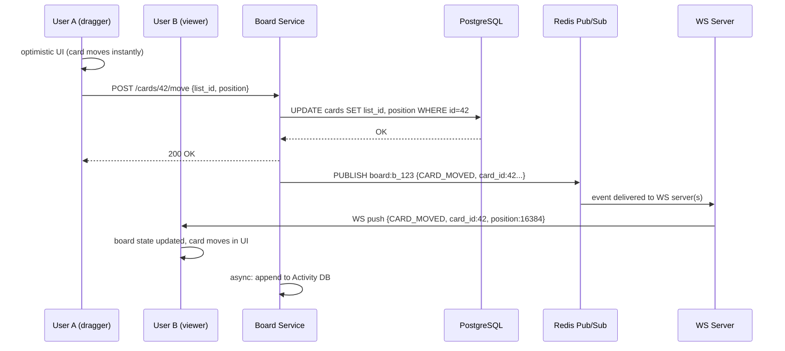
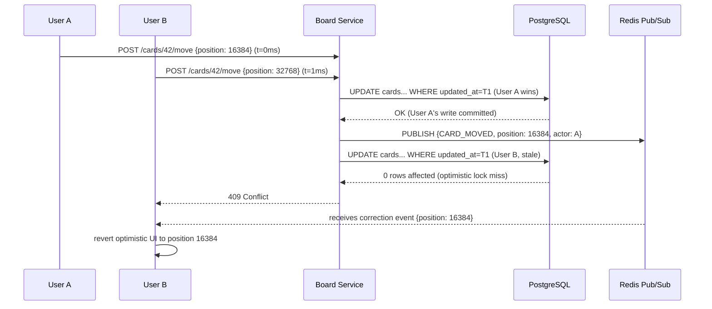

# Trello / Issue Manager System Design

---

## 1. What Is Trello / Issue Manager?

Trello (and Jira-lite tools like it) is a kanban board: a team lays out its work as cards — "Design mockups," "Fix login bug," "Write release notes" — and drags those cards across columns like "To Do," "In Progress," and "Done" as the work moves forward. Several people usually share the same board at once, adding cards, commenting, assigning teammates, and reordering things throughout the day.

The part that makes this hard isn't storing a list of cards — that's a CRUD app anyone could build in an afternoon. It's that several people are looking at and changing the *same* board at the *same* time: one teammate drags a card while another is renaming the list it's sitting in, and both of their screens have to end up agreeing on what the board actually looks like, within a couple hundred milliseconds, without either of them noticing anything went wrong. Keeping everyone's screen in sync while cards are constantly being dragged, edited, and reordered underneath them is the real engineering problem this design solves.

---

## 2. A Day in the Life

Maya is running the standup for Sprint 14. She opens the board, drags "Fix login bug" from "In Progress" to "Done," and the card slides into its new column instantly on her screen — she doesn't wait for anything to spin.

Devon, a teammate joining the call from a coffee shop, has the same board open on his laptop. A moment after Maya lets go of the card, it slides into "Done" on his screen too, without him refreshing the page or doing anything at all. He just watches it happen, the way you'd watch someone else's cursor move in a shared document.

Later that morning, Maya adds a comment on a card — "@Devon can you review this before EOD?" — and hits submit. Devon's phone buzzes a few seconds later with a notification. Neither of them thinks about how that happened; it just does, the same way the drag did.

In the afternoon, Priya — who only has viewer access to this board — opens it to check progress. She can see every card and every column, but there's no drag handle under her cursor and no "add card" button visible to her; the board simply doesn't offer her actions she isn't allowed to take.

Toward the end of the day, Maya and Devon both reach for the same card at almost the same instant — Maya to move it to "Done," Devon to move it back to "In Progress" because he spotted a regression. Only one of those moves can win. A second later, both of their screens agree on the same answer: the card ends up wherever the winning move put it, and the loser's screen quietly corrects itself — no error dialog, no "someone else already changed this," just the board settling into one true state.

None of this — the instant drag, the live update on Devon's screen, the notification, the vanishing "add card" button for Priya, the two simultaneous moves resolving into one — required anyone to think about a database, a queue, or a WebSocket connection. Everything from here on is how that actually gets built.

---

## 3. Requirements — and Why They Matter

**Scope.** In scope: boards, lists, and cards (create/update/delete plus drag-and-drop reorder), real-time multi-user sync, comments, labels, due dates, assignments, an activity feed, file attachments, notifications, and role-based access control. Out of scope: Gantt charts, advanced reporting/analytics, time-tracking, and billing/subscription management.

**Functional requirements:**

1. Create, update, and delete boards, lists, and cards
2. Drag-and-drop cards within and across lists — reordering a list of cards without renumbering every other card in it is a real problem in its own right (see §8.1)
3. Real-time sync — every board member sees a mutation within roughly 200ms, no matter how many other people are on the board at the same time
4. Card details: title, description, labels, due date, assignees, checklist, attachments
5. Comments on cards, including @mentions
6. Activity feed per card and per board (an audit log of who did what)
7. Board member management — invite, and assign a role of admin, member, or viewer — with each role's permissions actually enforced, not just displayed
8. Notifications for a mention, a due-date reminder, or being assigned to a card

<details markdown="1">
<summary><strong>Point to Ponder:</strong> Two users drag the same card at (almost) the same instant — who wins, and what does the loser see?</summary>

The system doesn't try to merge the two moves — it lets the server pick a winner and tells the loser to revert. Whichever write reaches the database first commits; the second one is rejected because it's holding a now-stale version of the card, and its client receives a correction event telling it where the card actually ended up. The losing user sees their card animate back to the winning position — a small visual "snap," not an error. See §8.2 for exactly how the server tells the two writes apart.

</details>

<details markdown="1">
<summary><strong>Point to Ponder:</strong> How do you insert a card between two existing cards without rewriting the position of every other card in the list?</summary>

Positions aren't stored as consecutive integers (1, 2, 3…) — they're stored as floating-point numbers, and a new card dropped between two others just gets the midpoint of their two values. That turns "insert a card" into a single-row write instead of an operation that touches — and re-broadcasts — every card after it. See §8.1 for the full mechanism, including what happens when you run out of room between two numbers.

</details>

**Non-functional requirements — and why each one matters to a real user, not just as a target:**

| Requirement | Target | Why it matters |
|---|---|---|
| Real-time sync latency | <200ms for board mutations | Above roughly 200ms, a teammate's drag stops feeling like something happening *right now* on your screen and starts feeling like a page that needs a refresh. |
| Availability | 99.99% (AP) | A board that won't even load during a partial outage blocks a whole team's work, not just one person's. |
| Consistency | Eventual for display; strong for card position | Card *content* (a title, a description) can afford to show a half-second-old value — nobody's harmed by that. Card *position* can't: two people can't both be told they "won" the same slot, or the board itself becomes a lie. |
| Read latency | <100ms for board load | A board is the first thing a user sees when they click in — if it visibly loads in stages, the tool feels slow before anyone's even touched anything. |
| Attachment upload | Async, direct-to-S3 | A large file upload must never freeze the rest of the board while it's in flight. |
| Notification delivery | At-least-once, <5s | A missed @mention is a genuinely bad experience, but occasionally delivering the same notification twice is a much smaller sin — so the system is built to over-deliver rather than risk under-delivering. |

That "eventual vs. strong" split in the consistency row isn't one blanket policy — it's applied per kind of data, and it's worth spelling out up front because §5 and §8 both build directly on it:

| Domain | Consistency model | Why |
|---|---|---|
| Card position (order within a list) | Eventual, resolved by last-write-wins on conflict | Concurrent moves on the same card are rare, and there's no financial or safety consequence to picking one winner — simple is enough. |
| Card content (title, description) | Eventual — last write per field wins | Two people editing a description at once is rare and low-stakes; the last save simply wins, with no character-level merge. |
| Board membership (who's on the board, what role) | Strong (CP) | A removed member must not keep receiving board events. Stale membership isn't a UX nit here, it's a security hole. |
| Activity feed | Eventual, append-only | Nobody notices or cares if two events logged within the same second show up in a slightly different order. |

---

## 4. Scale, From First Principles

Before designing anything, it's worth working out how big this actually gets — because the numbers below are what rule certain technology choices out before a single component gets picked.

**Starting assumptions:**
```
Daily active users:              50M
Boards per user (avg):           5 active
Cards per board (avg):           40
Other members watching a board:  avg 4
```

**How many boards are actually open at once?** Not every user has every board open simultaneously, but across 50M DAU with a handful of boards each, the system settles around **5M concurrently active boards** at peak — that's the number the caching and connection-handling story downstream has to be sized against, not the full board count.

**How many people does a single card move actually need to reach?** Every board move happens fast, but it isn't reaching just one screen — the whole point of real-time sync is that it reaches everyone else on the board:
```
100K card mutations/sec (peak) x avg 4 other members per board
  = 400K WebSocket pushes/sec
```
That single number is what rules out "just call the other users' servers directly" as a fan-out strategy — at 400K pushes a second, this has to go through a broadcast mechanism built for exactly this shape of problem (Redis Pub/Sub — see §5), not point-to-point calls between application servers.

**How many people need an open connection at all, right now?** Every actively-open board tab is a live connection waiting for the next event:
```
~8-10M concurrent WebSocket connections
  (roughly: users x average number of open board tabs)
```

**What about the durable side — comments, mutations logged for audit, activity?** Every mutation on a board — every move, edit, comment, and label change — also becomes one activity-log event:
```
~2 billion activity events/day
```
That's a wildly different scale problem from the 400K/sec real-time fan-out number above: it's a write-once, read-rarely stream suited to an analytical store, not something competing for space in the same fast in-memory path that live drags depend on.

**A few more numbers worth having on hand:** ~20K comments/sec at peak, and ~10M attachment uploads/day. Opening a board always means loading a full snapshot — every list, every card, every member — not an incremental diff, since there's no prior client state to diff against on a cold open.

**Where does this leave the primary bottleneck?** Not storage. At these numbers, the thing that breaks first is WebSocket connection management and fan-out throughput — pushing 400K events/sec out to millions of open connections is a harder problem here than writing rows to a database, which is the opposite of how a lot of CRUD-shaped systems are usually bottlenecked.

These numbers are what drive every major decision ahead: WebSocket servers behind a sticky-session load balancer, Redis Pub/Sub per board for real-time fan-out, PostgreSQL for board state under optimistic locking (not a lock that blocks), and S3 for attachments so large files never transit the application tier.

---

## 5. High-Level Architecture

Go back to Maya dragging that card in §2. Underneath the instant slide on her screen and the near-instant slide on Devon's, this system is doing something specific: **it is not a task CRUD system, it's a real-time collaborative state-synchronization system.** The kanban UI is just the surface; the actual engineering problem is keeping shared, constantly-mutating state consistent across everyone looking at it, in close to real time. That distinction matters because it rules out a design that treats every card edit as "write to the database, refetch on next load" — that model simply can't deliver Devon seeing Maya's drag a few hundred milliseconds later without him doing anything.

**The board itself is a tree**, and every mutation is an operation on some node of it:
```
Board
  └── List[]  <- ordered by position (float64)
        └── Card[]  <- ordered by position (float64) within list
              └── Comment[], Attachment[], Checklist[], Activity[]
```
Every user action — a drag, a rename, a comment — becomes an event applied to this tree, and every one of those events has to clear three bars: it must be **persisted** (the database is the source of truth, not any one client's local state), it must be **fanned out** to every other board member currently watching, and it must be **idempotent** — safe for a reconnecting client to reapply without double-counting, since networks drop and clients retry.

That's the whole shape of the system in one line: a user drags a card, the UI updates optimistically before the server has said anything, the mutation posts to the server, the server writes to the database, publishes the change, and every connected member's board updates. Two paths run through that sentence, and this system is deliberately built to never let them blur together:

| Fast Path (optimistic) | Reliable Path (durable) |
|---|---|
| Optimistic UI — the card moves instantly in the dragging user's own browser, before any server round trip | The database write happens *before* the real-time publish — nothing gets broadcast that wasn't actually saved |
| WebSocket delta push — only the changed card goes out, not the whole board | Every mutation appends an activity event, so there's always an audit trail independent of the real-time path |
| A reconnecting client reconciles by diffing against a full snapshot | On conflict, the server's last-write-wins decision is final, and the losing client receives a correction event |

**This system is reactive, not CRUD** — no client ever talks to the database directly, only through named events. The event catalog is small and specific to what a kanban board actually does:

| Event | Trigger | Payload |
|---|---|---|
| `CARD_CREATED` | User adds a card | `board_id, list_id, card_id, title, position, actor_id` |
| `CARD_MOVED` | User drags a card to a new list or position | `board_id, card_id, from_list, to_list, position, actor_id` |
| `CARD_UPDATED` | User edits title, description, due date, labels, or assignees | `board_id, card_id, changed_fields: {field: new_value}, actor_id` |
| `CARD_DELETED` | User archives a card | `board_id, card_id, actor_id` |
| `LIST_CREATED` | User adds a list | `board_id, list_id, name, position, actor_id` |
| `LIST_UPDATED` | User renames or moves a list | `board_id, list_id, changed_fields, actor_id` |
| `COMMENT_ADDED` | User posts a comment | `board_id, card_id, comment_id, body, mentions[], actor_id` |
| `MEMBER_ADDED` | Admin invites a user | `board_id, user_id, role, actor_id` |
| `MEMBER_REMOVED` | Admin removes a user | `board_id, user_id, actor_id` |

Every one of those events also carries a common envelope: an `event_id` (a UUID, doubling as the idempotency key), the `board_id` it routes on, the `actor_id` who triggered it, and a millisecond `ts`.

Generically, any one of these events flows through the same eight steps on its way from a user's action to every other member's screen:
```
User action (e.g. drag card)
    |
[Optimistic UI] <- event applied to local state immediately (0ms)
    |
HTTP POST mutation to Board Service
    |
Board Service writes to PostgreSQL (source of truth)
    |
Board Service publishes event to Redis channel board:{boardId}
    |
All WS servers subscribed to board:{boardId} receive the event
    |
Each WS server pushes the event delta to its connected members
    |
Each client applies the event to its board state (<200ms end-to-end)
    |
Async: the same event is also published to Kafka -> Activity Service -> BigQuery
```

**Why go through named events instead of just letting clients read the database changes directly?** Four reasons, each ruling out a simpler alternative: the database is disk-backed and too slow to double as a real-time broadcast channel; events decouple a mutation from its fan-out, so the Board Service never needs to know which WebSocket servers happen to hold which connections; events are replayable, so a client reconnecting after a dropped connection can catch up from its `last_event_id` instead of needing a full reload; and the same event stream that drives real-time sync is also the audit log the Activity Service consumes — one source of truth, two consumers.

With that event model in hand, the components fall out fairly directly. The simple version of the system is a Board Service that owns writes to PostgreSQL and publishes to Redis, a WebSocket tier that relays those publishes to connected browsers, and direct browser-to-S3 uploads for attachments so files never transit the API layer:



The evolved version adds what scale actually forces: multiple Board Service instances behind the gateway, PostgreSQL sharded by `board_id`, a Redis snapshot cache separated from the Redis Pub/Sub channels (they serve very different access patterns), a CDN for static assets, and Kafka carrying events onward to a Notification Service and an append-only Activity Service feeding BigQuery:



> [!IMPORTANT]
> **Why Redis Pub/Sub, not Kafka, for this hop.** Kafka appears in the evolved diagram above, but only on the durable side (notifications, the activity log feeding BigQuery) — never on the path a card move takes to reach another member's screen. Board mutations have to reach every connected member in under 200ms; Kafka's throughput is massive, but its broker adds roughly 10–100ms of latency on top, which eats a meaningful chunk of that budget before the message has even left the building. Redis Pub/Sub is in-memory and sub-millisecond to publish, and it's a good fit specifically because the fan-out here is small — an average of 4 recipients per board, not thousands.
>
> **The DB-write-before-publish ordering is a correctness requirement, not a style choice.** If the database write fails, Redis is never published — there's no phantom update broadcast for something that was never actually saved. If the write succeeds but the Redis publish itself fails, nothing is lost: a reconnecting client always catches up via the snapshot-diff mechanism keyed on `last_event_id` (§8.4), because the database, not the publish, is this system's real source of truth.

The diagrams above show the components; here's the actual message sequence between them for the two concrete cases §3's Points to Ponder already raised. First, the clean case — User A drags a card and User B, watching the same board, sees it move:



Second, the collision case — User A and User B both move the same card within a millisecond of each other, and the board still converges to one answer. §8.2 walks through exactly why the losing write gets rejected and how the loser's client recovers; this is what that mechanism looks like as messages on the wire:



<details markdown="1">
<summary><strong>Point to Ponder:</strong> Why is board membership treated as strongly consistent while almost everything else on the board is eventual?</summary>

Because the consequence of being wrong is completely different. A stale card title for half a second is harmless. A stale *membership* record means a user who was just removed from a board can still receive its real-time events for a few more seconds — that's not a UX blemish, it's an access-control failure. So membership changes get an immediate cache invalidation rather than riding the same relaxed TTL everything else gets. §8.4 covers exactly how that invalidation is wired up.

</details>

<details markdown="1">
<summary><strong>Point to Ponder:</strong> A user's WebSocket drops for a few seconds — a tunnel, a flaky wifi handoff — and then reconnects. How does their board catch up without a full reload?</summary>

The client doesn't just resubscribe and hope — it sends the `event_id` of the last event it successfully applied, and the server replays everything that happened after it. As long as the gap is inside a bounded buffer window, the client applies the missed diffs in order and the board is current again without ever re-fetching the whole thing. Only if the gap outlives that buffer does the client fall back to a full snapshot reload. §8.3 covers the buffer window and where it lives.

</details>

The event lifecycle above is the general shape; §8.2 and §8.3 walk through two concrete instances of it — a card move that lands cleanly, and a card move that collides with another one.

---

## 6. API Design

The API surface here is grouped by the object being changed rather than by who's calling it, because unlike a two-sided marketplace, every actor on a Trello-style board — admin, member, or viewer — is hitting the same endpoints; what differs is which of them a given role is actually permitted to invoke (enforced server-side, §8.5). Boards and lists change rarely and mostly through deliberate, structural actions; cards are the high-frequency resource that most of this API exists to serve, since a card is what gets dragged, edited, and commented on dozens of times an hour on an active board.

**Boards**

| Endpoint | Method | Key Params / Body | Notes |
|---|---|---|---|
| `/boards` | GET | — | List boards for the authenticated user (from their workspaces) |
| `/boards` | POST | `name, workspace_id, visibility` | Create board; visibility = public/private |
| `/boards/{id}` | GET | — | Full board snapshot: `{ board, lists: [{…, cards:[…]}], members }` |
| `/boards/{id}` | DELETE | — | Soft delete (sets `is_archived=true`) |
| `/boards/{id}/members` | POST | `user_id, role` | Invite member |
| `/boards/{id}/members/{userId}` | PATCH | `role` | Change member role |
| `/boards/{id}/members/{userId}` | DELETE | — | Remove member (strong consistency required — see §5) |
| `/boards/{id}/activity` | GET | `cursor, limit=20` | Cursor-paginated board activity feed |

**Lists**

| Endpoint | Method | Key Params / Body | Notes |
|---|---|---|---|
| `/boards/{id}/lists` | POST | `name, position` | Add list |
| `/lists/{id}` | PATCH | `name, position` | Rename or reorder list |
| `/lists/{id}` | DELETE | — | Soft delete list (`is_archived=true`); archives all cards in it |

**Cards**

| Endpoint | Method | Key Params / Body | Notes |
|---|---|---|---|
| `/lists/{id}/cards` | POST | `title, position` | Create card |
| `/cards/{id}` | GET | — | Full card detail: title, description, labels, checklists, attachments, comments, activity |
| `/cards/{id}` | PATCH | `title, description, due_date, assignee_ids, label_ids` | Update card fields |
| `/cards/{id}` | DELETE | — | Soft delete (`is_archived=true`) |
| `/cards/{id}/move` | POST | `list_id, position, updated_at` | Move card |
| `/cards/{id}/comments` | POST | `body, mentions[]` | Add comment; triggers @mention notifications async |
| `/cards/{id}/attachments` | POST | `filename, content_type` | Returns a pre-signed S3 URL for direct upload |

Two things in that table aren't self-evident from the columns alone. First, `POST /cards/{id}/move` takes an `updated_at` field the client didn't invent — it's the client's last-known version of the card, sent back so the server can tell a fresh move apart from one racing against a stale view (§8.2). Second, `POST /cards/{id}/attachments` doesn't accept a file at all — it returns a pre-signed URL, because the actual bytes go straight from the browser to S3 and never touch this API (§8.6).

Real-time updates ride a separate WebSocket channel, not these REST endpoints — every event from §5's catalog crosses the wire in the same shape, with `event_id` doing double duty as an idempotency key on the client:

```json
// Server → Client (event push)
{
  "event": "CARD_MOVED",
  "board_id": "b_123",
  "card_id": "c_456",
  "from_list": "l_1",
  "to_list": "l_2",
  "position": 16384.0,
  "actor_id": "u_789",
  "event_id": "evt_abc",   ← idempotency key
  "ts": 1712000000000
}

// Client → Server (subscribe)
{ "action": "subscribe", "board_id": "b_123" }
{ "action": "unsubscribe", "board_id": "b_123" }
```

---

## 7. Data Model

Nine kinds of data live in this system, and the reason each one lands where it does becomes clear once you group them by how they're actually used rather than reading them as one flat list.

**The board's structural state — the tables everything else hangs off — lives in PostgreSQL, sharded by `board_id`.** `boards`, `lists`, `cards`, `board_members`, `labels`, `checklists`, `checklist_items`, and `comments` all need relational integrity (a card really does belong to exactly one list, a comment really does belong to exactly one card) and, for cards and lists specifically, ACID transactions to make the optimistic-locking conflict resolution from §8.2 actually work. Every one of these tables carries `board_id` as a denormalized shard key, which is what lets a board's *entire* dataset — its lists, cards, comments, everything — live on one shard, so no board operation ever needs a cross-shard join.

**Two things that look similar to the tables above are deliberately not stored the same way, because they're ephemeral by nature.** The board snapshot — the full `{board, lists, cards, members}` payload returned on open — is cached in Redis with a 60-second TTL, invalidated on every mutation; it's a cache of what's already durable in PostgreSQL, not a second source of truth. Real-time fan-out is Redis Pub/Sub, one channel per board, and it holds nothing at all after a message is delivered — there's no persistence to worry about because the durable copy of every event was already written to PostgreSQL before it was ever published.

**File attachments split their metadata from their bytes.** The `attachments` table in PostgreSQL holds only metadata — filename, S3 key, size, upload status — while the actual binary lives in S3, reached through a pre-signed URL so it never passes through the API tier at all (§8.6).

**Two data types are write-heavy and read-rarely, and neither belongs anywhere near the transactional path.** The activity/audit log — every card move, comment, and label change, roughly 2 billion events a day (§4) — is append-only and analytical, which makes BigQuery the right home: it's read for audits and history, essentially never for a live board render. Notifications ride through Kafka as a durable, at-least-once queue rather than a table, because a notification is fundamentally a message to deliver once, not a row to keep querying.

| Entity | Storage | Key Columns |
|---|---|---|
| `users` | PostgreSQL | id, email (unique), display_name, avatar_url, created_at |
| `workspaces` | PostgreSQL | id, name, owner_id, created_at |
| `boards` | PostgreSQL, sharded by board_id | id, workspace_id, name, visibility (public/private), is_archived, created_by |
| `lists` | PostgreSQL, sharded by board_id | id, board_id, name, position (float8 — fractional index, §8.1), is_archived |
| `cards` | PostgreSQL, sharded by board_id | id, board_id, list_id, title, description, position (float8), due_date, assignee_ids[], label_ids[], reminded_24h (§8.8), updated_at (optimistic lock version, §8.2), updated_by |
| `board_members` | PostgreSQL, composite PK | board_id, user_id, role (admin/member/viewer, §8.5), joined_at |
| `labels` | PostgreSQL, sharded by board_id | id, board_id, name, color |
| `attachments` | PostgreSQL (metadata) + S3 (bytes) | id, card_id, board_id, uploader_id, filename, s3_key, size_bytes, status (PENDING/UPLOADED/DELETED) |
| `checklists` / `checklist_items` | PostgreSQL, sharded by board_id | title, position (float8), is_checked, due_date, assignee_id |
| `comments` | PostgreSQL, sharded by board_id | id, card_id, board_id, author_id, body, mentions[], is_edited, created_at |
| Board snapshot | Redis, TTL=60s | `board:snapshot:{boardId}` |
| Real-time fan-out | Redis Pub/Sub | `board:{boardId}` channel, no persistence |
| Activity / audit log | BigQuery (append-only) | board_id, card_id, actor, event_type, ts |
| Notification queue | Kafka | at-least-once delivery to Notification Service |

The indexes follow directly from the hot paths above — board load ordering by position, per-card detail lookups, membership checks, and the two background sweeps (attachment cleanup, due-date reminders):

```sql
-- Hot path: board load (lists + cards ordered by position)
CREATE INDEX idx_lists_board_pos    ON lists    (board_id, position);
CREATE INDEX idx_cards_list_pos     ON cards    (list_id, position);
CREATE INDEX idx_cards_board        ON cards    (board_id);          -- shard fan-out

-- Card detail
CREATE INDEX idx_comments_card      ON comments (card_id, created_at DESC);
CREATE INDEX idx_attachments_card   ON attachments (card_id);
CREATE INDEX idx_checklists_card    ON checklists (card_id, position);
CREATE INDEX idx_items_checklist    ON checklist_items (checklist_id, position);

-- Membership
CREATE UNIQUE INDEX idx_members_pk  ON board_members (board_id, user_id);
CREATE INDEX idx_members_user       ON board_members (user_id);      -- "user's boards" query

-- Labels
CREATE INDEX idx_labels_board       ON labels (board_id);

-- Attachments cleanup job
CREATE INDEX idx_attachments_status ON attachments (status, created_at) WHERE status = 'PENDING';

-- Due date reminder job (partial index — only non-reminded, non-archived cards with due dates)
CREATE INDEX idx_cards_due_date     ON cards (due_date) WHERE reminded_24h = false AND is_archived = false;
```

---

## 8. Deep Dives

### 8.1 Card Ordering — Fractional Indexing

This is the deep dive worth spending the most time on, because it's the one problem in this design that's genuinely specific to a drag-and-drop kanban board rather than to real-time systems in general.

**What it needs to guard against:** every card in a list has a position, and a drag has to be able to drop a card *between* any two others without disturbing anyone else's card. The naive approach — store position as a plain integer, 1, 2, 3, … — works for exactly one insert. Drop a card between position 1 and position 2 and there's no integer left to give it; the system has to renumber everything after it. Renumbering N cards means N database writes, and — because every write is also a real-time event under this design (§5) — it means N `CARD_MOVED` broadcasts to every other board member for what was, from the user's point of view, a single drag. At 100K card mutations a second (§4), that fan-out amplification is the whole ballgame: it's the difference between a system that scales and one that doesn't.

**The fix is to stop counting in integers.** Card positions are stored as `float64` values, and inserting a card between two others just takes the midpoint of their two positions:
```
Initial:  A=10000, B=20000
Insert:   new = 15000
Insert again between 10000 and 15000: new = 12500
Insert again: new = 11250
...
```
Every one of those inserts is a single-row update — no other card's position changes, so no other card generates a spurious move event. That's what turns "renumber N cards" into "write one float."

It doesn't work forever, though. A `float64` only carries about 15 decimal digits of precision, and repeatedly bisecting the same gap eats into that precision every time — after roughly 50 consecutive inserts squeezed into the same two neighboring positions, the gap gets too small to safely bisect again. The system watches for that directly: whenever two adjacent positions are closer than `0.01` apart, it triggers a rebalance of that entire list, reassigning evenly-spaced positions (10000, 20000, 30000, …) across every card in it. That rebalance is the one place this design accepts an N-row write — but it's rare by construction, since it only fires after roughly 50 back-to-back inserts into the exact same gap, so for a typical 40-card list it means 40 writes, once, every ~50 inserts into that one spot rather than on every drag.

> [!NOTE]
> Fractional indexing makes 99.9% of card moves a single-row update with zero fan-out to any other card. Integer indexing makes every insert an N-row update that fans out to every other card's position to all N board members. At this system's write volume, that's not a minor inefficiency — it's the difference between a design that survives 100K moves/sec and one that doesn't.

---

### 8.2 Concurrent Card Moves — Conflict Resolution

Here's the problem the Point to Ponder in §3 pointed at: two users drag the same card at close to the same instant. Without any coordination, whichever write reaches the database last would silently clobber the first — and which one that is would depend on network timing, not on either user's actual intent.

Three ways to handle this exist, and it's worth ruling the other two out explicitly rather than jumping straight to the answer. A **version-based merge** — each client sending a version vector, the server deterministically merging conflicting positions — is the kind of machinery built for character-level collaborative text editing, and bringing it here is solving a problem that barely exists: concurrent moves on the *same* card happen for well under 0.1% of all moves. **Server-assigned ordering** — the server ignoring whatever position the client requested and assigning its own monotonic sequence number — avoids the conflict entirely, but it breaks the optimistic UI from §5, because the client can no longer predict where its own drag will actually land.

**The chosen mechanism is last-write-wins, enforced through optimistic locking on the card's `updated_at` column.** Every move request carries the client's last-known `updated_at` alongside the new position:
```sql
UPDATE cards
SET list_id = $1, position = $2, updated_at = NOW(), updated_by = $3
WHERE id = $4
  AND updated_at = $5    ← client's last-known version
```
If that `WHERE` clause still matches — nobody else touched the card since this client last read it — the update commits, one row affected, and the server publishes the `CARD_MOVED` event. If someone else's write landed first, the `updated_at` the client is holding is now stale, zero rows match, and the write is rejected with `409 Conflict`. Concretely: if User A and User B both submit a move against the same stale `updated_at`, whichever request's `UPDATE` executes first wins — one row affected, 200 OK, and its `CARD_MOVED` event goes out over Redis Pub/Sub to everyone including the loser. The second request finds zero rows affected and gets a 409 back instead.

The losing client doesn't just see an error and stop — it reconciles automatically: it receives the winning `CARD_MOVED` correction event over its own WebSocket connection, discards its own pending move from its local `pendingEvents` map (§9's Frontend Notes covers this map in more detail), and applies the server's version — the card animates to the server-correct position over a 300ms CSS transition rather than snapping instantly. Every board member, winner and loser alike, ends up looking at the same state.

**Why not just hold a row lock instead — `SELECT FOR UPDATE` for the duration of the drag?** Because that lock would be held for the entire drag gesture, which can run to hundreds of milliseconds, and at 100K drags a second that serializes *all* concurrent drags globally, turning an occasional rare conflict into a permanent bottleneck for every single move, conflicting or not.

> [!NOTE]
> Optimistic locking is the right trade specifically because conflicts are rare — under 0.1% of moves. Pessimistic locking would punish the other 99.9% of moves, which never conflict with anything, purely to guard against a collision that almost never happens.

---

### 8.3 Real-Time Fan-out — WebSocket and Redis Pub/Sub

The problem: with 8–10 million concurrent WebSocket connections spread across many WebSocket servers, a card move on board B has to reach every member of board B — but those members are, in general, connected to *different* servers than the one that received the move. The naive fix — every WebSocket server holding a copy of every connection, and broadcasting every mutation to all of them so each server can check whether any of its own connections care — falls apart at this scale: 8M connections times 100K mutations a second is enormous, wasted, redundant work for the vast majority of servers that have nobody watching that particular board.

**The chosen mechanism is Redis Pub/Sub with one channel per board.** When a user opens board `b_123`, the WebSocket server they're connected to subscribes to the Redis channel `board:b_123`. The Board Service, on any mutation, issues exactly one `PUBLISH` to `board:{boardId}` — regardless of how many members are watching — and every WebSocket server subscribed to that channel receives the event and relays it to its own connected users. Nothing about the publish side needs to know or care who's listening, or where.

Connection routing uses **sticky sessions** — a consistent hash on `user_id` — so a given user's WebSocket connection reliably reconnects to the same server each time, which keeps per-user state (pending acknowledgments, the subscription list) simple to manage in one place rather than needing to be shared or looked up across servers. At the numbers in §4, that works out to roughly 800K connections per server across 10 WebSocket servers, each also subscribed to on the order of 200K active board channels (users tend to watch several boards at once) — and none of that overwhelms Redis, since one `PUBLISH` fans out to every subscriber across every server in a single operation.

> [!NOTE]
> WebSocket vs. SSE here is a subscription-management problem, not a performance one — both have comparable latency. WebSocket wins because board clients also need to *send* to the server (subscribe/unsubscribe as they navigate between boards); SSE is read-only and simply can't carry that half of the conversation.

---

### 8.4 Board Snapshot — Fast Initial Load

The problem: opening a board has to feel instant, but a board with 200 cards spread across 6 lists needs its full state — every list, every card, every member — assembled from a multi-table join, and running that join fresh against PostgreSQL on every one of millions of daily board opens would overwhelm it long before matching or writes ever became the bottleneck.

**The fix is a Redis snapshot cache with a 60-second TTL.** The Board Service caches the fully-assembled board payload at key `board:snapshot:{boardId}`; a cache hit returns it in roughly 5ms straight from memory, and a cache miss falls through to PostgreSQL, populating the cache on the way back out. Every mutation issues an explicit `DEL board:snapshot:{boardId}` *before* publishing its real-time event, so the next board open always rebuilds from the freshly-written database state rather than serving something already stale.

The 60-second TTL exists even with that explicit invalidation in place, and it's worth explaining why the belt-and-suspenders approach is deliberate rather than redundant: if a service crashes mid-mutation and the explicit `DEL` never fires, the TTL is the safety net that guarantees the cache still self-heals within 60 seconds rather than serving indefinitely stale data forever.

There's a second, narrower race worth naming: between a client fetching its snapshot and that same client's WebSocket subscription actually taking effect, a mutation could theoretically slip through unseen. The fix is that the snapshot response includes a `last_event_id`, and the WebSocket server buffers the last 5 seconds of events — so on subscribe, the client can request anything it missed in that gap by its `last_event_id`, closing the race without needing a second full snapshot fetch.

> [!NOTE]
> The snapshot cache turns board load into an O(1) operation for the roughly 99% of opens that hit it; the 1% that miss simply pay the ordinary database query cost. Without this cache, *every* board open would run a multi-table join against a database that's simultaneously absorbing 100K mutations a second — a very different, much worse story.

---

### 8.5 Permissions and Access Control

Trello-style boards are private by default, and the design commits to a specific rule up front: access control lives at the API layer, never the UI, because a client can always be bypassed and a server-side check can't be.

**Board visibility is one of two states.** A `private` board (the default) is visible only to its members, and only admins and members (not viewers) can mutate it. A `public` board is readable by any authenticated user, but still only mutable by actual board members. That distinction has a direct architectural consequence: `GET /boards/{id}` has to check membership before returning *anything* — a public board answers any authenticated request, but a private board returns `403` unless the requester has a row in `board_members` for it.

**Every action on a card, list, or board maps to a required role**, and viewers in particular can look but never touch:

| Action | Admin | Member | Viewer |
|---|---|---|---|
| View board (read all lists + cards) | Yes | Yes | Yes |
| Create card | Yes | Yes | No |
| Edit card (title, description, due date) | Yes | Yes | No |
| Move card (drag-and-drop) | Yes | Yes | No |
| Delete card (archive) | Yes | Yes (own cards only) | No |
| Comment on card | Yes | Yes | No |
| Upload attachment | Yes | Yes | No |
| Create / rename list | Yes | Yes | No |
| Delete list | Yes | No | No |
| Invite members | Yes | No | No |
| Change member role | Yes | No | No |
| Remove member | Yes | No | No |
| Delete / archive board | Yes (board owner only) | No | No |
| Change board visibility (public/private) | Yes | No | No |

**The naive way to enforce that matrix — a database lookup on every single request — doesn't survive this system's write volume.** At 100K mutations a second, and with every WebSocket event also needing a permission check, a DB round trip per check would be a straightforward bottleneck long before anything else in this design became one. So the enforcement path is:
```
Every API request:
  1. API Gateway validates JWT -> extracts user_id
  2. Board Service looks up board_members for (board_id, user_id)
     -> fetches role (cached in Redis, TTL=30s)
  3. Middleware checks role against action's required permission
  4. Permitted -> proceed  |  Denied -> 403 Forbidden

Board membership changes (remove member, role downgrade):
  -> Invalidate Redis cache entry immediately (strong consistency required)
  -> User loses access on next request (max 30s stale window for TTL,
     0s for explicit invalidation)
```
Caching the role lookup in Redis is what makes the permission check cheap enough to run on every request — roughly a hundredfold reduction in database load compared to hitting PostgreSQL directly on each check.

That 30-second TTL is deliberately shorter than the 60-second snapshot cache TTL in §8.4, and the reason is the same one that made board membership "strong" consistency back in §5: role removal is a security event, not a display staleness issue, so 30 seconds is the accepted worst case for how long a just-removed member could still act on a board — with explicit invalidation on removal typically making it 0 in practice. (For an enterprise or compliance-sensitive board, this design would drop straight to 0 with a direct DB check on every mutation, trading the 100x cache win for a hard access guarantee.)

Public boards fold neatly into the same mechanism without a special case: when `boards.visibility = 'public'`, the absence of a `board_members` row for a requester isn't treated as "no access" — the middleware treats it as an implicit `viewer` role.

---

### 8.6 File Attachments — Direct S3 Upload

The problem: cards can carry attachments up to 100MB, and if that data transits the API servers on its way to storage, every upload burns bandwidth and CPU on infrastructure that has nothing to do with actually storing a file — and adds latency the user feels for no benefit.

**The fix is a pre-signed S3 URL.** The client requests `POST /cards/{id}/attachments` with a filename and content type; the Board Service generates a pre-signed S3 URL valid for 10 minutes, saves attachment metadata (`card_id`, `filename`, `s3_key`, `status=PENDING`) to the database, and returns the URL. The client then uploads directly to S3 — no traffic through the application servers at all. Once S3 receives the file, it fires an event notification that a Lambda/webhook consumes, flipping the attachment's status to `UPLOADED`, publishing to Kafka, and triggering both a notification and a real-time board event ("User A attached file.pdf") for other members watching.

The trade-off accepted here is what happens when a client-side upload simply fails partway through: the attachment row is left sitting in `PENDING` state. A background cleanup job deletes any `PENDING` row older than 24 hours and revokes its S3 key, rather than leaving orphaned rows and orphaned pre-signed URLs around indefinitely.

> [!NOTE]
> Never route binary file uploads through application servers if you can avoid it. At 10 million uploads a day averaging 2MB each — roughly 20TB/day — routing that volume through the API tier would require 50-plus servers dedicated purely to upload I/O. The pre-signed URL means the API servers never see a single byte of file data.

---

### 8.7 @Mentions — Notification Flow

The problem: when a user types `@alice` in a comment, Alice has to be notified within 5 seconds — in-app, email, or push — without the comment's own save being slowed down by however long notification delivery takes.

The flow keeps those two concerns strictly separate. The client posts `POST /cards/{id}/comments` with the comment body and a `mentions` array; the Board Service saves the comment row and returns `200 OK` immediately, before anything about the notification has happened. Only after that does it publish two events asynchronously to Kafka: one to a `board.events` topic, which feeds the same Redis Pub/Sub fan-out from §8.3 so every board member sees the new comment appear in real time, and a separate `notification.mentions` event to the Notification Service. That service looks up Alice's notification preferences, checks a rate limit (no more than 10 notifications a minute per user, so a burst of activity can't spam her), and dispatches to whichever channel she's configured.
```
User types @alice in comment
  -> POST /cards/{id}/comments
  -> DB write (mentions=[u_alice])
  -> Kafka: board.events + notification.mentions (async, non-blocking)
  -> Kafka -> Notification Service -> push/email/in-app to Alice (<5s)
```
Delivery is at-least-once, matching Kafka's own guarantee, and duplicate notifications are prevented with an idempotency key of `comment_id + user_id` — an `ON CONFLICT DO NOTHING` on that key means a redelivered event never produces a second in-app alert.

> [!NOTE]
> An @mention notification is fire-and-forget from the comment's point of view — the comment save must never block on notification delivery. Kafka is what makes that decoupling clean: the comment is durably persisted first, and the notification dispatches on its own schedule after.

---

### 8.8 Due Date Reminders — Scheduled Job

The problem is a different shape from everything above it: a due-date reminder isn't triggered by any user action at all — it has to fire proactively, roughly 24 hours before a card's due date, with nobody having done anything to trigger it.

**The chosen mechanism is a polling worker with a distributed lock**, not a timer set at card-creation time. A Due Date Reminder Worker runs every 5 minutes and queries for cards falling due soon:
```sql
SELECT id, assignee_ids, due_date FROM cards
WHERE due_date BETWEEN NOW() AND NOW() + INTERVAL '25 hours'
  AND reminded_24h = false
  AND is_archived = false
```
That query runs against a dedicated read replica specifically so it never competes with the system's actual write throughput. For each matching card, the worker publishes a `notification.due_date` event to Kafka with the card ID, assignees, and due date, then marks `reminded_24h = true` on the card row so the same card isn't picked up again on the next pass. The Notification Service consumes from there and dispatches to each assignee's preferred channel.

Since multiple worker instances could plausibly run the same 5-minute job at once, a distributed lock guards against duplicate reminders: `SET NX EX 270` on the key `due_date_job_lock` (270 seconds, comfortably inside the 5-minute window) means only one worker instance acquires the lock and actually runs the job in any given cycle.

**Why not the more obvious event-driven approach — set a timer the moment a card gets a due date?** Because that timer would need to be canceled and rescheduled every single time the due date changes or the card is deleted, which is a lot of bookkeeping for very little benefit: a 5-minute polling interval is comfortably inside the tolerance of a 24-hour reminder, so the simpler mechanism wins outright.

> [!NOTE]
> Due date reminders are a scheduling problem, not a real-time one. A 5-minute polling job with a distributed lock is simpler to build and reason about than a timer queue that has to be kept in sync with every due-date edit and delete.

---

## 9. Bottlenecks, Failure Scenarios & Trade-offs

### 9.1 Bottlenecks & Scaling

This design targets 50M DAU, roughly 8M concurrent WebSocket connections, 100K card mutations a second at peak, and 5M active boards — and the primary bottleneck at that scale is WebSocket fan-out throughput, not database write throughput, exactly as §4 predicted.

**What breaks first if the system had to absorb another 10x — 500M DAU, 80M concurrent WebSocket connections?** WebSocket capacity is the first thing to give: connections per server would need to climb from roughly 800K to 8M, which isn't something a bigger box solves — it means scaling WebSocket servers horizontally and moving to a Redis Cluster so Pub/Sub channels distribute across shards rather than one node absorbing all of them. Redis Pub/Sub's publish throughput would need to grow to around 1M events a second, handled the same way — a Redis Cluster sharding channels by a hash of `board_id`. PostgreSQL's write throughput would climb from roughly 100K to 1M mutations a second, met by sharding on `board_id` via consistent hashing so each shard owns a defined range of boards. The board snapshot cache would need to hold state for 50M active boards instead of 5M, again solved by a Redis Cluster where each shard owns a slice of the `board_id` keyspace. And the activity log would climb to roughly 20 billion events a day — comfortably within what BigQuery handles natively at petabyte scale, with the main adjustment being more Kafka partitions to keep ingestion parallel.

**A different kind of stress is a demand spike rather than a scale-up** — the end of a sprint, when every team on the platform is updating boards at once. Mutation rate can spike to 5x baseline in that window; Redis Pub/Sub absorbs the burst fine since it's entirely in-memory with no disk I/O in the critical path, though the board snapshot cache's hit rate drops during it, since more boards are actively mutating and invalidating their own cache entries more often. WebSocket servers respond by auto-scaling on connection count.

The sharding strategy underlying all of this is the same one from §7: shard key is `board_id`, every table denormalizes it as a shard key, and a board's entire dataset — lists, cards, comments, everything — lives on exactly one shard, so no board operation ever needs a cross-shard join.

**One shape of board breaks the averages this whole design is built around: the extremely hot board** — a company-wide sprint board with 500 members all watching simultaneously, well past the "avg 4 other members" assumption from §4. Most of what that stresses turns out to already be handled by mechanisms built for other reasons: Redis Pub/Sub fanning one `PUBLISH` out to 500 WebSocket pushes instead of 4 is a non-issue, since Redis comfortably handles millions of subscribers on a single channel; 500 concurrent readers hitting the same board snapshot is absorbed by the very cache from §8.4, which serves one database read per 60 seconds regardless of how many readers show up in that window; and 500 members landing on 500 different WebSocket servers happens naturally, since sticky sessions route by `user_id`, not by which board someone's watching. The one place a hot board genuinely creates new pressure is cache invalidation: 200 mutations a second on a single board means 200 snapshot invalidations a second, which the system absorbs by debouncing — batching invalidations within a 500ms window so the snapshot rebuilds at most twice a second per board instead of on every single mutation. Boards that cross a mutation-rate threshold of 100 mutations a minute get explicitly tagged `hot`, and for those the snapshot TTL drops to 10 seconds (trading freshness for a lower cache-miss rate under heavy churn) and their Redis Pub/Sub channel gets dedicated connection-pool priority.

### 9.2 Failure Scenarios

Recovery here splits along the same line the rest of this design does: what failed was holding *ephemeral* fast-path state, or what failed was holding *durable* reliable-path state.

**Ephemeral failures self-heal, because nothing durable was ever at stake.** A WebSocket server crashing drops real-time updates for its connected users, but each client detects the disconnect via its socket's `onclose` handler, reconnects to a new server as the load balancer re-routes it, and catches up via the snapshot-diff mechanism keyed on `last_event_id` from §5 and §8.4. A Redis Pub/Sub node going down stops fan-out entirely until Redis Cluster promotes a replica — roughly a 10-second window — during which connected clients simply see no updates; on reconnect, the same snapshot diff catches anyone up on whatever they missed. Redis snapshot cache exhaustion (OOM) routes board opens straight to PostgreSQL instead — degraded but functional, since the database can absorb the load while an alert fires and the operator adds Redis memory or shards.

**A Board Service crash mid-mutation is a narrower version of the same story, resolved by the idempotency already built into the write path.** The database write may or may not have committed by the time the service dies; the client simply retries with the same `event_id` it already had, and a unique index on `event_id` with `ON CONFLICT DO NOTHING` makes that retry safe to apply even if the original write actually succeeded.

**Durable-side failures recover more slowly, but nothing is silently dropped.** A PostgreSQL shard becoming unresponsive makes the boards on it un-loadable and un-mutable: reads route to a replica, writes fail with `503` until the primary recovers, and the user sees "Unable to save changes" rather than a silent data loss. An S3 upload failure leaves the attachment row in `PENDING`, exactly as in §8.6 — the 24-hour cleanup job removes it, and the user can retry through a freshly-issued pre-signed URL. Kafka consumer lag on the Activity Service side delays the activity feed specifically — Kafka's 7-day retention means the consumer always catches up eventually, and the feed shows a "loading" state in the meantime rather than dropping events.

---

### 9.3 Trade-offs

### Real-time Protocol: WebSocket vs. SSE vs. Long Polling

The three options split mainly on direction and statefulness. Long polling is a plain request-response cycle repeated on a timer — stateless and easy to scale, but 500ms-to-2s latency and no way for the server to push anything the client didn't just ask for. Server-Sent Events push server-to-client only, at latency comparable to WebSocket (under 200ms), and hold a stateful connection open — but they're one-directional by protocol, so a client can never send anything back over that same connection. WebSocket is full-duplex over one stateful connection at the same sub-200ms latency SSE offers, and the client can send on that connection at any time — at the cost of needing sticky sessions to keep a connection pinned to one server, which is harder to scale than either alternative.

**Chosen:** WebSocket. Board clients must send subscribe/unsubscribe messages as they navigate between boards — SSE is read-only and simply has no channel to carry that half of the conversation, which rules it out regardless of its latency being otherwise competitive.

> [!NOTE]
> Latency alone doesn't decide this one — SSE and WebSocket are close enough that it's practically a tie. What actually forces WebSocket is that collaborative boards need the client to talk back, not just listen; that's a protocol capability question, not a speed question, and it's worth framing it that way rather than reaching for a latency number that doesn't actually distinguish the two.

---

### Conflict Resolution: Last-Write-Wins vs. OT vs. CRDT

All three exist to answer "what happens when two edits collide," but they're built for different collision shapes. Operational Transformation is what real-time text editors like Google Docs use — it merges concurrent character-level edits, at very high implementation complexity, because it has to handle conflicts on effectively every keystroke. CRDTs solve a related but distinct problem — automatic, mathematically-guaranteed merging, generally for eventually-consistent counters and similar structures — at high (though somewhat lower than OT) complexity. Last-write-wins is the simplest of the three by a wide margin: on a conflict, the loser just reverts, a visible but minor UX jerk, and it's the right tool specifically for discrete position updates rather than continuous character streams.

**Chosen:** last-write-wins. Card-move conflicts are discrete events that happen for well under 0.1% of moves — nothing like the "every keystroke is a potential conflict" world OT and CRDT were built for.

> [!NOTE]
> A kanban board isn't a text editor. A card move is one atomic event, not a stream of individual character insertions — and optimizing for character-level merge machinery here would be solving a much harder problem than the one this system actually has.

---

### Card Position: Integer Index vs. Fractional Index

An integer, gap-based index is the simplest to implement, but every insert between two adjacent cards forces a renumber of everything after it, which — as §8.1 covers in depth — becomes N fan-out events to every board member for one drag, with no precision ceiling ever hit since integers never run out of room the way floats do. Fractional `float64` indexing avoids the renumber entirely: one update, one new midpoint value, one fan-out event — at the cost of a precision limit (roughly 50 consecutive inserts into the same gap before a rebalance is needed) and a somewhat more involved implementation.

**Chosen:** fractional indexing — a single-row update per move. Integer rebalancing at 100K moves a second would generate N fan-out events on every insert, which overwhelms the WebSocket tier long before it becomes a database problem.

---

### Storage: PostgreSQL vs. Cassandra for Board State

PostgreSQL offers optimistic locking natively — `WHERE updated_at = ?` is exactly the primitive §8.2's conflict resolution depends on — where Cassandra has no multi-row transactions to build that on. Sharding by `board_id` is manual work in PostgreSQL versus a native partition key in Cassandra. Complex queries — joins, `ORDER BY`, array operations — are straightforward in PostgreSQL and essentially unsupported in Cassandra, which only really offers partition-key-plus-cluster-key access. And loading a board (the lists-plus-cards join) is O(1) with an index in PostgreSQL, but a genuine scatter-gather across partitions in Cassandra.

**Chosen:** PostgreSQL. Optimistic locking needs atomic, row-level versioning, and Cassandra's eventual-consistency model makes reliable conflict detection a much harder problem to build correctly. Manual sharding by `board_id` gets this design linear scale without giving up ACID guarantees within a single board's data.

---

## Frontend Notes

Trello-style tools are a genuinely balanced system — roughly half the hard problems live in the frontend, not the backend, and drag-and-drop, optimistic UI, and real-time reconciliation are exactly where that half concentrates.

**Drag-and-drop** leans on a purpose-built library (react-beautiful-dnd or dnd-kit) rather than raw HTML5 drag events, mainly because native drag semantics plus keyboard accessibility is a lot to reimplement correctly from scratch. On drag start, the card being dragged gets cloned into a dedicated drag layer while the original spot becomes a ghost placeholder. On drop, the new fractional position is computed client-side with the same midpoint formula from §8.1 — `(prev.position + next.position) / 2` — applied optimistically before the server has responded, with the actual `POST /cards/{id}/move` firing in the background. If that request comes back with a 409 (§8.2), the card animates back to the server-correct position over a 300ms CSS transition, the same visual "snap" described in §8.2's conflict walkthrough.

**Optimistic UI isn't limited to drags** — every mutation (move, rename, comment, label toggle) applies to local state the instant the user acts, before any server round trip. Each pending mutation is tracked in a `pendingEvents` map keyed by its `event_id`. When a WebSocket event arrives for something already in that map, the client recognizes it as its own action echoing back and skips reapplying it — an idempotency check on the client side that mirrors the server's own idempotent handling of retried writes. A 409 response or an incoming correction event both trigger the same reversal: the specific card or list in question reverts to whatever the server says is true.

The WebSocket connection itself follows a standard open-subscribe-reconnect lifecycle, one connection per open board tab:
```js
// One WS connection per open board tab
const ws = new WebSocket(`/boards/${boardId}/sync`);

ws.onopen = () => ws.send(JSON.stringify({ action: 'subscribe', board_id: boardId }));
ws.onmessage = ({ data }) => applyBoardEvent(JSON.parse(data));
ws.onclose = () => {
  // Reconnect with exponential backoff
  setTimeout(() => reconnect(), backoff.next());
  // On reconnect: fetch snapshot diff from last_event_id
};
```

**Reconciliation on reconnect** is what makes that `onclose` handler actually safe rather than just hopeful: the client sends its `last_event_id` on reconnect, the server replays everything after it from its 30-second event buffer, and the client applies those diffs in order to catch the board up without a full reload. Only if the gap since disconnect outlasts that 30-second buffer does the client fall back to fetching a fresh full snapshot.

**Large boards need their own rendering strategy.** A board with 500-plus cards — a sprint backlog, typically — rendering every card as a real DOM node works out to 7,500-plus nodes and drops frame rate to around 8fps, which is the kind of number that makes a board feel broken rather than just a little slow. The fix is a virtual list inside each column: only the cards actually visible, plus a small buffer of five above and below, get real DOM nodes, with each card's height known upfront (or estimated) so the scroll position stays stable as cards enter and leave the rendered window.

**Skeleton loading** covers the gap between clicking into a board and its real content arriving: grey skeleton columns with placeholder cards render immediately, `aspect-ratio` CSS on the card containers holds their layout steady so real cards don't cause a layout shift when they arrive, and since board data typically lands in around 100ms, the skeleton is barely on screen long enough to register — but it's there for the cases where it takes a beat longer.

---

## 10. Evaluation: Did We Meet the Requirements?

Six non-functional requirements were set out in §3. Here's how the design actually satisfies each one — the mechanism doing the work, not just the number restated.

**Real-time sync latency (<200ms):** the fast path never touches a disk-backed write on its way to other members' screens — `Board Service write -> Redis PUBLISH -> WS push` is a handful of in-memory hops (§5, §8.3), which is what keeps end-to-end delivery in the 150–200ms range described in §5's walkthrough.

**Availability (99.99%, AP):** the design accepts eventual consistency almost everywhere specifically so that a component failure degrades rather than blocks — a Redis Pub/Sub node dying stalls real-time updates for roughly 10 seconds during failover (§9.2) without taking board reads or writes down with it, because the durable path through PostgreSQL was never touched by that failure.

**Consistency (eventual for display, strong for card position and membership):** this is the one place the design deliberately refuses to be eventually consistent. Optimistic locking on `updated_at` makes card-position conflicts resolve to exactly one winner (§8.2), and membership changes get an immediate Redis cache invalidation rather than riding any TTL (§8.5) — both because the cost of being wrong there is qualitatively worse than a half-second-stale card title.

**Read latency (<100ms for board load):** the 60-second snapshot cache in §8.4 turns board open into an in-memory read for the roughly 99% of opens that hit it, at around 5ms — nowhere near a multi-table PostgreSQL join on every single open.

**Attachment upload (async, direct-to-S3):** the pre-signed URL mechanism in §8.6 means uploads never transit the API tier at all, so a 100MB file in flight has zero effect on how fast anything else on the board responds.

**Notification delivery (at-least-once, <5s):** the Kafka-based @mention pipeline in §8.7 decouples notification dispatch from the comment save entirely, with an idempotency key preventing the at-least-once guarantee from ever surfacing as a duplicate alert to the user.

| Requirement | Mechanism |
|---|---|
| Real-time sync <200ms | Board Service write -> Redis PUBLISH -> WS push, no disk-backed hop on the fast path |
| Availability 99.99% | Ephemeral state degrades gracefully; durable path (PostgreSQL) isolated from Redis/WS failures |
| Consistency — position & membership strong | Optimistic locking (`WHERE updated_at=?`) for position; immediate cache invalidation for membership |
| Read latency <100ms | Redis snapshot cache, TTL=60s, ~5ms on hit for ~99% of opens |
| Attachment upload async | Pre-signed S3 URL — bytes never transit the API tier |
| Notification delivery <5s, at-least-once | Kafka async pipeline, idempotency key on `comment_id + user_id` |

---

## 11. Conclusion

The hard part of this design was never storing a card — it was accepting that many people are looking at the same board at once and building the whole system around keeping their screens honest about that shared state. Everything downstream falls out of two decisions made early: treat every mutation as a named, replayable event rather than a silent database write, and split what can tolerate being briefly wrong (card content, activity ordering) from what absolutely cannot (who's allowed to be here, which move actually won). Fractional indexing turns the drag-and-drop ordering problem from an N-way fan-out into a single write; optimistic locking turns "two people moved the same card" from a race into a deterministic, self-correcting outcome; and Redis Pub/Sub turns "reach everyone watching this board" into one publish, regardless of how many servers those watchers happen to be connected to. None of it required inventing a new kind of database — it required being precise about which kind of "wrong" each piece of data could survive.

---

## 12. Interview Summary

### Key Decisions

| Decision | Problem it solves | Trade-off accepted |
|---|---|---|
| WebSocket + Redis Pub/Sub fanout | 8M connections across N servers; sub-200ms delivery to all board members | Sticky sessions required; WS servers are stateful |
| Fractional indexing (float64) for positions | Card move = 1 DB write, 1 WS event (not N rewrites) | Precision degrades after ~50 inserts to same gap → rebalance needed |
| Optimistic locking (updated_at) for conflicts | Prevent silent overwrites on concurrent card moves | Losing client's optimistic UI reverts (small UX jerk) |
| LWW conflict resolution (not CRDT/OT) | Board card moves are discrete, rare conflicts — not character streams | Loser's move lost; acceptable because conflicts are <0.1% of moves |
| Redis snapshot cache (TTL=60s) + invalidation | Board load <100ms despite complex multi-table joins | 60s max staleness on cache miss; snapshot rebuild on every mutation |
| Pre-signed S3 for attachments | 10M uploads/day — can't route 20TB/day through API servers | Upload failure leaves PENDING row; cleanup job required |
| Shard PostgreSQL by board_id | All board data (lists, cards, comments) on one shard — no cross-shard joins | Manual resharding on topology change |
| @mention notification via Kafka (async) | Comment save must not block on notification delivery | At-least-once; deduped by `comment_id + user_id` idempotency key |
| Due date reminder via 5-min polling job + Redis lock | Timer queues require cancel/reschedule on every due_date edit | 5-min polling interval is well within 24h tolerance |
| Role-based permissions cached in Redis (TTL=30s) | Every API call needs a role check — DB lookup per request at 100K/sec would bottleneck | 30s stale window; explicit invalidation on role removal for security |

### Fast Path vs Reliable Path

```
Fast Path (card move, happy path):
  User drags card
    → Optimistic UI (0ms)
    → POST /cards/{id}/move
    → PostgreSQL UPDATE (optimistic lock check)
    → 200 OK to actor
    → Redis PUBLISH board:{id}
    → WS servers push to all members
    Total: ~150–200ms actor-to-viewer

Reliable Path (reconnect + catch-up):
  WS disconnects
    → Client reconnects (exponential backoff)
    → Sends last_event_id
    → Server replays buffered events (30s window)
    → Client applies diffs in order
    → Board state fully reconciled
    (If >30s gap: full snapshot reload)
```

### Key Insights Checklist

> [!TIP]
> Say these out loud in the interview:

1. "This system is NOT a task CRUD app. It is a reactive, event-driven collaborative state synchronization system. Every user action produces a named event — CARD_MOVED, CARD_CREATED, CARD_UPDATED. That event is stored, broadcast, and applied to all clients. There is no direct DB-to-UI path."
2. "My consistency model is: eventual consistency with the server as single source of truth. Clients apply optimistic updates locally for instant feedback, then reconcile against server events. On conflict, server wins — client reverts. Every client always converges."
3. "Conflict resolution is last-write-wins via optimistic locking on `updated_at`. Client sends its last-known version with every write. If the version is stale (another write already committed), DB returns 0 rows → 409 → client gets the correction event and reverts. No silent overwrite."
4. "I use fractional indexing (float64) for card positions. Moving a card is a single-row UPDATE. Integer-based ordering requires renumbering N cards per insert — N fan-out events to all board members. Wrong at 100K moves/sec."
5. "Real-time fanout uses Redis Pub/Sub, not Kafka. Board mutations must reach all connected members in <200ms. Redis is in-memory sub-millisecond publish. Kafka adds 10–100ms broker latency — too slow for this use case."
6. "WebSocket over SSE because board clients must send subscribe/unsubscribe messages as they navigate between boards. SSE is read-only. That single requirement forces WebSocket."
7. "Optimistic UI is the right default — 99%+ of card moves succeed. The user sees instant feedback. On the rare 409 conflict, the card animates back to server position. The latency cost of waiting for server confirmation before rendering would make the board feel broken."
8. "Every WS server subscribes to the same Redis Pub/Sub channel per board. One Redis PUBLISH fans out to all WS servers simultaneously. This is how a user on WS Server 1 sees a move made by a user on WS Server 3 in <200ms without any server-to-server calls."
9. "Hot boards — boards with 500+ members all active simultaneously — break the avg 4-member fanout assumption. I handle them with debounced snapshot invalidation and tagged priority in Redis, not a completely different architecture."
10. "Permissions are enforced at the API layer — boards are private by default. Every mutation checks the caller's role (admin/member/viewer) against a permission matrix. Roles are cached in Redis at TTL=30s, but I invalidate immediately on member removal because access revocation is a security event, not a UX event."
11. "I never route file uploads through API servers. Pre-signed S3 URL means 10M files/day (potentially 20TB) goes directly client-to-S3. My API servers handle metadata only."
