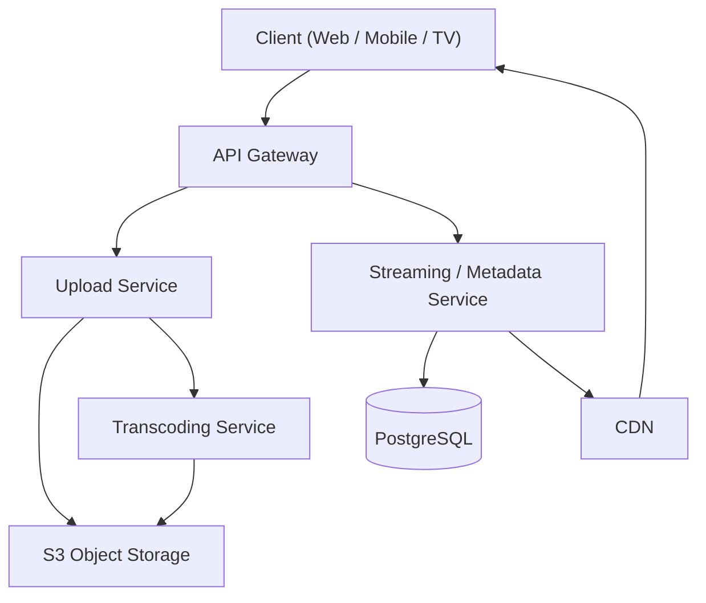
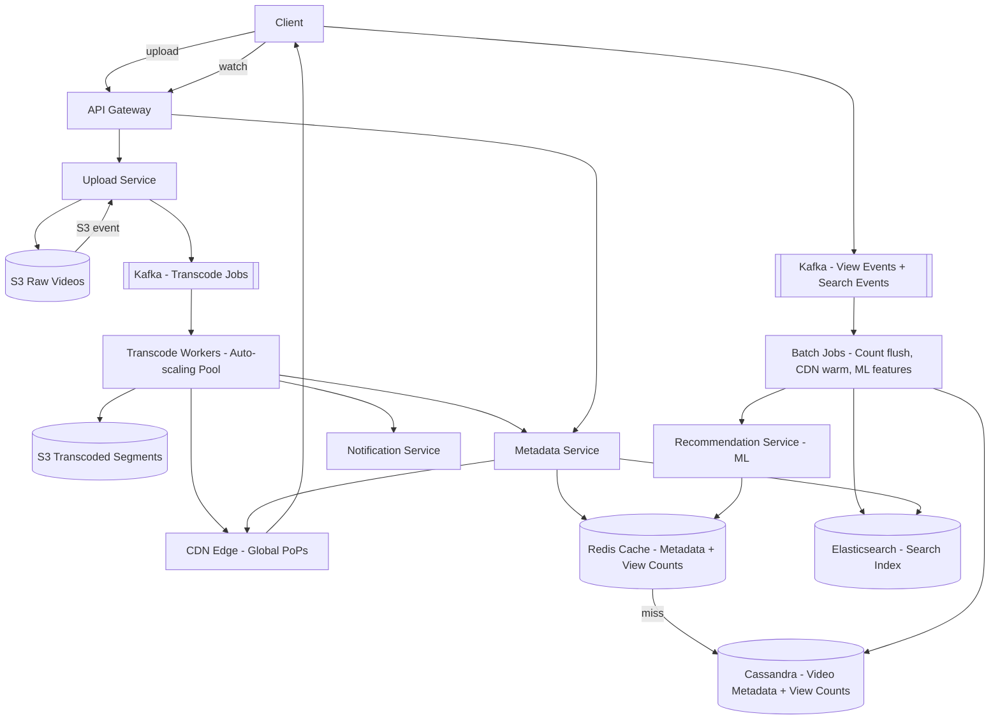
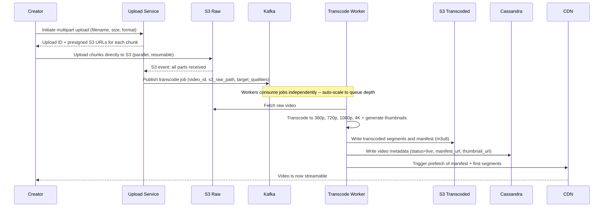
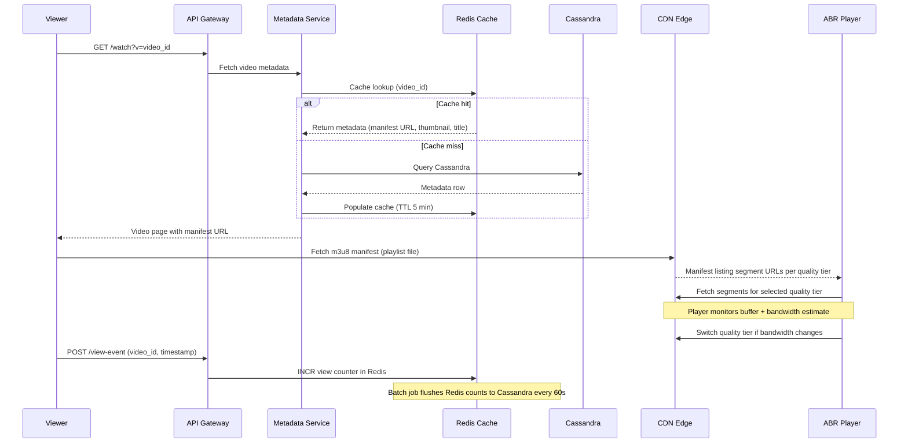
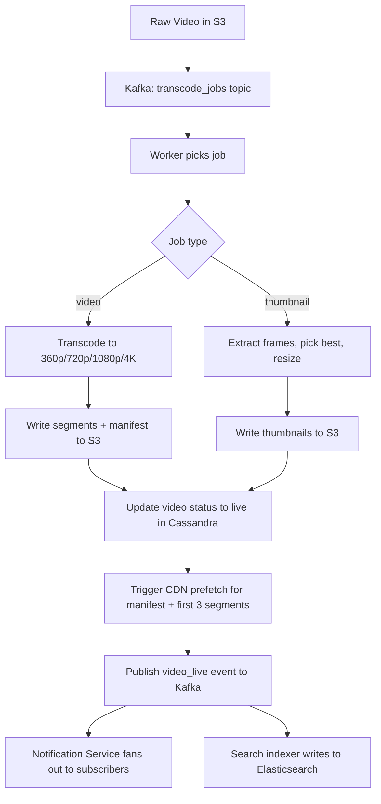

# System Design: YouTube / Video Streaming

---

## 1. What Is YouTube / Video Streaming?

YouTube is a video platform where creators upload videos and viewers watch them from anywhere in the world, at whatever quality their connection can handle. A creator records something once, uploads it, and from then on anyone — on fast home wifi or spotty mobile data on a train — can press play and have it just work, with the picture quietly adjusting itself to whatever bandwidth is actually available.

Underneath that simple experience are two goals pulling in opposite directions: getting a freshly uploaded video ready to watch as fast as possible, and making sure video that's already live plays back instantly and smoothly for millions of people watching at the same time. Everything in this design follows from treating those as two separate, purpose-built pipelines rather than trying to make one system do both jobs.

---

## 2. A Day in the Life

Maya just finished filming a cooking video and taps "Upload" from her phone. A progress bar climbs as the raw file streams up in the background — she doesn't have to sit and watch it; she closes the app and starts editing her next video's thumbnail instead. A few minutes later, a notification lands: "Your video is now live." She posts the link.

On the other side of the world, Dev opens the app that evening, searches "pasta recipe," and Maya's video is already sitting in the results — even though she uploaded it only a few minutes earlier. He taps play. The video starts in about two seconds, no spinner, no wait. For the first couple of seconds the picture looks a little soft while his phone's connection settles in, then it sharpens up on its own — he doesn't touch a settings menu, and he doesn't notice the switch happening at all. He watches the whole thing, taps like, and subscribes to Maya's channel.

Later that night, Maya checks her channel and sees her subscriber count has ticked up and her view count is climbing — not updating instantly, more like catching up every so often, but close enough that she never notices a delay. Neither Maya nor Dev ever thought about a transcoding job, a manifest file, or a cache — everything from here on is how that experience actually gets built.

---

## 3. Requirements — and Why They Matter

**Scope.** In scope: video upload, transcoding to multiple resolutions, adaptive bitrate streaming, video search, personalized recommendations, view counts, subscriptions and notifications. Out of scope: live streaming (a different protocol stack entirely — RTMP/WebRTC instead of HLS), the comments system (its own CRUD-plus-ranking deep dive), and the content moderation pipeline.

**Functional requirements:**

1. Creators can upload videos up to 128GB in any common format (MP4, MOV, AVI, MKV)
2. System transcodes every video to 360p, 720p, 1080p, and 4K (where source quality allows)
3. Viewers stream video with adaptive bitrate — quality adjusts automatically to network conditions
4. Videos are searchable by title, description, and tags within seconds of going live
5. Homepage and sidebar show personalized recommendations based on watch history
6. View counts are displayed and updated in near-real-time (eventual consistency acceptable)
7. Subscribers receive notifications when a channel uploads a new video
8. Creators can upload custom thumbnails; system auto-generates thumbnails from video frames

<details markdown="1">
<summary><strong>Point to Ponder:</strong> View counts are only "eventually" accurate — when does that actually become a problem?</summary>

For the number a viewer sees on screen, it doesn't: 1,234,567 vs 1,234,623 is indistinguishable to a human, and nobody is watching their own view count tick up in real time. The one case where staleness would actually matter is gating — something like "unlock a feature at 1M views" — and that case deliberately doesn't use the main view-count path at all. It runs through a separate, synchronous counter backed by a real DB transaction. See §8.3 in Deep Dives for the full write-path mechanics.

</details>

**Non-functional requirements — and why each one matters to a real user, not just as a target:**

| Requirement | Target | Why it matters |
|---|---|---|
| Video start latency | < 2 seconds | Studies show abandonment rate spikes sharply past 3 seconds — a viewer who taps play and waits is a viewer who leaves. |
| Upload processing | < 5 minutes for 720p to go live | A creator who just finished editing wants to share the link now, especially for time-sensitive or viral content. |
| Availability | 99.9% for streaming (8.7 hrs downtime/year) | Planned maintenance windows are acceptable, but an outage during peak viewing hours is lost watch-time for millions of people at once. |
| Durability | 99.999999999% (S3 eleven-nines) | A creator's video is often the only copy that exists — losing it isn't a bug, it's someone's work gone. |
| Search freshness | < 30 seconds after video goes live | A creator who just uploaded and shares the link expects it to be findable immediately, not tomorrow. |
| View count freshness | eventual, ~60 second lag | Not user-facing patience so much as system economics — see the Consistency Model below and §8.3 for why this is a deliberate choice, not a shortcut. |

**Consistency Model:**

| Domain | Model | Why |
|---|---|---|
| Video metadata (title, URL, status) | Strong | Viewer must see correct URL or playback breaks |
| View counts, likes | Eventual | Redis buffer + batch flush; 60s lag is imperceptible |
| Recommendations | Eventual | ML pipeline runs in batch; stale recs are acceptable |
| Search index | Near-real-time eventual | Elasticsearch replication lag is fine for search |

<details markdown="1">
<summary><strong>Point to Ponder:</strong> The system maintains both an HLS manifest and a DASH manifest for the same video — doesn't that mean transcoding everything twice?</summary>

No — the underlying video segments are identical (fMP4) either way; only the manifest file describing them differs. Apple devices need HLS because Safari and iOS have no other native option, while DASH covers Android and web with far more codec flexibility. The API layer picks which manifest to hand back based on the requesting device, so supporting both formats is a manifest-generation detail, not a second encode. See §9.2 Trade-offs for the full reasoning.

</details>

---

## 4. Scale, From First Principles

Before designing anything, it's worth asking what these given numbers — 500M daily active users, 500 hours of video uploaded every minute, 10M concurrent streams — actually force on the architecture.

**How much new video does the system store per day?** 500 hours uploaded every minute, over 1,440 minutes in a day, is a lot of raw footage before any processing even starts:
```
Upload rate:      500 hrs/min x 1440 min/day = 720,000 hrs/day of raw video
Raw video:        720,000 hrs x 3,600 sec/hr x ~5 Mbps avg = ~1.6 PB/day raw
After transcode:  Store 4 quality tiers (360p/720p/1080p/4K) + original
                  Multiplier ~3.5x = ~5.6 PB/day new video added
Compression gain: H.265/AV1 saves ~40-50% vs H.264 -- use modern codecs
Realistic:        ~2-3 PB/day after compression, tiered to cold storage
```
That 1.6 PB/day of raw footage alone rules out treating storage as an afterthought — even before transcoding multiplies it further, this is a problem that only tiered, compressed object storage solves economically, not a database with a blob column.

**How much bandwidth does serving 10 million concurrent streams take?** At a blended average bitrate across quality tiers of about 3 Mbps:
```
Concurrent streams:  10M
Avg bitrate mix:     ~3 Mbps (weighted avg across quality tiers)
Peak bandwidth:      10M x 3 Mbps = 30 Tbps
CDN absorbs 95%+ so origin sees: ~1.5 Tbps worst case
```
30 Tbps is not a number any origin data center is provisioned to push directly to end users — that figure alone is what makes a CDN mandatory rather than a nice-to-have. The system only works because the CDN absorbs 95%+ of that traffic at the edge, leaving origin servers to handle roughly 1.5 Tbps of actual cache misses.

**What does the upload side imply for the transcoding pipeline?** 500 hours of video arriving every minute, at an average video length of 7 minutes, works out to:
```
500 hrs/min uploaded
Avg video length: 7 min -> 500 hrs x 60 / 7 = ~4,300 videos/min = ~72 videos/sec
Each video needs 4 transcode jobs -> 288 jobs/sec at steady state
Peak (viral events): 3-5x -> need ~1,000-1,500 workers at peak
Auto-scaling transcoding workers is mandatory, not optional
```
288 transcoding jobs arriving every second rules out doing this work synchronously on the upload request — there's no way to hold a creator's connection open through that. And because viral events can spike demand 3-5x with no warning, the worker pool has to auto-scale on its own; a fixed-size pool sized for steady state would fall behind the moment a video goes viral.

Put together, these three numbers are what drive nearly every major decision in this design: async transcoding via Kafka (synchronous processing is impossible at 288 jobs/sec), CDN-first delivery (30 Tbps requires edge caching, since no origin absorbs that directly), and Redis for view counts (10M concurrent viewers generating events cannot write straight to a database).

---

## 5. High-Level Architecture

Remember Maya's upload and Dev's watch from the story above — here's what's actually happening underneath both of them.

YouTube is really two completely different systems sharing a data store. The **Upload Path** is a reliable, async pipeline where correctness matters more than speed — Maya's video can take a few minutes to become watchable, but it must never be silently lost along the way. The **Watch Path** is a fast, read-heavy path where latency matters above everything else — Dev's video has to start in about two seconds, no matter how many other people are streaming at that exact moment. Every design decision in this system maps cleanly onto one of these two paths.

```
UPLOAD PATH (Write-heavy, async, correctness-first)
================================================================
Creator --> Chunked Upload --> Raw S3
                                  |
                            Transcoding Queue (Kafka)
                                  |
                     +-----------+-----------+
                     |           |           |
                   360p        720p       1080p/4K
                     |           |           |
                     +-----------+-----------+
                                  |
                         Transcoded S3 Buckets
                                  |
                         CDN Prefetch + DB Metadata
                                  |
                           Video Goes Live


WATCH PATH (Read-heavy, latency-first, CDN-dominated)
================================================================
Viewer --> API Gateway --> Metadata Service --> Redis Cache
                                                     |
                                              Cassandra (miss)
                                                     |
                                          CDN Edge (m3u8 manifest)
                                                     |
                                        ABR Player picks quality tier
                                                     |
                                     CDN serves video segments (ts files)
                                   (95%+ cache hit -- segments are immutable)
```

### Core Design Principles

| Path | Optimized For | Mechanism |
|---|---|---|
| Upload Fast Path | Throughput | Chunked multipart upload to S3, no server buffering |
| Upload Reliable Path | Durability | Kafka job queue, idempotent transcoding workers, raw video persisted before any processing |
| Watch Fast Path | Latency | CDN edge serves segments, Redis serves metadata, ABR player never waits for origin |
| Watch Reliable Path | Availability | Multi-region CDN origins, Redis fallback to Cassandra, circuit breaker on origin |

<details markdown="1">
<summary><strong>Point to Ponder:</strong> Why does the transcoding worker fetch the raw video from S3, instead of the Upload Service handing it directly to the worker?</summary>

Because whatever holds the raw video has to survive a worker crashing mid-job. If the raw bytes only existed in the Upload Service's memory or local disk, a crashed worker would mean the source video is simply gone — there'd be nothing left to retry from. Writing raw video to S3 first means any worker, including a freshly spun-up replacement, can pick the job back up from scratch. Durability is the input contract. See §8.2 for the full transcoding pipeline.

</details>

<details markdown="1">
<summary><strong>Point to Ponder:</strong> View events flow through a Kafka topic (KF2) before reaching the batch job — why not have the client just call Redis INCR directly?</summary>

Because Kafka is what makes the view-count pipeline survive a Redis outage without losing data. If the client wrote straight to Redis and Redis went down, every view event during that window would simply vanish. Routing events through Kafka first means they're durably queued regardless of whether Redis is currently up — when Redis recovers, a batch replayer catches up from the Kafka log, so the worst case is a few extra minutes of lag, not lost view counts. See §9.1 Failure Scenarios for how this plays out end to end.

</details>

---

### Simple Design (Start Here in the Interview)



### Evolved Design (After Identifying Bottlenecks)



Scaling this out is what turns one Kafka queue and one database into the fuller picture above — a dedicated view-event/search-event queue (KF2) feeding batch jobs, a recommendation service reading from that same pipeline, and a notification service fanning out off the back of the transcode workers. None of that is optional once the numbers from §4 are in play.

> [!NOTE]
> **Key Insight:** The CDN is not a performance optimization — at 30 Tbps, it is the only way the system physically works. Origin servers cannot absorb that bandwidth.

### The Full Sequence

The diagrams above show the components; this shows the actual message sequence between them, end to end — first the upload, then the watch.





---

## 6. API Design

The API surface splits along the same line as everything else in this design: endpoints that get a video **in** (upload) and endpoints that get a video **out** (watch, search, discovery, engagement). The two client flows barely overlap — a creator's upload session and a viewer's playback session touch almost none of the same code paths, except that they eventually meet at the same `video_id`.

| Method | Path | Description |
|---|---|---|
| POST | /api/v1/videos/upload/init | Initiate upload, returns {video_id, upload_url} — direct-to-S3 pre-signed URL |
| POST | /api/v1/videos/upload/complete | Confirm upload done, triggers transcoding pipeline |
| GET | /api/v1/videos/{id} | Video metadata + manifest URL (.m3u8 or .mpd) for player |
| GET | /api/v1/videos/{id}/stream | Redirects to CDN manifest — this is what the player fetches |
| GET | /api/v1/search?q=&page= | Full-text search via Elasticsearch |
| GET | /api/v1/feed/recommendations?user_id= | Personalized feed — collaborative filtering results |
| POST | /api/v1/videos/{id}/views | Record a view event (fire-and-forget, eventual consistency) |

Two of these rows are doing more work than they look like they are. `POST /videos/{id}/views` is deliberately fire-and-forget — the client doesn't wait for a response that confirms the count updated, because view counts are eventually consistent by design (§3, §8.3). And `GET /videos/{id}/stream` is the one worth pausing on:

> [!NOTE]
> `GET /videos/{id}/stream` is architecturally important — it returns a CDN URL (m3u8 manifest), not video bytes. The app server's job is just to hand off to CDN. Every subsequent segment fetch goes directly to CDN edge — the app server is never in the video data path again.

---

## 7. Data Model

Eight different pieces of data live in this system, and grouping them by how they're actually used — rather than as one flat list — makes the storage choices almost obvious.

**The ephemeral, fast-path data lives in Redis.** View counts are the clearest case: 10 million concurrent viewers generating events works out to roughly 100K writes/sec, and Redis `INCR` handles that atomically, in-memory, at sub-millisecond latency, with a batch job flushing the delta to Cassandra every 60 seconds — a video's exact view count at any given instant simply doesn't need to be durable on its own. Upload sessions follow the same logic for a different reason: `upload_id -> chunk_bitmask, expiry` is ephemeral, short-lived tracking state, and putting it in a real database would just be write amplification for data that TTLs itself away once the upload finishes. Recommendations sit in Redis too, but as a cache in front of an ML pipeline rather than a live computation — the actual `user_id -> [video_id list]` results are precomputed every few hours from watch history in Cassandra, and Redis just serves the last computed list in under a millisecond.

**The durable, high-write data lives in Cassandra, because the write volume rules out a single relational primary.** Video metadata (`video_id`, `title`, `channel_id`, `manifest_url`, `status`, `view_count`, and so on) sees roughly 500 videos going live per second plus the same 10M-view-count-updates-per-minute traffic layered on top — and a PostgreSQL primary saturates around 50K writes/sec, well below what this workload needs. Cassandra's multi-master model absorbs it instead, keyed by `video_id` as the partition key. Subscriptions live in Cassandra for a related but distinct reason: the access pattern is always "give me every subscriber for channel X," and partitioning by `channel_id` turns that fan-out query into a single-node read rather than a scatter-gather across a relational schema.

**The genuinely relational, low-write data still belongs in PostgreSQL.** User accounts — `user_id`, `email`, `channel_id`, `created_at`, `subscription_list` — need real ACID guarantees, but they're read-mostly and rarely written, so none of the write-throughput pressure that pushed video metadata to Cassandra applies here. This is the same reasoning the Trade-offs section returns to (§9.2): Cassandra was never chosen because the metadata schema demanded it — it was chosen because of the view-count write load riding along with it.

**Search and video bytes are their own category entirely.** The search index — `video_id`, `title`, `description`, `tags`, `channel`, `upload_time` — needs an inverted index for full-text search across billions of videos, something Cassandra simply can't do efficiently, so it lives in Elasticsearch. Video segments themselves (`bucket/video_id/quality/segment_N.ts` plus `video_id/master.m3u8`) are immutable objects at effectively unlimited scale, which is exactly what object storage is for — S3, with native CDN integration, not a database at all.

| Entity | Storage | Key Columns |
|---|---|---|
| Video metadata | Cassandra | video_id (partition), created_at, title, channel_id, manifest_url, status, view_count |
| Video segments | S3 | bucket/video_id/quality/segment_N.ts + video_id/master.m3u8 |
| User accounts | PostgreSQL | user_id, email, channel_id, created_at, subscription_list |
| Search index | Elasticsearch | video_id, title, description, tags, channel, upload_time |
| View counts (hot) | Redis HyperLogLog / INCR | video_id -> count |
| Recommendations | Redis + ML Feature Store | user_id -> [video_id list] |
| Subscriptions | Cassandra | channel_id (partition), subscriber_id |
| Upload sessions | Redis | upload_id -> chunk_bitmask, expiry |

The table is a compact recap of storage location, not a repeat of the reasoning above — but one line in it is easy to misread as a schema choice rather than a load choice:

> [!NOTE]
> **Key Insight:** Cassandra for video metadata is a write-throughput decision, not a schema decision. The moment view count updates hit 100K/sec, SQL primary write ceiling becomes the bottleneck.

---

## 8. Deep Dives

### 8.1 Adaptive Bitrate Streaming (ABR)

Here's the problem ABR exists to solve: a viewer's phone might have a rock-solid 20 Mbps wifi connection one moment and a spotty 500 Kbps cell signal the next, sometimes within the same viewing session. A video encoded at one fixed quality can't survive that swing in either direction — encode it high and the bandwidth drops turn into stalling and rebuffering, encode it low and a viewer on a great connection is stuck looking at a needlessly blurry picture for no reason. What ABR has to guard against, specifically, is those two failure modes — rebuffering when bandwidth drops, and wasted quality when it doesn't — and it has to do it without the server ever knowing in advance which situation any given viewer is in.

The pieces that make this possible are simple by design: a single **master manifest** that lists every quality tier and points to that tier's own playlist; a **per-quality playlist** listing that tier's individual segment files; **segments** themselves, short chunks of video a few seconds long; and, entirely on the client side, the player's own **bandwidth and buffer estimator**, which is the part actually making the quality decisions — the server never gets involved in picking a tier.

The workflow that ties those pieces together is what runs on every single playback session: the player fetches the master manifest first, picks an initial quality tier based on whatever bandwidth estimate it can make before playback even starts, and begins downloading segments in that tier. From there, it continuously measures how fast each segment download completed and how full its buffer is, and if bandwidth drops or rises, it switches to a different quality tier — but only at the next segment boundary, never mid-segment, which is what makes the switch invisible instead of a visible stutter.

```
master.m3u8
  ├── 360p/playlist.m3u8   -> segment_0001.ts, segment_0002.ts ...
  ├── 720p/playlist.m3u8   -> segment_0001.ts, segment_0002.ts ...
  └── 1080p/playlist.m3u8  -> segment_0001.ts, segment_0002.ts ...
```

Segment length itself is a real trade-off, not an arbitrary constant. Short, 2-second chunks let a stream start fast and let the player react to a bandwidth change almost immediately — but that fine-grained switching comes at the cost of a very high object count, since every couple of seconds of every quality tier is its own file to store and cache. Long, 10-second chunks flip every one of those properties: startup is slower because the player needs at least two chunks buffered before it can safely begin, quality switches lag behind real bandwidth changes since the player is committed to a tier for the whole 10 seconds, but the object count driving storage and cache overhead drops accordingly. YouTube settles on roughly 2-second segments as its balance point; Netflix, weighing the trade differently, uses 4 seconds.

| Segment Size | Startup Latency | Quality Switch Granularity | CDN Object Count |
|---|---|---|---|
| 2-second chunks | Fast (buffer faster) | Fine-grained switching | Very high object count |
| 10-second chunks | Slow (need 2+ chunks to start) | Coarse, quality lags bandwidth changes | Low object count |

The reason any of this scales economically at all is that segments, once transcoded, never change — `segment_0001.ts` for a given video at 720p is the same file forever, so it can carry a `Cache-Control: max-age=31536000` header (a full year) with zero risk of ever serving stale content. For a popular video, that pushes CDN hit rate toward 100%, which is the property that makes video delivery affordable in the first place — not a performance nicety layered on top.

The last piece of this puzzle is which manifest format the player is even reading, since Apple's ecosystem and everyone else's don't agree. HLS is Apple's format, natively supported by Safari and iOS with no polyfill needed, but limited to H.264/H.265 and either MPEG-TS or fMP4 segments — it's the legacy format on YouTube and the required one on Apple platforms. DASH is the ISO standard instead, requiring Media Source Extensions outside Apple's ecosystem but supporting any codec, including VP9 and AV1, with fMP4-only segments — it's what Netflix and Disney+ lean on, and what YouTube itself has moved to for the majority of its modern delivery, because AV1 saves roughly 30% bandwidth over H.264 at the same visual quality.

| Dimension | HLS (Apple) | DASH (ISO standard) |
|---|---|---|
| Codec support | H.264/H.265 only natively | Any codec including VP9, AV1 |
| iOS/Safari support | Native, no polyfill needed | Requires Media Source Extensions |
| Segment format | MPEG-TS or fMP4 | fMP4 only |
| Adoption | YouTube (legacy), Apple | Netflix, YouTube (modern), Disney+ |

> [!NOTE]
> **Key Insight:** Video segments are immutable content — this is the property that makes CDN caching perfect. A 99% CDN hit rate on segments means the origin only sees 1% of traffic.

---

### 8.2 Transcoding Pipeline

Here's the problem: 500 hours of video arrive every minute, and a single one-hour 4K video alone can take 20-40 minutes to transcode even on powerful hardware. At roughly 72 videos arriving per second (§4), there's no way to run this work synchronously — what's needed is a distributed, async pipeline that auto-scales with demand rather than a fixed pool sized for an average day.

The reason raw video lands in S3 before transcoding starts, and not sometime after, comes straight from thinking through what happens when a worker crashes mid-job. If the raw bytes only ever lived in the Upload Service's memory or local disk, a crash would mean the source video is simply gone with nothing left to retry. Writing it to S3 first means any worker — including a brand-new one spun up to replace the crashed one — can pick the job back up from scratch. Durability is the input contract.



Which codec a video ends up transcoded into is itself a compatibility-versus-efficiency trade made per output, not one blanket choice: H.264 covers every device for broad compatibility, H.265 gets used for 4K since it's about 50% smaller than H.264 at the same quality, VP9 covers the web with better-than-H.264 compression at no licensing cost, and AV1 — the best compression available, but slow to encode — is reserved for popular videos where the encode cost is worth paying repeatedly across millions of views.

Scaling the worker pool itself is driven by a single signal: Kafka consumer lag. Once queue depth crosses 1,000 jobs, more EC2 spot instances spin up automatically. Transcoding is CPU-bound and embarrassingly parallel — exactly the kind of workload spot instances with checkpointing are built for, since a preempted instance just means the checkpoint resumes on another one.

> [!NOTE]
> **Key Insight:** The transcoding queue is a correctness requirement, not a performance optimization. Without it, a worker crash loses the video permanently. Kafka's durable log guarantees the job survives any single worker failure.

None of that crash recovery works, though, unless retrying a job from scratch is actually safe to do — otherwise a redelivered message just trades a stuck video for a corrupted one.

> [!IMPORTANT]
> Idempotency is mandatory: if a worker crashes after writing 720p but before writing 1080p, the job must be safe to retry. Workers use video_id + quality as the S3 key — writing the same key twice is idempotent in S3.

---

### 8.3 View Count at Scale

Here's the problem: 10 million concurrent viewers, each generating multiple view events per session, adds up fast — even at a conservative one event per viewer per minute, that's already 167K writes/sec for view counts alone.

The obvious approach is a direct row update, and it fails almost immediately at this volume:

```
UPDATE videos SET view_count = view_count + 1 WHERE video_id = X
```

Every one of those statements takes a row-level write lock, and PostgreSQL tops out around 10K-50K writes/sec on a single row before lock contention eats the rest of the throughput. A single viral video pushing 167K writes/sec against that one row is already 3-17x past the ceiling — and that's before accounting for every other video being watched at the same time.

The fix is to stop writing to a durable row on every event at all:

```
On view event:  INCR views:video_id   # atomic, in-memory, sub-millisecond
Every 60s:      Batch job reads Redis counts, writes delta to Cassandra, resets Redis counter
```

Redis's `INCR` is atomic and lock-free by construction, and a single Redis node absorbs over a million operations per second — nowhere near the same contention problem, because there's no disk-backed row being locked. The 60-second lag before that count lands in Cassandra is, as covered in §3, imperceptible to anyone actually watching the number.

Counting *unique* viewers is a related but separate problem, and it gets its own trick: `PFADD unique_views:video_id user_id` into a Redis HyperLogLog. A HyperLogLog estimates the size of a set using about 12KB per key, regardless of whether that set has a thousand members or ten million — storing an actual set of 10 million user IDs the naive way would cost gigabytes per video. The trade is a roughly 0.81% error rate, which is a non-issue here, since view counts were never meant to be exact in the first place.

There's exactly one place this eventual-consistency model would actually cause a problem: gating a feature behind a view-count threshold, something like "unlock at 1M views." That case is deliberately routed around this entire pipeline — it uses a separate, synchronous counter backed by a real database transaction, precisely because it's the one scenario where staleness has a real consequence rather than just being an approximate number on a page.

> [!NOTE]
> **Key Insight:** View count at scale is a write-throughput problem, not a consistency problem. Eventual consistency is not a compromise — it is the correct model. Nobody needs to see their view reflected in under 60 seconds.

---

## 9. Bottlenecks & Scaling

Every component in this design has a point where it stops being the right shape for the traffic in front of it. Here's what breaks first as scale grows, and what actually changes when it does.

CDN cache hit rate is the single most important metric in the whole system — if it drops below 90%, origin bandwidth costs explode and latency degrades immediately, since every miss falls back to the much slower, much more expensive origin path. The usual causes are too-short TTLs, poor cache key design, or unpredictable access patterns; the fix is to set segment TTLs to a full year (they're immutable, so this is safe), keep cache keys consistent, and pre-warm the CDN ahead of scheduled releases rather than waiting for organic misses.

The transcoding worker pool has to be sized against steady-state load, not peak: at 288 jobs/sec and roughly 5 minutes per job per worker, that's 288 × 300s ≈ 86,400 concurrent transcode slots needed just to keep up, since each worker handles one job at a time. That means running on the order of 86K worker processes via auto-scaling groups of spot instances, with Kafka consumer lag as the signal that drives scaling up or down.

Elasticsearch has its own ceiling once the catalog reaches YouTube's actual scale of roughly 800 million videos. Index sharding — partitioning by a hash of `video_id` — is what lets search queries fan out across shards and merge results instead of hitting one unmanageable index. The real bottleneck there isn't query time, it's write throughput for indexing every newly live video; the fix is routing writes through a Kafka → Logstash → Elasticsearch pipeline rather than synchronous API calls, with the index refresh interval set to 5-30 seconds so writes batch instead of committing in real time.

Recommendations have a cold-start problem that's really two separate problems wearing one name: new users have no watch history to build on, and new videos have no engagement signal yet either. New users fall back to popularity-based recommendations — trending content and category defaults — until enough watch history accumulates. New videos get boosted into a sampling pool so they can gather initial engagement signals within their first 24 hours, rather than being invisible to the recommendation engine until they've organically earned views some other way.

---

### 9.1 Failure Scenarios

Grouping these by what actually failed makes the recovery story easier to follow than reading them as an unordered list.

**Compute failures — workers and consumers falling behind or crashing — are the most self-healing category.** A transcoding worker crashing mid-job leaves a video stuck in a processing state, but the fix requires no manual intervention: the Kafka message was never ACKed, so it gets redelivered to another worker once the visibility timeout (30 minutes) passes, and because S3 writes are idempotent, replaying the job from scratch is safe. Kafka consumer lag spiking — the backlog growing faster than workers can drain it — triggers the same auto-scaling response covered above the moment lag crosses 1,000 jobs; in the meantime, new uploads simply show an estimated wait time in Creator Studio rather than failing outright, with an SLA of 720p live within 5 minutes for videos under 30 minutes long.

**Storage failures are handled through replication rather than retries.** If an S3 region goes unavailable, uploads and streaming fail for that region specifically, but cross-region replication already keeps transcoded segments in two or more regions, so the CDN simply reroutes to a healthy origin automatically while the upload service retries against a secondary region. A Cassandra node failure causes a latency spike only on the affected token range, not data loss — replication factor 3 means the data already exists on two other nodes, and hinted handoff absorbs the temporary outage until the node rejoins.

**Hot-path and cache failures are the ones designed to degrade gracefully rather than fail hard.** If the Redis view-count service goes down, writes during the outage aren't lost — they're already buffered in Kafka, so once Redis recovers, a batch replayer catches up from the Kafka log, with at most about 5 minutes of lag on view counts. A CDN origin overload shows up as high latency specifically for cache misses; multiple S3 origins across regions plus a circuit breaker (serving a stale cached manifest once the error rate passes 5%) plus an origin shield — a single CDN PoP that fronts the origin and absorbs miss traffic — keep that from cascading. And an Elasticsearch index lag simply means search misses very recently uploaded videos, which is acceptable by design given the eventual consistency already committed to for search (§3); if lag exceeds 5 minutes, alerting fires, and the metadata service can fall back to direct title-match queries against Cassandra in the meantime.

---

### 9.2 Trade-offs

### HLS vs DASH

The two formats diverge most on platform support and codec flexibility. HLS is natively supported on iOS and Safari with no polyfill needed, but it's locked to H.264/H.265 and either MPEG-TS or fMP4 segments, with FairPlay as its DRM. DASH needs a Media Source Extensions polyfill outside Apple's ecosystem, but in exchange it supports any codec — including VP9 and AV1 — uses fMP4-only segments, and pairs with Widevine or PlayReady for DRM. Industry adoption splits along the same line: HLS dominates on Apple devices, DASH dominates on Android and web.

**Chosen:** Both. Apple's ecosystem leaves no real alternative to HLS, while DASH covers everything else with the codec flexibility HLS can't offer. Which manifest a viewer gets is decided per-device at the API layer, but the underlying segments are the same fMP4 files either way — so supporting both formats never means encoding a video twice.

> [!NOTE]
> **Key Insight:** HLS vs DASH is a client compatibility problem, not a backend architecture problem. Same segments, two manifest formats. The CDN caches both.

---

### Push CDN vs Pull CDN

A push CDN means paying to pre-populate every point of presence in advance — high storage cost and real operational overhead maintaining that push, but content is already warm everywhere the moment it's needed, which suits predictable, popular releases well. A pull CDN flips that: low cost, since it only stores what's actually been fetched, and the CDN handles propagation with no manual push step — but the first request to any given edge is a cold miss, which is a poor fit for content that needs to be warm the instant it's published.

**Chosen:** Pull CDN as the default, with selective push reserved for known viral content — trending videos, scheduled premieres. Long-tail videos make up roughly 90% of the catalog, which is exactly the case pull's pay-only-for-what's-fetched model is built for.

> [!NOTE]
> **Key Insight:** Pull CDN + selective push warming is a cost optimization. Most videos are never watched after 30 days. Pushing all of them to all CDN PoPs would cost more than the bandwidth savings.

---

### Redis vs DB for View Counts

Redis `INCR` sustains over a million operations per second on a single node, against 10-50K/sec for a direct database write on the same row — a difference driven entirely by lock contention, since Redis never takes a disk-backed row lock. What Redis gives up is strong consistency (there's a 60-second lag baked into the batch flush) in exchange for that throughput, and durability shifts from ACID guarantees to RDB/AOF persistence — good enough for a number that was never meant to be exact, at a fraction of the infrastructure cost of a sharded database cluster with write replicas.

**Chosen:** Redis `INCR` with a 60-second batch flush to Cassandra. Strong consistency for view counts was never a business requirement in the first place — no revenue and no access control depends on the number being accurate to the second.

> [!NOTE]
> **Key Insight:** Eventual consistency for view counts is not a compromise — it is the correct model. The write load for strong consistency would cost 10x more infrastructure to serve a number that users interpret as "approximately N."

---

### Single Transcode Job vs DAG Pipeline

Transcoding a video as one job means one worker owns the whole video — simple as a plain queue consumer, but a crash means the entire video retries from zero, and all quality tiers finish together, whichever one takes longest. Splitting it into a DAG, one task per quality tier, means N workers can work the same video in parallel, a crash only costs the one tier that failed, and low tiers can go live independently of high ones — at the cost of needing a real orchestrator (Temporal or Airflow) to track those dependencies and retries instead of a bare queue.

**Chosen:** A DAG pipeline, with each quality tier published as its own Kafka message. 360p typically goes live in about a minute, with 4K following roughly ten minutes later — letting a viral upload become watchable at some quality almost immediately instead of waiting on the slowest tier. Temporal handles the dependency tracking and retry logic that this approach requires.

> [!NOTE]
> **Key Insight:** "360p first" is a product decision with architectural consequences. It requires a DAG pipeline instead of a monolithic transcode job — complexity is justified by creator experience.

---

### PostgreSQL vs Cassandra for Video Metadata

PostgreSQL offers flexible reads — JOINs, secondary indexes, ad-hoc queries — with strong ACID consistency and low operational complexity, but a single primary caps out around 50K writes/sec. Cassandra gives up JOINs entirely, restricted to partition-key access with tunable (default eventual) consistency and meaningfully higher operational overhead, in exchange for 500K+ writes/sec across a multi-master cluster.

**Chosen:** Cassandra. The access pattern for video metadata is always by `video_id`, a known partition key, so the lack of JOINs costs nothing in practice — while view count updates alone push past 100K/sec, which would turn a PostgreSQL primary into a hard bottleneck within roughly 12 months of growth. The trade-off accepted is no ad-hoc queries: analytics runs on a separate Spark/BigQuery pipeline reading from Cassandra backups instead.

> [!NOTE]
> **Key Insight:** Cassandra is chosen because of view count write load, not because of video metadata schema complexity. The metadata schema is simple enough for PostgreSQL — the write amplification from view events is what breaks SQL.

---

## 10. Evaluation: Did We Meet the Requirements?

Six non-functional requirements were set out in §3. Here's how the design actually satisfies each one — the specific mechanism doing the work, not just the promise.

**Video start latency (< 2 seconds):** The watch fast path never touches origin for a cache hit — the CDN edge serves the manifest and segments directly, Redis answers metadata lookups in under a millisecond, and the ABR player starts playback from whatever's already cached at the edge. Origin is a fallback for misses only, not something every playback has to wait on.

**Upload processing (< 5 minutes for 720p):** The DAG transcoding pipeline (§8.2, §9.2) publishes each quality tier as its own job, so 720p doesn't wait behind 4K — combined with a worker pool that auto-scales on Kafka consumer lag rather than sitting fixed at steady-state size, this is what keeps a viral upload from blowing past the 5-minute target.

**Availability (99.9% for streaming):** Multi-region CDN origins, a circuit breaker that serves a stale cached manifest once error rates cross 5%, and an origin shield absorbing miss traffic all keep a single origin failure from becoming a viewer-facing outage — and on the metadata side, Redis falling back to Cassandra on a cache miss means a Redis blip doesn't take down playback either.

**Durability (eleven-nines):** Raw video is written to S3 before transcoding ever begins, specifically so a crashed worker never means a lost source file — any worker can retry from scratch. Transcoded segments are cross-region replicated in S3, and Cassandra's replication factor of 3 plus hinted handoff means a single node failure never costs a byte.

**Search freshness (< 30 seconds):** New videos flow through a Kafka → Elasticsearch indexing pipeline rather than a synchronous write, with the index refresh interval tuned to 5-30 seconds — fast enough that a creator sharing a link minutes after upload finds it already searchable.

**View count freshness (eventual, ~60s lag):** This one isn't "met" so much as deliberately chosen — Redis `INCR` absorbs the write volume no database row could survive, with a 60-second batch flush to Cassandra (§8.3). The lag is a designed trade, not a limitation being tolerated.

| Requirement | Technique |
|---|---|
| Video start latency < 2s | CDN edge cache + Redis metadata cache, origin only on miss |
| Upload processing < 5 min | DAG transcoding pipeline (360p first) + auto-scaling workers |
| Availability 99.9% | Multi-region CDN origins, circuit breaker, origin shield, Redis→Cassandra fallback |
| Durability (eleven-nines) | Raw-to-S3-first, cross-region replication, Cassandra RF=3 + hinted handoff |
| Search freshness < 30s | Kafka → Elasticsearch pipeline, 5-30s refresh interval |
| View count freshness ~60s | Redis INCR + 60s batch flush to Cassandra |

---

## 11. Conclusion

This design treats YouTube as two pipelines wearing one app: an async, correctness-first upload path that would rather take a few extra minutes than ever lose a creator's video, and a latency-first, CDN-dominated watch path built around the fact that origin servers physically cannot serve 30 Tbps directly. The hardest problem wasn't any single component — it was recognizing which data can tolerate being wrong for sixty seconds (a view count) and which can never be wrong at all (a video file, a manifest URL), and then choosing storage and delivery mechanisms accordingly. Cassandra over PostgreSQL, Redis `INCR` over a database row, a DAG transcoding pipeline over a monolithic job, dual HLS/DASH manifests over a single format — every one of those decisions falls out of getting that distinction right.

---

## 12. Interview Summary

### Key Decisions

| Decision | Problem It Solves | Trade-off Accepted |
|---|---|---|
| Async transcoding via Kafka | 288 transcode jobs/sec is impossible synchronously; sync would mean 5+ hr wait for creators | Eventual availability — video not live instantly on upload |
| CDN for all segment delivery | 30 Tbps cannot physically hit origin servers | CDN cost, cache invalidation complexity for rare re-encodes |
| Redis INCR for view counts | 100K+ writes/sec exceeds DB write ceiling for a single viral video | 60-second eventual consistency on view counts |
| Cassandra for video metadata | View count updates + 500 videos/sec going live overwhelm SQL primary | No JOINs, no ad-hoc queries — access patterns must be known upfront |
| DAG transcode pipeline | "360p first" improves creator experience for viral uploads | Orchestration complexity (Temporal) vs simple queue consumer |
| HLS + DASH dual manifest | No single format covers all devices (Apple requires HLS) | Two manifest generation paths; segment storage is shared |

### Fast Path vs Reliable Path

```
WATCH FAST PATH (target: < 2s video start)
Viewer --> CDN Edge --> m3u8 manifest (cached) --> segments (cached, immutable)
No origin contact needed if CDN hit rate is high. Redis serves metadata in < 1ms.

WATCH RELIABLE PATH (CDN miss or origin needed)
Viewer --> API Gateway --> Metadata Service --> Redis miss --> Cassandra read
           --> CDN miss --> S3 origin --> segments served from origin with fallback

UPLOAD FAST PATH (target: upload bytes as fast as possible)
Creator --> presigned S3 URL --> direct multipart to S3 (no service in the path)

UPLOAD RELIABLE PATH (correctness guarantee)
S3 raw stored first --> Kafka job queued (durable) --> worker fetches raw from S3
--> idempotent transcode --> S3 transcoded --> DB update --> CDN prefetch
Any step can fail and be retried safely. Raw video is never lost.
```

### Key Insights Checklist

These are the lines an interviewer wants to hear out loud:

1. "Upload and watch are two completely separate systems — upload is async and correctness-first, watch is synchronous and latency-first. I never mix them."
2. "At 30 Tbps of streaming bandwidth, the CDN is not a caching layer — it is the primary delivery infrastructure. Origin servers are a fallback for cache misses only."
3. "Raw video goes to S3 before transcoding begins, not after. This is because the transcoding job must be idempotent — any worker must be able to retry from scratch without losing the original."
4. "View count eventual consistency is not a compromise. It is the correct model. No business decision depends on real-time view accuracy, and strong consistency would require 10x the write infrastructure."
5. "Cassandra for video metadata is a write-throughput decision driven by view count updates, not by metadata schema complexity. If we only had metadata writes, PostgreSQL would be fine."
6. "HyperLogLog for unique views uses 12KB regardless of audience size. A set of 10M user IDs would use gigabytes. The 0.81% error rate is acceptable — view counts are approximate by design."
