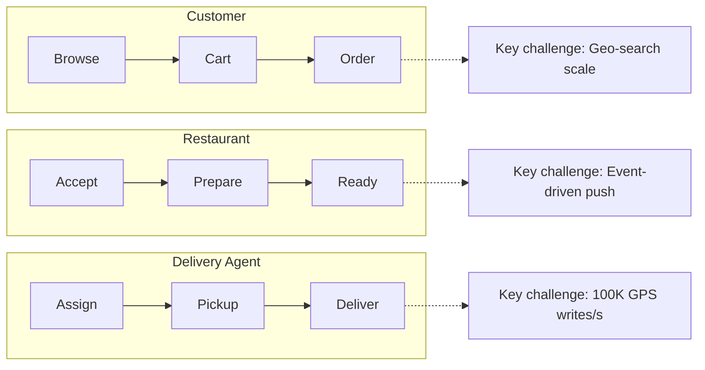
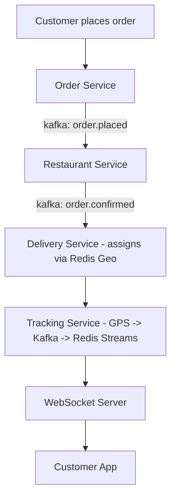
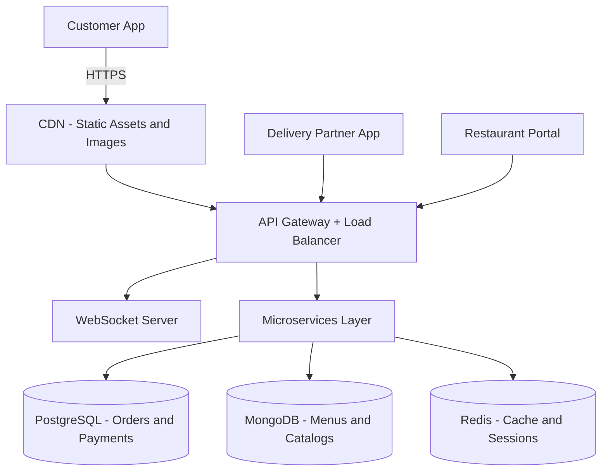
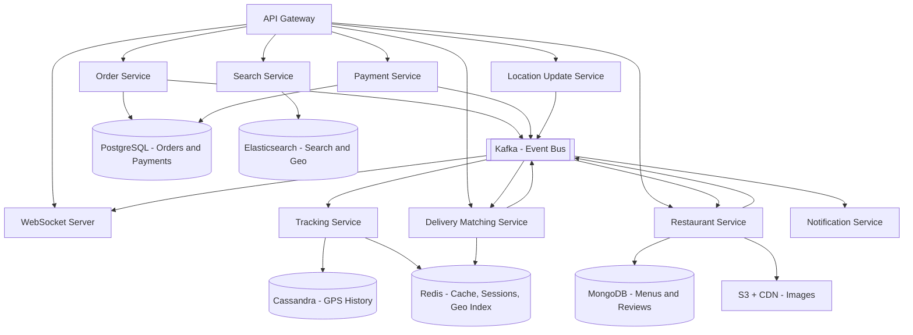
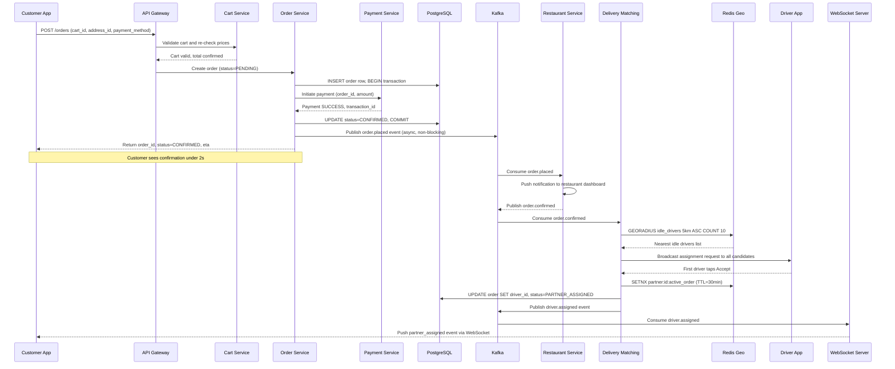
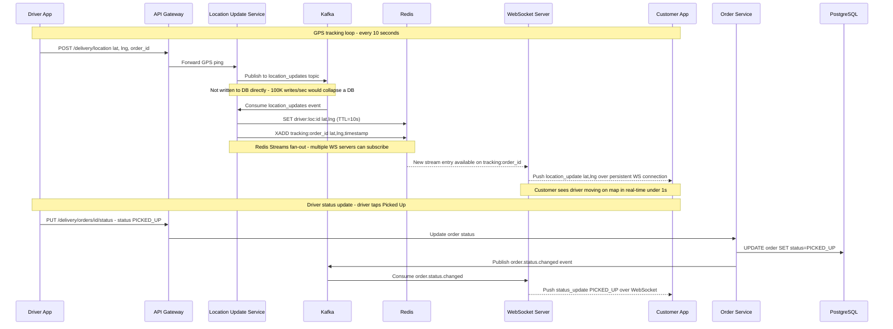
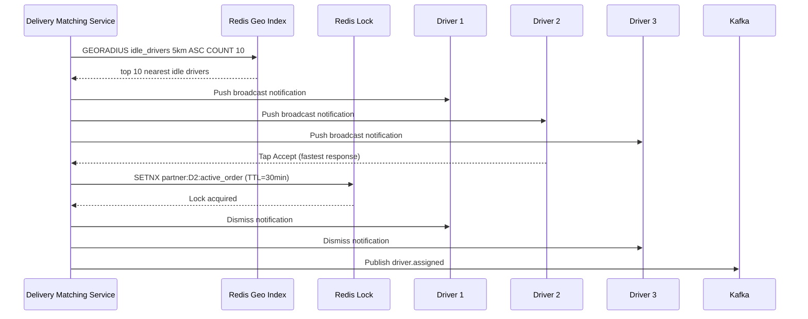
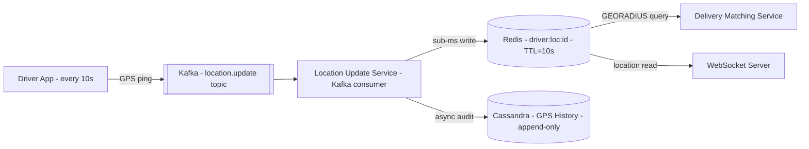
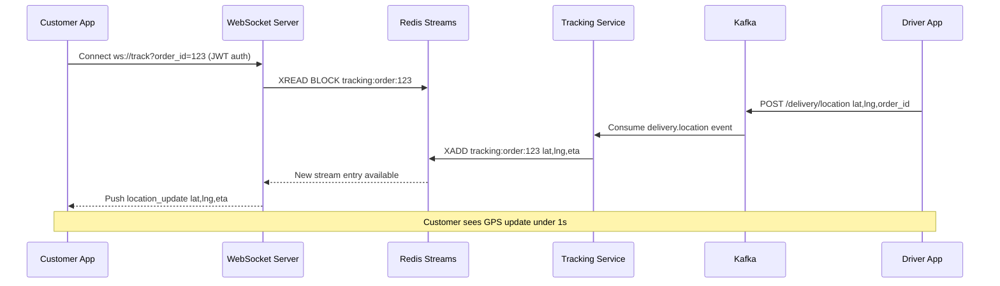

# System Design: Zomato / Food Delivery App

---

## 1. What Is a Food Delivery App?

A food delivery platform connects three groups of people who don't work for the same company and don't share a location: customers who want food delivered, restaurants that cook it, and delivery partners who carry it from one to the other. A customer opens the app, browses nearby restaurants, builds a cart, and pays; the restaurant confirms the order and starts cooking; a nearby delivery partner picks the food up and rides it to the customer's door while the customer watches its progress on a live map.

At the scale these platforms run at, the hard part isn't any single step in that chain — it's keeping three independently moving parties in sync, guaranteeing the money and the food both arrive exactly once, and doing it while tens of thousands of delivery partners are simultaneously broadcasting their location every few seconds.

---

## 2. A Day in the Life

Meera is hungry and opens the app around 1pm. The homepage already knows roughly where she is and shows restaurants near her, sorted by rating and estimated delivery time. She picks a place she's ordered from before, taps a couple of dishes into her cart, and checks out — address already saved, card already on file. She taps "Place Order."

Two seconds later her screen changes: "Order Confirmed." She didn't have to wait for anything else — just a spinner, then a confirmation, then a running order status.

At the restaurant, a notification pops up on the kitchen's tablet: a new order, with the items already itemized. Someone taps "Accept" and starts preparing it.

Across the city, Rakesh is on his bike between deliveries. His phone buzzes with a new pickup offer — restaurant name, distance, estimated payout. He taps to accept before it goes to someone else. A few minutes later he pulls up outside the restaurant, grabs the bag, and starts riding toward Meera's address.

Meera checks the app every so often and watches a little icon — Rakesh's bike — creeping across the map toward her building, updating smoothly enough that it doesn't feel like a slideshow. When he arrives, he marks the order delivered; she gets a notification, opens the door, and there's her food. She rates the order five stars on her way back inside.

The whole thing — from Meera's tap to her food arriving — usually takes 30 to 45 minutes, and neither she nor Rakesh ever thought about a database, a message queue, or a WebSocket connection. Everything from here on is how that experience actually gets built.

---

## 3. Requirements — and Why They Matter

**Scope.** In scope: restaurant browse and search, cart management, order placement and payment, delivery partner assignment, real-time GPS tracking, and order state notifications. Out of scope: the restaurant menu management portal, financial settlement and payouts, surge pricing, fraud detection, and machine-learning recommendations.

**Functional requirements:**

1. **Restaurant Discovery:** Browse restaurants filtered by location, cuisine, rating, delivery time, and dietary preference
2. **Search:** Full-text and geo search across restaurant names and dish names, with autocomplete suggestions
3. **Cart Management:** Add or remove items, apply promo codes, re-validate prices at checkout
4. **Order Placement:** Checkout with address selection and payment processing; order confirmation under 2 seconds
5. **Delivery Assignment:** Find and assign the nearest idle delivery partner; handle rejection and timeout fallbacks
6. **Real-time Tracking:** Live GPS updates from the delivery partner, visible to the customer in under 1 second
7. **Order State Notifications:** Push/SMS for every state transition (confirmed, preparing, picked up, delivered)
8. **Order History:** Customer can view all past orders and re-order

<details markdown="1">
<summary><strong>Point to Ponder:</strong> What stops two delivery partners from both being assigned the same order?</summary>

Delivery assignment is one of the few places this system insists on strong consistency (see the Consistency Model below) — it's enforced with a Redis `SETNX` lock (`partner:{id}:active_order`, TTL 30 minutes) the instant a partner accepts. Whichever partner's accept reaches the lock first wins it; every other partner's accept for that order is simply dismissed. See §8.1 Deep Dives for the full broadcast-and-lock mechanism.

</details>

<details markdown="1">
<summary><strong>Point to Ponder:</strong> What happens if a customer's payment succeeds but Kafka is down right when the restaurant should be notified?</summary>

Nothing is lost — the order is already durably committed to PostgreSQL before Kafka ever enters the picture, and a background job scans for CONFIRMED orders with no Kafka acknowledgment and replays their events once Kafka recovers (the outbox pattern). The restaurant just finds out a little late. See §9.2 Failure Scenarios.

</details>

**Non-functional requirements — and why each one matters to a real person, not just as a target:**

| Requirement | Target | Why it matters |
|---|---|---|
| Restaurant listing latency | Under 500ms | A slow-loading homepage is the first thing a hungry customer sees — hesitation here loses them to a competitor app before they've even browsed a menu. |
| Search results latency | Under 300ms | Search is how a customer with a specific craving finds it; a laggy search feels broken in a way a slow homepage doesn't. |
| Order placement end-to-end | Under 2s | The moment between tapping "Place Order" and seeing a confirmation is the highest-anxiety two seconds in the whole flow — did my card get charged? Did the order go through? |
| GPS tracking update latency | Under 1s customer-visible | A driver icon that visibly lags behind reality breaks the customer's trust in the ETA and makes them wonder if the app has frozen. |
| Availability | 99.9% (8.7 hours downtime/year) | A down app during lunch or dinner rush isn't a minor outage — it's every customer, restaurant, and delivery partner simultaneously unable to work. |
| Order durability | Zero loss after payment success | A vanished order after money has already left someone's account is the single worst thing this system could do to a customer's trust. |
| GPS write throughput | 100K writes/sec sustained | Not a promise to any one user — it's the floor the system must sustain just to keep the 1-second tracking promise true for everyone tracking an order at once. |
| Peak order throughput | 300 orders/sec | Same idea: this is what "everyone ordering lunch at the same time" actually costs in raw write volume. |

### Consistency Model

Different parts of the system require different consistency guarantees based on business risk and failure cost.

| Domain | Consistency | Why |
|---|---|---|
| Orders | Strong (ACID) | Cannot lose or duplicate — financial record |
| Payments | Strong | Financial correctness, regulatory requirement |
| Inventory / item availability | Strong per restaurant | Prevent selling unavailable items |
| Delivery assignment | Strong | One rider per order — Redis SETNX lock |
| GPS tracking updates | Eventual | Jitter acceptable; 1s staleness imperceptible |
| Restaurant listings | Eventual | Slight staleness fine for browse |
| Reviews and ratings | Eventual | Not business-critical |
| Search results | Eventual | Cached and indexed |

> [!IMPORTANT]
> The system is eventually consistent everywhere except money and orders. PostgreSQL ACID transactions for order + payment, Redis distributed locks for delivery assignment, Kafka async propagation everywhere else.

---

## 4. Scale, From First Principles

Before designing anything, it's worth asking what the raw numbers actually are — and what each one rules in or out before a single component gets chosen.

**Starting assumptions:**
```
Registered users:        50 million (10 million daily active)
Restaurants:              500,000
Active delivery partners: 1,000,000
Daily orders:              5 million
Concurrent tracking sessions at lunch/dinner peak: 50,000
```

**How many orders per second does that create?** 5 million orders a day, spread across 86,400 seconds, averages out to roughly 60 orders/sec. But meals don't spread evenly across the day — lunch and dinner windows concentrate demand, which is why the design target is **300 orders/sec peak**, five times the average. That number alone is nowhere near painful for a relational database — it's what rules PostgreSQL *in* for orders, not out.

**What does the GPS write load look like?** Every one of the 1 million active delivery partners pings their location roughly once every 10 seconds while working:
```
1,000,000 active delivery partners x 1 ping / 10s = 100,000 writes/sec peak
```
That single number is the hardest write path in the entire system. PostgreSQL's ceiling under contention sits around 50,000–100,000 writes/sec — meaning 100K writes/sec doesn't just strain it, it sits right at or past the edge of what a single relational primary can absorb directly. That's why a Kafka write buffer sits in front of the write, with consumers fanning out to Redis for the live read path and Cassandra for the audit trail — a decision that shows up again in §8's deep dive on exactly this problem.

**What does that imply for storage?** Orders are cheap: about 1KB per order times 5 million orders/day is 5GB/day, or roughly 1.8TB/year at PostgreSQL's 3-year retention window — trivial by modern storage standards. GPS history is a different story: 100,000 writes/sec at roughly 10 bytes per point, over 86,400 seconds in a day, works out to about 86GB/day, or roughly 2.5TB/month at Cassandra's 30-day retention. Menu images add about 250GB total (500KB average times 500,000 restaurants), living in S3 behind a CDN since they rarely change. Altogether, active hot storage across the system lands around 10–15TB/year.

**What does Redis need to hold in memory?** Sessions for 10 million daily active users at roughly 1KB each is 10GB. Active carts — 500,000 of them at about 2KB — add 1GB. A restaurant list cache covering 50,000 entries at 5KB each adds 250MB. Live driver locations for 100,000 concurrently active partners at 500 bytes each is 50MB, and the geo index covering those same 100,000 drivers adds roughly another 100MB. Idempotency keys for 5 million recent operations at 100 bytes each add 500MB. That totals to roughly 12GB — comfortably inside a single 32GB Redis instance with LRU eviction on the cache keys (not the correctness-critical ones).

**And the event bus itself?** Kafka needs to absorb roughly 100K events/sec at peak across the GPS and order topics combined — handled by 5 brokers, replication factor 3, and 10 partitions per topic.

> These numbers drive every storage and infrastructure decision below. The GPS write load is why we need Kafka + Cassandra. The 300 orders/sec peak is why PostgreSQL is perfectly fine for orders.

---

## 5. High-Level Architecture

Remember Meera's order and Rakesh's pickup from the story above — here's what actually happens underneath.

Every food delivery interview is really three sub-systems layered on top of each other, because the platform exists to coordinate three actors, each with a distinct flow and a distinct bottleneck:





The key insight is that these three flows are **decoupled by Kafka**: the customer flow writes to `order.placed`, the restaurant flow consumes it and confirms, `order.confirmed` fires, and the delivery flow picks it up from there. No service ever calls another service directly — that's the architecture in one sentence, and it's worth pausing on why before looking at the diagrams.

<details markdown="1">
<summary><strong>Point to Ponder:</strong> Why doesn't the Order Service just call the Restaurant Service directly to notify it, instead of publishing to Kafka?</summary>

Because a direct call couples the two services' availability together — a slow or down Restaurant Service would turn into order-placement latency, blocking the 2-second confirmation SLA for a problem that has nothing to do with the customer's payment. Kafka lets each service fail in isolation: a Notification Service outage can't block order placement, and a Tracking Service slowdown can't delay delivery assignment. See §9.3 Trade-offs (Kafka vs Direct Service Calls) for the full comparison.

</details>

> [!TIP]
> **Interview tip:** Name all three actors upfront and ask the interviewer which flow they want to go deep on. Interviewers who want breadth will say "all three"; interviewers who want depth will pick one. Either way, naming the actors first shows structured thinking before you touch a diagram.

### Core Design Principles

| Path | Optimized For | Mechanism |
|---|---|---|
| Fast Path — Order Placement | Latency, confirm in under 2s | Cart → Order → Payment sync. Kafka publish is async and non-blocking |
| Reliable Path — Order Safety | Durability, zero orders lost after payment | PostgreSQL ACID commit + idempotency keys + Kafka outbox replay |
| Fast Path — Tracking | Freshness, GPS update visible in under 1s | Driver → Kafka → Redis Streams → WebSocket push |
| Reliable Path — GPS Audit | Audit trail, dispute resolution | Cassandra append-only GPS history written async |

### From Simple to Evolved

The architecture starts simple and grows into the full event-driven design as the system matures — here's both versions.

**Simple Design**



**Evolved Design with Kafka, Cassandra, and Elasticsearch**



> [!NOTE]
> **Key Insight:** No service calls another service directly. All cross-service communication flows through Kafka. A Notification Service outage cannot block order placement. A Tracking Service slowdown cannot delay the delivery assignment. Each service fails in isolation.

### The Full Sequence: Order Placement and Driver Assignment

The diagrams above show the components; this shows the actual message sequence for the core interview flow — from Meera's tap to Rakesh's acceptance. Cart validation happens before anything touches money; the order commits to PostgreSQL and payment clears synchronously, so the customer's 2-second confirmation is a guarantee, not a best-effort; everything downstream of that commit — restaurant notification, delivery matching — runs asynchronously off the back of Kafka events, invisible to the customer waiting on their screen.



> [!NOTE]
> **Key Insight:** The Kafka publish after the PostgreSQL commit is fire-and-forget. The order is durably saved before we even attempt to notify the restaurant. If Kafka is temporarily unavailable, the order is safe — events replay via outbox on recovery.

### The Full Sequence: Real-Time GPS Tracking

Once Rakesh is riding, the same event bus that decoupled order placement from restaurant confirmation does the same job for location: every ping goes to Kafka first, never straight to a database, because 1 million drivers pinging every 10 seconds is a write rate no database survives directly (§4). A consumer fans that single ping out to two destinations that serve two different purposes — Redis for the live map, Cassandra for the permanent record — and the WebSocket server pushes to the customer only when Redis actually has something new to say.



> [!NOTE]
> **Key Insight:** Kafka absorbs 100K GPS writes/sec as a buffer — no database can handle this write rate directly. Redis is the hot read path (sub-millisecond for proximity search). Cassandra stores the append-only GPS history for audit. Three stores, three different jobs.

---

## 6. API Design

The API surface splits cleanly by actor — customers browsing and tracking orders, and delivery partners reporting their status and location — because the two mobile clients on either side of a delivery have almost nothing in common except the `order_id` connecting them.

### Customer APIs

| Method | Endpoint | Key Parameters | Response |
|---|---|---|---|
| GET | `/api/v1/restaurants` | `lat`, `lng`, `cuisine`, `page` | Geo-filtered restaurant list with ETA and rating |
| GET | `/api/v1/restaurants/{id}/menu` | `restaurant_id` (path) | Full menu with categories, items, and customizations |
| POST | `/api/v1/cart/items` | `restaurant_id`, `item_id`, `quantity`, `customizations` | Updated cart with new total |
| POST | `/api/v1/orders` | `cart_id`, `address_id`, `payment_method`, `idempotency_key` | `{ order_id, status, eta }` |
| GET | `/api/v1/orders/{id}/track` | `order_id` (path) | Current state, partner location (lat/lng), updated ETA |

### Delivery Partner APIs

| Method | Endpoint | Key Parameters | Response |
|---|---|---|---|
| POST | `/api/v1/delivery/available` | `lat`, `lng`, `partner_id` | Confirmation; registers partner in Redis Geo index |
| POST | `/api/v1/delivery/orders/{id}/accept` | `order_id` (path), `partner_id` | Assignment confirmation or conflict (if another partner accepted first) |
| POST | `/api/v1/delivery/location` | `lat`, `lng`, `order_id`, `partner_id` | Acknowledgement; GPS ping every 10s |

The one design choice worth calling out explicitly: `POST /api/v1/orders` is synchronous for the customer — cart validation, order creation, and payment processing all complete within the 2-second SLA before a response is returned — but it immediately triggers async Kafka events after the PostgreSQL commit. An `order.placed` event notifies the restaurant, and an `order.confirmed` event (published by the Restaurant Service after acknowledgement) kicks off the driver assignment flow. The customer sees a confirmed order instantly; restaurant notification and driver matching happen entirely out of band.

---

## 7. Data Model

Thirteen entities live in this system, and grouping them by how they're actually used — rather than treating them as one undifferentiated list — makes the storage choices almost obvious.

**The durable, financial data lives in PostgreSQL, because it's money.** Orders, order items, and payments all need ACID guarantees — an order and its payment must commit atomically, and neither can be allowed to silently drift out of sync with the other. Order items snapshot their price at checkout specifically so a retroactive menu price change can never corrupt a total that's already been charged. Payments store the full gateway response as JSONB, not just a status flag, because a dispute months later needs the actual record of what the payment gateway said at the time.

**The catalog data lives in MongoDB, because restaurants and menus are read constantly and shaped like documents, not rows.** A restaurant document embeds its geolocation, cuisines, operating hours, and rating; a menu document embeds its categories, items, and customizations directly inside it. That embedding is deliberate — the hottest read in the whole browse flow is "show me this restaurant's full menu," and a document store answers that with one read instead of the joins a normalized relational schema would require.

**The GPS and tracking data lives in Cassandra, because it's a 100,000-writes-per-second time-series problem that no relational database can absorb.** Both GPS history and order tracking events are append-only, queried almost exclusively by a single partition key (`driver_id` for GPS history, `order_id` for tracking events) ordered by time — exactly the access pattern Cassandra is built for, and exactly the write volume that would saturate PostgreSQL's WAL.

**The ephemeral, fast-path data lives in Redis, because it's either sub-millisecond-latency-critical or naturally expires on its own.** Driver live location needs sub-millisecond reads for proximity matching, and a TTL equal to the update interval doubles as liveness detection for free. The delivery geo index is a native Redis Geo structure so `GEORADIUS` queries for nearby idle drivers don't need any custom indexing code. The restaurant list cache collapses nearby users onto the same cache key (rounding lat/lng) to cut Elasticsearch load, with a 5-minute TTL bounding how stale a listing can get. Cart data is inherently session-scoped and expires naturally after 24 hours whether or not the customer finishes checking out. Idempotency keys exist purely to catch a retried payment webhook before it double-processes — a 24-hour TTL is more than enough for that window to matter.

**The search data lives in Elasticsearch, because full-text and geo-filtered queries under 300ms need an index built for exactly that, not a database repurposed for it.** Restaurant documents in the search index nest their dishes directly, so a search for a specific dish name can match at the dish level, not just the restaurant level.

| Entity | Storage | Key Columns |
|---|---|---|
| Orders | PostgreSQL | order_id, user_id, restaurant_id, driver_id, status, total_amount, created_at |
| Order Items | PostgreSQL | order_item_id, order_id, item_id, price_snapshot, quantity |
| Payments | PostgreSQL | payment_id, order_id, gateway_txn_id, status, gateway_response (JSONB) |
| Restaurants | MongoDB | restaurant_id, name, location (GeoJSON), cuisines, operating_hours, rating |
| Menus | MongoDB | restaurant_id, categories (nested), items, customizations |
| GPS History | Cassandra | partition: driver_id, cluster: timestamp DESC, lat, lng |
| Order Tracking Events | Cassandra | partition: order_id, cluster: event_time DESC, status, lat, lng |
| Driver Live Location | Redis | driver:loc:{id} → lat,lng (TTL=10s) |
| Delivery Geo Index | Redis | GEOADD delivery:partners {lng} {lat} {partner_id} |
| Restaurant List Cache | Redis | restaurant:list:{lat_round}:{lng_round}:{filter_hash} (TTL=5min) |
| Cart | Redis | cart:{user_id} (TTL=24h) |
| Idempotency Keys | Redis | webhook:{webhook_id} (TTL=24h) |
| Search Index | Elasticsearch | restaurant doc with nested dishes, geo_point location, cuisines keyword |

> [!NOTE]
> **Key Insight:** Each store is matched to its workload. PostgreSQL for 300 orders/sec with strict ACID. Cassandra for 100K GPS writes/sec as append-only time-series. Redis for sub-millisecond ephemeral reads. Elasticsearch for sub-300ms full-text + geo queries. There is no single best database.

---

## 8. Deep Dives

### 8.1 Delivery Partner Matching and Assignment

Once a restaurant confirms an order, the system has to find exactly one delivery partner and lock them in — fast, without ever double-assigning the same partner to two orders, and without leaving an order stranded because the one partner it tried happened to be slow to respond.

The naive design is to find the single closest idle partner and offer them the order alone, waiting for their response before trying anyone else. That flaw shows up the moment a partner is slow, distracted, or simply declines: a 5-second timeout per rejection means a chain of three rejections in a row adds 15 seconds before anyone is assigned. Fifteen seconds doesn't sound like much until you remember the restaurant is holding hot food and the customer's ETA prediction, quoted the moment the order was confirmed, starts silently drifting wrong the longer assignment takes.

The fix is to stop treating this as a sequence of one-at-a-time offers and broadcast to everyone who could plausibly take the order at once, letting whoever responds fastest win it. A `GEORADIUS` query against the Redis Geo index pulls the ten nearest idle drivers within 5km; the Delivery Matching Service pushes the same assignment offer to all ten simultaneously, and the first partner to tap Accept gets the order. That collapses the worst case from "up to 15 seconds of sequential rejections" down to "however long it takes the fastest of ten people to glance at their phone."

Broadcasting to ten partners instead of one obviously creates a new problem: what happens when two of them accept at nearly the same instant? This is where a plain write would be dangerous — a `SET` has no way to know whether someone already got there first. The fix is a Redis `SETNX` (set-if-not-exists) lock on `partner:{id}:active_order`, with a 30-minute TTL. Whichever partner's accept reaches the lock first gets `SETNX` to succeed; every other partner who taps Accept after that gets a conflict response and their offer is dismissed. The TTL isn't just cleanup housekeeping — it's what stops a partner's app crash mid-delivery from permanently locking them out of future assignments.



And when nobody within radius accepts at all? The system doesn't give up after one broadcast — it retries and widens its net in stages, trading a longer wait for an actual match instead of failing fast: if no partner accepts within 30 seconds, the order moves to `WAITING_FOR_PARTNER` and the broadcast retries every 30 seconds; after 2 minutes with no luck, the search radius expands from 5km to 10km; and if 10 minutes pass with still no assignment, the on-call operations team gets paged, because at that point something is wrong beyond normal supply-and-demand noise.

Broadcasting does have a real cost worth naming: ten push notifications go out for every order instead of one, which at 300 orders/sec peak works out to roughly 3,000 push notifications/sec. That's comfortably within what Firebase or APNs can handle, so the extra notification volume is a cheap price for the latency it buys back.

> [!NOTE]
> **Key Insight:** The `SETNX` lock is a correctness requirement, not a performance optimization. Without it, two simultaneous order broadcasts could race and both assign the same driver. The lock makes assignment atomic.

---

### 8.2 Driver Location Write Architecture

With 1 million active delivery partners each pinging their GPS position every 10 seconds, the system receives 100,000 writes per second at peak — the single hardest scaling challenge anywhere in this design (§4). Route those writes directly at any relational or document database and you hit its write ceiling and cascade into latency spikes across the entire platform, not just tracking.

The obvious approach — write every GPS ping straight into PostgreSQL or MongoDB — doesn't survive contact with that number. PostgreSQL handles roughly 50,000 writes/sec under contention before its WAL saturates and response times blow out; 100,000 writes/sec is past that ceiling, not near it. MongoDB fares somewhat better, but still can't reliably absorb bursts of this size without the added complexity of horizontal sharding.

The fix is to never let a database see the raw write rate at all. Kafka sits in front of everything and absorbs the full 100,000 writes/sec as a durable buffer; a Kafka consumer — the Location Update Service — reads off that buffer and fans each ping out to two destinations built for two different jobs. Redis gets a sub-millisecond write to `driver:loc:{id}` with a 10-second TTL, because that's the live position the Delivery Matching Service actually queries. Cassandra gets an async, append-only write to the GPS history table, purely for audit and dispute resolution — the Delivery Matching Service never touches Cassandra at all.



The 10-second TTL on `driver:loc:{id}` does more than bound memory use — it's a liveness check that costs nothing extra to run. If a driver's app crashes, loses signal, or simply goes offline, their key just expires on its own ten seconds after the last ping, and the Delivery Matching Service can no longer see them in a `GEORADIUS` query. There's no stale-driver cleanup job anywhere in this design, because the TTL already is the cleanup job.

The trade-off this makes deliberately is that Redis isn't durable — if it restarts, every live driver location it held is gone. That's acceptable specifically because the data is ephemeral by nature: a driver re-registers their position on their very next ping, within 10 seconds, and Cassandra still holds the full history for anything that needs to look backward. Ephemeral data belongs in ephemeral storage; losing it briefly costs nothing that a full history in Cassandra can't answer.

> [!NOTE]
> **Key Insight:** Redis is the live read path. Cassandra is the audit path. These are separate concerns — never conflate them. The Cassandra write is async and non-blocking; it never slows the assignment decision.

---

### 8.3 Real-Time Tracking via WebSocket

A customer watching their delivery move on the map needs sub-second updates, and at 50,000 concurrent tracking sessions during peak, the obvious way to build that — have the customer's app poll for the latest position every few seconds — doesn't hold up. Polling every 3 seconds against 50,000 concurrent sessions alone works out to roughly 17,000 HTTP requests/sec of mostly empty responses, since GPS actually updates only once every 10 seconds; scaled to a full 1 million tracking sessions across the platform at peak, that's 330,000 requests/sec of pure waste, most of them returning "nothing changed."

Every one of those wasted requests still costs real work: re-authenticating the client, re-routing through the load balancer, and re-querying whatever store holds the location — for a response that, most of the time, says nothing new happened. That's CPU and network spent for essentially no benefit to anyone.

The fix is to stop asking and start pushing. A customer's app opens a single WebSocket connection scoped to their order, and the server sends a message only when there's an actual new GPS point to send — nothing when there isn't. Redis Streams sit in between as the fan-out mechanism: the Location Update Service (from §8.2) writes each new position into a `tracking:{order_id}` stream, and any WebSocket server instance can subscribe to that same stream and push to its connected client. That's what makes the design horizontally scalable — sticky sessions are needed to keep a customer's connection pinned to one WebSocket server instance, but nothing about *routing the data itself* requires that stickiness, since any instance can read the same stream.



The load balancer routes reconnects using consistent hashing on `order_id`, so a customer who briefly drops connection and reconnects lands back on the same WebSocket server instance. Each stream is capped at roughly 100 entries per order (`MAXLEN`), which covers about 16 minutes of tracking history — plenty to replay whatever a client missed during a disconnect. If a client can't maintain a WebSocket connection at all, it falls back to REST polling every 10 seconds; because Redis Streams persist entries across reconnects, nothing about the tracking history is actually lost, just delivered on a coarser schedule for that one client.

The trade-off accepted is that WebSocket connections are stateful, which means sticky sessions at the load balancer and, in turn, more careful rolling deployments — a server can't just be killed mid-deploy, its connections have to drain gracefully first. That operational complexity is worth it because eliminating polling at this scale is fundamentally a math argument, not a matter of taste: the bandwidth and CPU savings from only sending bytes when something actually changed dominate the cost of managing stateful connections.

> [!NOTE]
> **Key Insight:** Redis Streams is what makes the fan-out cheap, not just the WebSocket transport itself. Any number of WebSocket server instances can subscribe to the same `tracking:order:{id}` stream, so adding tracking capacity is a matter of adding subscribers, not re-plumbing how GPS updates reach the client.

---

## 9. Bottlenecks, Failure Scenarios & Trade-offs

### 9.1 Bottlenecks & Scaling

The write-side of this system strains first as scale grows another 10x. GPS ingestion is the earliest to feel it — past roughly 1 million drivers, Kafka partitions need to scale out horizontally, with the Location Service's consumer group growing in lockstep with the partition count so no single consumer becomes a straggler. Order writes hit their own ceiling around 3,000 orders/sec; the fix there is read replicas absorbing every read query while the PostgreSQL primary handles writes only, with the orders table partitioned by `created_at` month so old partitions stop competing with hot ones for cache and index space. Delivery assignment broadcasts strain similarly once many orders are being matched simultaneously — the Match Service's Kafka consumer group scales independently of everything else, and the Redis Geo index moves to a Redis Cluster so the geo queries themselves aren't bottlenecked on a single node.

The read and connection side has its own pressure points. Restaurant listing caches suffer a cache-miss storm specifically at startup or after a deploy, before any keys are warm — the fix is proactively warming the cache on deploy rather than letting the first wave of real traffic pay for it, combined with a Redis Cluster using hash slots so memory scales horizontally rather than requiring one ever-larger instance. WebSocket connections cap out around 100,000 per server, which is the reason reaching real scale means horizontally adding WebSocket server nodes behind a consistent-hash load balancer keyed on `order_id`, so reconnects land back on the right instance. And Elasticsearch's geo queries strain under high search QPS — handled with 5 primary shards plus 2 replicas, a query cache on the filter clause, and a Redis cache layer sitting in front of Elasticsearch entirely so repeat searches never reach it at all.

Scaling each service horizontally follows the same shape throughout: the Order Service is stateless and scales behind the load balancer with no special coordination; the Location Update Service scales by adding Kafka partitions and consumers together; the WebSocket Server scales by adding nodes with the consistent-hash routing already described; Delivery Matching is a stateless Kafka consumer group that scales by partition count; PostgreSQL runs a primary plus two read replicas behind PgBouncer connection pooling, partitioned by `created_at`; and Cassandra scales linearly — new nodes join the cluster and data rebalances onto them automatically.

Caching absorbs a lot of the read load quietly: restaurant listings cache for 5 minutes with coordinates rounded to 4 decimal places (about 11 meters), which collapses nearby users onto the same cache key instead of each generating a unique one; menus cache for 15 minutes and get explicitly invalidated via a Kafka `cache.invalidate` event the moment a restaurant updates its menu; static assets like images sit behind CloudFront with a 7-day TTL, invalidated on S3 object update; and search results cache for 3 minutes, keyed by a hash of the search query itself. Some data, by contrast, is never cached at all, because staleness there isn't a UX inconvenience but a correctness bug: order status and details always read from PostgreSQL directly, payment status always reads from PostgreSQL directly, item availability at checkout always reads from MongoDB's primary rather than a replica or cache, and delivery partner assignment is always a Redis lock, never anything sitting in an application-level cache.

---

### 9.2 Failure Scenarios

Money-adjacent failures get the most careful handling, because they're the ones where "eventually correct" isn't good enough. If a customer's payment succeeds but Kafka happens to be down right afterward, the order is already committed to PostgreSQL — Kafka being unreachable only means downstream services haven't been notified yet, not that anything is lost. A background job continuously scans for CONFIRMED orders with no Kafka acknowledgment and replays their events once Kafka recovers, the same outbox pattern referenced back in §5 and §9.3. If instead the restaurant rejects the order or simply doesn't respond within 15 minutes, the Order Service auto-cancels it, triggers a full refund through the Payment Service, and notifies the customer by push or SMS — the customer is never left wondering what happened to their money. And if the payment gateway itself times out mid-transaction, the order stays in `PENDING` rather than guessing, while a background reconciliation job polls the gateway for the real outcome after 5 minutes — confirming the order if the gateway says it succeeded, cancelling and notifying the customer if it didn't.

Delivery assignment failures get their own recovery path, distinct from payment failures because nothing financial is at risk here — only time. If a delivery partner rejects an assignment, their Redis lock is released immediately and a fresh broadcast goes out to the next set of idle partners without delay. If no partner is available within radius at all, the system retries every 30 seconds, expands the search radius to 10km after 2 minutes and to 15km after 5 minutes, and keeps the customer informed with an updated ETA and a transparent status message rather than silence.

The real-time infrastructure — WebSocket servers and Redis — fails more visibly but recovers cheaply, because none of it is the system of record. A WebSocket server crashing simply disconnects its active tracking sessions; clients detect the drop and fall back to REST polling every 10 seconds, and because Redis Streams persist location history across reconnects, nothing about the tracking data is actually lost, just delivered differently for a moment. A full Redis failure is a bigger dent but still not a safety issue: the geo index becomes unavailable, so delivery assignment temporarily falls back to a slower PostgreSQL geo query (acceptable given the low volume of simultaneous assignments), and restaurant listings serve stale data straight from the CDN — order safety itself is untouched, since PostgreSQL remains the source of truth throughout.

The durable stores fail more slowly, and their recovery stories reflect that. A PostgreSQL primary failure blocks order writes until an automated failover promotes a replica, typically within about 30 seconds on RDS Multi-AZ; any order writes that were in flight during that window simply fail and the client retries, with the idempotency key on `POST /orders` guaranteeing that retry can never create a duplicate order. A Cassandra node failure reduces GPS write throughput but doesn't stop it — running at `QUORUM` consistency with a replication factor of 3 tolerates the loss of one node, the remaining nodes absorb the write load, and the cluster auto-repairs once the failed node returns.

Elasticsearch going down is the one failure mode that's purely a search-quality problem rather than a safety one: search results come back empty, but the platform degrades to a MongoDB geo query for location-based browsing instead — slower, at roughly 500ms instead of 300ms, but fully functional.

---

### 9.3 Trade-offs

**WebSocket vs HTTP Polling for Tracking**

The two approaches differ mainly in what they cost as tracking sessions scale into the millions. WebSocket pushes a location update in under a second the instant the position changes; HTTP polling is bounded by whatever interval it polls at, typically 3 to 10 seconds. Under load, WebSocket's server cost stays low because it only sends bytes when a GPS point actually changes, while polling at 1 million concurrent sessions generates roughly 333,000 requests/sec, most of them empty. WebSocket is stateful and needs sticky sessions at the load balancer; polling is stateless and trivially horizontally scalable, at the cost of needing no fallback at all, versus WebSocket which does need one for disconnects. The last dimension is connection overhead itself: WebSocket maintains one persistent TCP connection per client, where polling pays a fresh handshake and re-authentication on every single request.

**Chosen:** WebSocket with a polling fallback for disconnects. The decision comes down to arithmetic, not preference — the operational cost of sticky routing is a manageable, well-understood trade against generating hundreds of thousands of essentially empty responses a second.

> [!NOTE]
> **Key Insight:** WebSocket vs HTTP for tracking is a math problem. 1M sessions at 1 poll/3s = 333K empty requests/sec. WebSocket reduces server event generation to the actual GPS update rate — a 10x reduction in pointless network traffic.

---

**PostgreSQL vs Cassandra for Orders**

PostgreSQL gives full ACID transactions, which are mandatory here since an order and its payment must commit together; Cassandra has no native multi-row transaction support, so the same guarantee would need to be rebuilt at the application level as compensating transactions — extra code whose entire job is covering for something the database doesn't do natively. Financial correctness is guaranteed outright in PostgreSQL, where in Cassandra it would depend on that application-level logic actually being correct in every edge case. The trade runs the other way on raw throughput: PostgreSQL tops out around 50,000–100,000 writes/sec, while Cassandra scales to millions of writes/sec linearly by adding nodes. PostgreSQL also offers full SQL with arbitrary joins for reporting, where Cassandra restricts queries to whatever its partition keys were designed for up front. And operationally, PostgreSQL has decades of tooling and a managed RDS option behind it, while Cassandra carries meaningfully more operational complexity to run well.

**Chosen:** PostgreSQL for orders and payments. The trade-off accepted is lower raw write throughput, which is a non-issue here — 300 orders/sec peak is nowhere near PostgreSQL's ceiling. Financial correctness is non-negotiable and cannot be retrofitted onto an eventually consistent store after the fact.

> [!NOTE]
> **Key Insight:** Cassandra is chosen for GPS history (100K writes/sec time-series, no transactions needed) and PostgreSQL for orders (300 writes/sec, strict ACID required). Each database is matched to its workload — the question is never "which is better?" but "which fits this workload?"

---

**Kafka vs Direct Service Calls**

A Kafka event bus fully decouples producers from consumers — the Order Service publishing `order.placed` never waits on the Restaurant Service to actually process it, where a direct REST or gRPC call would tie the two together tightly enough that a slow downstream service blocks the caller. That decoupling extends to fault tolerance: Kafka persists events and replays them once a crashed consumer recovers, while a direct call simply loses the message if the receiving service crashes mid-call. Kafka also absorbs the full 100,000 events/sec this system generates through buffering alone, where direct calls would add a network round-trip's worth of latency per downstream service on every request. The sharpest difference is cascading failure risk: with Kafka, one slow consumer never touches any other service's health, where a chain of direct calls means one slow service can cascade failure across everything that calls it. What direct calls do have going for them is simplicity — standard HTTP or gRPC needs no broker to run or consumer lag to monitor, both real operational costs Kafka introduces.

**Chosen:** Kafka for all cross-service communication. The trade-off is real operational overhead — broker management, consumer lag alerting, a schema registry to maintain — accepted because at 100,000 events/sec, direct calls would create exactly the cascading failure chains described above: one slow Notification Service would otherwise be capable of blocking every single order placement in the system.

> [!NOTE]
> **Key Insight:** The Kafka event bus is a correctness requirement, not just a performance optimization. If Order Service called Restaurant Service directly, a restaurant service timeout would appear as order placement latency. Kafka makes order placement constant-time regardless of how many downstream consumers exist.

---

**At-Least-Once vs Exactly-Once Delivery**

At-least-once delivery replays events whenever a consumer crashes mid-processing, relying on a dedup key at the consumer to catch and discard anything reprocessed — which means duplicate delivery is possible in principle, just caught before it does anything. Exactly-once delivery guarantees no duplicate ever reaches the consumer in the first place, but only by paying for a two-phase-commit round trip on every event, adding real latency, and requiring every single consumer in the pipeline to participate in Kafka's transactional API for the guarantee to hold end to end. That's a meaningfully harder failure mode to reason about in practice — a partial failure inside a distributed transaction is harder to diagnose than "a duplicate showed up and got deduplicated."

**Chosen:** At-least-once delivery with idempotency keys. Payment webhooks use `webhook:{id}` in Redis (24h TTL) as their dedup key, and order creation uses a `SETNX` lock per user and cart. The result behaves like exactly-once from the outside, at standard Kafka latency, without ever paying for two-phase commit.

> [!NOTE]
> **Key Insight:** Exactly-once in distributed systems is expensive. At-least-once + idempotent consumers gives you the same correctness guarantee at a fraction of the cost. The dedup key is the correctness mechanism, not the delivery guarantee.

---

## 10. Evaluation: Did We Meet the Requirements?

Eight non-functional requirements were set out in §3. Here's how the design actually satisfies each one — not just what was promised, but the specific mechanism doing the work.

**Latency (restaurant listing < 500ms, search < 300ms, order placement < 2s, GPS tracking < 1s):** Restaurant listings and search both sit behind Redis and Elasticsearch caches that never touch a primary database on a cache hit. Order placement stays under 2 seconds because the only synchronous work on that path is cart validation, a PostgreSQL commit, and a payment gateway call — everything else (restaurant notification, delivery matching) is fired asynchronously through Kafka after the response has already gone back to the customer. GPS tracking stays under a second because the update path never touches a database at all: driver ping → Kafka → Redis Streams → WebSocket push, each hop sub-millisecond to low-single-digit milliseconds.

**Availability (99.9%):** No single component failure takes down the whole platform, because Kafka decouples every service from every other (§5, §9.3). A Redis failure degrades matching and listings to slower fallbacks rather than stopping them; a PostgreSQL primary failure triggers an automated failover within about 30 seconds (§9.2) rather than an outage.

**Order durability (zero loss after payment success):** The order commits to PostgreSQL inside an ACID transaction before anything downstream is even notified. If Kafka is down at that moment, the order is already safe — a background job replays its events via the outbox pattern once Kafka recovers (§9.2). Money is never contingent on Kafka being up.

**GPS write throughput (100K writes/sec) and peak order throughput (300 orders/sec):** These aren't outcomes achieved after the fact — they're the numbers that selected Kafka, Redis, and Cassandra for the GPS path, and PostgreSQL for the order path, before any component was chosen (§4 Scale, From First Principles). The design doesn't scale up to meet these numbers later; they were the numbers that ruled out the alternatives up front.

| Requirement | Mechanism |
|---|---|
| Restaurant listing < 500ms, search < 300ms | Redis + Elasticsearch caching in front of primary stores |
| Order placement < 2s | Synchronous cart validation + PostgreSQL commit + payment call only; everything else async via Kafka |
| GPS tracking < 1s | Driver ping → Kafka → Redis Streams → WebSocket push, no database on the hot path |
| Availability 99.9% | Kafka decoupling, Redis fallback to PostgreSQL geo query, automated PostgreSQL failover (~30s) |
| Order durability — zero loss | PostgreSQL ACID commit before notification; outbox pattern replays events after Kafka recovery |
| 100K GPS writes/sec, 300 orders/sec peak | Architectural constraints that selected Kafka + Cassandra + Redis (GPS) and PostgreSQL (orders) up front |

---

## 11. Conclusion

This design treats food delivery as three actors sharing one event bus rather than one monolithic flow: a customer placing an order, a restaurant confirming it, and a delivery partner carrying it — each decoupled from the others by Kafka so that no single actor's slowness or failure can stall the other two. The hardest problem wasn't any one of those three flows individually; it was the 100,000-writes-per-second GPS firehose, solved by never letting a database see that write rate directly, and the delivery-partner assignment race, solved by broadcasting instead of guessing and letting a `SETNX` lock — not a queue, not a distributed lock service — decide who actually gets the order. Every other decision in this design, from which database holds which entity to why WebSocket replaces polling, falls out of getting those two problems right.

---

## 12. Interview Summary

### Key Decisions Table

| Decision | Problem It Solves | Trade-off Accepted |
|---|---|---|
| Kafka between all services | Downstream slow services cannot block order placement; events survive crashes | Operational complexity, ~10ms publish latency |
| PostgreSQL for orders and payments | ACID atomicity: payment success and order creation must commit together | Lower raw write throughput — acceptable at 300 orders/sec peak |
| Cassandra for GPS history | 100K writes/sec time-series; relational DBs cannot absorb this volume | No transactions; access patterns must be pre-designed by partition key |
| WebSocket for tracking | 1M sessions polling = 333K empty HTTP requests/sec eliminated | Stateful connections require sticky sessions at LB |
| Redis Geo with TTL for driver location | Sub-millisecond proximity queries; TTL equals update interval for implicit liveness | Not durable — driver location is ephemeral by design, acceptable |
| Broadcast + first-accept for assignment | Serial unicast adds multi-second delays per rejection | Slightly higher push notification volume — well within capacity |

### Fast Path vs Reliable Path

```
FAST PATH — order placement, optimized for latency under 2s:
  Customer
    → Cart Validation (Redis cart read)
    → Order Created (PostgreSQL commit)
    → Payment Processed (gateway call)
    → CONFIRMED returned to client
  Kafka publish is fire-and-forget after the DB commit — never blocks the response

RELIABLE PATH — order safety, optimized for durability:
  PostgreSQL commit = source of truth, order exists regardless of downstream state
  Kafka event = async signal to restaurant, delivery, notification services
  If Kafka is down: order is safe in DB, events replayed via outbox on recovery
  If Payment Gateway is slow: order stays PENDING, auto-cancels after 15 minutes
  If restaurant times out: auto-cancel with full refund

TRACKING FAST PATH — GPS update visible to customer under 1s:
  Driver GPS ping
    → Kafka location.update topic (durable buffer)
    → Location Update Service
    → Redis Streams XADD (push notification to WebSocket server)
    → WebSocket push to customer

TRACKING AUDIT PATH — GPS history for dispute resolution:
  Driver GPS ping → Kafka → Cassandra (async, append-only, 30-day retention)
```

### Key Insights Checklist

These are the lines an interviewer wants to hear out loud:

1. "Three actors, three flows, three bottlenecks — geo-search scale, event-driven restaurant notification, and 100K GPS writes per second. Kafka decouples all three so each flow fails in isolation."
2. "100K GPS writes per second is the single hardest challenge. No relational database absorbs this directly. Kafka buffers it; Redis holds the live state with TTL equal to the update interval for free liveness detection — no polling, no manual cleanup."
3. "WebSocket versus polling for tracking is a math problem. At 1M tracking sessions polling every 3 seconds, we serve 333K empty HTTP responses per second. WebSocket eliminates this entirely — the server only sends bytes when the GPS position changes."
4. "PostgreSQL for orders is a correctness choice, not a performance choice. 300 orders per second is trivial for PostgreSQL. ACID transactions mean I never write compensating logic for a partial order-plus-payment failure. That code never exists."
5. "The Kafka event bus is a correctness requirement. If Order Service calls Restaurant Service directly, a 500ms restaurant timeout becomes a 500ms order placement latency spike. Kafka makes order placement constant-time regardless of how many downstream consumers exist."
6. "I accept at-least-once delivery everywhere and add idempotency keys at the consumer. This gives effectively-once behavior without Kafka 2PC overhead. The dedup key is the correctness mechanism — not the delivery guarantee."
